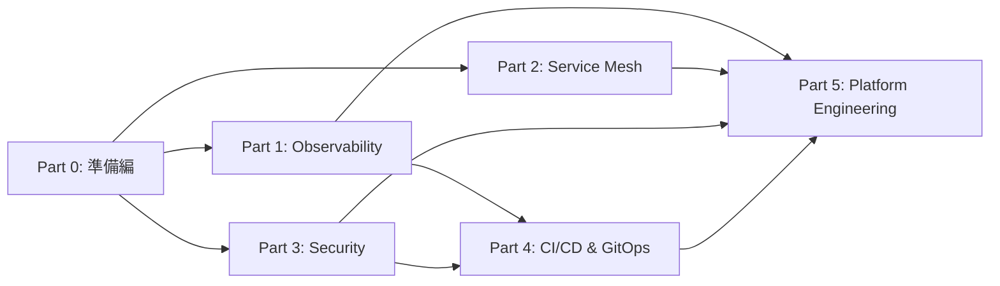
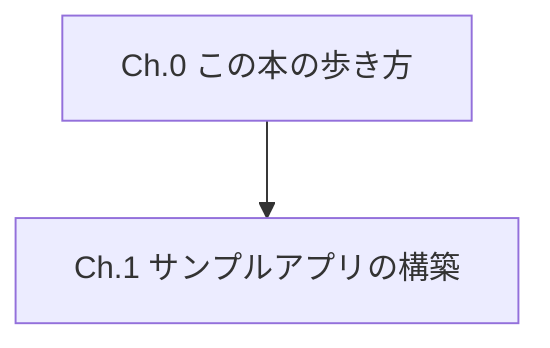
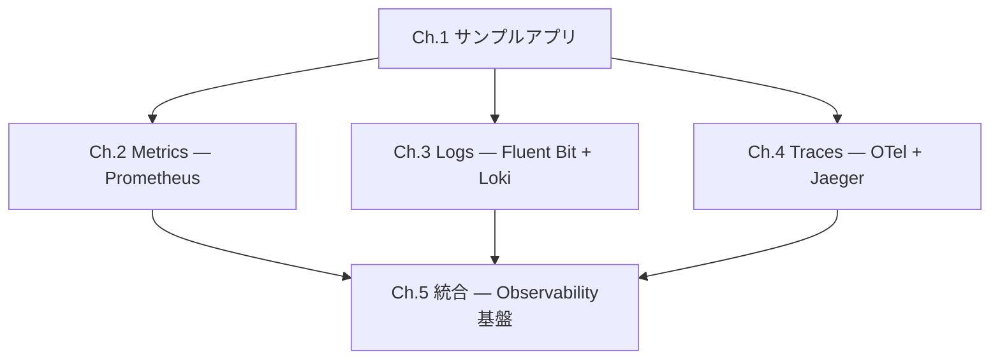
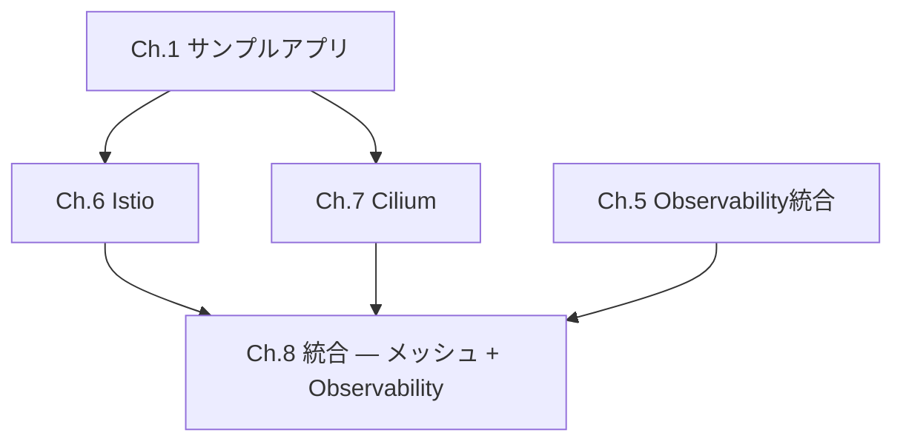
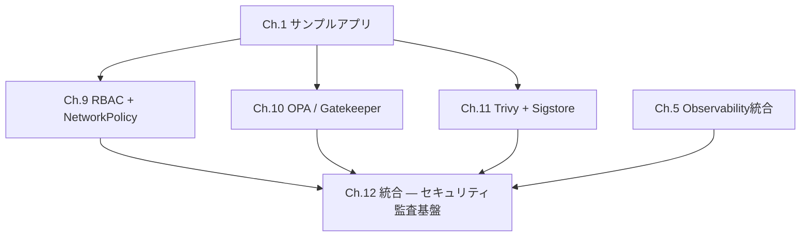
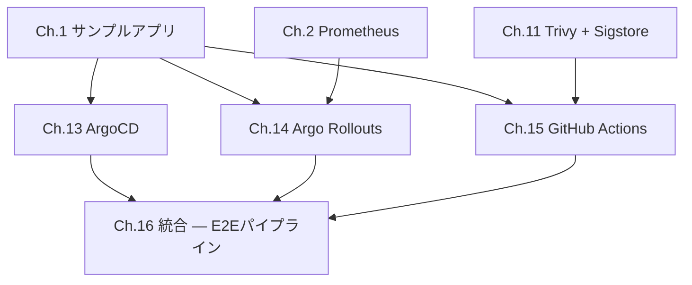
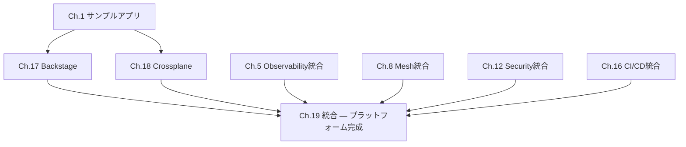
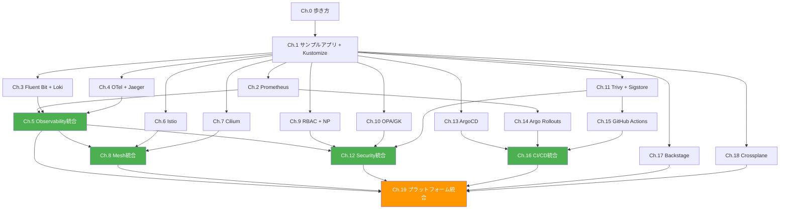

# 書籍構成・章間依存関係図

## Part構成と依存関係

## 章間依存関係

### Part 0: 準備編

- **Ch.0**: 前提なし。本書の読み方、環境要件を説明
- **Ch.1**: Ch.0のみ。サンプルアプリをK8s上にデプロイし、Kustomizeの基本を解説。以降すべての章の基盤

### Part 1: Observability

- **Ch.2**: Ch.1のみ。Prometheusの導入、メトリクス収集
- **Ch.3**: Ch.1のみ。Fluent Bit + Lokiによるログ集約
- **Ch.4**: Ch.1のみ。OpenTelemetry + Jaegerによる分散トレーシング
- **Ch.5**: Ch.2〜4すべて。Three Pillarsの統合、Grafanaダッシュボード、SLI/SLO

> **並列読書可能**: Ch.2, Ch.3, Ch.4は互いに独立しており、任意の順番で読める

### Part 2: Service Mesh

- **Ch.6**: Ch.1のみ。Istioの導入、mTLS、トラフィック管理
- **Ch.7**: Ch.1のみ。CiliumのeBPFアプローチ、Hubble
- **Ch.8**: Ch.5〜7。メッシュのテレメトリをPart 1のObservability基盤に統合

> **選択読書可能**: Ch.6（Istio）とCh.7（Cilium）はどちらか一方だけでもCh.8に進める

### Part 3: Security

- **Ch.9**: Ch.1のみ。RBAC設計、NetworkPolicyによる通信制限
- **Ch.10**: Ch.1のみ。OPA/GatekeeperによるAdmission Control
- **Ch.11**: Ch.1のみ。イメージスキャン、署名と検証
- **Ch.12**: Ch.9〜11 + Ch.5。Falco + Observability基盤でセキュリティダッシュボード構築

> **並列読書可能**: Ch.9, Ch.10, Ch.11は互いに独立

### Part 4: CI/CD & GitOps

- **Ch.13**: Ch.1のみ。ArgoCDによるGitOps管理
- **Ch.14**: Ch.1 + Ch.2（Prometheusメトリクスで自動判定）。Canary/Blue-Greenデプロイ
- **Ch.15**: Ch.1 + Ch.11（Trivyスキャン・cosign署名をCIに組み込む）。CIパイプライン構築
- **Ch.16**: Ch.13〜15すべて。CI→CD→Progressive Deliveryの一気通貫

### Part 5: Platform Engineering

- **Ch.17**: Ch.1のみ。Backstageでサービスカタログ構築
- **Ch.18**: Ch.1のみ。Crossplaneでインフラの宣言的管理
- **Ch.19**: 全統合章（Ch.5, Ch.8, Ch.12, Ch.16）+ Ch.17〜18。Golden Pathのデモ

## 全体依存関係図（サマリ）

**凡例**: 緑 = 各Part統合章、オレンジ = 最終統合章

## 読書パス

### フルパス（推奨）
Ch.0 → Ch.1 → Part 1 → Part 2 → Part 3 → Part 4 → Part 5

### Observability特化パス
Ch.0 → Ch.1 → Ch.2 → Ch.3 → Ch.4 → Ch.5

### Security特化パス
Ch.0 → Ch.1 → Ch.9 → Ch.10 → Ch.11 → Ch.5（統合章でObservability基盤を参照するため） → Ch.12

### CI/CD特化パス
Ch.0 → Ch.1 → Ch.2（Prometheus、Rollouts用） → Ch.11（Trivy/cosign、CI用） → Ch.13 → Ch.14 → Ch.15 → Ch.16
