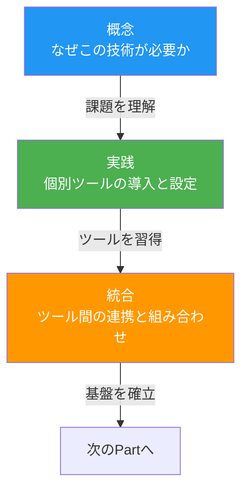
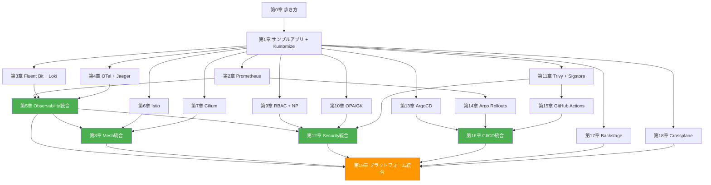
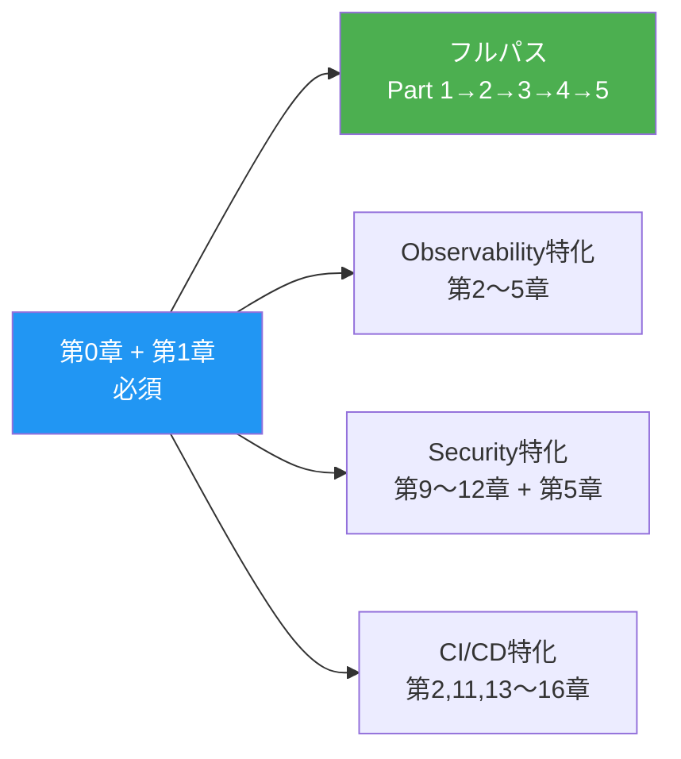
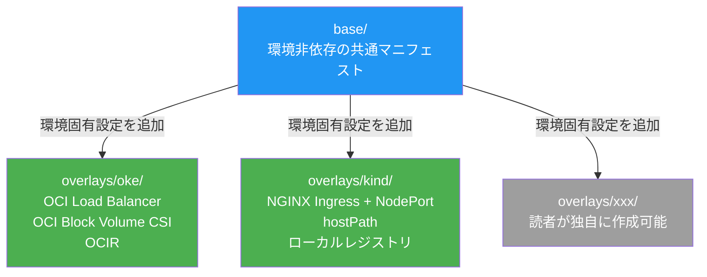

# 第0章 この本の歩き方

Kubernetesの基本は習得した。Pod、Deployment、Serviceを使ってアプリケーションをデプロイできる。しかし、本番環境の運用で次の疑問が浮かぶ。「障害が起きたとき、どこで何が起きているかをどう把握するのか」「サービス間の通信をどう制御し、セキュリティをどう担保するのか」「コードの変更を安全に本番へ届けるにはどうすればよいのか」――本書はこれらの問いに答える。

Observability、Service Mesh、Security、CI/CD & GitOps、Platform Engineeringの5領域を、1つのサンプルアプリケーションを通じて体系的に学ぶ。個別ツールの使い方だけでなく、ツール同士を「組み合わせる」方法まで踏み込む点が本書の特徴である。

### なぜCloud Nativeが重要なのか

Kubernetesを導入しただけでは、Cloud Nativeとは呼べない。CNCF（Cloud Native Computing Foundation）は、Cloud Nativeを「スケーラブルなアプリケーションを、パブリック・プライベート・ハイブリッドクラウドのような動的な環境で構築・実行する能力」と定義している[^1]。単にコンテナでアプリケーションを動かすだけでなく、可観測性、耐障害性、自動化、セキュリティといった運用面の成熟が求められる。

現代のソフトウェア開発では、デプロイ頻度の向上とリードタイムの短縮が競争力に直結する。DORA（DevOps Research and Assessment）の調査によれば、エリートパフォーマーはオンデマンドで1日に複数回のデプロイを実行している[^2]。この速度を安全に実現するには、Observabilityによる迅速な障害検知、Service Meshによるサービス間通信の制御、自動化されたCI/CDパイプライン、そしてPolicy as Codeによるセキュリティの担保が不可欠である。

本書が扱う5つの領域は、いずれもCNCFのプロジェクトとして標準化が進んでいる技術群である。個別に学ぶ資料は豊富にあるが、「どう組み合わせて統合的なプラットフォームを構築するか」を体系的に解説する資料は少ない。本書はこのギャップを埋める。

[^1]: CNCF Cloud Native Definition, https://github.com/cncf/toc/blob/main/DEFINITION.md
[^2]: DORA State of DevOps Report, https://dora.dev/

本章では、読者の前提知識を確認し、書籍全体の構造と読書パスを示した上で、ハンズオン環境の準備方法を説明する。

## 0.1 本書の対象読者と到達目標

### 想定読者

本書は、Kubernetesの基本を理解し、次のステップを模索しているエンジニアを対象とする。具体的には以下のような読者を想定している。

- インフラエンジニア / SRE / プラットフォームエンジニア
- Kubernetesの基本リソースを運用した経験がある
- 「K8sクラスタは作れるが、Observabilityやセキュリティ、CI/CDをどう組み合わせればいいか分からない」という課題を持つ

### 前提知識

本書を読み進めるにあたり、以下の知識を前提とする。

- Kubernetesの基本リソース（Pod、Deployment、Service、ConfigMap、Ingress、Namespace）
- kubectlの基本操作
- コンテナの基本概念（DockerまたはPodmanでのビルド・実行経験）
- YAMLの読み書き
- Helmチャートの基本的な利用方法
- Git / GitHubの基本操作

### 本書で扱う知識（前提としない）

以下の技術は本書で基礎から解説するため、事前知識は不要である。

- Prometheus / Grafana / Loki / Jaeger等のObservabilityツール
- Istio / Cilium等のService Mesh
- OPA / Gatekeeper / Trivy / Sigstore等のセキュリティツール
- ArgoCD / Argo Rollouts等のGitOps・Progressive Deliveryツール
- Backstage / Crossplane等のPlatform Engineeringツール
- OpenTelemetryの計装方法

### 到達目標

本書を読了した読者は、以下の6つの能力を身につける。

1. Prometheus + Loki + Jaeger + GrafanaによるObservability基盤を構築し、メトリクス・ログ・トレースを統合的に運用できる
2. IstioまたはCiliumを用いたService Meshを導入し、サービス間通信の可視化・制御・セキュリティ強化ができる
3. RBAC / NetworkPolicy / OPA Gatekeeper / Trivy / Sigstoreを組み合わせたセキュリティ基盤を設計・構築できる
4. GitHub Actions + ArgoCD + Argo Rolloutsによるコードプッシュから本番デプロイまでの一気通貫パイプラインを構築できる
5. Backstage + Crossplaneを活用したInternal Developer Platformの概念を理解し、Golden Pathを設計できる
6. 各領域の技術を組み合わせて統合的なCloud Nativeプラットフォームとして運用する設計力を身につける

図0.1に、本書を読む前と後で読者のスキルがどのように変化するかを示す。

図0.1: 読者のスキルマップ（Before / After）

```
                    Before              After
                    ------              -----
Observability       [ ]                 [████████]
                    未経験               Prometheus + Loki + Jaeger
                                        による統合基盤を構築可能

Service Mesh        [ ]                 [████████]
                    未経験               Istio / Cilium による
                                        通信制御と可視化が可能

Security            [██ ]               [████████]
                    RBAC基礎のみ         Policy as Code +
                                        サプライチェーンセキュリティ

CI/CD & GitOps      [██ ]               [████████]
                    手動デプロイ          GitOps + Progressive Delivery
                                        による自動パイプライン

Platform Eng.       [ ]                 [██████ ]
                    未経験               IDP概念の理解と
                                        Golden Pathの設計
```

## 0.2 書籍の構造 ― 概念・実践・統合の3層モデル

### 積み上げ型の構成

本書は1つのサンプルアプリケーションを軸に、各Partで技術を段階的に積み上げていく構成をとる。Part 0で「素のKubernetes上で動くアプリケーション」を構築し、Part 1でObservabilityを導入し、Part 2でService Meshを追加し、というように、最終的にフル装備のCloud Nativeアプリケーションが完成する。

### 3層構造モデル

各Partは「概念 → 実践 → 統合」の3層構造で構成される。図0.2にこのモデルを示す。

図0.2: 書籍の3層構造モデル



- **概念**: 各Partの冒頭で「今のサンプルアプリの何が問題か」を明示する。技術の必要性を実感してから導入に進む課題起点アプローチを採用する
- **実践**: 個別ツール（Prometheus、Istio、ArgoCD等）を1章ずつ取り上げ、導入・設定・動作確認までを行う
- **統合**: 各Partの最終章で、個別ツールを組み合わせて統合基盤を構築する。ツールの寄せ集めではなく、一体として機能するプラットフォームを目指す

### Part構成

本書はPart 0〜Part 5の6部構成と付録からなる。図0.3に各Partと章の依存関係を示す。

図0.3: Part構成と章間依存関係



各Partの概要は以下の通りである。

| Part | タイトル | 概要 | ページ（目安） |
|------|---------|------|--------------|
| Part 0 | 準備編 | 本書の歩き方とサンプルアプリケーションの構築 | 約30p |
| Part 1 | Observability | メトリクス・ログ・トレースの収集と統合ダッシュボード | 約80p |
| Part 2 | Service Mesh | Istio / Ciliumによるサービス間通信の制御と可視化 | 約70p |
| Part 3 | Security | クラスタセキュリティからサプライチェーンセキュリティまで | 約70p |
| Part 4 | CI/CD & GitOps | GitOps・Progressive Delivery・CIパイプラインの構築 | 約70p |
| Part 5 | Platform Engineering | IDP構築とすべての技術の統合 | 約60p |
| 付録 | リファレンス | kubeadm構築、Helmチートシート、トラブルシューティング | 約20p |

## 0.3 読書パス

本書は全章を通読するフルパスを推奨するが、読者の目的に応じた選択的な読書パスも用意している。図0.4に各パスを示す。

図0.4: 読書パスマップ



### フルパス（推奨）

第0章 → 第1章 → Part 1（第2〜5章）→ Part 2（第6〜8章）→ Part 3（第9〜12章）→ Part 4（第13〜16章）→ Part 5（第17〜19章）

Cloud Nativeエコシステム全体を体系的に学ぶ最も効果的なパスである。各Partの統合章（第5章、第8章、第12章、第16章、第19章）が、それまでに学んだツールを連携させる要の役割を果たす。フルパスを完了すると、個別ツールの知識だけでなく「統合プラットフォームとしての設計力」が身につく。

**推奨読者**: Cloud Nativeエコシステムの全体像を体系的に習得したいインフラエンジニア・SRE。Kubernetes運用経験が1年以上あり、次のステップとしてプラットフォーム設計を学びたい方。

### Observability特化パス

第0章 → 第1章 → 第2章 → 第3章 → 第4章 → 第5章

メトリクス・ログ・トレースの三本柱を学び、統合Observability基盤を構築する。Part 1内の第2〜4章は互いに独立しているため、任意の順番で読むことができる。

**推奨読者**: 「障害が起きたときに何が起きているか分からない」という課題を最優先で解決したい方。既にKubernetesでアプリケーションを運用しているが、`kubectl logs` と `kubectl describe` だけで障害調査をしている方に最適である。このパスを完了した後、Part 2のService Meshに進むと、サービス間通信の可視化がさらに強化される。

### Security特化パス

第0章 → 第1章 → 第9章 → 第10章 → 第11章 → 第5章 → 第12章

クラスタセキュリティからサプライチェーンセキュリティまでを学ぶ。第12章（統合章）でObservability基盤との連携を扱うため、第5章を先に読む必要がある。

**推奨読者**: セキュリティ監査への対応やコンプライアンス要件を満たす必要があるインフラエンジニア。NetworkPolicyやRBACの基本は知っているが、Policy as CodeやSBOM、イメージ署名まで含めた包括的なセキュリティ基盤を構築したい方。

### CI/CD特化パス

第0章 → 第1章 → 第2章 → 第11章 → 第13章 → 第14章 → 第15章 → 第16章

GitOpsからProgressive Deliveryまでの一気通貫パイプラインを構築する。第14章でPrometheusメトリクスを使用するため第2章が、第15章でTrivyスキャン・cosign署名をCIに組み込むため第11章が前提となる。

**推奨読者**: `kubectl apply` による手動デプロイから脱却し、コードプッシュから本番反映までを自動化したい方。Canaryデプロイやブルーグリーンデプロイによるリスク低減に関心がある方。

### 並列読書が可能な章

以下の章は互いに独立しており、並列に読み進めることができる。チームで分担して学習する場合にも有効である。

- Part 1: 第2章、第3章、第4章
- Part 2: 第6章、第7章（どちらか一方だけでも第8章に進める）
- Part 3: 第9章、第10章、第11章

> **補足**: チームで学習する場合、Part 1の第2〜4章を3人で分担し、各自が担当章を読了した後に第5章（統合章）を全員で読み進めるアプローチが効率的である。

## 0.4 実行環境の準備

### メイン環境

本書のハンズオンは、OKE（Oracle Container Engine for Kubernetes）を検証済み環境として使用する。

| 項目 | 値 |
|------|-----|
| Kubernetes | OKE v1.34.2 |
| ノード数 | 3 |
| OS | Oracle Linux 8.10 |
| コンテナランタイム | CRI-O |

### ローカル開発環境の前提条件

ハンズオンを実行するローカルマシンには、以下のソフトウェアが必要である。

| ソフトウェア | 用途 | 推奨バージョン |
|-------------|------|--------------|
| Docker Desktop または Podman | コンテナイメージのビルド | Docker 24.x以降 / Podman 4.x以降 |
| Python | サンプルアプリケーションのローカル実行・デバッグ | 3.12以降 |
| Node.js | フロントエンドのローカル実行・デバッグ | 20.x LTS以降 |
| jq | JSONレスポンスの整形（任意） | 1.6以降 |
| curl | APIの動作確認 | 任意 |

> **補足**: サンプルアプリケーションのバックエンドサービスはPython（FastAPI + uvicorn）で実装されている。Dockerfileでは `python:3.12-slim` をベースイメージとして使用するため、ローカルにPythonをインストールしなくてもKubernetes上での実行は可能である。ローカルでのデバッグや単体テスト実行時にはPythonが必要となる。

### 代替環境

OKE以外の環境でも本書のハンズオンを実行できる。以下の環境を代替として利用可能である。

- **kind**: ローカル環境でのKubernetesクラスタ。リソース制約があるため一部ハンズオンに制限あり。メモリ8GB以上のマシンを推奨する
- **minikube**: ローカル環境でのシングルノードクラスタ。`minikube start --cpus=4 --memory=8192` での起動を推奨する
- **kubeadm**: 自前で構築するクラスタ（付録Aに構築手順を記載）。ネットワークプラグインの選択が必要
- **他のマネージドK8s**: EKS、GKE、AKS等。Ingress ControllerやStorageClassの設定が環境ごとに異なる

> **注意**: kindやminikubeを使用する場合、Part 2のService Mesh（特にIstioのサイドカーインジェクション）ではメモリ不足になる可能性がある。最低16GBのメモリを搭載したマシンを推奨する。

環境間の差分は、Kustomizeのbase + overlays方式で吸収する。詳細は第1章で解説する。図0.5にこの構成の概要を示す。

図0.5: 環境構成の概要図



### 必要なCLIツール

ハンズオンの実行に必要なCLIツールを以下に示す。

リスト0.1: CLIツールのバージョン確認コマンド

```bash
# バージョン確認コマンド（すべて正常に出力されることを確認する）
$ kubectl version --client
$ kustomize version
$ helm version
$ git version
$ docker version   # または podman version
```

| ツール | 用途 | 推奨バージョン | インストール方法 |
|--------|------|--------------|----------------|
| kubectl | Kubernetesクラスタの操作 | v1.34以降 | https://kubernetes.io/docs/tasks/tools/ |
| kustomize | マニフェストのカスタマイズ | v5.x | https://kubectl.docs.kubernetes.io/installation/kustomize/ |
| helm | パッケージマネージャ | v3.x | https://helm.sh/docs/intro/install/ |
| git | バージョン管理 | v2.x | https://git-scm.com/downloads |
| docker / podman | コンテナビルド・実行 | Docker 24.x / Podman 4.x | https://docs.docker.com/get-docker/ |

> **補足**: kubectlとKubernetesクラスタのバージョンは、マイナーバージョンで1つ以内の差に収める必要がある。例えばKubernetes v1.34のクラスタに対しては、kubectl v1.33〜v1.35を使用する。バージョンが大きく異なると、APIの互換性問題が発生する可能性がある。

各ツールのインストール後、リスト0.1のコマンドを実行して正常にバージョンが表示されることを確認する。いずれかのコマンドが `command not found` となる場合は、PATHの設定を確認する。

リスト0.2に、本書のサンプルアプリケーションで使用するKustomize overlayのディレクトリ構造を示す。

リスト0.2: Kustomize overlayのディレクトリ構造

```
k8s/
  base/                  # 環境非依存の共通マニフェスト
    deployment.yaml
    service.yaml
    kustomization.yaml
  overlays/
    oke/                 # OKE固有の設定（メイン）
      ingress.yaml
      storage.yaml
      kustomization.yaml
    kind/                # kind固有の設定
      ingress.yaml
      storage.yaml
      kustomization.yaml
```

## 0.5 Namespace設計と本書の表記規則

### Namespace設計

本書のハンズオンで使用するNamespaceは `book-` プレフィックスで統一する。表0.1に一覧を示す。

| Namespace | 用途 | 対応Part |
|-----------|------|---------|
| `book-app` | サンプルアプリケーション本体 | Part 0 |
| `book-observability` | Prometheus / Loki / Jaeger / Grafana等 | Part 1 |
| `book-mesh` | Service Mesh関連 | Part 2 |
| `book-security` | Security関連 | Part 3 |
| `book-cicd` | ArgoCD / Argo Rollouts等 | Part 4 |
| `book-platform` | Backstage / Crossplane等 | Part 5 |

> 表0.1: Namespace一覧と対応Part

`book-` プレフィックスを使用する理由は、読者の既存環境との名前衝突を防ぎ、ハンズオン終了後のクリーンアップを容易にするためである。

### コード例の表記

本書で使用するコード例の言語は以下の通りである。

- **Python**: サンプルアプリケーションのバックエンドサービス（FastAPI + uvicorn）
- **JavaScript**: フロントエンド（Node.js / Express）
- **YAML**: Kubernetesマニフェスト、Kustomize設定、Helm values

### コマンド例の表記

コマンド例は以下の形式で記載する。

```bash
# コメント: コマンドの説明
$ kubectl get pods -n book-app
NAME                        READY   STATUS    RESTARTS   AGE
frontend-6d8f9b7c4d-x2j9k  1/1     Running   0          5m
```

`$` プレフィックスが付いた行がユーザーが実行するコマンド、それ以外の行が実行結果である。

### 補足・警告の表記

本書では以下の書式で補足情報や警告を記載する。

> **補足**: 環境固有の追加手順や代替方法を示す。

> **注意**: 設定ミスや見落としやすいポイントを示す。

> **OKE環境の場合**: OKE固有の手順を示す。kind等の代替環境では異なる手順が必要な場合がある。

---

本章では、本書の対象読者・到達目標・書籍構造・読書パス・環境要件・表記規則を確認した。次章では、サンプルアプリケーションを実際にKubernetes上に構築する。この第1章がすべてのPartの出発点となる。環境の準備が整ったら、第1章に進む。

## 理解度チェック

1. 本書が前提とする読者の知識レベルを3つ挙げよ
2. 「概念 → 実践 → 統合」の3層モデルにおいて、統合章の役割は何か
3. Part 1の第2章〜第4章が並列読書可能である理由を説明せよ
4. Kustomize overlayで環境差分を吸収する利点を述べよ

## 参考文献

- Kubernetes公式ドキュメント, https://kubernetes.io/docs/
- Kustomize公式ドキュメント, https://kustomize.io/
- CNCF Cloud Native Landscape, https://landscape.cncf.io/
- CNCF Cloud Native Definition, https://github.com/cncf/toc/blob/main/DEFINITION.md
- DORA State of DevOps Report, https://dora.dev/
