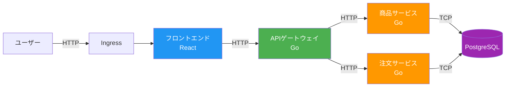
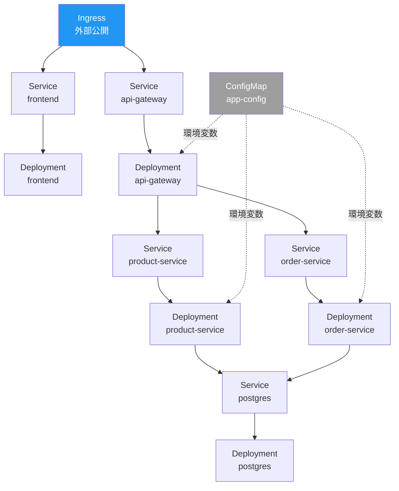
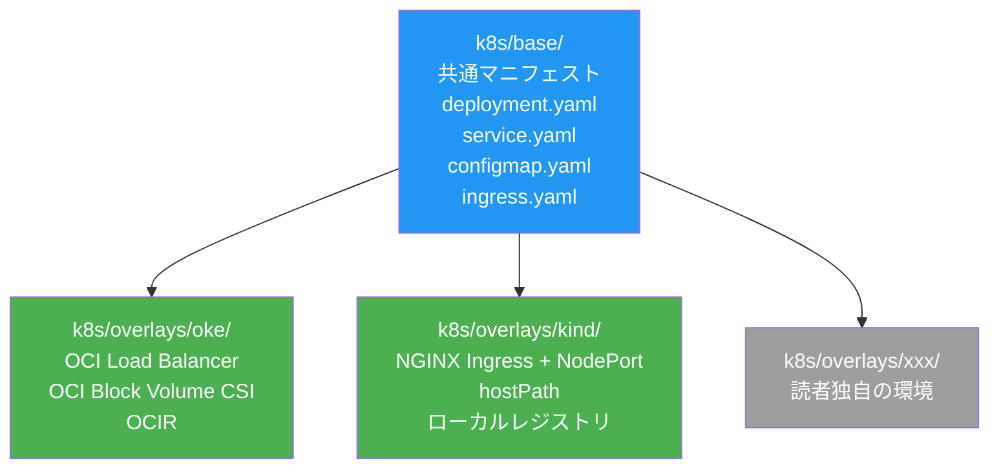
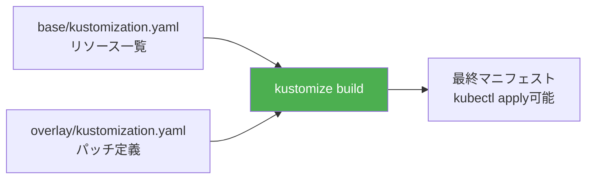
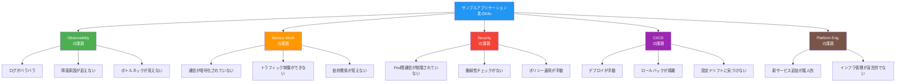

# 第1章 サンプルアプリケーションの構築

第0章で環境要件とNamespace設計を確認した。本章では、本書全体を通して使用するサンプルアプリケーションをKubernetes上に構築する。3〜4サービスで構成されるマイクロサービスアプリケーションをデプロイし、Kustomizeによる環境差分の管理を学ぶ。そして最後に、この「素のKubernetes」環境が抱える課題を明示し、以降のPartで解決すべきテーマを整理する。

## 1.1 サンプルアプリケーションの全体像

本書で使用するサンプルアプリケーションは、簡易的なECサイトを模したマイクロサービスアプリケーションである。図1.1にアーキテクチャを示す。

図1.1: サンプルアプリケーションのアーキテクチャ図



表1.1に各サービスの概要を示す。

| サービス名 | 役割 | 言語 | ポート |
|-----------|------|------|--------|
| frontend | Webフロントエンド。商品一覧・注文画面を提供 | React（Node.js） | 3000 |
| api-gateway | リクエストルーティング。フロントエンドからのAPIリクエストを各バックエンドサービスに振り分ける | Go | 8080 |
| product-service | 商品情報のCRUD操作を提供 | Go | 8081 |
| order-service | 注文処理を管理。商品サービスと連携して注文を作成する | Go | 8082 |
| postgres | データの永続化。商品情報と注文情報を保持する | PostgreSQL 15 | 5432 |

> 表1.1: 各サービスの概要

### サービス間通信フロー

ユーザーからのリクエストは以下の流れで処理される。

1. ユーザーがブラウザからフロントエンドにアクセスする
2. フロントエンドがAPIゲートウェイにHTTPリクエストを送信する
3. APIゲートウェイがリクエストのパスに基づいて商品サービスまたは注文サービスにルーティングする
4. 各バックエンドサービスがPostgreSQLにデータを読み書きする
5. レスポンスが逆順に返される

リスト1.1に、APIゲートウェイのルーティング処理の抜粋を示す。

```go
// リスト1.1: APIゲートウェイのmain.go（抜粋）
package main

import (
    "log"
    "net/http"
    "net/http/httputil"
    "net/url"
    "os"
)

func main() {
    productURL, _ := url.Parse(os.Getenv("PRODUCT_SERVICE_URL"))
    orderURL, _ := url.Parse(os.Getenv("ORDER_SERVICE_URL"))

    // /api/products → 商品サービスへプロキシ
    http.Handle("/api/products/", httputil.NewSingleHostReverseProxy(productURL))
    // /api/orders → 注文サービスへプロキシ
    http.Handle("/api/orders/", httputil.NewSingleHostReverseProxy(orderURL))

    log.Println("API Gateway listening on :8080")
    log.Fatal(http.ListenAndServe(":8080", nil))
}
```

APIゲートウェイはリバースプロキシとして動作し、URLパスに基づいてリクエストを適切なバックエンドサービスに転送する。サービス間の通信はすべてHTTP/RESTで行う。

## 1.2 Kubernetesマニフェストの作成

サンプルアプリケーションをKubernetesにデプロイするために、Deployment、Service、ConfigMap、Ingressの4種類のリソースを定義する。図1.2にこれらのリソースの関係を示す。

図1.2: Kubernetesリソースの構成図



すべてのリソースは `book-app` Namespaceにデプロイする。

```bash
# Namespaceの作成
$ kubectl create namespace book-app
```

### Deployment

リスト1.2に商品サービスのDeploymentマニフェストを示す。他のサービスも同様の構造で定義する。

```yaml
# リスト1.2: Deployment マニフェスト（商品サービス）
apiVersion: apps/v1
kind: Deployment
metadata:
  name: product-service
  namespace: book-app
  labels:
    app: product-service
spec:
  replicas: 2
  selector:
    matchLabels:
      app: product-service
  template:
    metadata:
      labels:
        app: product-service
    spec:
      containers:
        - name: product-service
          image: ghcr.io/cloudnative-book/product-service:v1.0.0
          ports:
            - containerPort: 8081
          envFrom:
            - configMapRef:
                name: app-config
          resources:
            requests:
              cpu: 100m
              memory: 128Mi
            limits:
              cpu: 200m
              memory: 256Mi
```

### Service

リスト1.3にServiceマニフェストを示す。ClusterIPタイプでクラスタ内部からのアクセスを提供する。

```yaml
# リスト1.3: Service マニフェスト（商品サービス）
apiVersion: v1
kind: Service
metadata:
  name: product-service
  namespace: book-app
spec:
  selector:
    app: product-service
  ports:
    - port: 8081
      targetPort: 8081
  type: ClusterIP
```

### ConfigMap

リスト1.4にConfigMapマニフェストを示す。サービス間のエンドポイントやDB接続情報を外部化する。

```yaml
# リスト1.4: ConfigMap マニフェスト
apiVersion: v1
kind: ConfigMap
metadata:
  name: app-config
  namespace: book-app
data:
  PRODUCT_SERVICE_URL: "http://product-service.book-app.svc.cluster.local:8081"
  ORDER_SERVICE_URL: "http://order-service.book-app.svc.cluster.local:8082"
  DATABASE_HOST: "postgres.book-app.svc.cluster.local"
  DATABASE_PORT: "5432"
  DATABASE_NAME: "bookapp"
  DATABASE_USER: "bookapp"
```

> **注意**: 本番環境ではデータベースのパスワードはSecretリソースで管理すべきである。本書ではハンズオンの簡略化のためConfigMapを使用する。

### Ingress

リスト1.5にIngressマニフェストを示す。このマニフェストは環境によって異なるため、Kustomize overlayで上書きする（1.3節で解説）。

```yaml
# リスト1.5: Ingress マニフェスト（base）
apiVersion: networking.k8s.io/v1
kind: Ingress
metadata:
  name: book-app-ingress
  namespace: book-app
spec:
  rules:
    - http:
        paths:
          - path: /
            pathType: Prefix
            backend:
              service:
                name: frontend
                port:
                  number: 3000
          - path: /api
            pathType: Prefix
            backend:
              service:
                name: api-gateway
                port:
                  number: 8080
```

## 1.3 Kustomizeの基本 ― base + overlays

### なぜKustomizeが必要か

前節で作成したマニフェストは、OKE環境を前提としている。しかし、kind環境ではIngressコントローラが異なり、StorageClassも変わる。環境ごとにマニフェストをコピーして修正するのは、保守性の観点から望ましくない。

Kustomize（カスタマイズ）は、Kubernetesマニフェストをテンプレートなしでカスタマイズする仕組みである。baseディレクトリに環境非依存の共通マニフェストを配置し、overlaysディレクトリで環境固有の差分のみを定義する。図1.3にこの構造を示す。

図1.3: Kustomizeのbase + overlays構造図



### kustomization.yamlの構造

kustomization.yamlは、Kustomizeがどのマニフェストをどのように処理するかを定義するファイルである。図1.4に処理フローを示す。

図1.4: kustomization.yamlの処理フロー



リスト1.6にbase側のkustomization.yamlを示す。

```yaml
# リスト1.6: kustomization.yaml（base）
apiVersion: kustomize.config.k8s.io/v1beta1
kind: Kustomization

resources:
  - namespace.yaml
  - deployment-frontend.yaml
  - deployment-api-gateway.yaml
  - deployment-product-service.yaml
  - deployment-order-service.yaml
  - deployment-postgres.yaml
  - service-frontend.yaml
  - service-api-gateway.yaml
  - service-product-service.yaml
  - service-order-service.yaml
  - service-postgres.yaml
  - configmap.yaml
  - ingress.yaml
```

リスト1.7にOKE用overlayのkustomization.yamlを示す。

```yaml
# リスト1.7: kustomization.yaml（OKE overlay）
apiVersion: kustomize.config.k8s.io/v1beta1
kind: Kustomization

resources:
  - ../../base

patches:
  - path: ingress-patch.yaml
  - path: storage-patch.yaml

images:
  - name: ghcr.io/cloudnative-book/frontend
    newName: <region>.ocir.io/<tenancy>/cloudnative-book/frontend
  - name: ghcr.io/cloudnative-book/api-gateway
    newName: <region>.ocir.io/<tenancy>/cloudnative-book/api-gateway
  - name: ghcr.io/cloudnative-book/product-service
    newName: <region>.ocir.io/<tenancy>/cloudnative-book/product-service
  - name: ghcr.io/cloudnative-book/order-service
    newName: <region>.ocir.io/<tenancy>/cloudnative-book/order-service
```

リスト1.8にkind用overlayのkustomization.yamlを示す。

```yaml
# リスト1.8: kustomization.yaml（kind overlay）
apiVersion: kustomize.config.k8s.io/v1beta1
kind: Kustomization

resources:
  - ../../base

patches:
  - path: ingress-patch.yaml
  - path: storage-patch.yaml

images:
  - name: ghcr.io/cloudnative-book/frontend
    newName: localhost:5001/cloudnative-book/frontend
  - name: ghcr.io/cloudnative-book/api-gateway
    newName: localhost:5001/cloudnative-book/api-gateway
  - name: ghcr.io/cloudnative-book/product-service
    newName: localhost:5001/cloudnative-book/product-service
  - name: ghcr.io/cloudnative-book/order-service
    newName: localhost:5001/cloudnative-book/order-service
```

### 環境間で差異が出るポイント

OKE環境とkind環境で主に差異が出るのは以下の3点である。

| 項目 | OKE | kind |
|------|-----|------|
| Ingress | OCI Load Balancer | NGINX Ingress + NodePort |
| StorageClass | OCI Block Volume CSI | hostPath |
| レジストリ | OCIR | ローカルレジストリ（localhost:5001） |

### kustomize buildの実行

以下のコマンドで、最終的なマニフェストを生成できる。

```bash
# OKE環境向けマニフェストの生成と確認
$ kustomize build k8s/overlays/oke/

# 直接適用する場合
$ kubectl apply -k k8s/overlays/oke/
```

`kustomize build` は最終マニフェストを標準出力に出力する。`kubectl apply -k` は `kustomize build` の結果を直接適用する短縮形である。

### 読者独自のoverlayを作成する

読者が独自の環境用overlayを作成する場合、以下の手順で行う。

1. `k8s/overlays/<環境名>/` ディレクトリを作成する
2. kustomization.yamlを作成し、`../../base` をresourcesに指定する
3. 環境固有のIngress、StorageClass、レジストリ設定をパッチとして定義する
4. `kustomize build` で生成結果を確認する

## 1.4 サンプルアプリケーションのデプロイと動作確認

### デプロイ

リスト1.9にデプロイ手順を示す。

```bash
# リスト1.9: デプロイと動作確認のコマンド一式

# OKE環境の場合
$ kubectl apply -k k8s/overlays/oke/

# kind環境の場合
$ kubectl apply -k k8s/overlays/kind/
```

### Pod状態の確認

デプロイ後、すべてのPodがRunning状態になることを確認する。図1.5に期待される出力を示す。

図1.5: デプロイ後のkubectlコマンド出力例

```
$ kubectl get pods -n book-app
NAME                               READY   STATUS    RESTARTS   AGE
frontend-6d8f9b7c4d-x2j9k         1/1     Running   0          2m
frontend-6d8f9b7c4d-abc12          1/1     Running   0          2m
api-gateway-7f4b8c9d5e-m3n4p       1/1     Running   0          2m
api-gateway-7f4b8c9d5e-qrs56       1/1     Running   0          2m
product-service-5a6b7c8d9e-f1g2h   1/1     Running   0          2m
product-service-5a6b7c8d9e-ijk34   1/1     Running   0          2m
order-service-4c5d6e7f8g-h9i0j     1/1     Running   0          2m
order-service-4c5d6e7f8g-klm56     1/1     Running   0          2m
postgres-3b4c5d6e7f-n8o9p          1/1     Running   0          2m

$ kubectl get svc -n book-app
NAME              TYPE        CLUSTER-IP      EXTERNAL-IP   PORT(S)    AGE
frontend          ClusterIP   10.96.100.1     <none>        3000/TCP   2m
api-gateway       ClusterIP   10.96.100.2     <none>        8080/TCP   2m
product-service   ClusterIP   10.96.100.3     <none>        8081/TCP   2m
order-service     ClusterIP   10.96.100.4     <none>        8082/TCP   2m
postgres          ClusterIP   10.96.100.5     <none>        5432/TCP   2m

$ kubectl get ingress -n book-app
NAME               CLASS   HOSTS   ADDRESS          PORTS   AGE
book-app-ingress   nginx   *       203.0.113.100    80      2m
```

すべてのPodが `1/1 Running` になっていれば正常にデプロイできている。PodがPendingやCrashLoopBackOffの場合は、以下のコマンドで原因を調査する。

```bash
# Podの詳細情報を確認
$ kubectl describe pod <pod名> -n book-app

# コンテナのログを確認
$ kubectl logs <pod名> -n book-app
```

### エンドツーエンド動作確認

リスト1.10に、curlを使ったエンドツーエンドの動作確認手順を示す。

```bash
# リスト1.10: curlによるエンドツーエンド動作確認

# IngressのIPアドレスを取得
$ INGRESS_IP=$(kubectl get ingress book-app-ingress -n book-app \
    -o jsonpath='{.status.loadBalancer.ingress[0].ip}')

# 商品の登録
$ curl -X POST http://${INGRESS_IP}/api/products/ \
    -H "Content-Type: application/json" \
    -d '{"name": "Kubernetes入門書", "price": 3000}'
{"id": 1, "name": "Kubernetes入門書", "price": 3000}

# 商品一覧の取得
$ curl http://${INGRESS_IP}/api/products/
[{"id": 1, "name": "Kubernetes入門書", "price": 3000}]

# 注文の作成
$ curl -X POST http://${INGRESS_IP}/api/orders/ \
    -H "Content-Type: application/json" \
    -d '{"product_id": 1, "quantity": 2}'
{"id": 1, "product_id": 1, "quantity": 2, "total": 6000, "status": "created"}
```

商品の登録から注文作成までが正常に動作すれば、サンプルアプリケーションのベースラインが確立できたことになる。

> **OKE環境の場合**: OCI Load BalancerのIPアドレスが割り当てられるまで数分かかる場合がある。`kubectl get ingress -n book-app -w` で状態を監視できる。

> **kind環境の場合**: IngressのIPアドレスの代わりに `localhost` とNodePortを使用する。`kubectl get svc -n ingress-nginx` でNodePortを確認できる。

## 1.5 現状の課題 ― 「素のK8s」の限界

サンプルアプリケーションは正常に動作している。しかし、このまま本番運用するには多くの課題がある。図1.6にこれらの課題を5つの領域に分類して示す。

図1.6: 現状の課題マップ



表1.2に各課題と対応するPartを示す。

| 領域 | 課題 | 対応Part |
|------|------|---------|
| Observability | ログが各Podに分散し、横断検索できない | Part 1（第2〜5章） |
| Observability | 障害発生時にサービス間の因果関係を追跡できない | Part 1（第4章） |
| Observability | パフォーマンスのボトルネックが可視化されていない | Part 1（第2章） |
| Service Mesh | サービス間通信が平文で行われている | Part 2（第6〜7章） |
| Service Mesh | トラフィックの細かい制御（重み付け、リトライ等）ができない | Part 2（第6〜7章） |
| Service Mesh | サービス間の依存関係が可視化されていない | Part 2（第8章） |
| Security | Pod間の通信がNetworkPolicyで制限されていない | Part 3（第9章） |
| Security | コンテナイメージの脆弱性スキャンが行われていない | Part 3（第11章） |
| Security | ポリシー（特権コンテナ禁止等）の適用が手動確認に依存している | Part 3（第10章） |
| CI/CD & GitOps | `kubectl apply` による手動デプロイ | Part 4（第13章） |
| CI/CD & GitOps | ロールバック手順が確立されていない | Part 4（第14章） |
| CI/CD & GitOps | Gitとクラスタ状態の乖離（ドリフト）に気づけない | Part 4（第13章） |
| Platform Eng. | 新サービス追加時のマニフェスト作成が属人的 | Part 5（第17章） |
| Platform Eng. | インフラの状態管理が宣言的に行われていない | Part 5（第18章） |

> 表1.2: 課題一覧と対応するPart

### Observabilityの課題

現在、各Podのログは `kubectl logs` で個別に確認するしかない。複数サービスにまたがるリクエストで障害が発生した場合、どのサービスのどの処理で問題が起きたかを特定するのは困難である。メトリクスも収集されていないため、CPU使用率やレイテンシの傾向を把握できない。

### Service Meshの課題

サービス間の通信は平文のHTTPで行われている。クラスタ内の通信であっても、ゼロトラスト（Zero Trust）の考え方に基づけば暗号化すべきである。トラフィックの重み付けルーティングやリトライポリシーの設定もできない。

### Securityの課題

すべてのPodが他のすべてのPodと通信可能な状態である。NetworkPolicyによるアクセス制限が設定されていない。コンテナイメージに含まれる脆弱性のスキャンも行われておらず、ポリシー違反（特権コンテナの使用等）を検知する仕組みもない。

### CI/CD & GitOpsの課題

デプロイは `kubectl apply` による手動操作に依存している。Gitリポジトリのマニフェストとクラスタの実際の状態が乖離しても検知できない。新バージョンのデプロイで問題が発生した場合のロールバック手順も確立されていない。

### Platform Engineeringの課題

新しいマイクロサービスを追加する際、Deployment、Service、ConfigMap等のマニフェストを手作業で作成する必要がある。この手順は属人的であり、チームの知識として標準化されていない。インフラリソース（データベース、ストレージ等）の管理も宣言的に行われていない。

---

本章では、サンプルアプリケーションをKubernetes上にデプロイし、Kustomizeによる環境差分の管理を学んだ。そして「素のKubernetes」が抱える5つの領域の課題を明確にした。次章からのPart 1では、最初の課題であるObservabilityの解決に取り組む。まずは第2章でPrometheusによるメトリクス収集から始める。

## 理解度チェック

1. サンプルアプリケーションを構成する4つのサービス（フロントエンド、APIゲートウェイ、商品サービス、注文サービス）の役割をそれぞれ説明せよ
2. Kustomizeのbaseとoverlaysの関係を説明し、環境差分をoverlayで吸収する利点を述べよ
3. `kubectl apply -k` と `kustomize build | kubectl apply -f -` の違いを説明せよ
4. 現状の「素のK8s」環境において、Observabilityの観点で具体的にどのような課題があるか3つ挙げよ
5. 新しいクラウド環境用のoverlayを作成する場合、最低限変更が必要なリソースを3つ挙げよ

## 参考文献

- Kustomize公式ドキュメント, https://kustomize.io/
- Kubernetes Ingress, https://kubernetes.io/docs/concepts/services-networking/ingress/
- Kubernetes ConfigMaps, https://kubernetes.io/docs/concepts/configuration/configmap/
