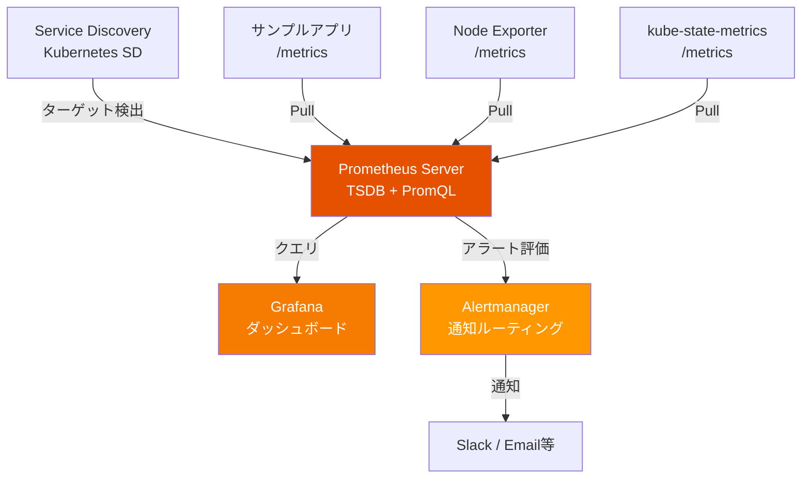
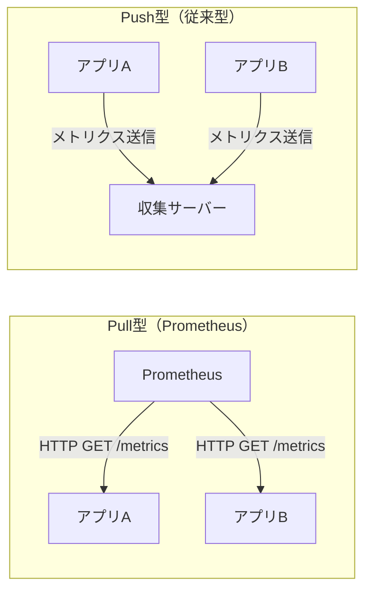
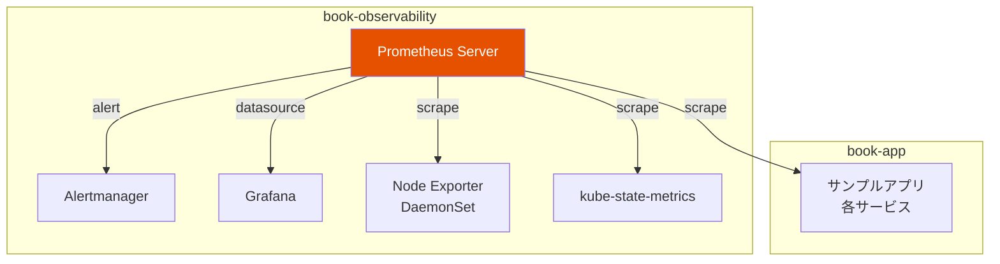
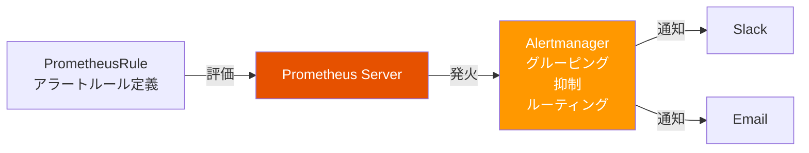

# 第2章 Metrics ― Prometheus

第1章で構築したサンプルアプリケーションは正常に動作している。しかし、1.5節で確認したように「パフォーマンスのボトルネックが見えない」「異常に気づけない」という課題がある。あるリクエストのレスポンスが遅い場合、どのサービスが原因なのか。リソースの使用率がどの程度なのか。現状ではこれらの情報を得る手段がない。

本章では、メトリクス（Metrics）収集の概念を学び、Prometheusを導入してサンプルアプリケーションのメトリクスを収集・可視化・アラート設定するまでを実践する。

## 2.1 なぜメトリクスが必要か ― サンプルアプリの課題から

サンプルアプリケーションで注文処理のレスポンスが遅くなったとする。現状では以下のように手探りで原因を調査するしかない。

図2.1: メトリクスなし vs ありの障害対応フロー

```
メトリクスなしの場合:
  障害報告 → kubectl logs で各Podを個別確認 → 原因特定に時間がかかる
  ┌──────────┐    ┌──────────┐    ┌──────────┐    ┌──────────┐
  │ 障害報告  │ →  │ Pod A    │ →  │ Pod B    │ →  │ Pod C    │ → ...
  │          │    │ ログ確認  │    │ ログ確認  │    │ ログ確認  │
  └──────────┘    └──────────┘    └──────────┘    └──────────┘
  所要時間: 数十分〜数時間

メトリクスありの場合:
  障害報告 → ダッシュボードで即座にボトルネックを特定 → 対応
  ┌──────────┐    ┌──────────────────┐    ┌──────────┐
  │ 障害報告  │ →  │ Grafanaダッシュボード │ →  │ 原因特定  │
  │          │    │ レイテンシ・エラー率  │    │ 即座に対応 │
  └──────────┘    └──────────────────┘    └──────────┘
  所要時間: 数分
```

メトリクスがない状態では、以下の問題が生じる。

- **障害対応の遅延**: 各Podのログを個別に確認する必要があり、原因特定に時間がかかる
- **キャパシティプランニングの困難**: CPU使用率やメモリ使用量の傾向が把握できず、スケーリングの判断が勘頼みになる
- **異常の見逃し**: エラーレートの上昇やレイテンシの悪化に気づくのが遅れる

メトリクスを導入することで、システムの状態を定量的に把握し、問題の早期検知と迅速な対応が可能になる。

## 2.2 Prometheusのアーキテクチャ

Prometheusは、Cloud Native Computing Foundation（CNCF）を卒業したオープンソースのモニタリングシステムである。図2.2にアーキテクチャの全体像を示す。

図2.2: Prometheusのアーキテクチャ全体図



### Pull型メトリクス収集モデル

Prometheusの最大の特徴はPull型のメトリクス収集モデルである。Prometheus Serverが定期的にターゲット（監視対象）の `/metrics` エンドポイントにHTTPリクエストを送り、メトリクスを取得する。図2.3にPull型とPush型の比較を示す。

図2.3: Pull型 vs Push型メトリクス収集モデルの比較



Pull型モデルには以下の利点がある。

- **ターゲットの生死確認**: スクレイプに失敗すればターゲットがダウンしていると判断できる
- **中央集権的な設定管理**: 監視対象の設定はPrometheus側で一元管理できる
- **デバッグの容易さ**: ターゲットの `/metrics` エンドポイントにブラウザからアクセスして内容を確認できる

### Service Discovery

Kubernetes環境では、PodやServiceの追加・削除が頻繁に発生する。Prometheus Kubernetes SD（Service Discovery）は、Kubernetes APIと連携して監視対象を自動検出する。手動でターゲットを登録する必要がない。

### メトリクスの4つの型

Prometheusのメトリクスには4つの型がある。

| 型 | 説明 | 例 |
|----|------|-----|
| Counter | 単調増加する値。リセットは0のみ | HTTPリクエスト総数 |
| Gauge | 任意に増減する値 | 現在のメモリ使用量 |
| Histogram | 値の分布を複数のバケットで計測 | レスポンスタイムの分布 |
| Summary | 値の分布をパーセンタイルで計測 | レスポンスタイムのp99 |

### メトリクス型の選び方 ― 判断フローチャート

メトリクスを新たに定義するとき、どの型を選べばよいか迷うことがある。図2.2b に判断フローチャートを示す。

図2.2b: メトリクス型の選択フローチャート

```
計測したい値は何か？
  │
  ├─ 値は単調増加するか？（リセットは0のみ）
  │   ├─ YES → Counter
  │   │   例: HTTPリクエスト総数、エラー総数、処理バイト数
  │   │   NG例: 現在のキューサイズ（減少しうる）→ Gaugeを使う
  │   │
  │   └─ NO → 値は増減するか？
  │       ├─ YES → Gauge
  │       │   例: 現在のメモリ使用量、アクティブコネクション数、キューサイズ
  │       │   NG例: 総リクエスト数（減少しない）→ Counterを使う
  │       │
  │       └─ 値の分布（パーセンタイル等）を知りたいか？
  │           ├─ サーバー側で集計 → Histogram（推奨）
  │           │   例: レスポンスタイムのp95/p99、リクエストサイズの分布
  │           │   利点: バケットデータからPromQLで任意のパーセンタイルを算出可能
  │           │
  │           └─ クライアント側で集計 → Summary
  │               注意: パーセンタイルが事前固定される。複数インスタンスの集計が不可
  │               → 特別な理由がない限りHistogramを推奨
```

**よくある間違いと対処法**を以下に示す。

- **「現在のリクエスト数」にCounterを使ってしまう**: Counterは累積値である。「現在の同時リクエスト数」のようなスナップショット値にはGaugeを使う
- **HistogramとSummaryの混同**: Summaryはクライアント側でパーセンタイルを計算するため、複数Podのメトリクスを集約できない。Kubernetesのように複数レプリカが存在する環境ではHistogramを使う
- **Counterに `rate()` をかけ忘れる**: Counter値をそのままグラフに表示すると右肩上がりの線になるだけで有用な情報が得られない。必ず `rate()` や `increase()` で変化率に変換する

HTTPリクエスト数にはCounter型が適切である。リクエストは累積的に増加するためGaugeではなく、分布を計測する必要がないためHistogramやSummaryでもない。

## 2.3 Prometheusの導入 ― Helmチャートによるデプロイ

kube-prometheus-stack Helmチャートを使用してPrometheusをデプロイする。このチャートにはPrometheus Server、Alertmanager、Grafana、各種Exporterが含まれる。

図2.4: book-observability Namespaceのリソース配置図



### デプロイ手順

リスト2.1にHelmチャートのインストールコマンドを示す。

```bash
# リスト2.1: kube-prometheus-stack Helmインストールコマンド

# Namespaceの作成
$ kubectl create namespace book-observability

# Helmリポジトリの追加
$ helm repo add prometheus-community \
    https://prometheus-community.github.io/helm-charts
$ helm repo update

# kube-prometheus-stackのインストール
$ helm install prometheus prometheus-community/kube-prometheus-stack \
    -n book-observability \
    -f values.yaml
```

リスト2.2にvalues.yamlのカスタマイズ例を示す。

```yaml
# リスト2.2: values.yamlカスタマイズ（抜粋）
prometheus:
  prometheusSpec:
    retention: 15d
    storageSpec:
      volumeClaimTemplate:
        spec:
          accessModes: ["ReadWriteOnce"]
          resources:
            requests:
              storage: 50Gi
    resources:
      requests:
        cpu: 200m
        memory: 512Mi
      limits:
        cpu: 500m
        memory: 1Gi
    # book-app Namespaceのサービスも監視対象にする
    serviceMonitorSelectorNilUsesHelmValues: false
    podMonitorSelectorNilUsesHelmValues: false

alertmanager:
  alertmanagerSpec:
    resources:
      requests:
        cpu: 100m
        memory: 128Mi

grafana:
  adminPassword: "admin"  # 本番環境ではSecretで管理すること
  resources:
    requests:
      cpu: 100m
      memory: 128Mi
```

### 動作確認

デプロイ後、Prometheus UIにアクセスして動作を確認する。

```bash
# Prometheus UIへのポートフォワード
$ kubectl port-forward -n book-observability \
    svc/prometheus-kube-prometheus-prometheus 9090:9090

# ブラウザで http://localhost:9090 にアクセス
# Status → Targets でbook-appのPodが検出されていることを確認
```

## 2.4 サンプルアプリへのメトリクス計装

Prometheusがメトリクスを収集するには、アプリケーションが `/metrics` エンドポイントでメトリクスを公開する必要がある。図2.5にメトリクス計装の全体フローを示す。

図2.5: メトリクス計装の全体フロー

```mermaid
graph LR
    App[サンプルアプリ<br/>Python / FastAPI] -->|"1. メトリクス定義"| Reg[prometheus_client<br/>メトリクス登録]
    Reg -->|"2. /metrics公開"| EP[/metricsエンドポイント]
    EP -->|"3. scrape"| PS[Prometheus Server]

    style PS fill:#E65100,color:#fff
```

### Pythonアプリへのメトリクス計装

本書のサンプルアプリケーションはPython（FastAPI + uvicorn）で構成されている。Pythonでは `prometheus_client` ライブラリを使用してメトリクスを計装する。

リスト2.3にFastAPIアプリケーションへのメトリクス計装の例を示す。

```python
# リスト2.3: FastAPIアプリへのメトリクス計装（main.py抜粋）
from fastapi import FastAPI, Request, Response
from prometheus_client import (
    generate_latest,
    CONTENT_TYPE_LATEST,
)
import uvicorn

app = FastAPI()

@app.get("/metrics")
def metrics():
    """Prometheus用メトリクスエンドポイント"""
    return Response(
        content=generate_latest(),
        media_type=CONTENT_TYPE_LATEST,
    )

@app.get("/api/products/")
async def list_products(request: Request):
    # ビジネスロジック...
    return {"products": []}

if __name__ == "__main__":
    uvicorn.run(app, host="0.0.0.0", port=8081)
```

`prometheus_client` ライブラリの `generate_latest()` は、登録済みのすべてのメトリクスをPrometheusのテキスト形式（OpenMetrics互換）でシリアライズする。FastAPIの `/metrics` エンドポイントでこれを返すだけで、Prometheusからのスクレイプに対応できる。

リスト2.4にカスタムメトリクスの定義と登録を示す。

```python
# リスト2.4: カスタムメトリクスの定義と登録（metrics.py）
from prometheus_client import Counter, Histogram, Gauge

# HTTPリクエスト総数（Counter）
# Counterは単調増加する値。リクエストのたびに .inc() で加算する
http_requests_total = Counter(
    "http_requests_total",
    "Total number of HTTP requests.",
    ["method", "path", "status"],
)

# HTTPリクエストのレスポンスタイム（Histogram）
# Histogramはデフォルトバケット（.005, .01, .025, .05, .075, .1, .25, .5, .75, 1.0, ...）
# を使用して値の分布を計測する
http_request_duration_seconds = Histogram(
    "http_request_duration_seconds",
    "Duration of HTTP requests in seconds.",
    ["method", "path"],
)

# アクティブコネクション数（Gauge）
# Gaugeは増減する値。.inc() / .dec() / .set() で操作する
active_connections = Gauge(
    "active_connections",
    "Number of active connections.",
)
```

リスト2.4bに、FastAPIのミドルウェアでメトリクスを記録する実装を示す。

```python
# リスト2.4b: ミドルウェアによるメトリクス記録（middleware.py）
import time
from fastapi import Request
from starlette.middleware.base import BaseHTTPMiddleware
from metrics import (
    http_requests_total,
    http_request_duration_seconds,
    active_connections,
)

class PrometheusMiddleware(BaseHTTPMiddleware):
    async def dispatch(self, request: Request, call_next):
        method = request.method
        path = request.url.path

        active_connections.inc()           # Gauge: コネクション開始
        start = time.perf_counter()

        try:
            response = await call_next(request)
            status = str(response.status_code)
        except Exception:
            status = "500"
            raise
        finally:
            duration = time.perf_counter() - start
            active_connections.dec()       # Gauge: コネクション終了

            # Counter: リクエスト数を加算
            http_requests_total.labels(
                method=method, path=path, status=status
            ).inc()

            # Histogram: レスポンスタイムを記録
            http_request_duration_seconds.labels(
                method=method, path=path
            ).observe(duration)

# app.add_middleware(PrometheusMiddleware) で適用
```

ミドルウェアパターンを使用することで、各エンドポイントにメトリクス記録コードを埋め込む必要がなくなる。すべてのHTTPリクエストに対して自動的にメトリクスが収集される。

### スクレイプ設定

Prometheusがアプリケーションのメトリクスを収集するために、2つの方法がある。

#### Podアノテーションによる設定

Deploymentのテンプレートにアノテーションを追加する。

```yaml
# Podアノテーションによるスクレイプ設定
spec:
  template:
    metadata:
      annotations:
        prometheus.io/scrape: "true"
        prometheus.io/port: "8081"
        prometheus.io/path: "/metrics"
```

#### ServiceMonitor CRDによる設定

kube-prometheus-stackではServiceMonitor CRD（Custom Resource Definition）を使用してスクレイプ設定を行うことが推奨される。リスト2.5にServiceMonitorの定義を示す。

```yaml
# リスト2.5: ServiceMonitor CRDの定義
apiVersion: monitoring.coreos.com/v1
kind: ServiceMonitor
metadata:
  name: product-service-monitor
  namespace: book-observability
  labels:
    release: prometheus
spec:
  namespaceSelector:
    matchNames:
      - book-app
  selector:
    matchLabels:
      app: product-service
  endpoints:
    - port: http
      path: /metrics
      interval: 15s
```

ServiceMonitor CRDはPodアノテーションと比べて以下の利点がある。

- **型安全**: CRDスキーマによるバリデーションが行われる
- **Namespace横断**: 異なるNamespaceのサービスを監視対象にできる
- **詳細な設定**: スクレイプ間隔、TLS設定、リラベリング等を細かく制御できる

### ラベル設計とカーディナリティの管理

Prometheusのメトリクスにはラベル（Label）を付与してデータを多次元的に分類できる。しかし、ラベルの組み合わせ数（カーディナリティ）が爆発すると、Prometheusのメモリ使用量とストレージ消費が急激に増加する。

図2.5b: ラベルカーディナリティの影響

```
低カーディナリティ（推奨）:
  method × path × status = 3 × 5 × 5 = 75 時系列
  → Prometheusが快適に処理できる範囲

高カーディナリティ（危険）:
  method × path × status × user_id = 3 × 5 × 5 × 100,000 = 7,500,000 時系列
  → メモリ不足・クエリタイムアウトの原因
```

**ラベル設計の原則**を以下に示す。

| 原則 | 推奨 | 避けるべき |
|------|------|-----------|
| 有限の値 | `method="GET"`, `status="200"` | `user_id="12345"`, `request_id="abc-..."` |
| 分析に必要な軸 | `service`, `path`, `status` | `hostname`（Podが頻繁に入れ替わる環境） |
| 安定した値 | `endpoint="/api/products/"` | `endpoint="/api/products/12345"`（パスパラメータを含む） |

パスパラメータを含むURLをそのままラベルに使用すると、商品IDやユーザーIDの数だけ時系列が生成される。URLパスのラベル値は、パラメータ部分を正規化して固定値にすべきである。例えば `/api/products/{id}` のようにパターン化する。

**カーディナリティの監視方法**として、以下のPromQLクエリが有用である。

```promql
# 時系列数の多いメトリクス名を確認
topk(10, count by (__name__) ({__name__=~".+"}))

# 特定メトリクスのラベルの組み合わせ数を確認
count(http_requests_total)
```

Prometheus UIの「Status → TSDB Status」ページでも、時系列数の多いメトリクスやラベルを確認できる。定期的にこのページを確認し、意図しない時系列の増加がないか監視することが重要である。

### ストレージのサイジングガイド

Prometheusのストレージ容量を見積もるには、以下の3要素を把握する必要がある。

1. **時系列数（Time Series Count）**: 全メトリクスのラベル組み合わせの総数
2. **スクレイプ間隔（Scrape Interval）**: メトリクスの取得頻度（デフォルト: 15秒）
3. **保持期間（Retention）**: データの保持日数

**概算式**は以下の通りである。

```
必要ストレージ ≈ 時系列数 × サンプル数/秒 × 保持期間(秒) × 1〜2バイト/サンプル

具体例:
  時系列数: 10,000
  スクレイプ間隔: 15秒 → 0.067サンプル/秒/時系列
  保持期間: 15日 = 1,296,000秒
  サンプルサイズ: 約1.5バイト（Prometheusの圧縮後）

  10,000 × 0.067 × 1,296,000 × 1.5 ≈ 1.3GB
```

本書のサンプルアプリケーション（3サービス、数十メトリクス）であれば、リスト2.2で設定した50GiのPVCで十分な容量を確保できる。本番環境でサービス数やメトリクス数が増加する場合は、上記の概算式を用いて必要なストレージ容量を事前に見積もることが重要である。

**ストレージ最適化のヒント**を以下に示す。

- **不要なメトリクスの除外**: `metric_relabel_configs` を使い、使用しないメトリクスをスクレイプ時にドロップする
- **スクレイプ間隔の調整**: 重要度の低いメトリクスは間隔を長くする（例: 30秒、60秒）
- **長期保存にはリモートストレージを使用する**: Thanos、Cortex、Grafana Mimirなどのリモートストレージを導入することで、Prometheus本体のストレージ要件を軽減できる

## 2.5 PromQLによるメトリクスのクエリ

PromQL（Prometheus Query Language）は、Prometheusに格納されたメトリクスを問い合わせるための専用クエリ言語である。

### 基本構文

PromQLの基本は**セレクタ**と**ラベルマッチング**である。

```promql
# メトリクス名でのクエリ
http_requests_total

# ラベルによるフィルタリング
http_requests_total{method="GET", status="200"}

# 正規表現マッチング
http_requests_total{path=~"/api/.*"}
```

### 瞬時ベクトルと範囲ベクトル

- **瞬時ベクトル（Instant Vector）**: ある時点での各時系列の最新値
- **範囲ベクトル（Range Vector）**: 指定した時間幅のデータポイント群

```promql
# 瞬時ベクトル
http_requests_total

# 範囲ベクトル（過去5分間）
http_requests_total[5m]
```

### 主要関数

表2.1にPromQLの基本関数を示す。

| 関数 | 説明 | 用途 |
|------|------|------|
| `rate()` | Counterの1秒あたりの変化率 | リクエストレートの算出 |
| `increase()` | Counterの指定期間内の増加量 | 期間内のリクエスト数 |
| `sum()` | 値の合計 | 全Podのリクエスト数合計 |
| `avg()` | 値の平均 | 平均レスポンスタイム |
| `max()` / `min()` | 最大値 / 最小値 | ピーク値の把握 |
| `histogram_quantile()` | パーセンタイル算出 | p95、p99レイテンシ |
| `count()` | 時系列の数 | 稼働中のPod数 |
| `topk()` | 上位N件 | 最もリクエストが多いエンドポイント |

> 表2.1: PromQLの基本関数一覧

### 実用クエリ集

リスト2.6に、サンプルアプリケーションに対する実用的なPromQLクエリを示す。

```promql
# リスト2.6: PromQL実用クエリ集

# リクエストレート（1秒あたりのリクエスト数、過去5分の平均）
rate(http_requests_total[5m])

# エラーレート（5xx系レスポンスの割合）
sum(rate(http_requests_total{status=~"5.."}[5m]))
  /
sum(rate(http_requests_total[5m]))

# レスポンスタイムのp95（95パーセンタイル）
histogram_quantile(0.95,
  sum(rate(http_request_duration_seconds_bucket[5m])) by (le)
)

# レスポンスタイムのp99（99パーセンタイル）
histogram_quantile(0.99,
  sum(rate(http_request_duration_seconds_bucket[5m])) by (le, path)
)

# サービス別のリクエストレート
sum(rate(http_requests_total[5m])) by (service)
```

図2.6にPromQLクエリの実行結果例を示す。

図2.6: PromQLクエリの実行結果例

```
Prometheus UI - Graph

Query: rate(http_requests_total{service="product-service"}[5m])

     RPS
  6 ┤                          ╭──╮
  5 ┤                    ╭─────╯  ╰──╮
  4 ┤              ╭─────╯           ╰──────╮
  3 ┤        ╭─────╯                        ╰──╮
  2 ┤  ╭─────╯                                 ╰──
  1 ┤──╯
  0 ┤
    └──────────────────────────────────────────────
     10:00    10:15    10:30    10:45    11:00

  product-service{method="GET", path="/api/products/"}
```

### rate()とincrease()の違い

`rate()` と `increase()` はどちらもCounterの変化を計算するが、意味が異なる。

- `rate(http_requests_total[5m])`: 過去5分間の**1秒あたりの平均変化率**（単位: requests/sec）
- `increase(http_requests_total[5m])`: 過去5分間の**総増加量**（単位: requests）

`increase()` は `rate()` に時間幅を掛けた値に等しい。`increase(metric[5m])` ≈ `rate(metric[5m]) * 300`。

### PromQLデバッグのコツ

PromQLクエリが期待通りの結果を返さない場合、以下の手順でデバッグする。

**1. メトリクスの存在確認**

まず、対象のメトリクスが実際にPrometheusに取り込まれているか確認する。

```promql
# メトリクスが存在するか確認（結果が空なら未収集）
http_requests_total

# ターゲットの状態を確認
up{job="product-service"}
# 値が1ならスクレイプ成功、0なら失敗
```

Prometheus UIの「Status → Targets」で、ターゲットのステータス（UP/DOWN）とLast Scrapeの時刻を確認できる。ステータスがDOWNの場合はエラーメッセージも表示されるため、原因の特定に役立つ。

**2. ラベル値の確認**

ラベルのフィルタが正しいか、実際のラベル値を確認する。

```promql
# そのメトリクスに付与されているラベル値を一覧表示
group by (status) (http_requests_total)
# → {status="200"}, {status="404"}, {status="500"} など

# ラベル値を間違えていないか確認
# NG: status="5xx"（正規表現を使っていない）
# OK: status=~"5.."（正規表現マッチング）
```

**3. 範囲ベクトルの時間幅の確認**

`rate()` や `increase()` で「no data」が返る場合、時間幅内にデータポイントが不足している可能性がある。

```promql
# 過去5分間のデータポイント数を確認
count_over_time(http_requests_total[5m])

# スクレイプ間隔が15秒の場合、5分間で約20データポイントが期待される
# 結果が0や1の場合、時間幅を広げる必要がある
```

`rate()` の時間幅は、スクレイプ間隔の少なくとも4倍を指定することが推奨される。スクレイプ間隔が15秒であれば、`rate(metric[1m])` 以上を使用する。

**4. よくあるエラーと対処**

| エラー/症状 | 原因 | 対処 |
|------------|------|------|
| `no data` | メトリクス名やラベル値が間違っている | メトリクス名をオートコンプリートで確認 |
| `parse error` | 構文エラー | 括弧の対応、`by` 句の位置を確認 |
| 値が常に0 | Counterに `rate()` を適用していない | `rate()` または `increase()` で変化率に変換 |
| グラフが途切れる | スクレイプに間欠的に失敗している | Targets画面でエラーを確認 |
| 結果が多すぎる | `by` 句による集約が不足 | `sum by (label)` で必要な軸に集約 |

## 2.6 アラート設計 ― Alertmanager

メトリクスを収集するだけでは不十分である。異常を検知して通知する仕組みが必要となる。図2.7にアラートの処理フローを示す。

図2.7: アラートの処理フロー



### アラートルールの定義

リスト2.7にPrometheusRule CRDによるアラートルール定義を示す。

```yaml
# リスト2.7: PrometheusRule CRDによるアラートルール定義
apiVersion: monitoring.coreos.com/v1
kind: PrometheusRule
metadata:
  name: book-app-alerts
  namespace: book-observability
  labels:
    release: prometheus
spec:
  groups:
    - name: book-app.rules
      rules:
        # 高エラーレート
        - alert: HighErrorRate
          expr: |
            sum(rate(http_requests_total{status=~"5.."}[5m]))
              /
            sum(rate(http_requests_total[5m]))
            > 0.05
          for: 5m
          labels:
            severity: critical
          annotations:
            summary: "高エラーレート検出"
            description: "5xxエラーの割合が5%を超えている"

        # 高レイテンシ
        - alert: HighLatency
          expr: |
            histogram_quantile(0.95,
              sum(rate(http_request_duration_seconds_bucket[5m])) by (le)
            ) > 1.0
          for: 5m
          labels:
            severity: warning
          annotations:
            summary: "高レイテンシ検出"
            description: "p95レイテンシが1秒を超えている"

        # Pod再起動の検出
        - alert: PodRestarting
          expr: |
            increase(kube_pod_container_status_restarts_total{
              namespace="book-app"
            }[1h]) > 3
          for: 5m
          labels:
            severity: warning
          annotations:
            summary: "Pod再起動検出"
            description: "{{ $labels.pod }}が直近1時間で3回以上再起動"
```

表2.2にサンプルアプリ用のアラートルール一覧を示す。

| アラート名 | 条件 | 重要度 | 持続時間 |
|-----------|------|--------|---------|
| HighErrorRate | 5xxエラー率 > 5% | critical | 5分 |
| HighLatency | p95レイテンシ > 1秒 | warning | 5分 |
| PodRestarting | 1時間で3回以上再起動 | warning | 5分 |
| HighCPUUsage | CPU使用率 > 80% | warning | 10分 |
| DiskSpaceLow | ディスク使用率 > 85% | critical | 5分 |

> 表2.2: サンプルアプリ用アラートルール一覧

### Alertmanagerのルーティング設定

リスト2.8にAlertmanagerのルーティング設定を示す。

```yaml
# リスト2.8: Alertmanagerのルーティング設定
alertmanager:
  config:
    global:
      resolve_timeout: 5m
    route:
      group_by: ['alertname', 'namespace']
      group_wait: 30s
      group_interval: 5m
      repeat_interval: 4h
      receiver: 'default'
      routes:
        - match:
            severity: critical
          receiver: 'critical-alerts'
        - match:
            severity: warning
          receiver: 'warning-alerts'
    receivers:
      - name: 'default'
        # デフォルトの通知先
      - name: 'critical-alerts'
        slack_configs:
          - channel: '#alerts-critical'
            send_resolved: true
      - name: 'warning-alerts'
        slack_configs:
          - channel: '#alerts-warning'
            send_resolved: true
```

### アラート疲れを防ぐための設計原則

アラート疲れ（Alert Fatigue）とは、アラートが多すぎて重要なアラートが埋もれてしまう状態を指す。以下の原則に従ってアラートを設計する。

1. **アクション可能なアラートのみ設定する**: 通知を受けた人が具体的な対応を取れるアラートに限定する
2. **`for` 句で一過性のスパイクを除外する**: 短期間のスパイクでアラートが発火しないように持続時間を設定する
3. **重要度を適切に分類する**: critical（即座の対応が必要）、warning（翌営業日までの対応）、info（情報提供のみ）の3段階で分類する

---

本章では、Prometheusを導入してサンプルアプリケーションのメトリクスを収集・可視化・アラート設定するまでを実践した。メトリクスにより「何が起きているか」を定量的に把握できるようになった。しかし、「なぜ起きたか」の詳細な原因はメトリクスだけでは追えない。次章ではFluent Bit + Lokiによるログ集約を学び、障害の原因調査に不可欠な情報を得る手段を整える。

## 理解度チェック

1. PrometheusのPull型メトリクス収集モデルの利点を、Push型と比較して2つ挙げよ
2. メトリクスの4つの型（Counter / Gauge / Histogram / Summary）の違いを説明し、HTTPリクエスト数にはどの型が適切か理由とともに答えよ
3. `rate(http_requests_total[5m])` と `increase(http_requests_total[5m])` の違いを説明せよ
4. アラート疲れ（Alert Fatigue）を防ぐためのアラート設計の原則を3つ挙げよ
5. ServiceMonitor CRDとPodアノテーションによるスクレイプ設定の違いを説明せよ

## 参考文献

- Prometheus公式ドキュメント, https://prometheus.io/docs/
- PromQL公式リファレンス, https://prometheus.io/docs/prometheus/latest/querying/basics/
- kube-prometheus-stack Helmチャート, https://github.com/prometheus-community/helm-charts/tree/main/charts/kube-prometheus-stack
- Prometheus client_python, https://github.com/prometheus/client_python
