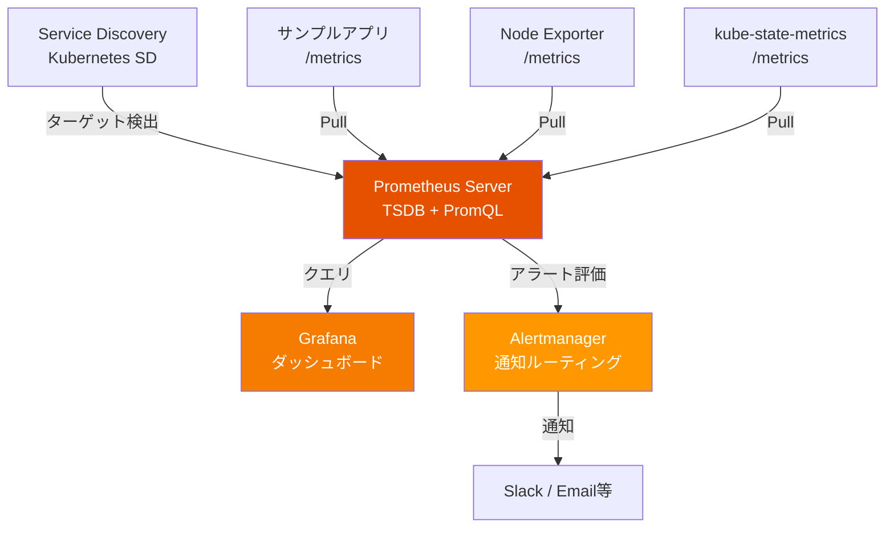
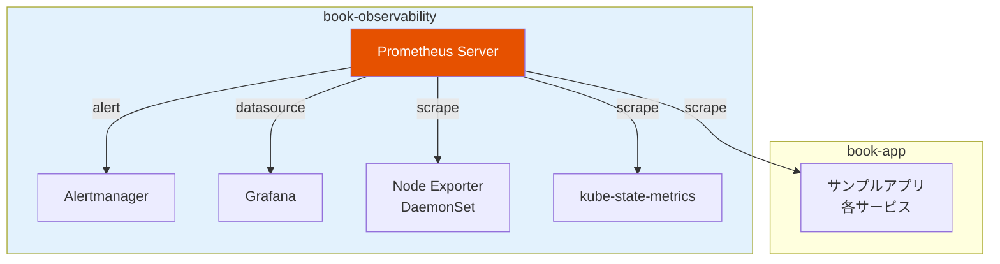
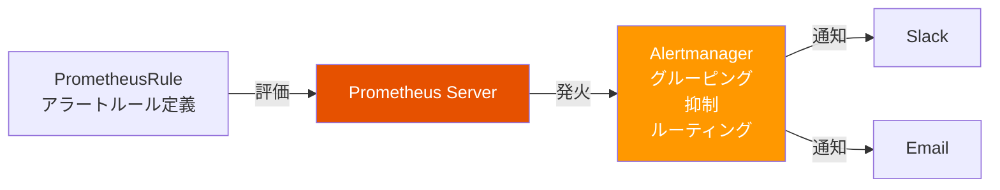

# 第2章 Metrics ― Prometheus

第1章で構築したサンプルアプリケーションは正常に動作している。しかし、1.5節で確認したように「パフォーマンスのボトルネックが見えない」「異常に気づけない」という課題がある。あるリクエストのレスポンスが遅い場合、どのサービスが原因なのか。リソースの使用率がどの程度なのか。現状ではこれらの情報を得る手段がない。

本章では、メトリクス（Metrics）収集の概念を学び、Prometheusを導入してサンプルアプリケーションのメトリクスを収集・可視化・アラート設定するまでを実践する。

## 2.1 なぜメトリクスが必要か ― サンプルアプリの課題から

サンプルアプリケーションで注文処理のレスポンスが遅くなったとする。現状では以下のように手探りで原因を調査するしかない。

図2.1: メトリクスなし vs ありの障害対応フロー

```
メトリクスなしの場合:
  障害報告 → kubectl logs で各Podを個別確認 → 原因特定に時間がかかる
  ┌──────────┐    ┌──────────┐    ┌──────────┐    ┌──────────┐
  │ 障害報告  │ →  │ Pod A    │ →  │ Pod B    │ →  │ Pod C    │ → ...
  │          │    │ ログ確認  │    │ ログ確認  │    │ ログ確認  │
  └──────────┘    └──────────┘    └──────────┘    └──────────┘
  所要時間: 数十分〜数時間

メトリクスありの場合:
  障害報告 → ダッシュボードで即座にボトルネックを特定 → 対応
  ┌──────────┐    ┌──────────────────┐    ┌──────────┐
  │ 障害報告  │ →  │ Grafanaダッシュボード │ →  │ 原因特定  │
  │          │    │ レイテンシ・エラー率  │    │ 即座に対応 │
  └──────────┘    └──────────────────┘    └──────────┘
  所要時間: 数分
```

メトリクスがない状態では、以下の問題が生じる。

- **障害対応の遅延**: 各Podのログを個別に確認する必要があり、原因特定に時間がかかる
- **キャパシティプランニングの困難**: CPU使用率やメモリ使用量の傾向が把握できず、スケーリングの判断が勘頼みになる
- **異常の見逃し**: エラーレートの上昇やレイテンシの悪化に気づくのが遅れる

メトリクスを導入することで、システムの状態を定量的に把握し、問題の早期検知と迅速な対応が可能になる。

## 2.2 Prometheusのアーキテクチャ

Prometheusは、Cloud Native Computing Foundation（CNCF）を卒業したオープンソースのモニタリングシステムである。図2.2にアーキテクチャの全体像を示す。

図2.2: Prometheusのアーキテクチャ全体図



### Pull型メトリクス収集モデル

Prometheusの最大の特徴はPull型のメトリクス収集モデルである。Prometheus Serverが定期的にターゲット（監視対象）の `/metrics` エンドポイントにHTTPリクエストを送り、メトリクスを取得する。図2.3にPull型とPush型の比較を示す。

図2.3: Pull型 vs Push型メトリクス収集モデルの比較

```mermaid
graph LR
    subgraph Pull型（Prometheus）
        P_Server[Prometheus] -->|"HTTP GET /metrics"| P_App1[アプリA]
        P_Server -->|"HTTP GET /metrics"| P_App2[アプリB]
    end

    subgraph Push型（従来型）
        Push_App1[アプリA] -->|"メトリクス送信"| Push_Server[収集サーバー]
        Push_App2[アプリB] -->|"メトリクス送信"| Push_Server
    end
```

Pull型モデルには以下の利点がある。

- **ターゲットの生死確認**: スクレイプに失敗すればターゲットがダウンしていると判断できる
- **中央集権的な設定管理**: 監視対象の設定はPrometheus側で一元管理できる
- **デバッグの容易さ**: ターゲットの `/metrics` エンドポイントにブラウザからアクセスして内容を確認できる

### Service Discovery

Kubernetes環境では、PodやServiceの追加・削除が頻繁に発生する。Prometheus Kubernetes SD（Service Discovery）は、Kubernetes APIと連携して監視対象を自動検出する。手動でターゲットを登録する必要がない。

### メトリクスの4つの型

Prometheusのメトリクスには4つの型がある。

| 型 | 説明 | 例 |
|----|------|-----|
| Counter | 単調増加する値。リセットは0のみ | HTTPリクエスト総数 |
| Gauge | 任意に増減する値 | 現在のメモリ使用量 |
| Histogram | 値の分布を複数のバケットで計測 | レスポンスタイムの分布 |
| Summary | 値の分布をパーセンタイルで計測 | レスポンスタイムのp99 |

HTTPリクエスト数にはCounter型が適切である。リクエストは累積的に増加するためGaugeではなく、分布を計測する必要がないためHistogramやSummaryでもない。

## 2.3 Prometheusの導入 ― Helmチャートによるデプロイ

kube-prometheus-stack Helmチャートを使用してPrometheusをデプロイする。このチャートにはPrometheus Server、Alertmanager、Grafana、各種Exporterが含まれる。

図2.4: book-observability Namespaceのリソース配置図



### デプロイ手順

リスト2.1にHelmチャートのインストールコマンドを示す。

```bash
# リスト2.1: kube-prometheus-stack Helmインストールコマンド

# Namespaceの作成
$ kubectl create namespace book-observability

# Helmリポジトリの追加
$ helm repo add prometheus-community \
    https://prometheus-community.github.io/helm-charts
$ helm repo update

# kube-prometheus-stackのインストール
$ helm install prometheus prometheus-community/kube-prometheus-stack \
    -n book-observability \
    -f values.yaml
```

リスト2.2にvalues.yamlのカスタマイズ例を示す。

```yaml
# リスト2.2: values.yamlカスタマイズ（抜粋）
prometheus:
  prometheusSpec:
    retention: 15d
    storageSpec:
      volumeClaimTemplate:
        spec:
          accessModes: ["ReadWriteOnce"]
          resources:
            requests:
              storage: 50Gi
    resources:
      requests:
        cpu: 200m
        memory: 512Mi
      limits:
        cpu: 500m
        memory: 1Gi
    # book-app Namespaceのサービスも監視対象にする
    serviceMonitorSelectorNilUsesHelmValues: false
    podMonitorSelectorNilUsesHelmValues: false

alertmanager:
  alertmanagerSpec:
    resources:
      requests:
        cpu: 100m
        memory: 128Mi

grafana:
  adminPassword: "admin"  # 本番環境ではSecretで管理すること
  resources:
    requests:
      cpu: 100m
      memory: 128Mi
```

### 動作確認

デプロイ後、Prometheus UIにアクセスして動作を確認する。

```bash
# Prometheus UIへのポートフォワード
$ kubectl port-forward -n book-observability \
    svc/prometheus-kube-prometheus-prometheus 9090:9090

# ブラウザで http://localhost:9090 にアクセス
# Status → Targets でbook-appのPodが検出されていることを確認
```

## 2.4 サンプルアプリへのメトリクス計装

Prometheusがメトリクスを収集するには、アプリケーションが `/metrics` エンドポイントでメトリクスを公開する必要がある。図2.5にメトリクス計装の全体フローを示す。

図2.5: メトリクス計装の全体フロー

```mermaid
graph LR
    App[サンプルアプリ<br/>Go] -->|"1. メトリクス定義"| Reg[Prometheus Registry<br/>メトリクス登録]
    Reg -->|"2. /metrics公開"| EP[/metricsエンドポイント]
    EP -->|"3. scrape"| PS[Prometheus Server]

    style PS fill:#E65100,color:#fff
```

### Goアプリへのメトリクス計装

リスト2.3にGoアプリケーションへのメトリクス計装の例を示す。

```go
// リスト2.3: Goアプリへのメトリクス計装（main.go抜粋）
package main

import (
    "net/http"
    "github.com/prometheus/client_golang/prometheus/promhttp"
)

func main() {
    // メトリクスエンドポイントの公開
    http.Handle("/metrics", promhttp.Handler())

    // アプリケーションのハンドラ
    http.HandleFunc("/api/products/", productsHandler)

    http.ListenAndServe(":8081", nil)
}
```

リスト2.4にカスタムメトリクスの定義と登録を示す。

```go
// リスト2.4: カスタムメトリクスの定義と登録
package main

import (
    "github.com/prometheus/client_golang/prometheus"
    "github.com/prometheus/client_golang/prometheus/promauto"
)

var (
    // HTTPリクエスト総数（Counter）
    httpRequestsTotal = promauto.NewCounterVec(
        prometheus.CounterOpts{
            Name: "http_requests_total",
            Help: "Total number of HTTP requests",
        },
        []string{"method", "path", "status"},
    )

    // HTTPリクエストのレスポンスタイム（Histogram）
    httpRequestDuration = promauto.NewHistogramVec(
        prometheus.HistogramOpts{
            Name:    "http_request_duration_seconds",
            Help:    "HTTP request duration in seconds",
            Buckets: prometheus.DefBuckets,
        },
        []string{"method", "path"},
    )

    // アクティブコネクション数（Gauge）
    activeConnections = promauto.NewGauge(
        prometheus.GaugeOpts{
            Name: "active_connections",
            Help: "Number of active connections",
        },
    )
)
```

### スクレイプ設定

Prometheusがアプリケーションのメトリクスを収集するために、2つの方法がある。

#### Podアノテーションによる設定

Deploymentのテンプレートにアノテーションを追加する。

```yaml
# Podアノテーションによるスクレイプ設定
spec:
  template:
    metadata:
      annotations:
        prometheus.io/scrape: "true"
        prometheus.io/port: "8081"
        prometheus.io/path: "/metrics"
```

#### ServiceMonitor CRDによる設定

kube-prometheus-stackではServiceMonitor CRD（Custom Resource Definition）を使用してスクレイプ設定を行うことが推奨される。リスト2.5にServiceMonitorの定義を示す。

```yaml
# リスト2.5: ServiceMonitor CRDの定義
apiVersion: monitoring.coreos.com/v1
kind: ServiceMonitor
metadata:
  name: product-service-monitor
  namespace: book-observability
  labels:
    release: prometheus
spec:
  namespaceSelector:
    matchNames:
      - book-app
  selector:
    matchLabels:
      app: product-service
  endpoints:
    - port: http
      path: /metrics
      interval: 15s
```

ServiceMonitor CRDはPodアノテーションと比べて以下の利点がある。

- **型安全**: CRDスキーマによるバリデーションが行われる
- **Namespace横断**: 異なるNamespaceのサービスを監視対象にできる
- **詳細な設定**: スクレイプ間隔、TLS設定、リラベリング等を細かく制御できる

## 2.5 PromQLによるメトリクスのクエリ

PromQL（Prometheus Query Language）は、Prometheusに格納されたメトリクスを問い合わせるための専用クエリ言語である。

### 基本構文

PromQLの基本は**セレクタ**と**ラベルマッチング**である。

```promql
# メトリクス名でのクエリ
http_requests_total

# ラベルによるフィルタリング
http_requests_total{method="GET", status="200"}

# 正規表現マッチング
http_requests_total{path=~"/api/.*"}
```

### 瞬時ベクトルと範囲ベクトル

- **瞬時ベクトル（Instant Vector）**: ある時点での各時系列の最新値
- **範囲ベクトル（Range Vector）**: 指定した時間幅のデータポイント群

```promql
# 瞬時ベクトル
http_requests_total

# 範囲ベクトル（過去5分間）
http_requests_total[5m]
```

### 主要関数

表2.1にPromQLの基本関数を示す。

| 関数 | 説明 | 用途 |
|------|------|------|
| `rate()` | Counterの1秒あたりの変化率 | リクエストレートの算出 |
| `increase()` | Counterの指定期間内の増加量 | 期間内のリクエスト数 |
| `sum()` | 値の合計 | 全Podのリクエスト数合計 |
| `avg()` | 値の平均 | 平均レスポンスタイム |
| `max()` / `min()` | 最大値 / 最小値 | ピーク値の把握 |
| `histogram_quantile()` | パーセンタイル算出 | p95、p99レイテンシ |
| `count()` | 時系列の数 | 稼働中のPod数 |
| `topk()` | 上位N件 | 最もリクエストが多いエンドポイント |

> 表2.1: PromQLの基本関数一覧

### 実用クエリ集

リスト2.6に、サンプルアプリケーションに対する実用的なPromQLクエリを示す。

```promql
# リスト2.6: PromQL実用クエリ集

# リクエストレート（1秒あたりのリクエスト数、過去5分の平均）
rate(http_requests_total[5m])

# エラーレート（5xx系レスポンスの割合）
sum(rate(http_requests_total{status=~"5.."}[5m]))
  /
sum(rate(http_requests_total[5m]))

# レスポンスタイムのp95（95パーセンタイル）
histogram_quantile(0.95,
  sum(rate(http_request_duration_seconds_bucket[5m])) by (le)
)

# レスポンスタイムのp99（99パーセンタイル）
histogram_quantile(0.99,
  sum(rate(http_request_duration_seconds_bucket[5m])) by (le, path)
)

# サービス別のリクエストレート
sum(rate(http_requests_total[5m])) by (service)
```

図2.6にPromQLクエリの実行結果例を示す。

図2.6: PromQLクエリの実行結果例

```
Prometheus UI - Graph

Query: rate(http_requests_total{service="product-service"}[5m])

     RPS
  6 ┤                          ╭──╮
  5 ┤                    ╭─────╯  ╰──╮
  4 ┤              ╭─────╯           ╰──────╮
  3 ┤        ╭─────╯                        ╰──╮
  2 ┤  ╭─────╯                                 ╰──
  1 ┤──╯
  0 ┤
    └──────────────────────────────────────────────
     10:00    10:15    10:30    10:45    11:00

  product-service{method="GET", path="/api/products/"}
```

### rate()とincrease()の違い

`rate()` と `increase()` はどちらもCounterの変化を計算するが、意味が異なる。

- `rate(http_requests_total[5m])`: 過去5分間の**1秒あたりの平均変化率**（単位: requests/sec）
- `increase(http_requests_total[5m])`: 過去5分間の**総増加量**（単位: requests）

`increase()` は `rate()` に時間幅を掛けた値に等しい。`increase(metric[5m])` ≈ `rate(metric[5m]) * 300`。

## 2.6 アラート設計 ― Alertmanager

メトリクスを収集するだけでは不十分である。異常を検知して通知する仕組みが必要となる。図2.7にアラートの処理フローを示す。

図2.7: アラートの処理フロー



### アラートルールの定義

リスト2.7にPrometheusRule CRDによるアラートルール定義を示す。

```yaml
# リスト2.7: PrometheusRule CRDによるアラートルール定義
apiVersion: monitoring.coreos.com/v1
kind: PrometheusRule
metadata:
  name: book-app-alerts
  namespace: book-observability
  labels:
    release: prometheus
spec:
  groups:
    - name: book-app.rules
      rules:
        # 高エラーレート
        - alert: HighErrorRate
          expr: |
            sum(rate(http_requests_total{status=~"5.."}[5m]))
              /
            sum(rate(http_requests_total[5m]))
            > 0.05
          for: 5m
          labels:
            severity: critical
          annotations:
            summary: "高エラーレート検出"
            description: "5xxエラーの割合が5%を超えている"

        # 高レイテンシ
        - alert: HighLatency
          expr: |
            histogram_quantile(0.95,
              sum(rate(http_request_duration_seconds_bucket[5m])) by (le)
            ) > 1.0
          for: 5m
          labels:
            severity: warning
          annotations:
            summary: "高レイテンシ検出"
            description: "p95レイテンシが1秒を超えている"

        # Pod再起動の検出
        - alert: PodRestarting
          expr: |
            increase(kube_pod_container_status_restarts_total{
              namespace="book-app"
            }[1h]) > 3
          for: 5m
          labels:
            severity: warning
          annotations:
            summary: "Pod再起動検出"
            description: "{{ $labels.pod }}が直近1時間で3回以上再起動"
```

表2.2にサンプルアプリ用のアラートルール一覧を示す。

| アラート名 | 条件 | 重要度 | 持続時間 |
|-----------|------|--------|---------|
| HighErrorRate | 5xxエラー率 > 5% | critical | 5分 |
| HighLatency | p95レイテンシ > 1秒 | warning | 5分 |
| PodRestarting | 1時間で3回以上再起動 | warning | 5分 |
| HighCPUUsage | CPU使用率 > 80% | warning | 10分 |
| DiskSpaceLow | ディスク使用率 > 85% | critical | 5分 |

> 表2.2: サンプルアプリ用アラートルール一覧

### Alertmanagerのルーティング設定

リスト2.8にAlertmanagerのルーティング設定を示す。

```yaml
# リスト2.8: Alertmanagerのルーティング設定
alertmanager:
  config:
    global:
      resolve_timeout: 5m
    route:
      group_by: ['alertname', 'namespace']
      group_wait: 30s
      group_interval: 5m
      repeat_interval: 4h
      receiver: 'default'
      routes:
        - match:
            severity: critical
          receiver: 'critical-alerts'
        - match:
            severity: warning
          receiver: 'warning-alerts'
    receivers:
      - name: 'default'
        # デフォルトの通知先
      - name: 'critical-alerts'
        slack_configs:
          - channel: '#alerts-critical'
            send_resolved: true
      - name: 'warning-alerts'
        slack_configs:
          - channel: '#alerts-warning'
            send_resolved: true
```

### アラート疲れを防ぐための設計原則

アラート疲れ（Alert Fatigue）とは、アラートが多すぎて重要なアラートが埋もれてしまう状態を指す。以下の原則に従ってアラートを設計する。

1. **アクション可能なアラートのみ設定する**: 通知を受けた人が具体的な対応を取れるアラートに限定する
2. **`for` 句で一過性のスパイクを除外する**: 短期間のスパイクでアラートが発火しないように持続時間を設定する
3. **重要度を適切に分類する**: critical（即座の対応が必要）、warning（翌営業日までの対応）、info（情報提供のみ）の3段階で分類する

---

本章では、Prometheusを導入してサンプルアプリケーションのメトリクスを収集・可視化・アラート設定するまでを実践した。メトリクスにより「何が起きているか」を定量的に把握できるようになった。しかし、「なぜ起きたか」の詳細な原因はメトリクスだけでは追えない。次章ではFluent Bit + Lokiによるログ集約を学び、障害の原因調査に不可欠な情報を得る手段を整える。

## 理解度チェック

1. PrometheusのPull型メトリクス収集モデルの利点を、Push型と比較して2つ挙げよ
2. メトリクスの4つの型（Counter / Gauge / Histogram / Summary）の違いを説明し、HTTPリクエスト数にはどの型が適切か理由とともに答えよ
3. `rate(http_requests_total[5m])` と `increase(http_requests_total[5m])` の違いを説明せよ
4. アラート疲れ（Alert Fatigue）を防ぐためのアラート設計の原則を3つ挙げよ
5. ServiceMonitor CRDとPodアノテーションによるスクレイプ設定の違いを説明せよ

## 参考文献

- Prometheus公式ドキュメント, https://prometheus.io/docs/
- PromQL公式リファレンス, https://prometheus.io/docs/prometheus/latest/querying/basics/
- kube-prometheus-stack Helmチャート, https://github.com/prometheus-community/helm-charts/tree/main/charts/kube-prometheus-stack
- Prometheus client_golang, https://github.com/prometheus/client_golang
