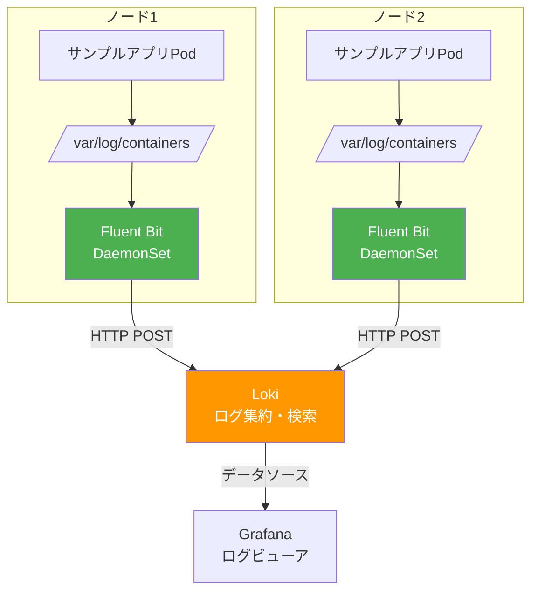
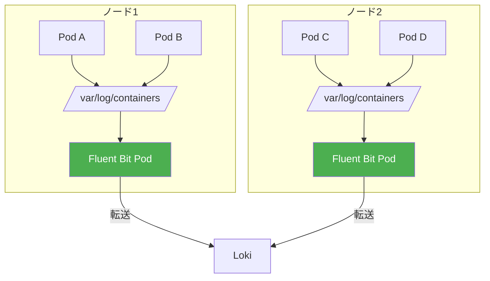
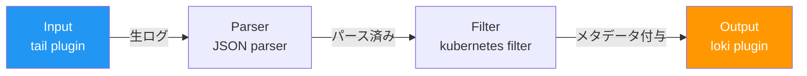
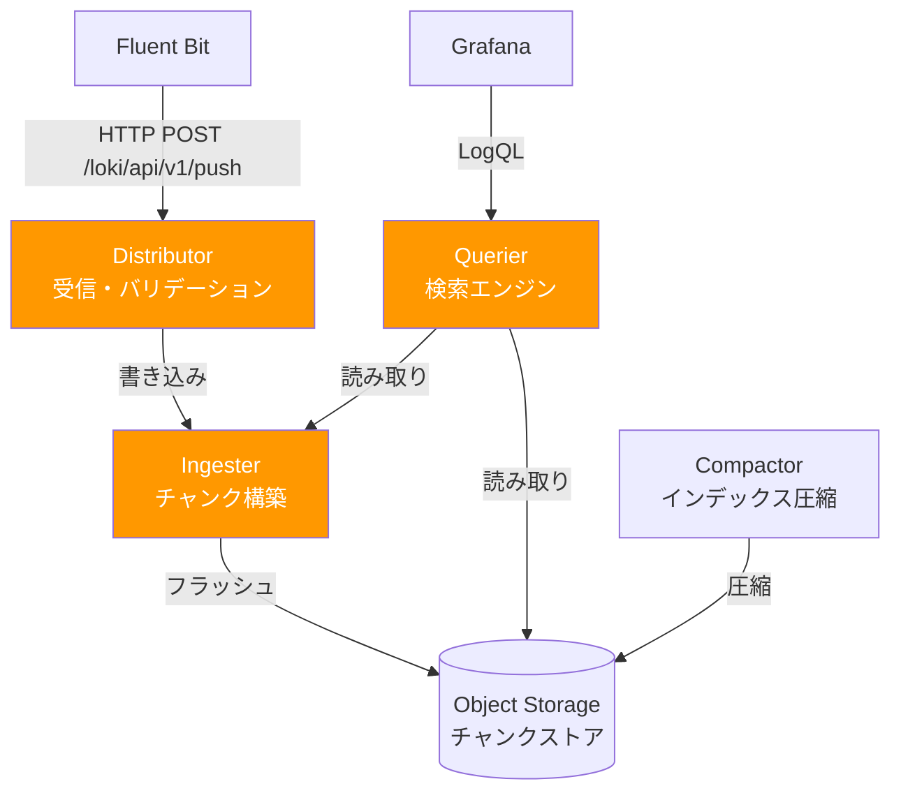

# 第3章 Logs ― Fluent Bit + Loki

第2章ではPrometheusによるメトリクス収集を導入し、「何が起きているか」を定量的に把握できるようになった。しかし、メトリクスで異常を検知しても、「なぜ起きたか」の詳細な原因はログを確認しなければ分からない。第1章の1.5節で指摘した「ログがバラバラで横断検索できない」という課題を、本章で解決する。

本章では、ログ収集パイプラインの設計思想を理解し、Fluent BitとLokiを使ってサンプルアプリケーションのログを集約・検索・分析できるようにする。

## 3.1 なぜログ集約が必要か ― サンプルアプリの課題から

サンプルアプリケーションで注文処理にエラーが発生した場合を考える。現状では `kubectl logs` でPodごとにログを個別に確認するしかない。

図3.1: 分散したログの課題 vs ログ集約後の統合検索

```
現状（ログ分散）:
  $ kubectl logs api-gateway-xxx -n book-app
  $ kubectl logs product-service-xxx -n book-app
  $ kubectl logs order-service-xxx -n book-app
  → 各Pod個別に確認。レプリカが複数あると更に煩雑
  → Podが再起動するとログが消失

ログ集約後:
  Grafana → Loki → 統合検索
  {namespace="book-app"} |= "error"
  → 全サービスのエラーログを一括検索
  → Podが消えてもログは保持される
```

`kubectl logs` の限界は以下の通りである。

- **Pod単位**: 1つのPodのログしか確認できない。レプリカが複数ある場合、全レプリカを個別に確認する必要がある
- **ログの消失**: Podが再起動または削除されるとログが消える
- **検索機能の欠如**: grepに頼るしかなく、構造的な検索やフィルタリングができない
- **横断検索の不可**: 複数サービスにまたがるリクエストのログを時系列で追跡できない

## 3.2 ログ収集パイプラインの設計

ログ収集パイプラインは、収集（Collection）→ 加工（Processing）→ 転送（Routing）→ 保存（Storage）の4フェーズで構成される。図3.2にこのモデルを示す。

図3.2: ログ収集パイプラインの4フェーズ


本書ではFluent Bitが収集・加工・転送を、Lokiが保存・検索を担当する。図3.3にFluent Bit + Lokiのアーキテクチャ全体図を示す。

図3.3: Fluent Bit + Lokiのアーキテクチャ全体図



### Fluent Bitの位置付け

Fluent Bitは、CNCFプロジェクトであるFluentdのサブプロジェクトとして開発された軽量ログ収集エージェントである。Fluentdと比較して以下の特徴がある。

| 項目 | Fluent Bit | Fluentd |
|------|-----------|---------|
| 言語 | C | Ruby + C |
| メモリ使用量 | 約450KB〜 | 約40MB〜 |
| プラグイン数 | 少ない | 豊富 |
| 用途 | エッジ・ログ収集 | ログ集約・ルーティング |

本書ではリソース効率を重視し、各ノードにDaemonSet（デーモンセット）として配置するFluent Bitを採用する。

### Lokiの設計思想

Lokiは「Like Prometheus, but for logs」を掲げるログ集約システムである。Elasticsearchがログの全文インデックスを作成するのに対し、Lokiはラベル（Namespace、Pod名、コンテナ名等）のみをインデックスに含める。ログ本文のインデックスを作成しないため、ストレージコストとリソース消費が大幅に低い。

## 3.3 構造化ログ（Structured Logging）の設計

ログを集約するにあたり、アプリケーション側のログ出力形式を整える必要がある。図3.4に非構造化ログと構造化ログの比較を示す。

図3.4: 非構造化ログ vs 構造化ログの比較

```
非構造化ログ（リスト3.1）:
  2026-03-07 10:15:23 [INFO] product-service: GET /api/products/ 200 12ms
  2026-03-07 10:15:24 [ERROR] order-service: Failed to create order: insufficient stock
  → パースに正規表現が必要、フォーマット変更で壊れる

構造化ログ（リスト3.2）:
  {"timestamp":"2026-03-07T10:15:23Z","level":"INFO","service":"product-service",
   "method":"GET","path":"/api/products/","status":200,"duration_ms":12,
   "request_id":"abc-123"}
  → JSONなので機械的にパース可能、フィールド単位で検索できる
```

### 構造化ログの必須フィールド

本書のサンプルアプリケーションでは、以下のフィールドを構造化ログの必須フィールドとして定義する。

| フィールド | 説明 | 例 |
|-----------|------|-----|
| `timestamp` | ISO 8601形式のタイムスタンプ | `2026-03-07T10:15:23Z` |
| `level` | ログレベル | `INFO`, `ERROR` |
| `service` | サービス名 | `product-service` |
| `message` | ログメッセージ | `Request completed` |
| `request_id` | リクエストの一意な識別子 | `abc-123-def-456` |

`request_id` は、後の第4章で導入する分散トレーシングのtrace IDと連携させることで、ログとトレースの相関分析を可能にする。

### Pythonでの構造化ログ実装

本書のサンプルアプリケーションはPython（FastAPI）で構成されている。Pythonでは `python-json-logger` ライブラリと標準の `logging` モジュールを組み合わせて構造化ログを実装する。

リスト3.3にPythonでの構造化ログの初期化コードを示す。

```python
# リスト3.3: python-json-loggerによる構造化ログ実装（logging_config.py）
import logging
import sys
from pythonjsonlogger import jsonlogger

def setup_logger(service_name: str) -> logging.Logger:
    """JSON形式の構造化ロガーを初期化する"""
    logger = logging.getLogger(service_name)
    logger.setLevel(logging.INFO)

    handler = logging.StreamHandler(sys.stdout)

    # JSON形式でログを出力するフォーマッタを設定
    formatter = jsonlogger.JsonFormatter(
        fmt="%(asctime)s %(levelname)s %(name)s %(message)s",
        rename_fields={
            "asctime": "timestamp",
            "levelname": "level",
            "name": "service",
        },
        datefmt="%Y-%m-%dT%H:%M:%SZ",
    )
    handler.setFormatter(formatter)
    logger.addHandler(handler)
    return logger

# 使用例
logger = setup_logger("product-service")
```

リスト3.3bに、FastAPIのミドルウェアでリクエストログを自動的に出力する実装を示す。

```python
# リスト3.3b: ミドルウェアによるリクエストログ（middleware.py）
import time
import uuid
from fastapi import Request
from starlette.middleware.base import BaseHTTPMiddleware
from logging_config import setup_logger

logger = setup_logger("product-service")

class RequestLoggingMiddleware(BaseHTTPMiddleware):
    async def dispatch(self, request: Request, call_next):
        # リクエストIDをヘッダから取得（またはUUIDを生成）
        request_id = request.headers.get("X-Request-ID", str(uuid.uuid4()))
        start = time.perf_counter()

        try:
            response = await call_next(request)
            duration_ms = (time.perf_counter() - start) * 1000

            logger.info(
                "Request completed",
                extra={
                    "method": request.method,
                    "path": request.url.path,
                    "status": response.status_code,
                    "duration_ms": round(duration_ms, 2),
                    "request_id": request_id,
                },
            )
            return response
        except Exception as e:
            duration_ms = (time.perf_counter() - start) * 1000
            logger.error(
                "Request failed",
                extra={
                    "method": request.method,
                    "path": request.url.path,
                    "status": 500,
                    "duration_ms": round(duration_ms, 2),
                    "request_id": request_id,
                    "error": str(e),
                },
            )
            raise
```

上記のコードが出力するJSONログの例を以下に示す。

```json
{
  "timestamp": "2026-03-07T10:15:23Z",
  "level": "INFO",
  "service": "product-service",
  "message": "Request completed",
  "method": "GET",
  "path": "/api/products/",
  "status": 200,
  "duration_ms": 12.34,
  "request_id": "abc-123-def-456"
}
```

`extra` ディクショナリに渡したキーがJSONの各フィールドとして出力される。これにより、Lokiで `| json | status >= 400` のようなフィールド単位のフィルタリングが可能になる。

### ログスキーマの進化に備える

構造化ログのスキーマ（フィールド構成）は、アプリケーションの成長に伴って変化する。たとえば、マイクロサービスの追加に伴い `upstream_service` フィールドを追加したり、認証機能の導入に伴い `user_id` フィールドを追加する場合がある。

スキーマの変更に備えて、以下の原則を守る。

1. **既存フィールドの名前を変更しない**: `duration_ms` を `latency_ms` に変更すると、LogQLクエリやダッシュボードが壊れる。新しいフィールド名が必要な場合は、既存フィールドを残したまま新フィールドを追加する
2. **フィールドの型を変更しない**: `status` を数値から文字列に変更すると、数値比較（`status >= 400`）が動作しなくなる
3. **変更履歴をドキュメントに記録する**: どのバージョンでどのフィールドが追加・廃止されたかを記録し、古いログの検索時に参照できるようにする

```
ログスキーマ変更の進め方:

  v1 (初期リリース):
    timestamp, level, service, message, request_id

  v2 (認証機能追加):
    + user_id, auth_method   ← フィールド追加（既存フィールドは維持）

  v3 (マルチリージョン対応):
    + region, availability_zone
    - 変更なし（既存フィールドは維持）
```

## 3.4 Fluent Bitの導入 ― DaemonSetでのデプロイ

### DaemonSetパターン

図3.6にDaemonSet（デーモンセット）によるノード単位のログ収集の概念を示す。

図3.6: DaemonSetによるノード単位のログ収集



DaemonSetは各ノードに1つずつPodを配置するKubernetesリソースである。ノードが追加されると自動的にFluent BitのPodが配置され、新しいノードのログも即座に収集される。

### Fluent Bitの処理パイプライン

図3.5にFluent Bitの処理パイプラインを示す。

図3.5: Fluent Bitの処理パイプライン



### デプロイ手順

```bash
# リスト3.4: Fluent Bit Helmインストールコマンド

# Helmリポジトリの追加
$ helm repo add fluent https://fluent.github.io/helm-charts
$ helm repo update

# Fluent Bitのインストール
$ helm install fluent-bit fluent/fluent-bit \
    -n book-observability \
    -f fluent-bit-values.yaml
```

リスト3.5にFluent Bitの設定を示す。

```yaml
# リスト3.5: Fluent Bit設定ファイル（values.yaml）
config:
  inputs: |
    [INPUT]
        Name              tail
        Tag               kube.*
        Path              /var/log/containers/*.log
        Parser            cri
        DB                /var/log/flb_kube.db
        Mem_Buf_Limit     5MB
        Skip_Long_Lines   On
        Refresh_Interval  10

  filters: |
    [FILTER]
        Name                kubernetes
        Match               kube.*
        Kube_URL            https://kubernetes.default.svc:443
        Kube_CA_File        /var/run/secrets/kubernetes.io/serviceaccount/ca.crt
        Kube_Token_File     /var/run/secrets/kubernetes.io/serviceaccount/token
        Merge_Log           On
        K8S-Logging.Parser  On

  outputs: |
    [OUTPUT]
        Name                 loki
        Match                kube.*
        Host                 loki.book-observability.svc.cluster.local
        Port                 3100
        Labels               job=fluent-bit
        Label_Keys           $kubernetes['namespace_name'],$kubernetes['pod_name']
        Remove_Keys          kubernetes,stream
```

リスト3.6にbook-appのログのみを対象とするフィルタ設定を示す。

```yaml
# リスト3.6: Fluent Bitのフィルタ設定（book-appのみ対象）
config:
  filters: |
    [FILTER]
        Name    grep
        Match   kube.*
        Regex   $kubernetes['namespace_name'] book-app
```

### データボリュームの見積もりと計画

ログ集約システムのストレージとコストを適切に管理するには、データボリュームの事前見積もりが不可欠である。

**ログ量の概算式**は以下の通りである。

```
1日あたりのログ量 ≈ 平均ログ行サイズ × 1秒あたりのログ行数 × 86,400

具体例（サンプルアプリケーション）:
  平均ログ行サイズ: 300バイト（JSON構造化ログ）
  RPSの合計: 50 req/s（3サービス合計）
  アプリログ: 300 × 50 × 86,400 ≈ 1.3GB/日
  + Kubernetesシステムログ: 約0.5GB/日
  → 合計: 約1.8GB/日 → 約54GB/月
```

**ログレベル別のボリューム比率**は環境によって大きく異なるが、一般的な目安を以下に示す。

| ログレベル | 比率（目安） | 保持期間（推奨） |
|-----------|-------------|----------------|
| ERROR | 1〜5% | 90日以上 |
| WARN | 5〜10% | 30〜90日 |
| INFO | 80〜90% | 7〜30日 |
| DEBUG | 本番では無効化 | 一時的に有効化する場合は1〜3日 |

**コスト削減のヒント**を以下に示す。

- **ログレベルフィルタリング**: Fluent Bitのフィルタで、本番環境ではDEBUGログを転送しない
- **Namespace単位のフィルタリング**: リスト3.6のように、監視対象のNamespaceのみに絞る
- **サンプリング**: 大量のアクセスログに対し、正常リクエストのログを一定割合で間引く（エラーログは100%保持）
- **圧縮**: Lokiはデフォルトでログデータを圧縮して保存する。圧縮率は一般的に5〜10倍

## 3.5 Lokiの導入とログの検索

### Lokiのデプロイ

図3.7にLokiのアーキテクチャを示す。

図3.7: Lokiのアーキテクチャ



```bash
# リスト3.7: Loki Helmインストールコマンド

# Helmリポジトリの追加
$ helm repo add grafana https://grafana.github.io/helm-charts
$ helm repo update

# Lokiのインストール（SingleBinaryモード）
$ helm install loki grafana/loki \
    -n book-observability \
    -f loki-values.yaml
```

### LogQLによるログ検索

LogQLはLokiのクエリ言語である。表3.1に基本構文を示す。

| 構文 | 説明 | 例 |
|------|------|-----|
| `{label="value"}` | ログストリームセレクタ | `{namespace="book-app"}` |
| `\|=` | 文字列を含む | `\|= "error"` |
| `!=` | 文字列を含まない | `!= "debug"` |
| `\|~` | 正規表現マッチ | `\|~ "status=[45].."` |
| `\| json` | JSONパース | `\| json \| level="ERROR"` |
| `\| line_format` | 出力フォーマット | `\| line_format "{{.message}}"` |
| `rate()` | 単位時間あたりのログ行数 | `rate({app="x"}[5m])` |
| `count_over_time()` | 期間内のログ行数 | `count_over_time({app="x"}[1h])` |

> 表3.1: LogQLの基本構文一覧

### 実用クエリ集

リスト3.8にサンプルアプリケーションに対する実用的なLogQLクエリを示す。

```logql
# リスト3.8: LogQL実用クエリ集

# book-app Namespaceの全ログ
{namespace="book-app"}

# order-serviceのエラーログのみ
{namespace="book-app", app="order-service"} |= "error" | json | level="ERROR"

# 特定のリクエストIDでの横断検索
{namespace="book-app"} |= "abc-123-def-456"

# 直近1時間のエラーログ件数（サービス別）
sum by (app) (count_over_time({namespace="book-app"} | json | level="ERROR" [1h]))

# エラーレート（1分あたりのエラーログ数）
rate({namespace="book-app"} | json | level="ERROR" [5m])
```

### LogQLの高度な機能

LogQLにはログの分析をさらに強力にする機能がある。以下に実用的なパターンを示す。

**JSONフィールドの抽出と数値フィルタリング**

構造化ログのフィールドを抽出し、数値条件でフィルタリングできる。

```logql
# レスポンスタイムが500ms以上のリクエストのみ抽出
{namespace="book-app"} | json | duration_ms >= 500

# ステータスコード400番台のリクエストを抽出
{namespace="book-app"} | json | status >= 400 | status < 500

# 特定のサービスで、特定のパスへのエラーリクエスト
{namespace="book-app", app="order-service"}
  | json
  | level="ERROR"
  | path="/api/orders/"
```

**`line_format` によるログ出力の整形**

デフォルトのJSON出力が見にくい場合、`line_format` でカスタムフォーマットに変換できる。

```logql
# 読みやすい形式に整形
{namespace="book-app"}
  | json
  | line_format "{{.timestamp}} [{{.level}}] {{.service}}: {{.method}} {{.path}} {{.status}} {{.duration_ms}}ms"

# 出力例:
# 2026-03-07T10:15:23Z [INFO] product-service: GET /api/products/ 200 12.34ms
```

**メトリクスクエリ（Metric Queries）**

LogQLではログからメトリクスを生成できる。Prometheusに計装されていない値もログから集計可能である。

```logql
# サービス別のエラー件数（過去1時間）
sum by (service) (
  count_over_time({namespace="book-app"} | json | level="ERROR" [1h])
)

# パス別の平均レスポンスタイム（ログの duration_ms フィールドから算出）
avg_over_time(
  {namespace="book-app"} | json | unwrap duration_ms [5m]
) by (path)

# レスポンスタイムのp95をログから算出
quantile_over_time(0.95,
  {namespace="book-app"} | json | unwrap duration_ms [5m]
) by (service)

# 1分あたりのログ量（バイト単位）をサービス別に集計
sum by (app) (bytes_over_time({namespace="book-app"} [1m]))
```

`unwrap` は、JSONフィールドの値を数値として抽出し、集計関数に渡すための演算子である。`duration_ms` や `status` のように数値型のフィールドに対して使用できる。

**パターンマッチングによる非構造化ログの解析**

すべてのログがJSON形式とは限らない。Kubernetesのシステムコンポーネントやサードパーティソフトウェアは非構造化ログを出力することがある。`pattern` パーサーを使えば、正規表現を書かずに簡潔にフィールドを抽出できる。

```logql
# nginx形式のアクセスログを解析
{app="nginx"}
  | pattern `<ip> - - [<timestamp>] "<method> <path> <_>" <status> <bytes>`
  | status >= 400
```

## 3.6 ログベースのアラートとベストプラクティス

### ログベースのアラート

Lokiのルーラーを使い、LogQLベースのアラートを設定できる。リスト3.9にアラートルール定義を示す。

```yaml
# リスト3.9: Lokiルーラーによるアラートルール定義
apiVersion: 1
groups:
  - name: book-app-log-alerts
    rules:
      - alert: HighErrorLogRate
        expr: |
          sum(rate({namespace="book-app"} | json | level="ERROR" [5m])) > 1
        for: 5m
        labels:
          severity: warning
        annotations:
          summary: "エラーログの発生頻度が高い"
          description: "直近5分間のエラーログが1件/秒を超えている"
```

### ベストプラクティス

表3.2にログ運用のベストプラクティスを示す。

| カテゴリ | ベストプラクティス | 理由 |
|---------|------------------|------|
| フォーマット | JSON形式の構造化ログを使用する | 機械的なパースとフィールド検索が可能 |
| ログレベル | 本番環境ではINFO以上を出力する | DEBUGログはボリュームが大きく、コスト増加の原因 |
| リテンション | 用途に応じた保持期間を設定する | 監査ログは長期保持、デバッグログは短期保持 |
| ラベル設計 | 高カーディナリティのラベルを避ける | ラベル数の爆発はLokiのパフォーマンスを劣化させる |
| 機密情報 | パスワード・トークン等をログに出力しない | Fluent Bitのフィルタでマスキングも可能 |
| コスト | 必要なログのみを転送・保存する | Namespaceフィルタで不要なログを除外 |

> 表3.2: ログ運用のベストプラクティス一覧

---

本章では、Fluent Bit + Lokiによるログ集約パイプラインを構築し、サンプルアプリケーションのログを統合的に検索・分析できるようにした。メトリクスで「何が起きているか」を、ログで「なぜ起きたか」を把握できるようになった。しかし、複数サービスにまたがるリクエストの因果関係を追跡するには、メトリクスとログだけでは不十分である。次章では、OpenTelemetry + Jaegerによる分散トレーシングを導入し、リクエストの流れを可視化する。3.3節で導入した `request_id` が、トレーシングのtrace IDと連携する仕組みを学ぶ。

## 理解度チェック

1. Lokiが「Like Prometheus, but for logs」と呼ばれる理由を、インデックス戦略の観点から説明せよ
2. Fluent BitをDaemonSetでデプロイする利点を、Sidecarパターンと比較して説明せよ
3. 構造化ログ（Structured Logging）がJSON形式の非構造化ログに対して持つ利点を3つ挙げよ
4. LogQLで `{namespace="book-app", app="order-service"} |= "error" | json | level="ERROR"` というクエリが何を検索しているか説明せよ
5. ログの保持期間を設計する際に考慮すべき要素を3つ挙げよ

## 参考文献

- Fluent Bit公式ドキュメント, https://docs.fluentbit.io/
- Grafana Loki公式ドキュメント, https://grafana.com/docs/loki/latest/
- LogQLリファレンス, https://grafana.com/docs/loki/latest/query/
- python-json-logger, https://github.com/madzak/python-json-logger
