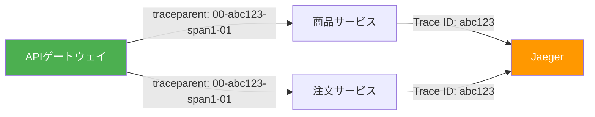
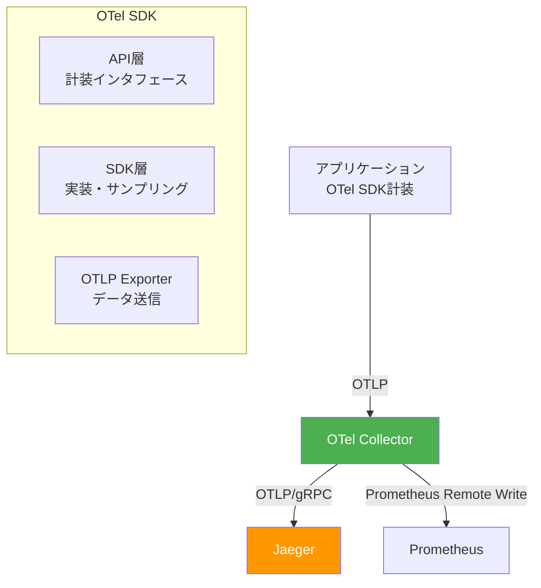
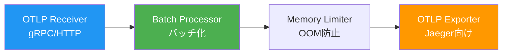
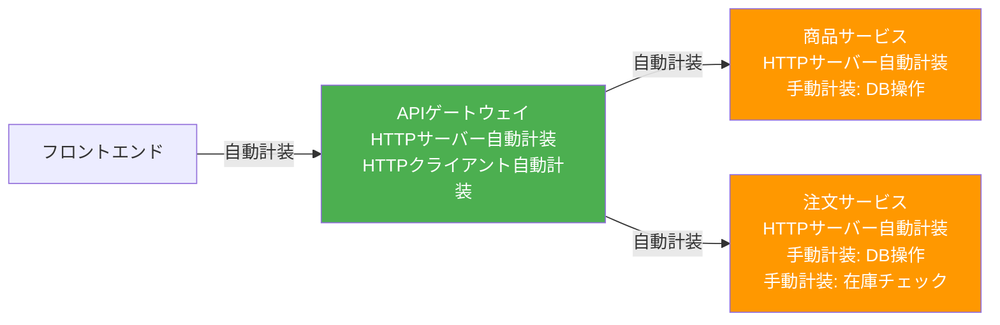
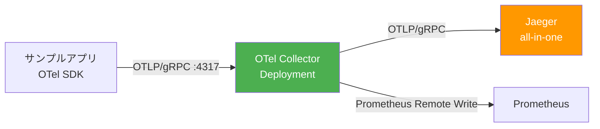
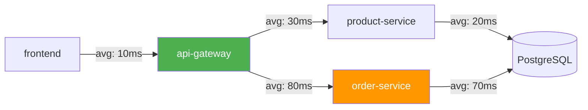

# 第4章 Traces ― OpenTelemetry + Jaeger

第2章のメトリクスで「何が起きているか」を、第3章のログで「なぜ起きたか」を把握できるようになった。しかし、マイクロサービス環境ではもう1つの課題が残っている。フロントエンドからのリクエストが遅い場合、APIゲートウェイ・商品サービス・注文サービス・データベースのどこがボトルネックなのか。メトリクスやログだけでは、サービス間の因果関係を追跡するのが困難である。

本章では、分散トレーシング（Distributed Tracing）の概念を学び、OpenTelemetry（OTel）SDKでサンプルアプリケーションを計装し、Jaegerでトレースを可視化・分析する。

## 4.1 なぜ分散トレーシングが必要か ― サンプルアプリの課題から

サンプルアプリケーションで注文リクエストのレスポンスタイムが5秒に悪化したとする。第2章で導入したPrometheusのメトリクスから全体のレイテンシ増加は確認できるが、リクエスト単位でどのサービスに時間がかかったかは分からない。

図4.1: トレーシングなしのリクエストフロー

```
ユーザー → [フロントエンド] → [APIゲートウェイ] → [商品サービス] → [DB]
                                                 → [注文サービス] → [DB]

全体で5秒かかっている。しかし:
  - フロントエンドの処理時間は？
  - APIゲートウェイのルーティングにかかった時間は？
  - 商品サービスと注文サービスは直列？並列？
  - DBクエリが遅いのか、アプリのロジックが遅いのか？

→ メトリクスもログも「点」の情報。リクエスト全体の「線」が見えない。
→ 分散トレーシングがこの「線」を可視化する。
```

分散トレーシングは、1つのリクエストの全ライフサイクルを1つの「トレース」として記録し、各サービスでの処理を「スパン」として可視化する技術である。

## 4.2 分散トレーシングの基本概念

### Trace / Span / SpanContext

分散トレーシングの基本概念は以下の3つである。

- **トレース（Trace）**: 1つのリクエストの全体を表す。一意のTrace IDで識別される
- **スパン（Span）**: トレース内の個々の処理単位。開始時刻、終了時刻、属性、イベントを持つ
- **SpanContext**: スパン間で伝播される情報（Trace ID、Span ID、Trace Flags）

図4.2にこれらの関係を示す。

図4.2: Trace / Span / SpanContextの関係図

```
Trace ID: abc-123-def-456
├── Span: フロントエンド (200ms)
│   └── Span: APIゲートウェイ (180ms)
│       ├── Span: 商品サービス (50ms)
│       │   └── Span: DB Query (30ms)
│       └── Span: 注文サービス (120ms)
│           └── Span: DB Query (100ms)  ← ボトルネック!

時間軸:
|-- フロントエンド ----------------------------------|
   |-- APIゲートウェイ ----------------------------|
      |-- 商品サービス ---|
      |-- 注文サービス ----------------------|
         |---------- DB Query ----------|
0ms     50ms    100ms    150ms    200ms
```

### コンテキスト伝播（Context Propagation）

サービス間でTrace IDとSpan IDを伝播するために、HTTPヘッダーを使用する。図4.3にその仕組みを示す。

図4.3: コンテキスト伝播の仕組み



### W3C Trace Contextの詳細

W3C Trace Context仕様は、分散トレーシングにおけるコンテキスト伝播の標準化を目的としたW3C勧告である。この仕様により、異なるベンダーのトレーシングツール間でもコンテキストを正しく伝播できる。仕様は `traceparent` と `tracestate` の2つのHTTPヘッダーで構成される。

`traceparent` ヘッダーは以下の形式である。

```
リスト4.1: W3C Trace Context（traceparentヘッダー）の形式

traceparent: {version}-{trace-id}-{parent-id}-{trace-flags}

例: traceparent: 00-4bf92f3577b34da6a3ce929d0e0e4736-00f067aa0ba902b7-01

各フィールドの意味:
- version (2文字): プロトコルバージョン。現在は "00" が唯一の有効値
- trace-id (32文字): トレース全体を一意に識別するID（16バイト、128ビット）
  全てゼロ（00000000000000000000000000000000）は無効値として扱われる
- parent-id (16文字): 呼び出し元スパンのID（8バイト、64ビット）
  全てゼロ（0000000000000000）は無効値として扱われる
- trace-flags (2文字): トレースのフラグ。ビットフィールドとして解釈される
  - ビット0 (0x01): sampled - このトレースがサンプリング対象であることを示す
  - 例: "01" = サンプリング対象、"00" = サンプリング対象外
```

`tracestate` ヘッダーは、ベンダー固有の情報を伝播するための拡張フィールドである。複数のベンダーのキー=バリューペアをカンマ区切りで格納できる。

```
リスト4.1b: tracestate ヘッダーの例

tracestate: vendor1=opaque-value,vendor2=another-value

例: tracestate: ot=th:256;rv:abcdef1234567890
  - ot: OpenTelemetryのネイティブエントリ
  - th:256: サンプリングの閾値（threshold）
  - rv:...: ランダム値（randomness value）
```

W3C Trace Contextの重要な点は、`traceparent` の情報だけで基本的なコンテキスト伝播が成立することである。`tracestate` はオプショナルであり、ベンダー間の相互運用性を損なわずに追加情報を伝播できる設計になっている。OpenTelemetry SDKはデフォルトでW3C Trace Contextフォーマットを使用するため、特別な設定なしにこの仕様に準拠したコンテキスト伝播が行われる。

## 4.3 OpenTelemetryのアーキテクチャ

OpenTelemetry（OTel）は、CNCFプロジェクトとして開発されているベンダーニュートラルなテレメトリ基盤である。Traces、Metrics、Logsの3つのシグナルを統一的なAPIとSDKで扱う。図4.4にアーキテクチャを示す。

図4.4: OpenTelemetryのアーキテクチャ全体図



### OTel Collectorの内部構造

OTel Collectorはテレメトリデータの受信・加工・転送を担うコンポーネントである。図4.5にその内部構造を示す。

図4.5: OTel Collectorの内部構造



OTel Collectorを挟むメリットは以下の通りである。

- **アプリケーションの疎結合化**: バックエンド変更時にアプリの再デプロイが不要
- **データ加工**: バッチ処理、フィルタリング、属性追加をCollector側で実行できる
- **リソース効率**: 複数アプリからのデータをCollectorで集約し、バックエンドへの接続数を削減できる

## 4.4 サンプルアプリへのOTel SDK計装

図4.6にサンプルアプリケーションへの計装ポイントを示す。

図4.6: サンプルアプリへの計装ポイントマップ



### OTel SDKの初期化

リスト4.2にTracerProviderの初期化コードを示す。

```python
# リスト4.2: OTel SDK初期化（TracerProvider + OTLP Exporter）

from opentelemetry import trace
from opentelemetry.exporter.otlp.proto.grpc.trace_exporter import OTLPSpanExporter
from opentelemetry.sdk.resources import Resource
from opentelemetry.sdk.trace import TracerProvider
from opentelemetry.sdk.trace.export import BatchSpanProcessor
from opentelemetry.semconv.resource import ResourceAttributes


def init_tracer() -> TracerProvider:
    """TracerProviderを初期化し、OTLP gRPC Exporterを設定する"""

    # リソース情報の定義（サービス名等）
    resource = Resource.create({
        ResourceAttributes.SERVICE_NAME: "product-service",
        ResourceAttributes.SERVICE_VERSION: "v1.0.0",
    })

    # TracerProviderの作成
    provider = TracerProvider(resource=resource)

    # OTLP gRPC Exporterの作成とBatchSpanProcessorへの登録
    exporter = OTLPSpanExporter(
        endpoint="otel-collector.book-observability:4317",
        insecure=True,
    )
    provider.add_span_processor(BatchSpanProcessor(exporter))

    # グローバルTracerProviderとして登録
    trace.set_tracer_provider(provider)

    return provider
```

`Resource` はテレメトリデータの発生元を識別するメタデータである。`SERVICE_NAME` はJaegerのサービス一覧に表示される名前となるため、サービスごとに一意な名前を設定する。`BatchSpanProcessor` はスパンをバッファリングし、一定間隔（デフォルト5秒）またはバッファサイズ（デフォルト512スパン）に達した時点でまとめてExporterに送信する。これにより、スパンの送信がアプリケーションのリクエスト処理をブロックしない。

### 自動計装

リスト4.3に `otelhttp` によるHTTPサーバーの自動計装を示す。

```python
# リスト4.3: FastAPIの自動計装（HTTPサーバー）

from fastapi import FastAPI
from opentelemetry.instrumentation.fastapi import FastAPIInstrumentor

app = FastAPI()

# FastAPIInstrumentorでアプリケーションを計装する
# これにより、すべてのエンドポイントへのリクエストに対して
# 自動的にSpanが生成される
FastAPIInstrumentor.instrument_app(app)


@app.get("/api/products/")
async def list_products():
    """商品一覧を返すエンドポイント"""
    # この関数が呼ばれると、自動的に以下の情報を持つSpanが生成される:
    # - http.method: GET
    # - http.url: /api/products/
    # - http.status_code: 200
    # - http.route: /api/products/
    products = await fetch_products_from_db()
    return {"products": products}
```

`FastAPIInstrumentor.instrument_app(app)` を1行呼び出すだけで、すべてのエンドポイントに対してスパンが自動生成される。スパンにはHTTPメソッド、URL、ステータスコード、ルート情報が自動的に属性として付与される。

リスト4.4にHTTPクライアントの自動計装を示す。

```python
# リスト4.4: httpxによる自動計装（HTTPクライアント）

import httpx
from opentelemetry.instrumentation.httpx import HTTPXClientInstrumentor

# httpxクライアントを自動計装する
# これにより、すべてのHTTPリクエストに対して:
# 1. 自動的にSpanが生成される
# 2. traceparentヘッダーが自動的に注入される（コンテキスト伝播）
HTTPXClientInstrumentor().instrument()


async def call_product_service() -> dict:
    """APIゲートウェイから商品サービスへのリクエスト"""
    async with httpx.AsyncClient() as client:
        # traceparentヘッダーが自動注入されるため、
        # 商品サービス側でも同じTrace IDでSpanが記録される
        response = await client.get(
            "http://product-service.book-app:8081/api/products/"
        )
        return response.json()
```

`HTTPXClientInstrumentor().instrument()` により、`httpx` で発行するすべてのHTTPリクエストにW3C Trace Contextの `traceparent` ヘッダーが自動注入される。呼び出し先のサービスがOpenTelemetry SDKで計装されていれば、受信した `traceparent` ヘッダーからTrace IDとParent Span IDを読み取り、同一トレースの子スパンとして記録する。これがサービス間のコンテキスト伝播の仕組みである。

### 手動計装

リスト4.5にビジネスロジック固有のSpanを手動で追加する方法を示す。

```python
# リスト4.5: 手動計装によるカスタムSpanの追加

from opentelemetry import trace

tracer = trace.get_tracer("order-service")


async def create_order(product_id: int, quantity: int) -> None:
    """注文を作成する。各処理ステップをSpanで計測する"""

    # カスタムSpanの開始
    # with文を使うと、ブロック終了時に自動的にSpanが閉じられる
    with tracer.start_as_current_span("CreateOrder") as span:

        # 在庫チェックのSpan
        with tracer.start_as_current_span("CheckStock"):
            available = await check_stock(product_id, quantity)

        if not available:
            span.record_exception(
                Exception(f"在庫不足: product_id={product_id}")
            )
            raise ValueError("在庫が不足しています")

        # DB書き込みのSpan
        with tracer.start_as_current_span("InsertOrder"):
            await insert_order_to_db(product_id, quantity)
```

Pythonでは `with tracer.start_as_current_span(name)` を使うことで、スパンのライフサイクルをコンテキストマネージャーで管理できる。`with` ブロックを抜けるとスパンが自動的に終了し、例外が発生した場合もスパンに例外情報が記録される。ネストした `with` 文により、親子関係を持つスパンの階層構造が自然に表現できる。

リスト4.6にSpan属性とイベントの設定を示す。

```python
# リスト4.6: Span属性とイベントの設定

from opentelemetry import trace
from opentelemetry.trace import StatusCode

tracer = trace.get_tracer("order-service")


async def process_order(order_id: int) -> None:
    """注文を処理する。属性とイベントをSpanに記録する"""

    with tracer.start_as_current_span("ProcessOrder") as span:
        # 属性の追加
        # 属性はキー=バリュー形式でSpanに付与するメタデータである
        span.set_attribute("order.id", order_id)
        span.set_attribute("order.status", "processing")

        try:
            await validate(order_id)
        except Exception as e:
            # record_exceptionでスタックトレースを含む例外情報をSpanに記録
            span.record_exception(e)
            # set_statusでSpanのステータスをERRORに設定
            span.set_status(StatusCode.ERROR, str(e))
            raise

        # イベント（Span Event）の追加
        # イベントはSpanのライフサイクル中に発生した出来事を記録する
        span.add_event("order.validated", attributes={
            "order.id": order_id,
            "validation.result": "passed",
        })

        span.set_attribute("order.status", "completed")
```

`span.set_attribute()` で設定する属性は、Jaeger UIでスパンの詳細を確認する際に表示される。業務的に意味のある属性（注文ID、商品ID、ユーザーID等）を付与することで、障害調査時にトレースから迅速にコンテキストを把握できる。`span.record_exception()` は例外オブジェクトからスタックトレースを含むSpan Eventを自動生成する。`span.add_event()` は任意のイベントを記録でき、処理の中間ステップの完了やビジネスロジック上の重要なポイントを記録するのに適している。

## 4.5 OTel Collectorのデプロイと設定

図4.7にOTel Collectorのデプロイ構成を示す。

図4.7: OTel Collectorのデプロイ構成図



```bash
# リスト4.7: OTel Collector Helmインストールコマンド

$ helm repo add open-telemetry \
    https://open-telemetry.github.io/opentelemetry-helm-charts
$ helm repo update

$ helm install otel-collector open-telemetry/opentelemetry-collector \
    -n book-observability \
    -f otel-collector-values.yaml
```

リスト4.8にOTel Collectorの設定を示す。

```yaml
# リスト4.8: OTel Collector設定
config:
  receivers:
    otlp:
      protocols:
        grpc:
          endpoint: 0.0.0.0:4317
        http:
          endpoint: 0.0.0.0:4318

  processors:
    batch:
      timeout: 5s
      send_batch_size: 1024
    memory_limiter:
      check_interval: 1s
      limit_mib: 512
      spike_limit_mib: 128

  exporters:
    otlp:
      endpoint: jaeger-collector.book-observability:4317
      tls:
        insecure: true

  service:
    pipelines:
      traces:
        receivers: [otlp]
        processors: [memory_limiter, batch]
        exporters: [otlp]
```

## 4.6 Jaegerによるトレースの可視化と分析

```bash
# リスト4.9: Jaeger Helmインストールコマンド

$ helm repo add jaegertracing https://jaegertracing.github.io/helm-charts
$ helm repo update

$ helm install jaeger jaegertracing/jaeger \
    -n book-observability \
    --set allInOne.enabled=true \
    --set collector.enabled=false \
    --set query.enabled=false \
    --set agent.enabled=false
```

### ウォーターフォール表示

Jaeger UIでトレースを選択すると、ウォーターフォール表示でリクエストの全体像を確認できる。図4.8にその例を示す。

図4.8: Jaeger UIのウォーターフォール表示例

```
Trace: abc-123-def-456  |  Duration: 200ms  |  Services: 4  |  Spans: 7

frontend                    |████████████████████████████████████████| 200ms
  api-gateway               |██████████████████████████████████████|   180ms
    product-service          |████████|                                50ms
      DB Query               |██████|                                  30ms
    order-service            |██████████████████████████████|         120ms
      CheckStock             |████|                                    20ms
      InsertOrder            |████████████████████████|               100ms ← slow!
```

この表示から、`InsertOrder` のDB操作が100msかかっていることが一目で分かる。レイテンシの大部分がこのスパンに起因している。

### サービス依存関係グラフ

図4.9にJaegerが自動生成するサービス依存関係グラフを示す。

図4.9: Jaegerのサービス依存関係グラフ



### サンプリング戦略

全リクエストをトレースするとストレージコストが膨大になる。本番環境では適切なサンプリング戦略を選択する必要がある。

#### Head-based Sampling

Head-based samplingは、リクエストの開始時点（トレースの先頭）でサンプリングの可否を決定する方式である。リスト4.10にPythonでの設定を示す。

```python
# リスト4.10: Head-based Samplingの設定

from opentelemetry.sdk.trace import TracerProvider
from opentelemetry.sdk.trace.sampling import (
    ALWAYS_ON,
    ALWAYS_OFF,
    ParentBasedTraceIdRatio,
    TraceIdRatioBased,
    ParentBased,
)

# 方式1: 全リクエストをサンプリング（開発環境向け）
provider_dev = TracerProvider(sampler=ALWAYS_ON)

# 方式2: 全リクエストを無視（テスト環境でトレースを無効化したい場合）
provider_off = TracerProvider(sampler=ALWAYS_OFF)

# 方式3: 確率ベースのサンプリング（10%のリクエストをサンプリング）
provider_ratio = TracerProvider(
    sampler=TraceIdRatioBased(rate=0.1)
)

# 方式4: ParentBasedサンプリング（推奨）
# 親スパンがサンプリング対象であれば子もサンプリングする
# 親スパンがない場合（ルートスパン）は10%の確率でサンプリング
provider_parent = TracerProvider(
    sampler=ParentBased(root=TraceIdRatioBased(rate=0.1))
)
```

`ParentBased` サンプラーが推奨される理由は、トレースの一貫性を保てることにある。親スパンがサンプリングされた場合、子スパンも必ずサンプリングされるため、トレースが途中で途切れることがない。逆に、親スパンがサンプリング対象外の場合、子スパンも対象外となり、不完全なトレースの生成を防ぐ。

#### Tail-based Sampling

Tail-based samplingは、リクエスト完了後に全スパンの情報を見てからサンプリングの可否を決定する方式である。OTel Collectorの `tail_sampling` プロセッサーで実装する。

```yaml
# リスト4.10b: OTel CollectorでのTail-based Sampling設定
processors:
  tail_sampling:
    decision_wait: 10s        # スパンの収集を待つ最大時間
    num_traces: 100000         # メモリに保持するトレースの最大数
    expected_new_traces_per_sec: 100
    policies:
      # ポリシー1: エラーが発生したトレースは必ず記録
      - name: errors-policy
        type: status_code
        status_code:
          status_codes: [ERROR]

      # ポリシー2: レイテンシが500msを超えるトレースは必ず記録
      - name: latency-policy
        type: latency
        latency:
          threshold_ms: 500

      # ポリシー3: 上記に該当しないトレースは10%をサンプリング
      - name: probabilistic-policy
        type: probabilistic
        probabilistic:
          sampling_percentage: 10
```

Tail-based samplingでは、エラーや高レイテンシのリクエストを確実に捕捉できる。障害調査に必要なトレースが欠落するリスクを大幅に低減できるが、決定を遅延させる間すべてのスパンをメモリに保持する必要があるため、OTel Collectorのリソース消費が増加する。

#### サンプリング方式の比較

| 方式 | 説明 | メリット | デメリット |
|------|------|---------|-----------|
| Head-based sampling | リクエスト開始時にサンプリングを決定 | 実装が簡単。リソース消費が少ない | エラーリクエストを見逃す可能性がある |
| Tail-based sampling | リクエスト完了後にサンプリングを決定 | エラーや遅延リクエストを確実に記録 | Collectorのメモリ消費が大きい。全スパンを一時的に保持する必要がある |
| ParentBased | 親スパンの決定に従う | トレースの一貫性を保証。不完全なトレースが発生しない | 単体では使えず、ルートサンプラーと組み合わせる必要がある |

本番環境では、Head-based（ParentBased + TraceIdRatioBased）をアプリケーション側で設定し、加えてOTel CollectorでTail-based samplingを組み合わせるハイブリッド方式が効果的である。通常リクエストはHead-basedで一定割合をサンプリングしつつ、エラーや高レイテンシのリクエストはTail-basedで確実に捕捉する。

### 非同期処理のトレーシング

マイクロサービスアーキテクチャでは、メッセージキューやバックグラウンドタスクを使った非同期処理も一般的である。非同期処理では、HTTPヘッダーによるコンテキスト伝播が使えないため、別の方法でトレースの連続性を確保する必要がある。

#### メッセージキュー経由のコンテキスト伝播

メッセージのヘッダー（属性）にSpanContextを埋め込むことで、プロデューサーとコンシューマー間でトレースを接続できる。

```python
# リスト4.10c: 非同期処理（メッセージキュー）のトレーシング

from opentelemetry import trace, context
from opentelemetry.trace.propagation import get_current_span
from opentelemetry.propagate import inject, extract

tracer = trace.get_tracer("order-service")


async def publish_order_event(order_id: int, queue_client) -> None:
    """注文イベントをメッセージキューに発行する（プロデューサー側）"""

    with tracer.start_as_current_span(
        "publish_order_event",
        kind=trace.SpanKind.PRODUCER,  # プロデューサースパンとして記録
    ) as span:
        span.set_attribute("messaging.system", "rabbitmq")
        span.set_attribute("messaging.destination", "order-events")
        span.set_attribute("order.id", order_id)

        # メッセージヘッダーにSpanContextを注入
        headers = {}
        inject(headers)  # traceparent等をheadersに注入

        await queue_client.publish(
            exchange="order-events",
            body={"order_id": order_id, "action": "created"},
            headers=headers,  # SpanContextをメッセージに埋め込む
        )


async def consume_order_event(message) -> None:
    """注文イベントを処理する（コンシューマー側）"""

    # メッセージヘッダーからSpanContextを抽出
    parent_context = extract(message.headers)

    with tracer.start_as_current_span(
        "process_order_event",
        context=parent_context,        # 親コンテキストを指定
        kind=trace.SpanKind.CONSUMER,  # コンシューマースパンとして記録
    ) as span:
        span.set_attribute("messaging.system", "rabbitmq")
        span.set_attribute("messaging.destination", "order-events")

        order_id = message.body["order_id"]
        await fulfill_order(order_id)
```

`inject()` と `extract()` は、OpenTelemetryの `propagate` モジュールが提供するコンテキスト伝播のユーティリティである。HTTPヘッダーだけでなく、任意のキー=バリューの辞書にSpanContextを注入・抽出できるため、メッセージキューやgRPCメタデータなど、さまざまなトランスポートでのコンテキスト伝播に対応できる。

#### バックグラウンドタスクのトレーシング

FastAPIのバックグラウンドタスクやasyncioタスクでは、タスクの起動元のSpanContextを明示的に引き継ぐ必要がある。

```python
# リスト4.10d: バックグラウンドタスクのトレーシング

import asyncio
from opentelemetry import context as otel_context

tracer = trace.get_tracer("order-service")


async def handle_order_request(order_id: int) -> dict:
    """注文リクエストを処理し、後続処理をバックグラウンドで実行"""

    with tracer.start_as_current_span("handle_order") as span:
        # 現在のコンテキストを保存
        ctx = otel_context.get_current()

        # バックグラウンドタスクにコンテキストを渡す
        asyncio.create_task(
            send_confirmation_email(order_id, ctx)
        )

        return {"status": "accepted", "order_id": order_id}


async def send_confirmation_email(order_id: int, parent_ctx) -> None:
    """確認メールの送信（バックグラウンドタスク）"""

    # 親コンテキストを復元してスパンを開始
    token = otel_context.attach(parent_ctx)
    try:
        with tracer.start_as_current_span("send_confirmation_email") as span:
            span.set_attribute("order.id", order_id)
            # メール送信処理...
    finally:
        otel_context.detach(token)
```

`otel_context.get_current()` で現在のコンテキストを取得し、`otel_context.attach()` でバックグラウンドタスクにコンテキストを復元する。`detach()` を `finally` ブロックで呼び出すことで、コンテキストのリークを防ぐ。

---

本章では、OpenTelemetry + Jaegerによる分散トレーシングを導入し、リクエストのサービス間の因果関係を可視化できるようにした。これでObservabilityの三本柱（Three Pillars）であるメトリクス（第2章）・ログ（第3章）・トレース（本章）がすべて揃った。次章では、これら3つのシグナルを統合し、Grafanaダッシュボードで相関分析を行うObservability基盤を完成させる。

## 理解度チェック

1. Trace、Span（スパン）、SpanContextの関係を説明し、1つのリクエストが4つのサービスを通過する場合のSpanの構造を図示せよ
2. W3C Trace Contextの `traceparent` ヘッダーが含む情報を列挙し、コンテキスト伝播（Context Propagation）が分散トレーシングにおいて果たす役割を説明せよ
3. OTel Collectorを挟む（アプリ → Collector → Jaeger）メリットを、アプリから直接Jaegerに送信する場合と比較して3つ挙げよ
4. 自動計装と手動計装の違いを説明し、それぞれが適するユースケースを挙げよ
5. Head-based samplingとTail-based samplingの違いを説明し、各方式のトレードオフを述べよ

## 参考文献

- OpenTelemetry公式ドキュメント, https://opentelemetry.io/docs/
- OpenTelemetry Python SDK, https://opentelemetry.io/docs/languages/python/
- W3C Trace Context, https://www.w3.org/TR/trace-context/
- Jaeger公式ドキュメント, https://www.jaegertracing.io/docs/
- OpenTelemetry Collector, https://opentelemetry.io/docs/collector/
- OpenTelemetry Tail Sampling Processor, https://github.com/open-telemetry/opentelemetry-collector-contrib/tree/main/processor/tailsamplingprocessor
