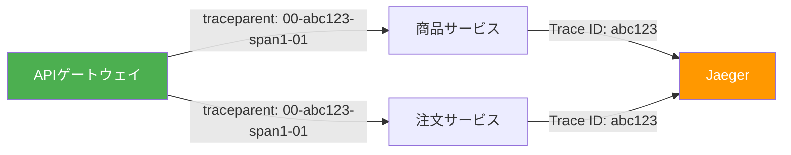
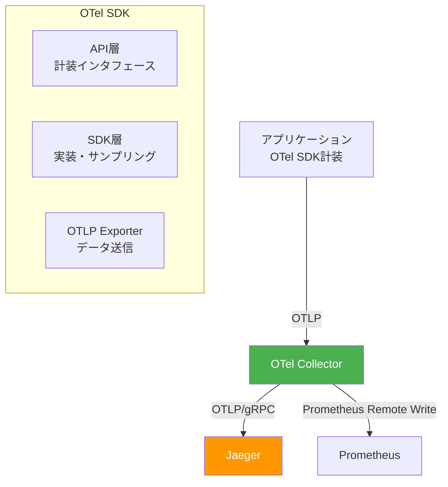
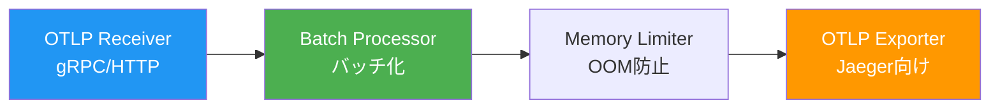
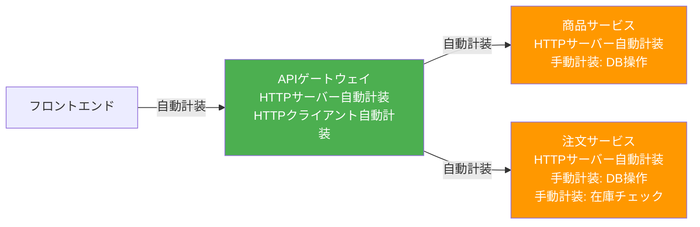
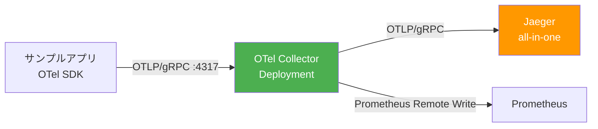
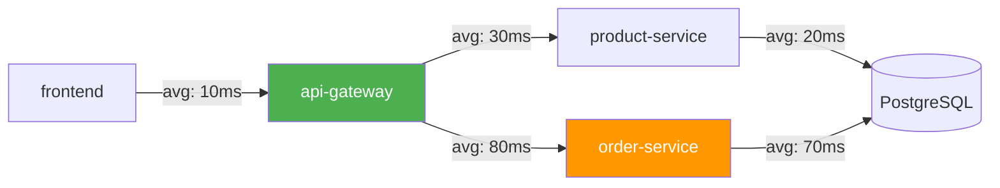

# 第4章 Traces ― OpenTelemetry + Jaeger

第2章のメトリクスで「何が起きているか」を、第3章のログで「なぜ起きたか」を把握できるようになった。しかし、マイクロサービス環境ではもう1つの課題が残っている。フロントエンドからのリクエストが遅い場合、APIゲートウェイ・商品サービス・注文サービス・データベースのどこがボトルネックなのか。メトリクスやログだけでは、サービス間の因果関係を追跡するのが困難である。

本章では、分散トレーシング（Distributed Tracing）の概念を学び、OpenTelemetry（OTel）SDKでサンプルアプリケーションを計装し、Jaegerでトレースを可視化・分析する。

## 4.1 なぜ分散トレーシングが必要か ― サンプルアプリの課題から

サンプルアプリケーションで注文リクエストのレスポンスタイムが5秒に悪化したとする。第2章で導入したPrometheusのメトリクスから全体のレイテンシ増加は確認できるが、リクエスト単位でどのサービスに時間がかかったかは分からない。

図4.1: トレーシングなしのリクエストフロー

```
ユーザー → [フロントエンド] → [APIゲートウェイ] → [商品サービス] → [DB]
                                                 → [注文サービス] → [DB]

全体で5秒かかっている。しかし:
  - フロントエンドの処理時間は？
  - APIゲートウェイのルーティングにかかった時間は？
  - 商品サービスと注文サービスは直列？並列？
  - DBクエリが遅いのか、アプリのロジックが遅いのか？

→ メトリクスもログも「点」の情報。リクエスト全体の「線」が見えない。
→ 分散トレーシングがこの「線」を可視化する。
```

分散トレーシングは、1つのリクエストの全ライフサイクルを1つの「トレース」として記録し、各サービスでの処理を「スパン」として可視化する技術である。

## 4.2 分散トレーシングの基本概念

### Trace / Span / SpanContext

分散トレーシングの基本概念は以下の3つである。

- **トレース（Trace）**: 1つのリクエストの全体を表す。一意のTrace IDで識別される
- **スパン（Span）**: トレース内の個々の処理単位。開始時刻、終了時刻、属性、イベントを持つ
- **SpanContext**: スパン間で伝播される情報（Trace ID、Span ID、Trace Flags）

図4.2にこれらの関係を示す。

図4.2: Trace / Span / SpanContextの関係図

```
Trace ID: abc-123-def-456
├── Span: フロントエンド (200ms)
│   └── Span: APIゲートウェイ (180ms)
│       ├── Span: 商品サービス (50ms)
│       │   └── Span: DB Query (30ms)
│       └── Span: 注文サービス (120ms)
│           └── Span: DB Query (100ms)  ← ボトルネック!

時間軸:
|-- フロントエンド ----------------------------------|
   |-- APIゲートウェイ ----------------------------|
      |-- 商品サービス ---|
      |-- 注文サービス ----------------------|
         |---------- DB Query ----------|
0ms     50ms    100ms    150ms    200ms
```

### コンテキスト伝播（Context Propagation）

サービス間でTrace IDとSpan IDを伝播するために、HTTPヘッダーを使用する。図4.3にその仕組みを示す。

図4.3: コンテキスト伝播の仕組み



W3C Trace Contextの `traceparent` ヘッダーは以下の形式である。

```
リスト4.1: W3C Trace Context（traceparentヘッダー）の形式

traceparent: 00-<trace-id>-<parent-span-id>-<trace-flags>

例: traceparent: 00-4bf92f3577b34da6a3ce929d0e0e4736-00f067aa0ba902b7-01

- 00: バージョン
- 4bf92f...: 32文字のTrace ID（16バイト）
- 00f067...: 16文字のParent Span ID（8バイト）
- 01: Trace Flags（01 = サンプリング対象）
```

## 4.3 OpenTelemetryのアーキテクチャ

OpenTelemetry（OTel）は、CNCFプロジェクトとして開発されているベンダーニュートラルなテレメトリ基盤である。Traces、Metrics、Logsの3つのシグナルを統一的なAPIとSDKで扱う。図4.4にアーキテクチャを示す。

図4.4: OpenTelemetryのアーキテクチャ全体図



### OTel Collectorの内部構造

OTel Collectorはテレメトリデータの受信・加工・転送を担うコンポーネントである。図4.5にその内部構造を示す。

図4.5: OTel Collectorの内部構造



OTel Collectorを挟むメリットは以下の通りである。

- **アプリケーションの疎結合化**: バックエンド変更時にアプリの再デプロイが不要
- **データ加工**: バッチ処理、フィルタリング、属性追加をCollector側で実行できる
- **リソース効率**: 複数アプリからのデータをCollectorで集約し、バックエンドへの接続数を削減できる

## 4.4 サンプルアプリへのOTel SDK計装

図4.6にサンプルアプリケーションへの計装ポイントを示す。

図4.6: サンプルアプリへの計装ポイントマップ



### OTel SDKの初期化

リスト4.2にTracerProviderの初期化コードを示す。

```go
// リスト4.2: OTel SDK初期化（TracerProvider + OTLP Exporter）
package main

import (
    "context"
    "go.opentelemetry.io/otel"
    "go.opentelemetry.io/otel/exporters/otlp/otlptrace/otlptracegrpc"
    "go.opentelemetry.io/otel/sdk/resource"
    sdktrace "go.opentelemetry.io/otel/sdk/trace"
    semconv "go.opentelemetry.io/otel/semconv/v1.24.0"
)

func initTracer(ctx context.Context) (*sdktrace.TracerProvider, error) {
    // OTLP gRPC Exporterの作成
    exporter, err := otlptracegrpc.New(ctx,
        otlptracegrpc.WithEndpoint("otel-collector.book-observability:4317"),
        otlptracegrpc.WithInsecure(),
    )
    if err != nil {
        return nil, err
    }

    // リソース情報の定義（サービス名等）
    res, _ := resource.New(ctx,
        resource.WithAttributes(
            semconv.ServiceNameKey.String("product-service"),
            semconv.ServiceVersionKey.String("v1.0.0"),
        ),
    )

    // TracerProviderの作成
    tp := sdktrace.NewTracerProvider(
        sdktrace.WithBatcher(exporter),
        sdktrace.WithResource(res),
    )
    otel.SetTracerProvider(tp)
    return tp, nil
}
```

### 自動計装

リスト4.3に `otelhttp` によるHTTPサーバーの自動計装を示す。

```go
// リスト4.3: otelhttpによる自動計装（HTTPサーバー）
package main

import (
    "net/http"
    "go.opentelemetry.io/contrib/instrumentation/net/http/otelhttp"
)

func main() {
    ctx := context.Background()
    tp, _ := initTracer(ctx)
    defer tp.Shutdown(ctx)

    // otelhttp.NewHandlerでラップすると自動的にSpanが生成される
    handler := http.HandlerFunc(productsHandler)
    wrappedHandler := otelhttp.NewHandler(handler, "ProductsAPI")

    http.Handle("/api/products/", wrappedHandler)
    http.ListenAndServe(":8081", nil)
}
```

リスト4.4にHTTPクライアントの自動計装を示す。

```go
// リスト4.4: otelhttpによる自動計装（HTTPクライアント）
package main

import (
    "net/http"
    "go.opentelemetry.io/contrib/instrumentation/net/http/otelhttp"
)

// APIゲートウェイから商品サービスへのリクエスト
func callProductService(ctx context.Context) (*http.Response, error) {
    // otelhttp.NewTransportでラップすると
    // traceparentヘッダーが自動的に注入される
    client := &http.Client{
        Transport: otelhttp.NewTransport(http.DefaultTransport),
    }

    req, _ := http.NewRequestWithContext(ctx, "GET",
        "http://product-service.book-app:8081/api/products/", nil)
    return client.Do(req)
}
```

### 手動計装

リスト4.5にビジネスロジック固有のSpanを手動で追加する方法を示す。

```go
// リスト4.5: 手動計装によるカスタムSpanの追加
package main

import (
    "context"
    "go.opentelemetry.io/otel"
)

func createOrder(ctx context.Context, productID int, quantity int) error {
    tracer := otel.Tracer("order-service")

    // カスタムSpanの開始
    ctx, span := tracer.Start(ctx, "CreateOrder")
    defer span.End()

    // 在庫チェックのSpan
    ctx, checkSpan := tracer.Start(ctx, "CheckStock")
    available, err := checkStock(ctx, productID, quantity)
    checkSpan.End()

    if err != nil {
        span.RecordError(err)
        return err
    }

    // DB書き込みのSpan
    _, dbSpan := tracer.Start(ctx, "InsertOrder")
    err = insertOrderToDB(ctx, productID, quantity)
    dbSpan.End()

    return err
}
```

リスト4.6にSpan属性とイベントの設定を示す。

```go
// リスト4.6: Span属性とイベントの設定
import (
    "go.opentelemetry.io/otel/attribute"
    "go.opentelemetry.io/otel/codes"
)

func processOrder(ctx context.Context, orderID int) {
    tracer := otel.Tracer("order-service")
    ctx, span := tracer.Start(ctx, "ProcessOrder")
    defer span.End()

    // 属性の追加
    span.SetAttributes(
        attribute.Int("order.id", orderID),
        attribute.String("order.status", "processing"),
    )

    // エラー発生時
    if err := validate(ctx); err != nil {
        span.RecordError(err)
        span.SetStatus(codes.Error, err.Error())
    }
}
```

## 4.5 OTel Collectorのデプロイと設定

図4.7にOTel Collectorのデプロイ構成を示す。

図4.7: OTel Collectorのデプロイ構成図



```bash
# リスト4.7: OTel Collector Helmインストールコマンド

$ helm repo add open-telemetry \
    https://open-telemetry.github.io/opentelemetry-helm-charts
$ helm repo update

$ helm install otel-collector open-telemetry/opentelemetry-collector \
    -n book-observability \
    -f otel-collector-values.yaml
```

リスト4.8にOTel Collectorの設定を示す。

```yaml
# リスト4.8: OTel Collector設定
config:
  receivers:
    otlp:
      protocols:
        grpc:
          endpoint: 0.0.0.0:4317
        http:
          endpoint: 0.0.0.0:4318

  processors:
    batch:
      timeout: 5s
      send_batch_size: 1024
    memory_limiter:
      check_interval: 1s
      limit_mib: 512
      spike_limit_mib: 128

  exporters:
    otlp:
      endpoint: jaeger-collector.book-observability:4317
      tls:
        insecure: true

  service:
    pipelines:
      traces:
        receivers: [otlp]
        processors: [memory_limiter, batch]
        exporters: [otlp]
```

## 4.6 Jaegerによるトレースの可視化と分析

```bash
# リスト4.9: Jaeger Helmインストールコマンド

$ helm repo add jaegertracing https://jaegertracing.github.io/helm-charts
$ helm repo update

$ helm install jaeger jaegertracing/jaeger \
    -n book-observability \
    --set allInOne.enabled=true \
    --set collector.enabled=false \
    --set query.enabled=false \
    --set agent.enabled=false
```

### ウォーターフォール表示

Jaeger UIでトレースを選択すると、ウォーターフォール表示でリクエストの全体像を確認できる。図4.8にその例を示す。

図4.8: Jaeger UIのウォーターフォール表示例

```
Trace: abc-123-def-456  |  Duration: 200ms  |  Services: 4  |  Spans: 7

frontend                    |████████████████████████████████████████| 200ms
  api-gateway               |██████████████████████████████████████|   180ms
    product-service          |████████|                                50ms
      DB Query               |██████|                                  30ms
    order-service            |██████████████████████████████|         120ms
      CheckStock             |████|                                    20ms
      InsertOrder            |████████████████████████|               100ms ← slow!
```

この表示から、`InsertOrder` のDB操作が100msかかっていることが一目で分かる。レイテンシの大部分がこのスパンに起因している。

### サービス依存関係グラフ

図4.9にJaegerが自動生成するサービス依存関係グラフを示す。

図4.9: Jaegerのサービス依存関係グラフ



### サンプリング戦略

全リクエストをトレースするとストレージコストが膨大になる。リスト4.10にサンプリング戦略の設定を示す。

```yaml
# リスト4.10: サンプリング戦略の設定
# TracerProviderの設定で指定
sdktrace.NewTracerProvider(
    sdktrace.WithSampler(
        sdktrace.ParentBased(
            sdktrace.TraceIDRatioBased(0.1), // 10%のリクエストをサンプリング
        ),
    ),
)
```

| 方式 | 説明 | トレードオフ |
|------|------|------------|
| Head-based sampling | リクエストの開始時にサンプリングを決定 | 実装が簡単だが、エラーリクエストを見逃す可能性がある |
| Tail-based sampling | リクエスト完了後にサンプリングを決定 | エラーや遅延リクエストを確実に記録できるが、実装が複雑 |

---

本章では、OpenTelemetry + Jaegerによる分散トレーシングを導入し、リクエストのサービス間の因果関係を可視化できるようにした。これでObservabilityの三本柱（Three Pillars）であるメトリクス（第2章）・ログ（第3章）・トレース（本章）がすべて揃った。次章では、これら3つのシグナルを統合し、Grafanaダッシュボードで相関分析を行うObservability基盤を完成させる。

## 理解度チェック

1. Trace、Span（スパン）、SpanContextの関係を説明し、1つのリクエストが4つのサービスを通過する場合のSpanの構造を図示せよ
2. W3C Trace Contextの `traceparent` ヘッダーが含む情報を列挙し、コンテキスト伝播（Context Propagation）が分散トレーシングにおいて果たす役割を説明せよ
3. OTel Collectorを挟む（アプリ → Collector → Jaeger）メリットを、アプリから直接Jaegerに送信する場合と比較して3つ挙げよ
4. 自動計装と手動計装の違いを説明し、それぞれが適するユースケースを挙げよ
5. Head-based samplingとTail-based samplingの違いを説明し、各方式のトレードオフを述べよ

## 参考文献

- OpenTelemetry公式ドキュメント, https://opentelemetry.io/docs/
- W3C Trace Context, https://www.w3.org/TR/trace-context/
- Jaeger公式ドキュメント, https://www.jaegertracing.io/docs/
- OpenTelemetry Go SDK, https://pkg.go.dev/go.opentelemetry.io/otel
- OpenTelemetry Collector, https://opentelemetry.io/docs/collector/
