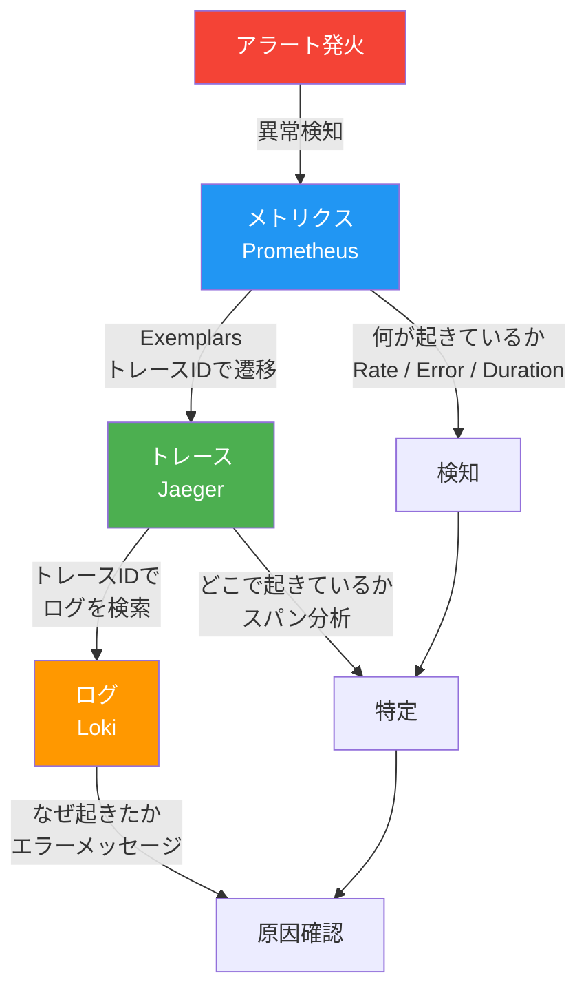
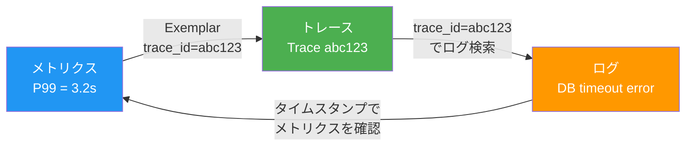
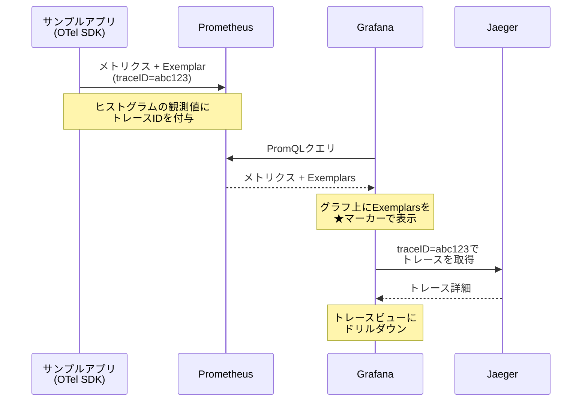
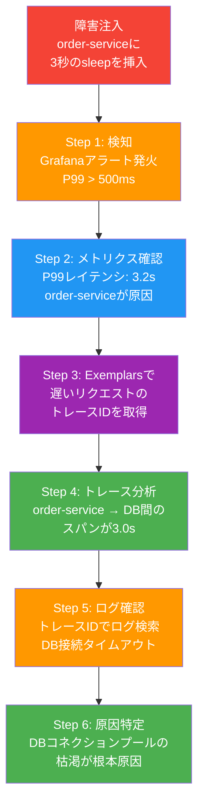
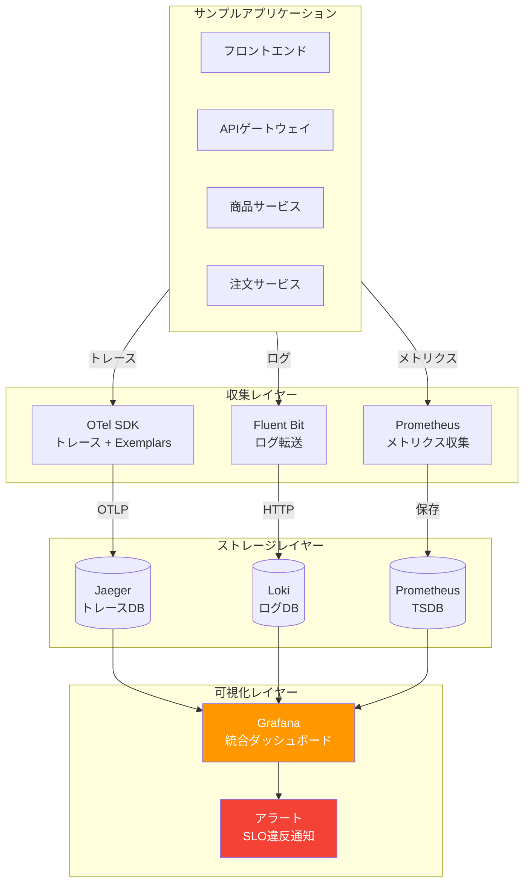

# 第5章 統合 ― Observability基盤を完成させる

第2章〜第4章で、メトリクス（Prometheus）、ログ（Fluent Bit + Loki）、トレース（OpenTelemetry + Jaeger）をそれぞれ個別に導入した。各ツールは独立して動作しているが、障害対応時にはツール間を手動で行き来する必要がある。本章では、これら3つのシグナルをGrafanaで統合し、SLI/SLOに基づく運用基盤として完成させる。

## 5.1 Three Pillarsの相関 ― なぜ統合が必要なのか

### 個別運用の限界

サンプルアプリケーションの注文サービスでレイテンシが増大したとする。現状では以下のような調査フローになる。

1. Prometheusで `http_server_duration_seconds` のP99を確認し、レイテンシ増大を検知する
2. Jaegerに切り替え、注文サービスのトレースを時間帯で絞り込み、遅いスパンを探す
3. Lokiに切り替え、該当時間帯の注文サービスのログからエラーメッセージを探す

3つのツールを行き来するたびに、時間帯やサービス名を手動で再入力する必要がある。トレースIDやリクエストIDでの紐づけもできない。この「コンテキストスイッチ」が、障害対応の平均復旧時間（MTTR: Mean Time To Recovery）を押し上げる要因となる。

### Three Pillarsの相関関係

Three Pillarsの各シグナルは、異なる角度から同じ事象を捉えている。

- **メトリクス**: 「何が起きているか」を示す。エラーレートの上昇やレイテンシの悪化を集約的に検知する
- **トレース**: 「どこで起きているか」を示す。リクエスト単位でサービス間の処理時間を追跡する
- **ログ**: 「なぜ起きたか」を示す。エラーメッセージやスタックトレースで根本原因を特定する

図5.1にThree Pillarsの相関関係を示す。

図5.1: Three Pillarsの相関関係図



3つのシグナルを相関させる鍵は以下の3要素である。

- **タイムスタンプ**: 同一時間帯のデータを横断的に検索する
- **ラベル**: サービス名やNamespace等の共通ラベルで絞り込む
- **トレースID**: リクエスト単位で3つのシグナルを紐づける最も強力な相関キー

本章では、Grafanaを中心にこれらの相関を実現する。

### 具体的な相関の実現方法

3つのシグナルを相関させるには、共通の識別子をすべてのシグナルに埋め込む必要がある。最も重要な識別子はトレースIDである。以下に、各シグナルにトレースIDを埋め込む方法を示す。

```python
# コード5.0a: 3つのシグナルにトレースIDを埋め込む統合設定

import logging
from opentelemetry import trace, metrics

tracer = trace.get_tracer("order-service")
meter = metrics.get_meter("order-service")
logger = logging.getLogger("order-service")

# メトリクス: ヒストグラム（Exemplarsで自動的にトレースIDが付与される）
request_duration = meter.create_histogram(
    name="http.server.duration",
    description="リクエスト処理時間",
    unit="ms",
)


async def handle_request(request):
    """1つのリクエストに対して3つのシグナルを記録する"""

    with tracer.start_as_current_span("handle_request") as span:
        # トレースIDを取得
        trace_id = format(span.get_span_context().trace_id, "032x")

        # ログ: トレースIDを構造化ログに含める
        logger.info(
            "リクエスト処理開始",
            extra={
                "trace_id": trace_id,
                "span_id": format(span.get_span_context().span_id, "016x"),
                "service": "order-service",
                "http.method": request.method,
                "http.url": str(request.url),
            },
        )

        # ビジネスロジック実行...
        result = await process(request)

        # メトリクス: Exemplarsにより自動的にtrace_idが付与
        request_duration.record(
            result.duration_ms,
            attributes={"http.method": request.method},
        )

        return result
```

この設定により、以下の相関が可能になる。

- **メトリクス → トレース**: Exemplarsに含まれるトレースIDからJaegerのトレースビューへ遷移
- **ログ → トレース**: 構造化ログの `trace_id` フィールドからJaegerのトレースビューへ遷移
- **トレース → ログ**: トレースIDをキーにLokiのログを検索

図5.1b: 3つのシグナル間の相関フロー図



## 5.2 Grafanaによる統合ダッシュボード設計

### データソースの統合

Grafanaに3つのデータソースを登録する。コード5.1にProvisioning YAMLの設定を示す。

```yaml
# コード5.1: Grafanaデータソース設定（Provisioning YAML）
apiVersion: 1
datasources:
  - name: Prometheus
    type: prometheus
    url: http://prometheus-server.book-observability:9090
    access: proxy
    isDefault: true
    jsonData:
      exemplarTraceIdDestinations:
        - name: traceID
          datasourceUid: jaeger  # Exemplarsからのリンク先
  - name: Loki
    type: loki
    url: http://loki-gateway.book-observability:3100
    access: proxy
    jsonData:
      derivedFields:
        - name: TraceID
          matcherRegex: '"trace_id":"(\w+)"'
          url: "$${__value.raw}"
          datasourceUid: jaeger  # ログからトレースへのリンク
  - name: Jaeger
    type: jaeger
    uid: jaeger
    url: http://jaeger-query.book-observability:16686
    access: proxy
```

Prometheusの `exemplarTraceIdDestinations` により、メトリクスのExemplarsからJaegerへ遷移できる。Lokiの `derivedFields` により、構造化ログ内のトレースIDからJaegerへリンクが生成される。この設定によって、3つのシグナル間のナビゲーションが実現する。

### ダッシュボード設計の原則

統合ダッシュボードの設計には、REDメソッド（Rate、Errors、Duration）を適用する。REDメソッドは、Tom Wilkieが提唱したマイクロサービス向けのモニタリング手法である[^1]。

- **Rate**: リクエストの処理速度（リクエスト/秒）
- **Errors**: エラーレート（エラー数/リクエスト数）
- **Duration**: レスポンスタイム（P50、P90、P99）

図5.2に統合ダッシュボードのレイアウトを示す。

図5.2: 統合ダッシュボードのレイアウト設計図

```
┌─────────────────────────────────────────────────────────────┐
│ 概要行: サービス選択 [namespace ▼] [service ▼]              │
├──────────────────┬──────────────────┬───────────────────────┤
│  Request Rate    │  Error Rate      │  P99 Latency          │
│  (リクエスト/秒)  │  (エラー率 %)    │  (レスポンスタイム)     │
│  ██████████████  │  ████            │  ██████████           │
├──────────────────┴──────────────────┴───────────────────────┤
│ メトリクス行: 時系列グラフ                                    │
│  ┌─────────────────────────────────────────────────────┐   │
│  │  Rate / Errors / Duration (時系列)    ★=Exemplars   │   │
│  └─────────────────────────────────────────────────────┘   │
├─────────────────────────────────────────────────────────────┤
│ トレース行: Jaegerトレースリスト                              │
│  ┌──────────┬──────────┬──────────┬─────────────────┐      │
│  │ Trace ID │ サービス  │ Duration │ Spans           │      │
│  ├──────────┼──────────┼──────────┼─────────────────┤      │
│  │ abc123   │ order    │ 1.2s     │ █████████████   │      │
│  │ def456   │ order    │ 0.3s     │ ████            │      │
│  └──────────┴──────────┴──────────┴─────────────────┘      │
├─────────────────────────────────────────────────────────────┤
│ ログ行: Lokiログストリーム                                    │
│  ┌─────────────────────────────────────────────────────┐   │
│  │ 2026-03-07 10:15:32 [ERROR] order-service: DB ...  │   │
│  │ 2026-03-07 10:15:33 [WARN]  order-service: retry.. │   │
│  └─────────────────────────────────────────────────────┘   │
└─────────────────────────────────────────────────────────────┘
```

ダッシュボードは4層構成とする。概要行で対象サービスを選択すると、メトリクス行・トレース行・ログ行がすべて連動してフィルタリングされる。

> 表5.1: ダッシュボードに配置するパネル一覧

| 行 | パネル | データソース | PromQL / LogQL |
|----|--------|-------------|----------------|
| 概要 | Request Rate | Prometheus | `sum(rate(http_server_duration_seconds_count{service="$service"}[5m]))` |
| 概要 | Error Rate | Prometheus | `sum(rate(http_server_duration_seconds_count{service="$service",http_status_code=~"5.."}[5m])) / sum(rate(http_server_duration_seconds_count{service="$service"}[5m]))` |
| 概要 | P99 Latency | Prometheus | `histogram_quantile(0.99, sum(rate(http_server_duration_seconds_bucket{service="$service"}[5m])) by (le))` |
| メトリクス | Rate/Errors/Duration | Prometheus | 上記3クエリの時系列グラフ |
| トレース | トレースリスト | Jaeger | サービス名でフィルタ |
| ログ | ログストリーム | Loki | `{namespace="book-observability", app="$service"}` |

### テンプレート変数

テンプレート変数を使うことで、ダッシュボードのパネルを動的にフィルタリングできる。

```yaml
# コード5.2: 統合ダッシュボードのテンプレート変数定義
templating:
  list:
    - name: namespace
      type: query
      datasource: Prometheus
      query: label_values(http_server_duration_seconds_count, namespace)
      current:
        text: book-observability
        value: book-observability
    - name: service
      type: query
      datasource: Prometheus
      query: label_values(http_server_duration_seconds_count{namespace="$namespace"}, service)
      includeAll: true
      multi: true
```

## 5.3 Exemplars ― メトリクスからトレースへのドリルダウン

### Exemplarsの仕組み

Exemplars（エグゼンプラー）は、メトリクスのデータポイントにトレースIDを紐づける仕組みである。通常、メトリクスは集約データ（平均値、パーセンタイル等）であり、個々のリクエストの情報は失われる。Exemplarsを使うことで、「P99レイテンシが急上昇した」という集約情報から、その原因となった具体的なリクエストのトレースへ直接ジャンプできる。

図5.3にExemplarsによるドリルダウンフローを示す。

図5.3: Exemplarsによるメトリクスからトレースへのドリルダウンフロー



### OTel SDKでのExemplars有効化

第4章で導入したOTel SDKの設定に、Exemplarsのサポートを追加する。コード5.3にPythonでの設定例を示す。

```python
# コード5.3: OTel SDKでのExemplars有効化設定

from opentelemetry import metrics, trace
from opentelemetry.exporter.prometheus import PrometheusMetricReader
from opentelemetry.sdk.metrics import MeterProvider
from opentelemetry.sdk.metrics.export import (
    AlwaysOnExemplarFilter,
    TraceBasedExemplarFilter,
)
from opentelemetry.sdk.resources import Resource
from opentelemetry.semconv.resource import ResourceAttributes


def init_meter_provider() -> MeterProvider:
    """MeterProviderを初期化し、Exemplarsを有効化する"""

    resource = Resource.create({
        ResourceAttributes.SERVICE_NAME: "order-service",
    })

    # Prometheus Exporterの作成
    reader = PrometheusMetricReader()

    # MeterProviderの作成（ExemplarFilterを指定）
    provider = MeterProvider(
        resource=resource,
        metric_readers=[reader],
        # Exemplarsを常に記録する（開発環境向け）
        exemplar_filter=AlwaysOnExemplarFilter(),
    )

    metrics.set_meter_provider(provider)
    return provider
```

`AlwaysOnExemplarFilter()` を指定することで、メトリクスの観測時にアクティブなスパンのトレースIDが自動的にExemplarとして付与される。本番環境ではサンプリングレートに応じて `TraceBasedExemplarFilter()` を使用するとよい。`TraceBasedExemplarFilter` は、サンプリング対象のスパンにのみExemplarを付与するため、Exemplarsのデータ量を抑制できる。

### Exemplarsの実装詳細

Exemplarsの動作をより深く理解するために、メトリクスの観測とExemplarの付与がどのように連動するかを示す。

```python
# コード5.3b: Exemplarsが付与されるメトリクス観測の例

from opentelemetry import metrics, trace

meter = metrics.get_meter("order-service")
tracer = trace.get_tracer("order-service")

# ヒストグラムメトリクスの定義
order_duration = meter.create_histogram(
    name="order.duration",
    description="注文処理にかかった時間",
    unit="ms",
)


async def process_order(order_id: int) -> None:
    """注文処理。トレーシングとメトリクスの両方を記録する"""
    import time

    with tracer.start_as_current_span("ProcessOrder") as span:
        span.set_attribute("order.id", order_id)

        start = time.monotonic()
        # 注文処理ロジック...
        await execute_order(order_id)
        duration_ms = (time.monotonic() - start) * 1000

        # ヒストグラムに観測値を記録
        # このとき、アクティブなスパンのTrace IDが
        # 自動的にExemplarとして付与される
        order_duration.record(
            duration_ms,
            attributes={"order.status": "completed"},
        )
```

この例では、`order_duration.record()` が呼ばれた時点でアクティブなスパン（`ProcessOrder`）のTrace IDがExemplarとして自動付与される。Prometheus側では、このExemplarが以下の形式でメトリクスに付随する。

```
# Prometheusが公開するExemplar付きメトリクスの例
order_duration_bucket{order_status="completed",le="500"} 42 # {trace_id="4bf92f3577b34da6a3ce929d0e0e4736"} 127.3 1709812345.678
```

`# {trace_id="..."}` の部分がExemplarであり、特定のデータポイントに紐づいたトレースIDとその観測値（127.3ms）、タイムスタンプを保持している。

### Prometheus側の設定

Prometheus側では、Exemplarsの保存を有効にする必要がある。第2章でHelmチャートで導入したPrometheusの設定に以下を追加する。

```yaml
# Prometheus Helm valuesに追加
server:
  global:
    scrape_interval: 15s
  enableFeatures:
    - exemplar-storage  # Exemplarsの保存を有効化
```

### Grafanaでのドリルダウン操作

Grafanaのメトリクスパネルでは、Exemplarsが有効な場合、グラフ上に★マーカーが表示される。★マーカーをクリックすると、紐づいたトレースIDが表示され、Jaegerのトレースビューへ直接遷移できる。5.2節で設定した `exemplarTraceIdDestinations` がこの遷移を実現している。

## 5.4 SLI/SLOの設計と実装

### SLI/SLOとは何か

SLI（Service Level Indicator）は、サービスの信頼性を定量的に測定する指標である。SLO（Service Level Objective）は、SLIに対する目標値を定義したものである。

- **SLI**: 「何を測るか」を定義する。ユーザー体験に直結する指標を選定する
- **SLO**: 「どこまで許容するか」を定義する。SLIに対する目標値を設定する
- **エラーバジェット（Error Budget）**: SLO違反の許容量。100%からSLOを引いた残りの余裕

SLI/SLOの考え方は、GoogleのSRE（Site Reliability Engineering）プラクティスに基づく[^2]。Observability基盤を「ツールの寄せ集め」から「運用基盤」へ昇華させるために不可欠な概念である。

### サンプルアプリケーションへの適用

サンプルアプリケーションの各サービスに対して、SLI/SLOを定義する。

> 表5.2: サンプルアプリケーションのSLI/SLO定義表

| サービス | SLI | 測定方法 | SLO | 計測ウィンドウ |
|---------|-----|---------|-----|-------------|
| api-gateway | 可用性 | 成功レスポンス率（2xx + 3xx） | 99.9% | 30日間ローリング |
| api-gateway | レイテンシ | P99レスポンスタイム | 500ms以内 | 30日間ローリング |
| product-service | 可用性 | 成功レスポンス率 | 99.95% | 30日間ローリング |
| order-service | 可用性 | 成功レスポンス率 | 99.9% | 30日間ローリング |
| order-service | レイテンシ | P99レスポンスタイム | 1000ms以内 | 30日間ローリング |

### PromQLによるSLI計算

コード5.4にSLI計算のPromQLクエリを示す。

```promql
# コード5.4: SLI計算のPromQLクエリ

# 可用性SLI: 成功リクエスト率（過去30日間）
sum(rate(http_server_duration_seconds_count{
  service="api-gateway",
  http_status_code!~"5.."
}[30d]))
/
sum(rate(http_server_duration_seconds_count{
  service="api-gateway"
}[30d]))

# レイテンシSLI: P99が500ms以内のリクエスト割合
sum(rate(http_server_duration_seconds_bucket{
  service="api-gateway",
  le="0.5"
}[30d]))
/
sum(rate(http_server_duration_seconds_count{
  service="api-gateway"
}[30d]))
```

### Recording Ruleによる効率化

SLI/SLOの計算は重いクエリになるため、Recording Ruleで事前に計算しておく。

```yaml
# コード5.5: SLOダッシュボード用のRecording Rule
groups:
  - name: slo_rules
    interval: 1m
    rules:
      # 可用性SLI（5分間ウィンドウ）
      - record: sli:availability:ratio_rate5m
        expr: |
          sum(rate(http_server_duration_seconds_count{
            http_status_code!~"5.."
          }[5m])) by (service)
          /
          sum(rate(http_server_duration_seconds_count[5m])) by (service)

      # レイテンシSLI（5分間ウィンドウ）
      - record: sli:latency_good:ratio_rate5m
        expr: |
          sum(rate(http_server_duration_seconds_bucket{
            le="0.5"
          }[5m])) by (service)
          /
          sum(rate(http_server_duration_seconds_count[5m])) by (service)

      # エラーバジェット残量（30日間）
      - record: slo:error_budget:remaining
        expr: |
          1 - (
            (1 - sli:availability:ratio_rate5m)
            /
            (1 - 0.999)
          )
```

### SLO計測ウィンドウの設計

表5.2で各SLOの計測ウィンドウを「30日間ローリング」と定義した。計測ウィンドウの選択はSLOの実用性に直結するため、ここで設計指針を整理する。

計測ウィンドウには大きく2つの種類がある。

- **ローリングウィンドウ（Rolling Window）**: 現在時刻から過去N日間を常に計算する。時間の経過とともにウィンドウが移動するため、古いインシデントの影響が自然に薄れる
- **カレンダーウィンドウ（Calendar Window）**: 月初〜月末のような固定期間で計算する。月次レポートとの親和性が高いが、月末にリセットされるため「月初にエラーバジェットが回復する」という不自然な動作が発生する

> 表5.2b: 計測ウィンドウの比較

| 項目 | ローリングウィンドウ | カレンダーウィンドウ |
|------|-------------------|-------------------|
| 計算方法 | 現在から過去N日間 | 月初〜月末（固定期間） |
| バジェットのリセット | なし（自然に回復） | 月末にリセット |
| メリット | 一貫した信頼性評価 | レポートとの親和性 |
| デメリット | 過去のインシデントが30日間影響 | 月末にバジェットが回復する不整合 |
| 推奨用途 | エンジニアリング判断（リリース可否） | ビジネスレポート |

ウィンドウの長さは、サービスの特性に応じて選択する。

- **7日間**: 変更頻度が高いサービス向け。フィードバックループが短い
- **30日間**: 一般的なWebサービス向け。エラーバジェットの消費状況を月単位で管理しやすい（推奨）
- **90日間**: ミッションクリティカルなサービス向け。長期的な信頼性トレンドを評価できるが、改善の効果が見えるまで時間がかかる

本書では30日間ローリングウィンドウを採用する。これは多くのSREチームで採用されている標準的な設定であり、エラーバジェットの消費速度を直感的に把握しやすい。

### マルチウィンドウ・マルチバーンレートアラート

単一のウィンドウでSLO違反を検知すると、短時間の大量エラー（瞬間的なスパイク）と長時間の少量エラー（じわじわとした劣化）の区別がつかない。Google SRE Workbookで推奨されているマルチウィンドウ・マルチバーンレートアラートを導入することで、この問題を解決できる。

バーンレート（Burn Rate）とは、エラーバジェットの消費速度である。バーンレート1.0は、SLOウィンドウ全体で均等にエラーバジェットを消費するペースを意味する。バーンレート10.0は、その10倍の速度で消費していることを意味し、30日間のバジェットが3日で枯渇する計算になる。

```yaml
# コード5.5b: マルチウィンドウ・マルチバーンレートのRecording Rule
groups:
  - name: slo_burn_rate_rules
    interval: 30s
    rules:
      # 5分間の短期ウィンドウ（高速バーンレートの検知）
      - record: sli:availability:ratio_rate5m
        expr: |
          sum(rate(http_server_duration_seconds_count{
            http_status_code!~"5.."
          }[5m])) by (service)
          /
          sum(rate(http_server_duration_seconds_count[5m])) by (service)

      # 1時間の中期ウィンドウ
      - record: sli:availability:ratio_rate1h
        expr: |
          sum(rate(http_server_duration_seconds_count{
            http_status_code!~"5.."
          }[1h])) by (service)
          /
          sum(rate(http_server_duration_seconds_count[1h])) by (service)

      # 6時間の長期ウィンドウ（緩やかな劣化の検知）
      - record: sli:availability:ratio_rate6h
        expr: |
          sum(rate(http_server_duration_seconds_count{
            http_status_code!~"5.."
          }[6h])) by (service)
          /
          sum(rate(http_server_duration_seconds_count[6h])) by (service)
```

アラートルールでは、短期ウィンドウと長期ウィンドウの両方の条件を組み合わせる。

```yaml
# コード5.5c: マルチウィンドウアラートルール
groups:
  - name: slo_burn_rate_alerts
    rules:
      # 高速バーン: 5分×バーンレート14.4 AND 1時間×バーンレート14.4
      # → 30日のバジェットが2日で枯渇するペース
      - alert: SLOHighBurnRate
        expr: |
          (1 - sli:availability:ratio_rate5m{service="api-gateway"}) > (14.4 * 0.001)
          and
          (1 - sli:availability:ratio_rate1h{service="api-gateway"}) > (14.4 * 0.001)
        for: 2m
        labels:
          severity: critical
        annotations:
          summary: "api-gateway: エラーバジェットが急速に消費されています"

      # 低速バーン: 1時間×バーンレート6 AND 6時間×バーンレート6
      # → 30日のバジェットが5日で枯渇するペース
      - alert: SLOSlowBurnRate
        expr: |
          (1 - sli:availability:ratio_rate1h{service="api-gateway"}) > (6 * 0.001)
          and
          (1 - sli:availability:ratio_rate6h{service="api-gateway"}) > (6 * 0.001)
        for: 15m
        labels:
          severity: warning
        annotations:
          summary: "api-gateway: エラーバジェットが緩やかに消費されています"
```

高速バーンレートのアラートは即座にエンジニアの対応を求め、低速バーンレートのアラートは次の営業日に対応する形で運用する。この2段階のアラート設計により、深夜の不要なアラート通知を減らしつつ、重大な障害は見逃さない運用が可能になる。

### エラーバジェットの考え方

SLOが99.9%の場合、30日間で許容されるエラーの割合は0.1%（= 100% - 99.9%）である。これがエラーバジェットとなる。30日間のうち約43分間のダウンタイムが許容される計算になる。

図5.4にエラーバジェットの消費状況を示すダッシュボードパネルの例を示す。

図5.4: エラーバジェットの消費状況ダッシュボードパネル

```
┌─────────────────────────────────────────────────────────┐
│ エラーバジェット残量: api-gateway (SLO: 99.9%)           │
├─────────────────────────────────────────────────────────┤
│                                                         │
│  残量: 72.3%  ████████████████████░░░░░░░░              │
│                                                         │
│  消費推移（過去30日間）                                   │
│  100% ┬─────────────────────────────────                │
│       │ ╲                                               │
│   72% ┤   ╲___________                                  │
│       │               ╲                                 │
│   50% ┤                ╲_______                         │
│       │                        ╲                        │
│       │                         ╲_____ 現在             │
│    0% ┴─────────────────────────────────                │
│       Day 1          Day 15         Day 30              │
│                                                         │
│  ⚠ バジェット残量が30%を下回ったらリリース凍結を検討       │
└─────────────────────────────────────────────────────────┘
```

エラーバジェットの運用ルールは以下のように設定する。

- **残量50%以上**: 通常運用。新機能のリリースを許可する
- **残量30〜50%**: 注意レベル。リリースの頻度を下げ、品質確認を強化する
- **残量30%未満**: 警戒レベル。新機能のリリースを凍結し、信頼性改善に集中する
- **残量0%（バジェット枯渇）**: リリース停止。SLO違反の原因を分析し、改善が確認されるまでリリースを再開しない

## 5.5 障害シミュレーションによる統合検証

### 検証の目的

構築したObservability基盤が実際の障害に対して有効に機能するかを検証する。サンプルアプリケーションに意図的な障害を注入し、メトリクス → トレース → ログの順で原因を絞り込むフローを実践する。

### 障害シナリオ

> 表5.3: 障害シナリオ一覧

| シナリオ | 注入方法 | 期待する検知 | 影響範囲 |
|---------|---------|-------------|---------|
| レイテンシ増大 | order-serviceのDB接続にsleep(3s)を挿入 | P99レイテンシの急上昇 | order-service, api-gateway |
| エラー率上昇 | product-serviceの在庫確認で50%の確率で500エラーを返す | エラーレートの上昇 | product-service, api-gateway |
| Pod再起動 | order-serviceのメモリリミットを低く設定してOOMKillを誘発 | Pod再起動カウントの増加 | order-service |

### 検証フロー

図5.5に障害シミュレーションの検証フローを示す。レイテンシ増大シナリオを例に、統合Observability基盤によるトラブルシューティングを実践する。

図5.5: 障害シミュレーションの検証フロー



### Step 1: アラートによる異常検知

コード5.6にGrafanaのアラートルール定義を示す。P99レイテンシが500msを超えた場合にアラートを発火させる。

```yaml
# コード5.6: Grafanaアラートルール定義
apiVersion: 1
groups:
  - orgId: 1
    name: slo_alerts
    folder: Observability
    interval: 1m
    rules:
      - uid: latency-p99-alert
        title: P99レイテンシSLO違反
        condition: C
        data:
          - refId: A
            relativeTimeRange:
              from: 300  # 過去5分間
              to: 0
            datasourceUid: prometheus
            model:
              expr: |
                histogram_quantile(0.99,
                  sum(rate(http_server_duration_seconds_bucket{
                    namespace="book-observability"
                  }[5m])) by (service, le)
                )
              intervalMs: 1000
          - refId: C
            datasourceUid: __expr__
            model:
              type: threshold
              conditions:
                - evaluator:
                    type: gt
                    params: [0.5]  # 500ms
        for: 2m  # 2分間継続したら発火
        annotations:
          summary: "{{ $labels.service }} のP99レイテンシがSLOを超過"
```

### Step 2-3: メトリクスからトレースへ

アラート発火後、統合ダッシュボードのメトリクス行を確認する。order-serviceのP99レイテンシが3.2秒に急上昇していることが分かる。時系列グラフ上のExemplars（★マーカー）をクリックし、遅いリクエストのトレースIDを取得する。

### Step 4: トレース分析

Jaegerのトレースビューで該当トレースを展開する。api-gateway → order-service → PostgreSQLの呼び出しチェーンにおいて、order-serviceからPostgreSQLへのスパンが3.0秒を記録している。ボトルネックがDB接続にあることが分かる。

### Step 5-6: ログによる根本原因の特定

トレースIDを使ってLokiでログを検索する。以下のLogQLクエリを使用する。

```logql
{namespace="book-observability", app="order-service"}
  | json
  | trace_id = "abc123def456"
```

検索結果から、`connection pool exhausted: max connections reached` というエラーメッセージを発見する。DBコネクションプールの上限に達したことが根本原因だと特定できる。

障害シミュレーションにより、メトリクス → Exemplars → トレース → ログという一連のドリルダウンフローが機能することを確認した。個別のツールを手動で行き来する場合と比較して、原因特定までの時間を大幅に短縮できる。

## 5.6 本章のまとめと次章への橋渡し

### Part 1の成果

Part 1（第2章〜第5章）で構築したObservability基盤の全体像を図5.6に示す。

図5.6: Part 1で完成したObservability基盤の全体アーキテクチャ図



4つの章で構築した要素を整理する。

- **第2章（Prometheus）**: メトリクスの収集・保存・クエリ（PromQL）・アラート
- **第3章（Fluent Bit + Loki）**: 構造化ログの収集・転送・保存・クエリ（LogQL）
- **第4章（OpenTelemetry + Jaeger）**: 分散トレーシングの計装・収集・可視化
- **第5章（本章）**: 3つのシグナルの統合、Exemplars、SLI/SLO、障害シミュレーション

### 現時点の課題

Observability基盤はアプリケーションレイヤーのテレメトリを網羅しているが、サービス間のネットワーク通信に関する可視化と制御はまだ行えていない。

- サービス間のトラフィック量やエラーレートをネットワークレベルで把握できない
- mTLSによる通信の暗号化が未実装である
- リトライ、タイムアウト、サーキットブレーカー等の通信制御がアプリケーションコードに埋め込まれている

### Part 2への橋渡し

Part 2では、Service Meshを導入してこれらの課題を解決する。第6章ではIstio、第7章ではCiliumによるService Meshを構築する。Service Meshはサイドカープロキシ（またはeBPFデータプレーン）を通じてサービス間通信のテレメトリを自動生成する。第8章では、このテレメトリを本章で構築したObservability基盤に統合し、アプリケーションレイヤーとネットワークレイヤーの両方を横断的にモニタリングできる環境を完成させる。

## 理解度チェック

1. Three Pillarsの各シグナル（メトリクス、ログ、トレース）が障害対応においてそれぞれどのような役割を果たすか説明せよ

2. Exemplarsとは何か。メトリクスからトレースへのドリルダウンがどのように実現されるか説明せよ

3. SLIとSLOの違いを説明し、サンプルアプリケーションの注文サービスに対して適切なSLI/SLOを1つ設計せよ

4. エラーバジェットとは何か。エラーバジェットが枯渇した場合にどのような判断を行うべきか説明せよ

5. 障害発生時にメトリクス → トレース → ログの順で原因を絞り込む手順を、具体的な操作を含めて説明せよ

## 参考文献

- Grafana公式ドキュメント, https://grafana.com/docs/grafana/latest/
- Grafana Exemplars, https://grafana.com/docs/grafana/latest/fundamentals/exemplars/
- Google SRE Book "Service Level Objectives", https://sre.google/sre-book/service-level-objectives/
- OpenTelemetry Metrics SDK Exemplars, https://opentelemetry.io/docs/specs/otel/metrics/sdk/#exemplar

[^1]: Tom Wilkie "The RED Method: key metrics for microservices architecture" (2018), https://www.weave.works/blog/the-red-method-key-metrics-for-microservices-architecture/
[^2]: Betsy Beyer et al. "Site Reliability Engineering" (2016), O'Reilly Media, Chapter 4: Service Level Objectives
