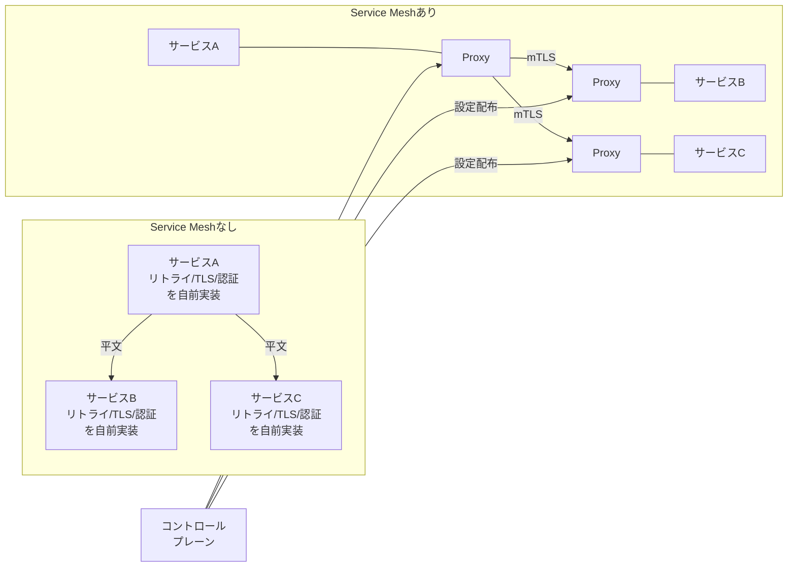
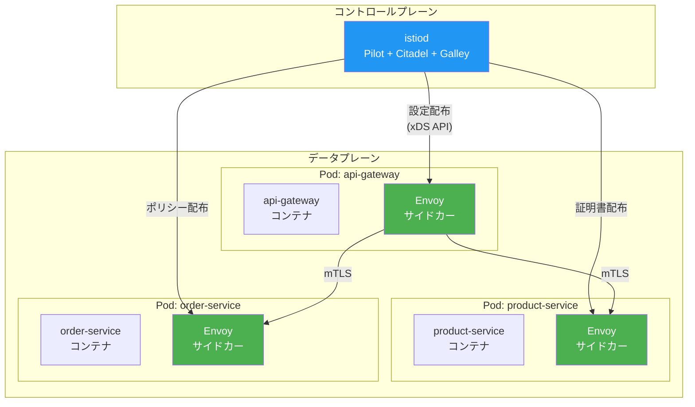
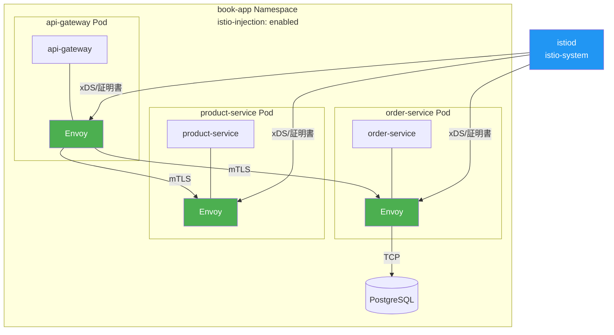
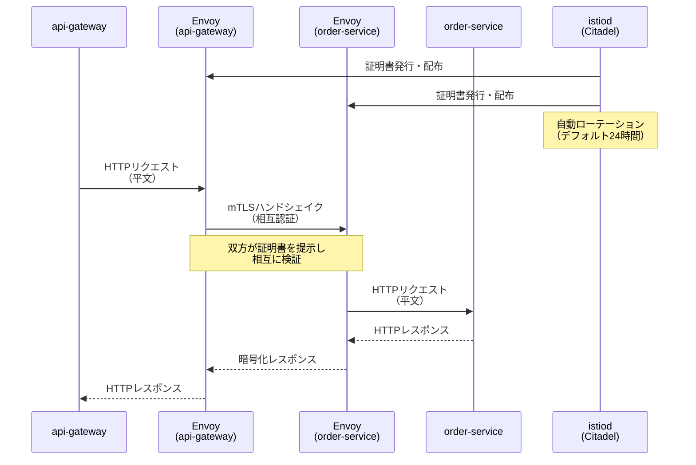
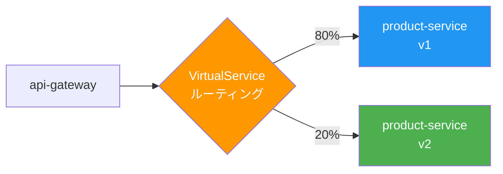

# 第6章 Istio

Part 1ではObservability基盤を構築し、アプリケーションの状態を可視化できるようにした。しかし、サービス間通信のセキュリティや制御はアプリケーションコードに委ねられたままである。リトライ、タイムアウト、mTLS（相互TLS認証）といった横断的関心事を各サービスに個別実装するのは非効率であり、不整合の温床になる。

本章では、Service Mesh（サービスメッシュ）の代表的実装であるIstioを導入し、アプリケーションコードを変更せずにサービス間通信の可視化・暗号化・制御を実現する。

## 6.1 Service Meshとは何か

### マイクロサービスにおける通信の課題

第1章で構築したサンプルアプリケーションでは、サービス間の通信にKubernetesのService（ClusterIP）を使用している。この構成には以下の課題がある。

- **暗号化の不在**: サービス間通信は平文であり、クラスタ内のネットワークが信頼境界になっている
- **リトライ・タイムアウトの個別実装**: 各サービスのアプリケーションコードにリトライロジックを実装する必要がある
- **通信の可視化が困難**: どのサービスがどのサービスと通信しているか、トポロジーが把握しづらい
- **認証・認可の不在**: サービス間の呼び出しに認証がなく、任意のPodが任意のサービスを呼び出せる

これらの課題はサービス数に比例して深刻化する。サービスが5つであれば管理可能でも、50、100と増えると破綻する。

### Service Meshの設計思想

Service Meshは、これらの横断的関心事をアプリケーションコードから分離し、インフラレイヤーで解決する。図6.1にService Meshなしとありの通信アーキテクチャを比較する。

図6.1: Service Meshなしとありの通信アーキテクチャ比較図



Service Meshは2つのレイヤーで構成される。

- **データプレーン（Data Plane）**: 各Podに配置されたプロキシ群。すべてのインバウンド・アウトバウンド通信を仲介する
- **コントロールプレーン（Control Plane）**: データプレーンに設定を配布し、証明書の管理やポリシーの適用を行う

## 6.2 Istioのアーキテクチャ ― サイドカーパターンとEnvoy

### istiodとEnvoyサイドカー

Istioはコントロールプレーンである `istiod` と、データプレーンであるEnvoy（エンボイ）サイドカーで構成される。図6.2にアーキテクチャの全体像を示す。

図6.2: Istioアーキテクチャ図



istiodは、以前は独立していた3つのコンポーネントを統合したモノリシックなコントロールプレーンである。

> 表6.1: istiodの主要コンポーネントの役割

| コンポーネント | 役割 | 担当する機能 |
|-------------|------|------------|
| Pilot | 設定配布 | xDS APIを通じてEnvoyに対してルーティングルール、リトライ設定等を配布する |
| Citadel | 証明書管理 | mTLS用の証明書を自動発行・配布・ローテーションする |
| Galley | 設定検証 | ユーザーが作成したIstioリソース（VirtualService等）のバリデーションを行う |

### サイドカーパターン

Envoyサイドカーは、アプリケーションコンテナと同じPod内に追加のコンテナとして配置される。iptablesルールにより、Podへのすべてのインバウンド・アウトバウンド通信がEnvoyを経由するよう透過的にリダイレクトされる。アプリケーション側のコード変更は不要である。

## 6.3 Istioのインストールとサンプルアプリへの導入

### istioctlによるインストール

istioctlコマンドでIstioをインストールする。プロファイルにより、インストールするコンポーネントセットを選択できる。

```bash
# コード6.1: istioctlインストールコマンドとプロファイル設定
# istioctlのインストール
curl -L https://istio.io/downloadIstio | ISTIO_VERSION=1.24.2 sh -
export PATH=$PWD/istio-1.24.2/bin:$PATH

# demoプロファイルでインストール（開発・学習用）
istioctl install --set profile=demo -y

# インストールの確認
kubectl get pods -n istio-system
```

| プロファイル | 用途 | 含まれるコンポーネント |
|------------|------|---------------------|
| demo | 開発・学習 | istiod、Ingress Gateway、Egress Gateway |
| default | 本番 | istiod、Ingress Gateway |
| minimal | 最小構成 | istiodのみ |

### サイドカー注入の有効化

Namespaceにラベルを付与することで、そのNamespace内のすべてのPodにEnvoyサイドカーが自動注入される。

```yaml
# コード6.2: Namespaceへのサイドカー注入ラベル付与
apiVersion: v1
kind: Namespace
metadata:
  name: book-app
  labels:
    istio-injection: enabled  # サイドカー自動注入を有効化
```

### Kustomize overlayでの管理

第1章で構築したKustomize構成にIstio用のoverlayを追加する。

```yaml
# コード6.3: Kustomize overlay（Istio用）
# overlays/istio/kustomization.yaml
apiVersion: kustomize.config.k8s.io/v1beta1
kind: Kustomization

resources:
  - ../../base
  - namespace.yaml        # istio-injection: enabled付きNamespace
  - peer-authentication.yaml  # mTLS設定
  - virtual-service.yaml      # トラフィック制御

patches:
  - target:
      kind: Deployment
    patch: |
      - op: add
        path: /spec/template/metadata/annotations
        value:
          sidecar.istio.io/inject: "true"
```

### 導入確認

サンプルアプリケーションを再デプロイし、各Podのコンテナ数が2（アプリ + Envoy）になっていることを確認する。

```bash
# Podの確認
kubectl get pods -n book-app

# 出力例
# NAME                               READY   STATUS    CONTAINERS
# api-gateway-xxx                    2/2     Running   2
# product-service-xxx                2/2     Running   2
# order-service-xxx                  2/2     Running   2
```

図6.3にIstio導入後の構成を示す。

図6.3: Istio導入後のサンプルアプリケーション構成図



## 6.4 mTLSによるサービス間通信の暗号化

### mTLSの仕組み

mTLS（mutual TLS）は、通信の双方が証明書を提示して相互認証する仕組みである。通常のTLSではサーバーのみが証明書を提示するが、mTLSではクライアント側も証明書を提示する。IstioのCitadelが証明書の発行・配布・ローテーションを自動で行うため、アプリケーション側での証明書管理は不要である。

図6.4にmTLSの通信フローを示す。

図6.4: mTLSによるサービス間通信の暗号化フロー



アプリケーション間の通信は平文のままだが、Envoyサイドカー間の通信はmTLSで暗号化される。アプリケーションはmTLSの存在を意識する必要がない。

### PeerAuthenticationの設定

PeerAuthenticationリソースでmTLSのモードを制御する。

```yaml
# コード6.4: PeerAuthentication（STRICTモード）
apiVersion: security.istio.io/v1
kind: PeerAuthentication
metadata:
  name: default
  namespace: book-app
spec:
  mtls:
    mode: STRICT  # mTLSを強制（平文通信を拒否）
```

> 表6.2: PeerAuthenticationのモード一覧

| モード | 説明 | ユースケース |
|-------|------|------------|
| STRICT | mTLSのみ許可（平文を拒否） | 本番環境での推奨設定 |
| PERMISSIVE | mTLSと平文の両方を許可 | 移行期間中の設定 |
| DISABLE | mTLSを無効化 | デバッグ用途のみ |

### DestinationRuleによるTLSポリシー

DestinationRuleでクライアント側のTLSポリシーを設定する。

```yaml
# コード6.5: DestinationRule（mTLS設定）
apiVersion: networking.istio.io/v1
kind: DestinationRule
metadata:
  name: order-service
  namespace: book-app
spec:
  host: order-service.book-app.svc.cluster.local
  trafficPolicy:
    tls:
      mode: ISTIO_MUTUAL  # Istio管理のmTLSを使用
```

### mTLSの検証

mTLSが正しく有効化されているかを確認する。

```bash
# mTLSの状態を確認
istioctl authn tls-check order-service.book-app

# 出力例
# HOST:PORT                                    STATUS     PEER
# order-service.book-app.svc.cluster.local:80  STRICT     STRICT
```

## 6.5 トラフィック管理 ― 分割・タイムアウト・リトライ

### VirtualServiceとDestinationRule

Istioのトラフィック管理は、VirtualServiceとDestinationRuleの2つのリソースで構成される。

- **VirtualService**: リクエストのルーティングルールを定義する（どこに、どのように送るか）
- **DestinationRule**: 送信先のサブセットやロードバランシングポリシーを定義する（送信先の詳細設定）

### トラフィック分割

product-serviceのv2をCanaryデプロイする場合を考える。図6.5にトラフィック分割の概念を示す。

図6.5: VirtualServiceによるトラフィック分割の概念図



```yaml
# コード6.6: VirtualService（トラフィック分割: v1=80%, v2=20%）
apiVersion: networking.istio.io/v1
kind: VirtualService
metadata:
  name: product-service
  namespace: book-app
spec:
  hosts:
    - product-service
  http:
    - route:
        - destination:
            host: product-service
            subset: v1
          weight: 80
        - destination:
            host: product-service
            subset: v2
          weight: 20
---
apiVersion: networking.istio.io/v1
kind: DestinationRule
metadata:
  name: product-service
  namespace: book-app
spec:
  host: product-service
  subsets:
    - name: v1
      labels:
        version: v1
    - name: v2
      labels:
        version: v2
```

> 表6.3: VirtualServiceの主要フィールド一覧

| フィールド | 説明 | 例 |
|-----------|------|-----|
| hosts | ルーティング対象のホスト名 | `product-service` |
| http.match | マッチ条件（ヘッダ、URI等） | `headers: {x-canary: {exact: "true"}}` |
| http.route.destination | 送信先サービスとサブセット | `host: product-service, subset: v1` |
| http.route.weight | トラフィックの重み（%） | `80` |
| http.timeout | リクエストタイムアウト | `3s` |
| http.retries | リトライ設定 | `attempts: 3, perTryTimeout: 2s` |

### タイムアウトとリトライ

応答遅延や一時的エラーに対する制御をVirtualServiceで設定する。

```yaml
# コード6.7: VirtualService（タイムアウト・リトライ設定）
apiVersion: networking.istio.io/v1
kind: VirtualService
metadata:
  name: order-service
  namespace: book-app
spec:
  hosts:
    - order-service
  http:
    - route:
        - destination:
            host: order-service
      timeout: 5s  # 5秒でタイムアウト
      retries:
        attempts: 3          # 最大3回リトライ
        perTryTimeout: 2s    # リトライごとのタイムアウト
        retryOn: "5xx,reset,connect-failure"  # リトライ条件
```

タイムアウトとリトライをアプリケーションコードではなくIstioのリソースで管理することにより、全サービスで一貫したポリシーを適用できる。設定変更もマニフェストの更新のみで、アプリケーションの再デプロイは不要である。

## 6.6 Kialiによるサービスグラフの可視化

### Kialiとは

Kiali（キアリ）は、Istioの可観測性コンポーネントである。Istioが生成するテレメトリデータを集約し、サービス間の通信トポロジーをグラフとして可視化する。

```bash
# コード6.8: Kialiのインストールとアクセス設定
# Kialiのインストール（Istio addonsから）
kubectl apply -f istio-1.24.2/samples/addons/kiali.yaml

# ダッシュボードへのアクセス
istioctl dashboard kiali
```

### サービスグラフ

図6.6にKialiのサービスグラフ画面を示す。

図6.6: Kialiのサービスグラフ画面

```
┌─────────────────────────────────────────────────────────┐
│ Kiali - Service Graph                    [book-app ▼]   │
├─────────────────────────────────────────────────────────┤
│                                                         │
│    ┌──────────┐     ┌────────────────┐                  │
│    │ istio-   │     │                │                  │
│    │ ingress  │────→│  api-gateway   │                  │
│    │ gateway  │     │  ✓ 100% OK     │                  │
│    └──────────┘     └───────┬────────┘                  │
│                        ┌────┴────┐                      │
│                        │         │                      │
│                        ▼         ▼                      │
│               ┌────────────┐  ┌────────────┐            │
│               │  product-  │  │  order-    │            │
│               │  service   │  │  service   │            │
│               │  ✓ 99.8%   │  │  ✓ 99.5%   │            │
│               └──────┬─────┘  └──────┬─────┘            │
│                      │               │                  │
│                      ▼               ▼                  │
│               ┌──────────────────────────┐              │
│               │      PostgreSQL          │              │
│               │      ✓ 100% OK           │              │
│               └──────────────────────────┘              │
│                                                         │
│  凡例: ── 正常(緑)  ── 警告(黄)  ── エラー(赤)          │
│  表示: [Traffic ▼] [Response Time ▼] [mTLS ▼]          │
└─────────────────────────────────────────────────────────┘
```

Kialiのサービスグラフでは以下の情報をリアルタイムで確認できる。

- サービス間のトラフィック量と方向
- 各エッジの成功率（エラーがある場合は赤色で表示）
- レスポンスタイムの統計
- mTLSの有効/無効状態（鍵アイコン）
- 設定エラーの検出（VirtualServiceやDestinationRuleの不整合等）

## 6.7 本章のまとめと次章への橋渡し

### 導入したIstioリソース

本章で導入したIstioリソースを表6.4にまとめる。

> 表6.4: 本章で導入したIstioリソースの一覧

| リソース | 用途 | 節 |
|---------|------|-----|
| PeerAuthentication | mTLSモードの設定 | 6.4 |
| DestinationRule | TLSポリシー、サブセット定義 | 6.4, 6.5 |
| VirtualService | トラフィック分割、タイムアウト、リトライ | 6.5 |

### サイドカーパターンの利点と課題

Istioのサイドカーパターンには以下の利点がある。

- アプリケーションコードの変更なしに通信制御を導入できる
- 言語やフレームワークに依存しない統一的な制御が可能
- mTLS、トラフィック分割、リトライ等の機能が成熟している

一方で、以下の課題も存在する。

- 各Podにサイドカーコンテナが追加されるため、メモリとCPUのオーバーヘッドが発生する
- Envoyを経由することでリクエストのレイテンシが若干増加する（一般的に数ms）
- サイドカーの注入やライフサイクル管理が複雑になる場合がある

次章では、eBPF（extended Berkeley Packet Filter）技術を活用したCiliumにより、サイドカーを使わずにService Meshの機能を実現するアプローチを学ぶ。IstioとCiliumは互いに排他的ではなく、プロジェクトの要件に応じて選択できる。第8章では、どちらのアプローチからもPart 1のObservability基盤と統合する方法を扱う。

## 理解度チェック

1. Service Meshのデータプレーンとコントロールプレーンの役割をそれぞれ説明せよ

2. サイドカーパターンの利点と課題を3つずつ挙げよ

3. PeerAuthenticationのSTRICTモードとPERMISSIVEモードの違いを説明し、本番環境での推奨設定とその理由を述べよ

4. VirtualServiceとDestinationRuleの役割の違いを説明し、トラフィック分割を実現するために両方が必要な理由を述べよ

## 参考文献

- Istio公式ドキュメント, https://istio.io/latest/docs/
- Envoy Proxy公式ドキュメント, https://www.envoyproxy.io/docs/
- Kiali公式ドキュメント, https://kiali.io/docs/
- Istio Security: mTLS, https://istio.io/latest/docs/concepts/security/
- Istio Traffic Management, https://istio.io/latest/docs/concepts/traffic-management/

[^1]: Istio "Installation Configuration Profiles", https://istio.io/latest/docs/setup/additional-setup/config-profiles/
