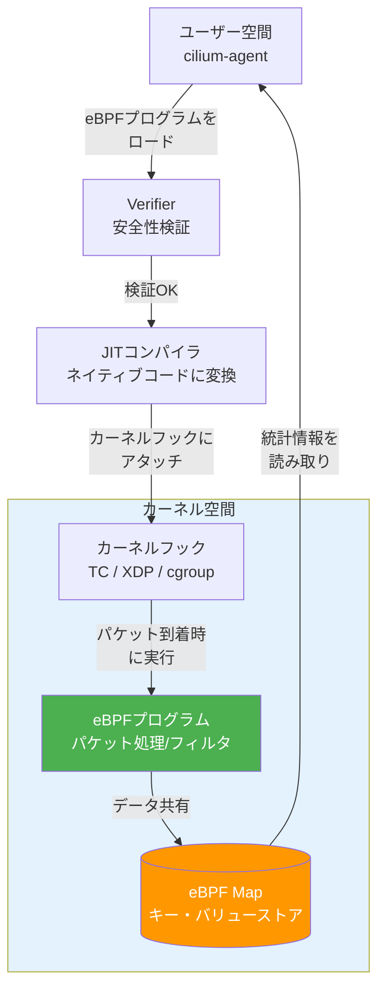
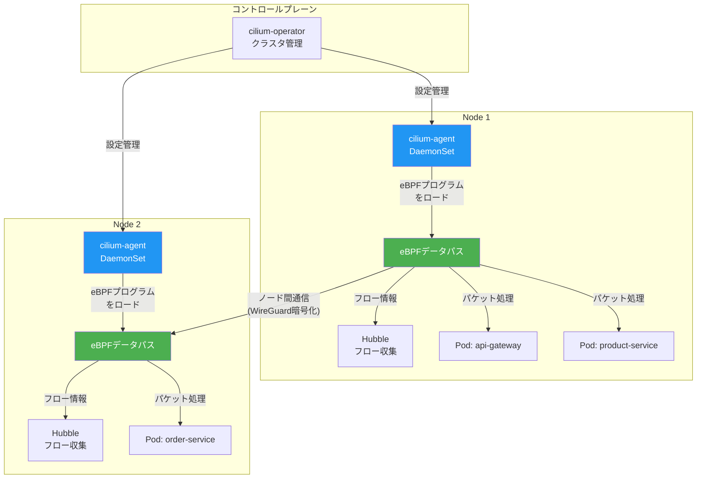
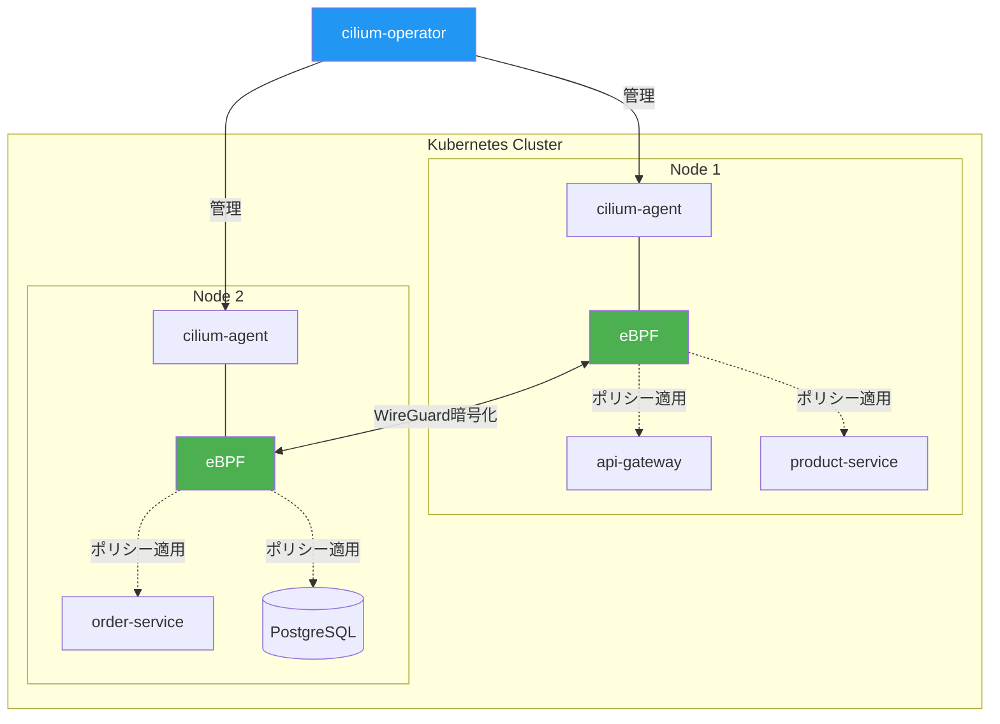
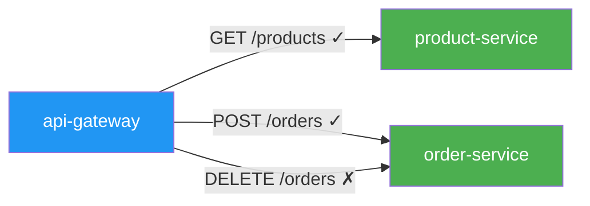
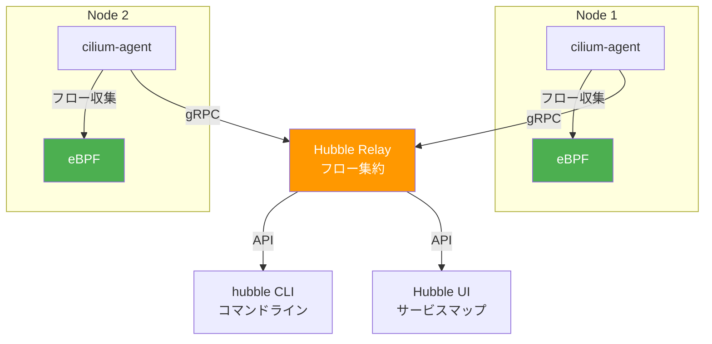
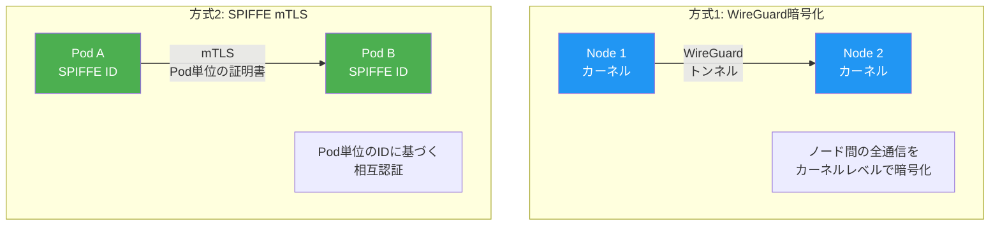

# 第7章 Cilium

前章ではIstioのサイドカーパターンによるService Meshを構築した。サイドカーは強力なアプローチだが、Podあたりのリソースオーバーヘッドやレイテンシ増加という課題がある。本章では、eBPF（extended Berkeley Packet Filter）技術を活用したCiliumを導入し、サイドカーレスでService Meshの機能を実現する。

Ciliumは第6章のIstioと独立して読める構成としている。Istioを読まずに本章から始めても問題ない。

## 7.1 eBPFとは何か ― カーネルレベルのプログラマビリティ

### eBPFの概要

eBPF（extended Berkeley Packet Filter）は、Linuxカーネル内でサンドボックス化されたプログラムを安全に実行するための技術である。カーネルの再コンパイルやカーネルモジュールの追加なしに、ネットワーキング、セキュリティ、可観測性の機能をカーネルレベルで実装できる。

図7.1にeBPFプログラムの実行モデルを示す。

図7.1: eBPFプログラムの実行モデル



eBPFの特徴を以下にまとめる。

- **安全性**: Verifierがプログラムを実行前に検証し、無限ループやメモリアクセス違反を防止する
- **高性能**: JITコンパイルによりネイティブコードとして実行される。ユーザー空間とカーネル空間の境界を越えるコンテキストスイッチが不要
- **動的性**: カーネルの再起動なしにプログラムのロード・アンロードが可能

従来のカーネルモジュールと比較すると、eBPFは安全性と動的性で大きな優位性を持つ。カーネルモジュールはカーネルクラッシュのリスクがあるが、eBPFプログラムはVerifierにより安全性が保証される。

### eBPFの内部構造

eBPFプログラムの実行を深く理解するため、主要な構成要素を詳しく見ていく。

**Verifier（検証器）**

eBPFプログラムはカーネルにロードされる前に、Verifierによる静的解析を受ける。Verifierは以下の検証を行う。

- **ループ検出**: 無限ループがないことを保証する。eBPFプログラムは有界（bounded）であることが要求され、すべてのパスが必ず終了することを検証する
- **メモリアクセスの安全性**: 不正なメモリ領域への読み書きがないことを検証する。ポインタ演算の結果が有効な範囲内にあるかをチェックする
- **スタックサイズの制限**: eBPFプログラムのスタックは512バイトに制限されている
- **命令数の制限**: 1つのeBPFプログラムは100万命令以内に収まる必要がある（カーネル5.2以降）

Verifierが拒否した場合、プログラムはカーネルにロードされないため、カーネルの安定性は保たれる。

**eBPF Map（マップ）**

eBPF Mapは、eBPFプログラム間およびユーザー空間とのデータ共有に使用されるキー・バリューストアである。Ciliumでは以下のMapが使用される。

> 表7.1b: Ciliumが使用する主要なeBPF Map

| Map名 | 用途 | データ内容 |
|-------|------|-----------|
| cilium_ct_tcp4_global | コネクション追跡 | TCP接続の状態（SYN/ESTABLISHED/FIN） |
| cilium_ipcache | IPキャッシュ | Pod IPとIdentityのマッピング |
| cilium_policy | ポリシーマップ | Identity間の許可/拒否ルール |
| cilium_lxc | エンドポイント情報 | Pod のvethインターフェースとIdentityのマッピング |

**フック（Hook）ポイント**

eBPFプログラムはカーネル内の特定のフックポイントにアタッチされ、イベント発生時に実行される。Ciliumが使用する主要なフックポイントは以下の通りである。

- **TC（Traffic Control）**: ネットワークインターフェースのIngress/Egressでパケットを処理する。Ciliumのメインのデータパス処理に使用される
- **XDP（eXpress Data Path）**: ネットワークドライバのレベルでパケットを処理する。TCよりも早い段階で処理できるため、DDoS防御やロードバランシングに使用される
- **cgroup**: cgroup（コントロールグループ）レベルでソケット操作をフックする。Kubernetes Serviceの実装に使用される

XDPは最も低レイヤーのフックポイントであり、パケットがカーネルのネットワークスタックに入る前に処理できるため、パフォーマンスが最も高い。Ciliumでは、XDPを使用したプリフィルタリングにより、不要なパケットを早期にドロップしてCPU消費を削減できる。

### パフォーマンスの考察

eBPFがユーザー空間のプロキシ（Envoy）と比較して高性能である理由は、主に以下の3点に集約される。

1. **コンテキストスイッチの回避**: ユーザー空間のプロキシではパケットごとにカーネル空間⇔ユーザー空間のコンテキストスイッチが発生する。eBPFはカーネル空間内でパケット処理を完結させるため、このオーバーヘッドがない
2. **メモリコピーの削減**: ユーザー空間のプロキシはパケットデータをカーネル空間からユーザー空間にコピーする必要がある。eBPFはカーネル内のバッファを直接操作する
3. **JITコンパイル**: eBPFバイトコードはJITコンパイラによりネイティブのマシンコードに変換されるため、インタプリタのオーバーヘッドがない

ベンチマーク上、L3/L4レベルのパケット処理ではCilium（eBPF）はIstio（Envoy）と比較して数十%から数倍のスループット向上が報告されている。ただし、L7レベルの処理（HTTPヘッダの解析等）ではCiliumもEnvoyプロキシを使用するため、差は小さくなる。

## 7.2 Ciliumのアーキテクチャ ― サイドカーレスの仕組み

### コンポーネント構成

Ciliumは、cilium-agent（各ノード）とcilium-operator（クラスタ全体）で構成される。図7.2にアーキテクチャを示す。

図7.2: Ciliumアーキテクチャ図



Istioとの構造的な違いを表7.1にまとめる。

> 表7.1: IstioとCiliumのアーキテクチャ比較表

| 項目 | Istio | Cilium |
|------|-------|--------|
| データプレーン | Envoyサイドカー（Pod単位） | eBPFプログラム（ノード単位） |
| コントロールプレーン | istiod | cilium-operator + cilium-agent |
| パケット処理の場所 | ユーザー空間（Envoy） | カーネル空間（eBPF） |
| L3/L4処理 | Envoy経由 | eBPFで直接処理 |
| L7処理 | Envoyサイドカー | ノード単位のEnvoyプロキシ |
| リソースオーバーヘッド | Pod数に比例 | ノード数に比例 |
| レイテンシ影響 | 数ms（サイドカー経由） | 最小限（カーネル内処理） |

## 7.3 Ciliumのインストールとサンプルアプリへの導入

### Helmによるインストール

OKE環境にCiliumをインストールする。OKEではデフォルトのCNI（flannel）と並行してCiliumを導入する方法と、CiliumをCNIとして置き換える方法がある。ここでは学習用にCiliumをオーバーレイモードで導入する。

```bash
# コード7.1: CiliumのHelmインストールコマンド
# Cilium Helmリポジトリの追加
helm repo add cilium https://helm.cilium.io/
helm repo update

# Ciliumのインストール
helm install cilium cilium/cilium --version 1.16.5 \
  --namespace kube-system \
  --set hubble.enabled=true \
  --set hubble.relay.enabled=true \
  --set hubble.ui.enabled=true \
  --set encryption.enabled=true \
  --set encryption.type=wireguard
```

### Kustomize overlayでの管理

Cilium関連のポリシーやリソースをKustomize overlayで管理する。

```yaml
# コード7.2: Cilium用Kustomize overlay
# overlays/cilium/kustomization.yaml
apiVersion: kustomize.config.k8s.io/v1beta1
kind: Kustomization

resources:
  - ../../base
  - cilium-network-policy.yaml    # L7ポリシー
  - cilium-l7-policy.yaml         # HTTPレベルのポリシー
```

### 動作確認

```bash
# コード7.3: cilium statusによる動作確認
cilium status

# 出力例
#     /¯¯\
#  /¯¯\__/¯¯\    Cilium:          OK
#  \__/¯¯\__/    Operator:        OK
#  /¯¯\__/¯¯\    Hubble Relay:    OK
#  \__/¯¯\__/    ClusterMesh:     disabled
#     \__/
#
# Deployment        cilium-operator    Desired: 1, Ready: 1/1
# DaemonSet         cilium             Desired: 3, Ready: 3/3
# Deployment        hubble-relay       Desired: 1, Ready: 1/1
# Deployment        hubble-ui          Desired: 1, Ready: 1/1
```

図7.3にCilium導入後のクラスタ構成を示す。

図7.3: Cilium導入後のクラスタ構成図



Istioとは異なり、各Podにサイドカーコンテナは追加されない。`kubectl get pods` で確認すると、コンテナ数は1のままである。

### CiliumのIdentityモデル

Ciliumは従来のIPアドレスベースのセキュリティモデルではなく、Identity（アイデンティティ）ベースのセキュリティモデルを採用している。各PodにはKubernetesラベルに基づいたIdentityが割り当てられ、このIdentityを使用してポリシーの評価が行われる。

IPアドレスベースのモデルでは、Podの再起動やスケーリングによりIPアドレスが変わるたびにポリシーの更新が必要になる。Identityベースのモデルでは、ラベルが同じPodには同じIdentityが割り当てられるため、IPアドレスの変動に影響されない。

```bash
# コード7.3b: Cilium IdentityのIdentity割り当て確認
# エンドポイントとIdentityの一覧
cilium endpoint list

# 出力例
# ENDPOINT   POLICY (ingress)   POLICY (egress)   IDENTITY   LABELS (source:k8s)
# 1234       Enabled            Enabled           45678      k8s:app=order-service
# 5678       Enabled            Enabled           45679      k8s:app=product-service
```

### Ciliumのトラブルシューティング

Ciliumの運用中に遭遇しやすい問題と対処法を以下にまとめる。

> 表7.1c: Ciliumの一般的な問題と対処法

| 問題 | 症状 | 対処法 |
|------|------|--------|
| eBPFプログラムのロード失敗 | Podの通信ができない | `cilium status` でeBPFの状態を確認。カーネルバージョンがCiliumの要件を満たしているか確認（最低4.19、推奨5.10以上） |
| ポリシーの反映遅延 | 新しいポリシーが即座に適用されない | `cilium policy get` でポリシーの状態を確認。cilium-agentのログでエラーを確認 |
| DNS解決の失敗 | サービス名で通信できない | CiliumのDNSプロキシが正常に動作しているか確認。`cilium monitor --type=l7` でDNSリクエストを監視 |
| ノード間通信の障害 | 異なるノード上のPod間で通信できない | WireGuardトンネルの状態を確認。`cilium encrypt status` で暗号化の状態を確認 |

## 7.4 CiliumNetworkPolicy ― L7レベルのポリシー適用

### Kubernetes NetworkPolicyとの違い

KubernetesネイティブのNetworkPolicyはL3/L4（IPアドレス、ポート番号）でのフィルタリングに限定される。CiliumNetworkPolicy（CNP）はL7（HTTPメソッド、パス、ヘッダ）レベルの細粒度なポリシーを適用できる。

> 表7.2: NetworkPolicyとCiliumNetworkPolicyの機能比較表

| 機能 | NetworkPolicy | CiliumNetworkPolicy |
|------|--------------|-------------------|
| L3フィルタリング（IPアドレス） | 対応 | 対応 |
| L4フィルタリング（ポート番号） | 対応 | 対応 |
| L7フィルタリング（HTTP/gRPC） | 非対応 | 対応 |
| DNS名ベースのフィルタリング | 非対応 | 対応 |
| Egress制御 | 対応 | 対応（L7レベル） |
| ポリシーの可視化 | 非対応 | Hubbleで可視化 |

### L7ポリシーの実装

図7.4にCiliumNetworkPolicyによるL7フィルタリングの概念を示す。

図7.4: CiliumNetworkPolicyによるL7フィルタリングの概念図



サンプルアプリケーションに対して、HTTPメソッドとパスに基づくアクセス制御を設定する。

```yaml
# コード7.4: CiliumNetworkPolicy（L7 HTTPルール）
apiVersion: cilium.io/v2
kind: CiliumNetworkPolicy
metadata:
  name: order-service-l7-policy
  namespace: book-app
spec:
  endpointSelector:
    matchLabels:
      app: order-service
  ingress:
    - fromEndpoints:
        - matchLabels:
            app: api-gateway
      toPorts:
        - ports:
            - port: "8080"
              protocol: TCP
          rules:
            http:
              - method: GET    # 注文の参照は許可
                path: "/orders.*"
              - method: POST   # 注文の作成は許可
                path: "/orders"
              # DELETE は記載しない → 拒否される
```

サービス間のアクセス制御も設定する。

```yaml
# コード7.5: CiliumNetworkPolicy（サービス間アクセス制御）
apiVersion: cilium.io/v2
kind: CiliumNetworkPolicy
metadata:
  name: product-service-policy
  namespace: book-app
spec:
  endpointSelector:
    matchLabels:
      app: product-service
  ingress:
    - fromEndpoints:
        - matchLabels:
            app: api-gateway
      toPorts:
        - ports:
            - port: "8080"
              protocol: TCP
          rules:
            http:
              - method: GET
                path: "/products.*"
    # order-serviceからのアクセスは拒否（ルールなし）
```

### ポリシー違反の確認

ポリシーに違反するリクエストを送信し、CiliumがL7レベルで拒否することを確認する。

```bash
# api-gatewayからorder-serviceへのDELETEリクエスト（拒否される）
kubectl exec -n book-app deploy/api-gateway -- \
  curl -s -o /dev/null -w "%{http_code}" \
  -X DELETE http://order-service:8080/orders/1
# 出力: 403
```

## 7.5 Hubble ― サービス間通信の可視化

### Hubbleのアーキテクチャ

Hubble（ハブル）は、CiliumのObservabilityコンポーネントである。各ノードのcilium-agentがeBPFから収集したフロー情報を、Hubble Relay経由で集約する。

図7.5: Hubbleのアーキテクチャ図



### Hubbleの有効化

```bash
# コード7.6: Hubbleの有効化とHubble UIのインストール
# Hubbleは7.3節のHelmインストール時に有効化済み
# 追加設定が必要な場合:
helm upgrade cilium cilium/cilium --namespace kube-system \
  --reuse-values \
  --set hubble.enabled=true \
  --set hubble.relay.enabled=true \
  --set hubble.ui.enabled=true

# Hubble CLIのインストール
HUBBLE_VERSION=$(curl -s https://raw.githubusercontent.com/cilium/hubble/master/stable.txt)
curl -L --remote-name-all \
  https://github.com/cilium/hubble/releases/download/$HUBBLE_VERSION/hubble-linux-amd64.tar.gz
tar xzvf hubble-linux-amd64.tar.gz
sudo mv hubble /usr/local/bin/
```

### フロー監視

hubble CLIでリアルタイムのフロー監視を行う。

```bash
# コード7.7: hubble observeコマンドによるフロー監視
# ポートフォワードでHubble Relayに接続
cilium hubble port-forward &

# 全フローの監視
hubble observe --namespace book-app

# 出力例
# TIMESTAMP          SOURCE                  DESTINATION             TYPE     VERDICT  SUMMARY
# Mar  7 10:15:32    book-app/api-gateway    book-app/order-service  l7/HTTP  FORWARDED  GET /orders HTTP/1.1
# Mar  7 10:15:33    book-app/api-gateway    book-app/product-svc    l7/HTTP  FORWARDED  GET /products HTTP/1.1
# Mar  7 10:15:34    book-app/api-gateway    book-app/order-service  l7/HTTP  DROPPED    DELETE /orders/1 HTTP/1.1

# 特定サービスのフローをフィルタ
hubble observe --namespace book-app --to-label app=order-service --verdict DROPPED
```

VERDICTカラムにFORWARDED（許可）またはDROPPED（拒否）が表示され、ポリシーの適用状況をリアルタイムで確認できる。

Hubbleのフロー情報はL3/L4/L7の各レイヤーにわたる詳細なメタデータを含んでおり、障害調査やセキュリティ監査に活用できる。

> 表7.2b: Hubbleフロー情報の各レイヤーの詳細

| レイヤー | 情報 | 活用シナリオ |
|---------|------|------------|
| L3 | 送信元/先IPアドレス、ICMP | ネットワーク到達性の確認、IPベースのトラフィック分析 |
| L4 | TCP/UDPポート番号、TCPフラグ、コネクション状態 | ポート番号ベースのポリシー確認、コネクション問題の診断 |
| L7 | HTTPメソッド、パス、ステータスコード、レスポンスタイム | API呼び出しの分析、エラーレートの算出、レイテンシの追跡 |
| DNS | クエリ名、レスポンスIP、TTL | DNS解決の確認、FQDN（完全修飾ドメイン名）ベースのポリシー検証 |

```bash
# コード7.7b: Hubbleの高度なフィルタリング
# 特定のHTTPステータスコードでフィルタ
hubble observe --namespace book-app \
  --protocol http \
  --http-status 500-599

# DNS関連のフローのみ表示
hubble observe --namespace book-app \
  --protocol dns

# 特定の送信元から送信先へのフローをJSON形式で出力
hubble observe --namespace book-app \
  --from-label app=api-gateway \
  --to-label app=order-service \
  --output json
```

### Hubble UIのサービスマップ

図7.6にHubble UIのサービスマップ画面を示す。

図7.6: Hubble UIのサービスマップ画面

```
┌────────────────────────────────────────────────────────┐
│ Hubble - Service Map                   [book-app ▼]    │
├────────────────────────────────────────────────────────┤
│                                                        │
│    ┌──────────────┐                                    │
│    │ istio-ingress│                                    │
│    │  (external)  │                                    │
│    └──────┬───────┘                                    │
│           │ HTTP                                       │
│           ▼                                            │
│    ┌──────────────┐                                    │
│    │ api-gateway  │                                    │
│    │ ━━━━━━━━━━━━ │                                    │
│    │ 120 req/s    │                                    │
│    └───┬──────┬───┘                                    │
│   GET /│      │ POST /orders                           │
│   products    │                                        │
│        ▼      ▼                                        │
│ ┌────────────┐ ┌────────────┐                          │
│ │ product-   │ │ order-     │                          │
│ │ service    │ │ service    │                          │
│ │ ━━━━━━━━━━ │ │ ━━━━━━━━━━ │                          │
│ │ 80 req/s   │ │ 40 req/s   │                          │
│ └────────────┘ └──────┬─────┘                          │
│                       │ TCP :5432                      │
│                       ▼                                │
│               ┌──────────────┐                         │
│               │ PostgreSQL   │                         │
│               │ ━━━━━━━━━━━━ │                         │
│               │ 40 conn      │                         │
│               └──────────────┘                         │
│                                                        │
│ ── FORWARDED (緑)  ── DROPPED (赤)  ── unknown (灰)    │
│ Flows: [L3/L4 ▼] [L7 ▼] [DNS ▼]                      │
└────────────────────────────────────────────────────────┘
```

## 7.6 Cilium Service Mesh ― mTLSとL7トラフィック管理

### 暗号化の方式

CiliumはIstioとは異なるアプローチで通信の暗号化を実現する。2つの方式を提供している。

図7.7: CiliumのmTLS実装方式の概念図



> 表7.3: IstioとCiliumのmTLS実装比較表

| 項目 | Istio mTLS | Cilium WireGuard | Cilium SPIFFE mTLS |
|------|-----------|-----------------|-------------------|
| 暗号化の粒度 | Pod間 | ノード間 | Pod間 |
| 証明書管理 | Citadel（自動） | カーネル内鍵管理 | SPIRE（外部） |
| パフォーマンス | ユーザー空間処理 | カーネル内処理（高速） | ユーザー空間処理 |
| 設定の複雑さ | 中程度 | 低い | 高い |
| ID体系 | SPIFFE互換 | ノードキー | SPIFFE ID |

### WireGuard暗号化の設定

WireGuardによるノード間暗号化は、Ciliumのインストール時に有効化できる。

```yaml
# コード7.8: WireGuard暗号化の有効化設定
# Cilium Helm values
encryption:
  enabled: true
  type: wireguard
  wireguard:
    userspaceFallback: false  # カーネル内WireGuardを使用
```

WireGuard暗号化はカーネル空間で処理されるため、アプリケーションやサイドカーへの影響がない。ただし、暗号化の粒度はノード間であり、同一ノード内のPod間通信は暗号化されない点に注意が必要である。

### L7トラフィック管理

CiliumでL7レベルのトラフィック管理（リトライ、タイムアウト等）を行う場合は、Cilium Envoy Config（CEC）を使用する。

```yaml
# コード7.9: Cilium Envoy Config（L7トラフィック管理）
apiVersion: cilium.io/v2
kind: CiliumEnvoyConfig
metadata:
  name: order-service-l7
  namespace: book-app
spec:
  services:
    - name: order-service
      namespace: book-app
  backendServices:
    - name: order-service
      namespace: book-app
  resources:
    - "@type": type.googleapis.com/envoy.config.route.v3.RouteConfiguration
      name: order-service-route
      virtual_hosts:
        - name: order-service
          domains: ["*"]
          routes:
            - match:
                prefix: "/"
              route:
                cluster: "book-app/order-service"
                timeout: 5s
                retry_policy:
                  retry_on: "5xx"
                  num_retries: 3
                  per_try_timeout: 2s
```

L7トラフィック管理の場面ではCiliumもEnvoyプロキシを使用するが、Istioのようにすべてのトラフィックがサイドカーを経由するわけではない。L7処理が必要なトラフィックのみがノード単位のEnvoyプロキシを経由する。

この「オンデマンドL7処理」がCiliumのパフォーマンス上の大きな利点である。L3/L4レベルのフィルタリングで十分なトラフィック（例: データベース接続のポート制御）はeBPFで直接処理され、HTTPメソッドやパスに基づくフィルタリングが必要なトラフィックのみがEnvoyを経由する。

### IstioとCiliumの併用

IstioとCiliumは排他的な選択ではなく、それぞれの強みを活かした併用構成が可能である。

```
Cilium（CNI）: L3/L4ネットワーキング + ネットワークポリシー + WireGuard暗号化
   ↕
Istio（Service Mesh）: L7トラフィック管理 + mTLS + 高度なルーティング
```

併用する場合の一般的なパターンは以下の通りである。

> 表7.3b: IstioとCiliumの併用パターン

| 機能 | Ciliumで対応 | Istioで対応 |
|------|------------|-----------|
| CNI（Pod間ネットワーキング） | eBPFによるパケットルーティング | - |
| L3/L4ネットワークポリシー | CiliumNetworkPolicy | - |
| L7トラフィック管理 | - | VirtualService / DestinationRule |
| ノード間暗号化 | WireGuard | - |
| Pod間相互認証 | - | mTLS（Citadel） |
| 可観測性 | Hubble（フロー監視） | Kiali（サービスグラフ） |

この構成により、L3/L4の処理はカーネル空間で高速に行い、L7の高度な制御が必要な場面でのみIstioのEnvoyサイドカーを使用する。結果として、パフォーマンスと機能の両方を最適化できる。

## 7.7 本章のまとめと次章への橋渡し

### IstioとCiliumの選定基準

> 表7.4: IstioとCiliumの総合比較表

| 観点 | Istio | Cilium | 推奨シナリオ |
|------|-------|--------|------------|
| パフォーマンス | サイドカーのオーバーヘッドあり | eBPFによる高速処理 | レイテンシ要件が厳しい場合はCilium |
| L7トラフィック制御 | VirtualService/DestinationRuleで豊富な制御 | CEC経由で基本的な制御 | 高度なトラフィック制御が必要な場合はIstio |
| エコシステム | 成熟（Kiali、多数のアドオン） | 成長中（Hubble、Tetragon） | 既存ツールとの統合を重視する場合はIstio |
| 運用の複雑さ | サイドカーのライフサイクル管理が必要 | DaemonSetのみで管理がシンプル | 運用チームのリソースが限られる場合はCilium |
| ネットワークポリシー | Istio AuthorizationPolicy | CNP（L7対応） | CNI統合のポリシーが必要な場合はCilium |
| mTLS | Citadelによる自動管理 | WireGuard / SPIFFE | Pod単位のIDが必要な場合はIstio |

選定は二者択一ではなく、プロジェクトの要件に応じて決定する。CiliumをCNIとして導入しつつ、L7トラフィック制御にIstioを組み合わせる構成も実用的である。

### 次章への橋渡し

本章ではCiliumによるネットワークポリシーの適用とHubbleによる通信可視化を構築した。IstioやCiliumが生成するテレメトリ（メトリクス、アクセスログ、トレース）は、まだPart 1で構築したObservability基盤に統合されていない。次章では、Service MeshのテレメトリをPrometheus、Loki、Jaegerに流し込み、アプリケーションレイヤーとメッシュレイヤーの横断的な可観測性を実現する。

## 理解度チェック

1. eBPFとは何か。従来のカーネルモジュールと比較した場合の利点を説明せよ

2. サイドカーパターン（Istio）とサイドカーレス（Cilium）のトレードオフを3つ挙げて説明せよ

3. CiliumNetworkPolicyがKubernetesネイティブのNetworkPolicyと比較して優れている点を、L7フィルタリングの具体例を含めて説明せよ

4. Hubbleが収集するフロー情報にはどのようなものがあるか。L3/L4/L7それぞれのレベルで説明せよ

5. Istioを選ぶべきユースケースとCiliumを選ぶべきユースケースをそれぞれ挙げ、その理由を述べよ

## 参考文献

- Cilium公式ドキュメント, https://docs.cilium.io/
- eBPF公式サイト, https://ebpf.io/
- Hubble公式ドキュメント, https://docs.cilium.io/en/stable/observability/hubble/
- Cilium Service Mesh, https://docs.cilium.io/en/stable/network/servicemesh/
- WireGuard, https://www.wireguard.com/
