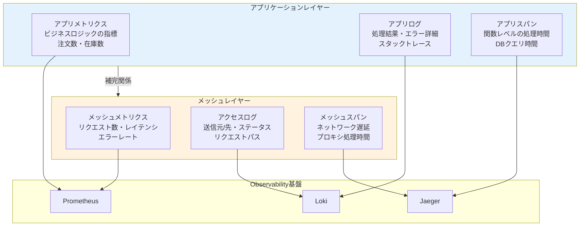
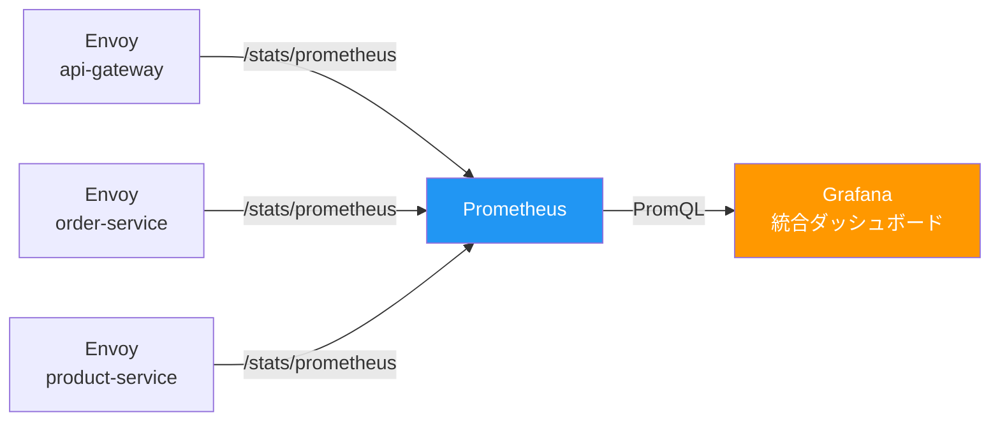
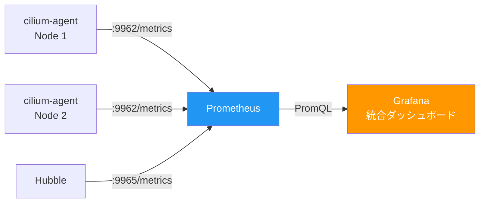
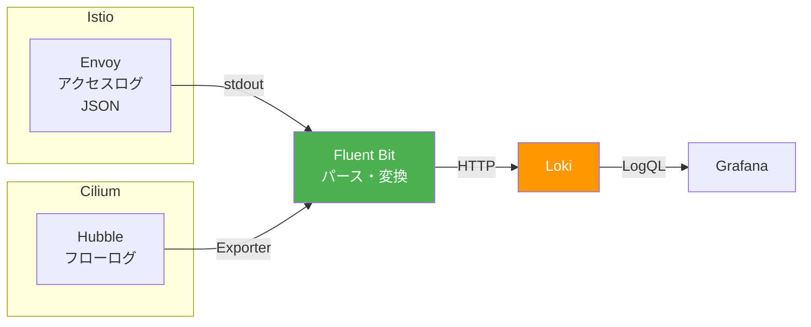
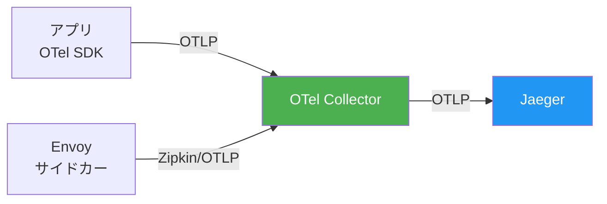
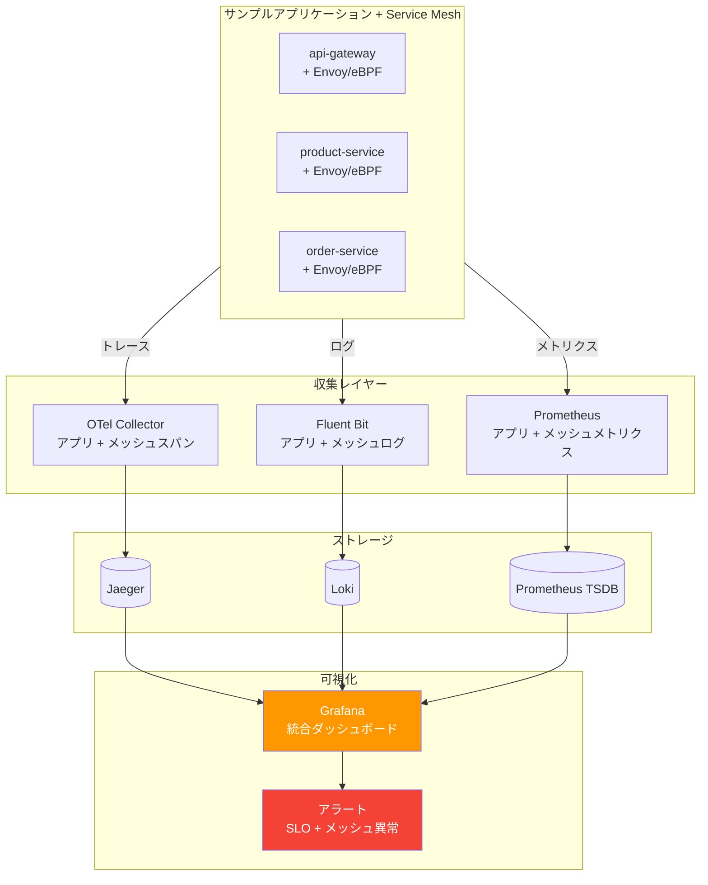

# 第8章 統合 ― メッシュとObservabilityを連携する

Part 2の第6章と第7章で、IstioとCiliumによるService Meshを構築した。mTLSやトラフィック制御は機能しているが、メッシュが生成するテレメトリはまだPart 1で構築したObservability基盤に統合されていない。本章では、メッシュレイヤーのメトリクス・アクセスログ・トレースをPrometheus・Loki・Jaegerに流し込み、アプリケーションからネットワークまでの横断的な可観測性を実現する。

> **注意**: 本章はIstio（第6章）とCilium（第7章）のどちらか一方のみを完了していれば進められる。両方を完了している場合は、それぞれの統合手順を実施できる。

## 8.1 メッシュが生成するテレメトリ ― 何が得られるのか

### アプリケーションテレメトリとメッシュテレメトリ

Service Meshは、アプリケーションコードの変更なしにリクエストレベルのテレメトリを自動生成する。第2章〜第4章で導入したアプリケーションレイヤーのテレメトリとは異なるレイヤーの情報を提供する。

> 表8.1: メッシュが生成するテレメトリ一覧（Istio / Cilium比較）

| テレメトリ種別 | Istio（Envoy） | Cilium（Hubble） | 得られる情報 |
|-------------|---------------|-----------------|------------|
| メトリクス | `istio_requests_total`、`istio_request_duration_milliseconds` | `hubble_http_requests_total`、`cilium_forward_count_total` | リクエスト数、レイテンシ、エラーレート |
| アクセスログ | EnvoyアクセスログJSON | Hubbleフローログ | 送信元/先、レスポンスコード、リクエストパス |
| トレース | Envoyが生成するスパン（W3C Trace Context） | L7プロキシ経由でのスパン生成 | ネットワークレイヤーの遅延 |
| ネットワークフロー | ― | L3/L4フロー（FORWARDED/DROPPED） | ポリシー適用状況 |

図8.1にアプリケーションテレメトリとメッシュテレメトリのレイヤーを示す。

図8.1: アプリケーションテレメトリとメッシュテレメトリのレイヤー図



アプリケーションテレメトリはビジネスロジックの内部状態を示すのに対し、メッシュテレメトリはサービス間の通信品質を示す。両者を統合することで、「注文処理が遅い原因がアプリケーションのDBクエリなのか、ネットワークの遅延なのか」を切り分けられる。

## 8.2 IstioメトリクスをPrometheusへ統合する

### Istio標準メトリクス

IstioのEnvoyサイドカーは、リクエストの処理に関する標準メトリクスを自動的に公開する。

> 表8.2: Istio標準メトリクス一覧（主要なもの）

| メトリクス名 | 種別 | 説明 |
|------------|------|------|
| `istio_requests_total` | Counter | リクエスト総数（ラベル: source、destination、response_code） |
| `istio_request_duration_milliseconds` | Histogram | リクエストのレイテンシ分布 |
| `istio_tcp_sent_bytes_total` | Counter | TCP送信バイト数 |
| `istio_tcp_received_bytes_total` | Counter | TCP受信バイト数 |
| `istio_tcp_connections_opened_total` | Counter | TCPコネクションの開始数 |

### ServiceMonitorの設定

Prometheus Operatorを使用している場合、ServiceMonitorでEnvoyのメトリクスエンドポイントをスクレイプ対象に追加する。

```yaml
# コード8.1: ServiceMonitor（Istio Envoyメトリクス用）
apiVersion: monitoring.coreos.com/v1
kind: ServiceMonitor
metadata:
  name: istio-mesh-metrics
  namespace: book-observability
spec:
  selector:
    matchExpressions:
      - key: app
        operator: Exists
  namespaceSelector:
    matchNames:
      - book-app
  endpoints:
    - port: http-envoy-prom  # Envoyメトリクスポート（15090）
      path: /stats/prometheus
      interval: 15s
```

### Grafanaダッシュボードへの統合

図8.2にIstioメトリクス収集のデータフローを示す。

図8.2: Istioメトリクス収集のデータフロー図



第5章で構築したダッシュボードにメッシュメトリクスのパネルを追加する。

```yaml
# コード8.2: Grafanaダッシュボード（Istioメトリクスパネル）
# メッシュレイヤーのRequest Rate
# PromQL:
#   sum(rate(istio_requests_total{
#     destination_service_namespace="book-app"
#   }[5m])) by (destination_service_name, response_code)

# メッシュレイヤーのP99 Latency
# PromQL:
#   histogram_quantile(0.99,
#     sum(rate(istio_request_duration_milliseconds_bucket{
#       destination_service_namespace="book-app"
#     }[5m])) by (destination_service_name, le)
#   )
```

## 8.3 CiliumメトリクスをPrometheusへ統合する

### Cilium / Hubble標準メトリクス

cilium-agentとHubbleは、ネットワークフローに関するメトリクスを公開する。

> 表8.3: Cilium / Hubble標準メトリクス一覧（主要なもの）

| メトリクス名 | ソース | 説明 |
|------------|-------|------|
| `cilium_forward_count_total` | cilium-agent | 転送されたパケット数 |
| `cilium_drop_count_total` | cilium-agent | ドロップされたパケット数（ラベル: reason） |
| `cilium_policy_verdict` | cilium-agent | ポリシー判定結果（FORWARDED/DROPPED） |
| `hubble_http_requests_total` | Hubble | L7 HTTPリクエスト数 |
| `hubble_http_request_duration_seconds` | Hubble | L7 HTTPリクエストレイテンシ |
| `hubble_flows_processed_total` | Hubble | 処理されたフロー総数 |

### ServiceMonitorの設定

```yaml
# コード8.3: ServiceMonitor（Cilium / Hubbleメトリクス用）
apiVersion: monitoring.coreos.com/v1
kind: ServiceMonitor
metadata:
  name: cilium-metrics
  namespace: book-observability
spec:
  selector:
    matchLabels:
      app.kubernetes.io/name: cilium-agent
  namespaceSelector:
    matchNames:
      - kube-system
  endpoints:
    - port: metrics   # cilium-agentメトリクスポート（9962）
      interval: 15s
---
apiVersion: monitoring.coreos.com/v1
kind: ServiceMonitor
metadata:
  name: hubble-metrics
  namespace: book-observability
spec:
  selector:
    matchLabels:
      app.kubernetes.io/name: hubble
  namespaceSelector:
    matchNames:
      - kube-system
  endpoints:
    - port: metrics   # Hubbleメトリクスポート（9965）
      interval: 15s
```

### Grafanaダッシュボードへの統合

図8.3にCiliumメトリクス収集のデータフローを示す。

図8.3: Ciliumメトリクス収集のデータフロー図



```yaml
# コード8.4: Grafanaダッシュボード（Ciliumメトリクスパネル）
# ポリシーDROPレート
# PromQL:
#   sum(rate(cilium_drop_count_total[5m])) by (reason)

# L7 HTTPリクエストレート（Hubble）
# PromQL:
#   sum(rate(hubble_http_requests_total{
#     destination_namespace="book-app"
#   }[5m])) by (destination_workload, status_code)
```

## 8.4 アクセスログをFluent Bitへ統合する

### Envoyアクセスログの収集（Istio）

IstioのEnvoyアクセスログはJSON形式で出力できる。Fluent Bitのパーサーで構造化し、Lokiへ送信する。

図8.4: アクセスログ収集のデータフロー図



```yaml
# コード8.5: Fluent Bit設定（Envoyアクセスログのパース）
[INPUT]
    Name              tail
    Tag               mesh.envoy.*
    Path              /var/log/containers/*istio-proxy*.log
    Parser            docker
    Refresh_Interval  5

[FILTER]
    Name              parser
    Match             mesh.envoy.*
    Key_Name          log
    Parser            envoy-json
    Reserve_Data      On

[OUTPUT]
    Name              loki
    Match             mesh.envoy.*
    Host              loki-gateway.book-observability
    Port              3100
    Labels            job=envoy-access-log, namespace=$kubernetes['namespace_name'], service=$kubernetes['labels']['app']
    Label_Keys        $response_code, $upstream_cluster
```

### Hubbleフローログの収集（Cilium）

```yaml
# コード8.6: Fluent Bit設定（Hubbleフローログの収集）
[INPUT]
    Name              tail
    Tag               mesh.hubble.*
    Path              /var/run/cilium/hubble/events.log
    Parser            json
    Refresh_Interval  5

[FILTER]
    Name              modify
    Match             mesh.hubble.*
    Add               log_type hubble-flow

[OUTPUT]
    Name              loki
    Match             mesh.hubble.*
    Host              loki-gateway.book-observability
    Port              3100
    Labels            job=hubble-flow, namespace=$destination_namespace, source=$source_workload, destination=$destination_workload
```

統合後は、LogQLでアプリケーションログとメッシュアクセスログを横断的に検索できる。

```logql
# 特定サービスのアプリログとメッシュログを同時に検索
{namespace="book-app", service="order-service"} | json
```

## 8.5 トレースをOpenTelemetryへ統合する

### IstioトレースのOTel Collector統合

IstioのEnvoyはリクエストを処理する際にトレーススパンを生成する。このスパンをOpenTelemetry Collector経由でJaegerに送信することで、アプリケーションスパンとメッシュスパンが1つのトレースとして結合される。

図8.5: トレース統合のデータフロー図



```yaml
# コード8.7: IstioのトレースバックエンドをOTel Collectorに向ける設定
# Istio MeshConfig
apiVersion: install.istio.io/v1alpha1
kind: IstioOperator
spec:
  meshConfig:
    enableTracing: true
    extensionProviders:
      - name: otel-collector
        opentelemetry:
          service: otel-collector.book-observability.svc.cluster.local
          port: 4317
    defaultProviders:
      tracing:
        - otel-collector
```

```yaml
# コード8.8: OTel Collectorのパイプライン設定（メッシュスパン受信）
receivers:
  otlp:
    protocols:
      grpc:
        endpoint: 0.0.0.0:4317
      http:
        endpoint: 0.0.0.0:4318

processors:
  batch:
    timeout: 5s
    send_batch_size: 1024
  attributes:
    actions:
      - key: mesh.source
        value: istio
        action: upsert  # メッシュスパンにソースを付与

exporters:
  otlp:
    endpoint: jaeger-collector.book-observability:4317
    tls:
      insecure: true

service:
  pipelines:
    traces:
      receivers: [otlp]
      processors: [batch, attributes]
      exporters: [otlp]
```

### 統合トレースの確認

図8.6に統合トレースの表示例を示す。アプリケーションの計装で生成したスパンとEnvoyが生成したスパンが、同一のTrace IDで結合されている。

図8.6: 統合トレースの表示例

```
Trace ID: abc123def456    Duration: 1.2s    Spans: 8

├── [120ms] api-gateway (app)
│   ├── [5ms]  envoy.ingress (mesh)       ← メッシュスパン
│   └── [115ms] api-gateway.handle (app)
│       ├── [50ms] product-service (app)
│       │   ├── [3ms]  envoy.egress (mesh)  ← ネットワーク遅延が見える
│       │   ├── [2ms]  envoy.ingress (mesh)
│       │   └── [45ms] product-service.query (app)
│       └── [60ms] order-service (app)
│           ├── [4ms]  envoy.egress (mesh)  ← ネットワーク遅延が見える
│           ├── [2ms]  envoy.ingress (mesh)
│           └── [54ms] order-service.create (app)

凡例: (app) = アプリケーションスパン  (mesh) = メッシュスパン
```

メッシュスパンにより、リクエストがEnvoyプロキシを通過する際のオーバーヘッドやネットワーク遅延が可視化される。アプリケーション内部の処理時間とネットワーク遅延を切り分けて分析できる。

トレースが結合されるためには、以下の条件が必要である。

- アプリケーションとEnvoyが同一のTrace IDを使用すること（W3C Trace Context対応）
- アプリケーションがリクエストヘッダでTrace Contextを伝播していること（第4章で実装済み）

## 8.6 統合ダッシュボードの完成と検証

### メッシュ関連の障害シナリオ

> 表8.4: メッシュ関連の障害シナリオと検知方法

| シナリオ | 検知するメトリクス | ログ/トレースでの確認 |
|---------|-----------------|-------------------|
| mTLS証明書の期限切れ | `istio_requests_total{response_code="503"}` 増加 | Envoyログに `UAEX` (upstream auth error) |
| ポリシー拒否 | `cilium_drop_count_total` 増加 | Hubbleフローで `DROPPED` の verdict |
| リトライ多発 | `istio_requests_total` の急増 | トレースで同一リクエストの複数スパン |
| サイドカー未注入 | `istio_requests_total` でサービスが表示されない | ― |

### 統合ダッシュボードの構成

```yaml
# コード8.9: 統合ダッシュボード用Kustomize構成
# overlays/observability-mesh/kustomization.yaml
apiVersion: kustomize.config.k8s.io/v1beta1
kind: Kustomization

resources:
  - ../../base
  - service-monitor-istio.yaml    # 8.2節のServiceMonitor
  - service-monitor-cilium.yaml   # 8.3節のServiceMonitor
  - fluent-bit-mesh-config.yaml   # 8.4節のFluent Bit設定
  - otel-collector-mesh.yaml      # 8.5節のOTel Collector設定
  - grafana-dashboard-mesh.yaml   # メッシュパネル追加
```

### 障害シミュレーションによる検証

mTLS関連の障害を注入し、統合Observability基盤での検知・調査フローを検証する。

1. **検知**: Grafanaダッシュボードのメッシュメトリクスパネルで503エラーの増加を確認する
2. **メトリクス分析**: `istio_requests_total{response_code="503"}` でエラーの発生元サービスを特定する
3. **ログ調査**: LokiでEnvoyアクセスログを検索し、`UAEX` フラグからmTLSエラーと判定する
4. **トレース確認**: Jaegerで該当リクエストのトレースを表示し、メッシュスパンでエラーが発生している箇所を特定する

### Part 2完成時のアーキテクチャ

図8.7にPart 2完成時の全体アーキテクチャを示す。

図8.7: Part 2完成時の全体アーキテクチャ図



## 8.7 本章のまとめと次章への橋渡し

### Part 1〜2の成果

> 表8.5: Part 1〜2で構築した基盤のコンポーネント一覧

| Part | 章 | コンポーネント | 役割 |
|------|---|-------------|------|
| Part 1 | 第2章 | Prometheus | メトリクス収集・保存・クエリ |
| Part 1 | 第3章 | Fluent Bit + Loki | ログ収集・転送・保存・クエリ |
| Part 1 | 第4章 | OpenTelemetry + Jaeger | 分散トレーシング |
| Part 1 | 第5章 | Grafana | 統合ダッシュボード、SLI/SLO |
| Part 2 | 第6章 | Istio | mTLS、トラフィック制御 |
| Part 2 | 第7章 | Cilium | eBPFポリシー、Hubble可視化 |
| Part 2 | 第8章 | 統合 | メッシュテレメトリのObservability統合 |

### 現時点の課題とPart 3への橋渡し

Part 2までで、アプリケーションレイヤーとメッシュレイヤーの統合可観測性と、Service Meshによるサービス間通信のセキュリティが実現した。しかし、Kubernetesクラスタ全体のセキュリティにはまだ対処していない。

- RBACによるKubernetesリソースのアクセス制御が未設定
- ポリシーの自動検証（Policy as Code）が未導入
- コンテナイメージのサプライチェーンセキュリティが未対応
- セキュリティイベントのObservability基盤への統合が未実施

Part 3では、これらの課題に対処する。第9章でRBACとNetworkPolicy、第10章でOPA/GatekeeperによるPolicy as Code、第11章でコンテナイメージのセキュリティ、第12章でセキュリティ監査基盤の構築を扱う。

## 理解度チェック

1. Service Meshが自動生成するテレメトリと、アプリケーションの計装で得られるテレメトリの違いを説明せよ。両者が補完関係にある理由を述べよ

2. IstioのEnvoyメトリクスをPrometheusで収集するために必要な設定を説明せよ

3. メッシュのアクセスログをLokiに統合する際、ラベルとしてどのようなメタデータを付与すべきか。その理由とともに3つ以上挙げよ

4. アプリケーションスパンとメッシュスパンが1つのトレースとして結合されるために必要な条件を説明せよ

## 参考文献

- Istio Observability, https://istio.io/latest/docs/tasks/observability/
- Istio Standard Metrics, https://istio.io/latest/docs/reference/config/metrics/
- Cilium Monitoring & Metrics, https://docs.cilium.io/en/stable/observability/metrics/
- Hubble Exporter, https://docs.cilium.io/en/stable/observability/hubble/export/
- OpenTelemetry Collector, https://opentelemetry.io/docs/collector/
