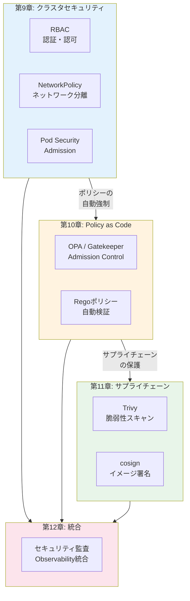
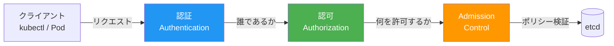
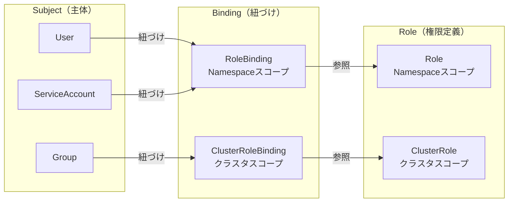
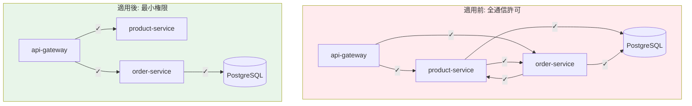
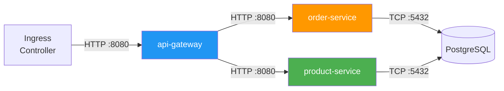
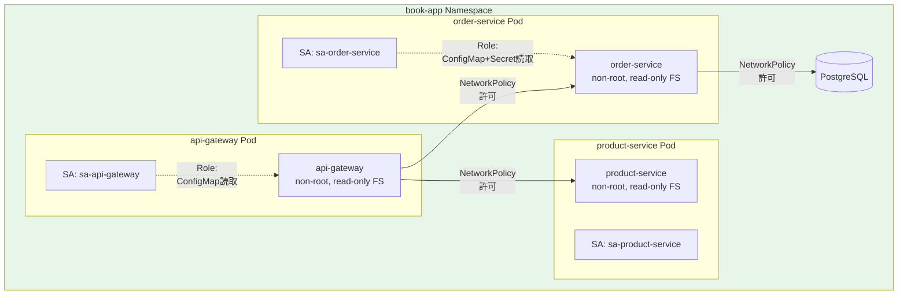

# 第9章 クラスタセキュリティ ― RBAC + NetworkPolicy

Part 1〜2でObservabilityとService Meshの基盤を構築した。しかし、サンプルアプリケーションのセキュリティ設計はほぼ手つかずである。全PodがデフォルトのServiceAccountで動作し、Namespace間の通信も無制限、privilegedコンテナの制約もない。Part 3では、Kubernetesクラスタ全体のセキュリティを体系的に強化する。

## 9.1 Part 3 イントロダクション ― なぜセキュリティが必要か

### サンプルアプリケーションの現状

第1章でデプロイしたサンプルアプリケーションには、以下のセキュリティ上の課題がある。

- デフォルトServiceAccountで全Podが動作しており、不要なAPIアクセス権限がある
- Namespace間の通信が無制限であり、任意のPodが任意のサービスにアクセスできる
- コンテナがroot権限で動作し、privilegedモードの制約がない
- リソース作成時のポリシーチェックが存在せず、危険な設定のデプロイを防げない

### Part 3の全体像

図9.1にPart 3で扱うセキュリティ領域を示す。

図9.1: Part 3のセキュリティ領域マップ



Part 3の3つの章（第9章〜第11章）は互いに独立して読める構成としている。第12章でこれらをObservability基盤と統合する。

## 9.2 Kubernetesの認証・認可モデル

### APIリクエストの処理フロー

Kubernetes APIサーバーへのすべてのリクエストは、3つの段階を経て処理される。図9.2にフローを示す。

図9.2: APIリクエストの処理フロー



- **認証（Authentication）**: リクエストの発信者を識別する。X.509証明書、Bearer Token（ベアラートークン）、ServiceAccountトークン、OIDC（OpenID Connect）等の方式がある
- **認可（Authorization）**: 認証されたユーザーが要求された操作を許可されているか判定する。本書ではRBACを使用する
- **Admission Control**: リクエストの内容を検証・変更する。Mutating Admission（リクエストの変更）とValidating Admission（リクエストの検証）の2段階がある。第10章で詳述する

## 9.3 RBAC ― ロールベースアクセス制御の設計

### RBACの4つのリソース

RBAC（Role-Based Access Control）は4つのリソースで構成される。図9.3に関係を示す。

図9.3: RBACリソースの関係図



- **Role**: Namespace内のリソースに対する権限を定義する
- **ClusterRole**: クラスタ全体のリソースに対する権限を定義する
- **RoleBinding**: SubjectとRoleを紐づける（Namespaceスコープ）
- **ClusterRoleBinding**: SubjectとClusterRoleを紐づける（クラスタスコープ）

### サンプルアプリへのRBAC設計

> 表9.1: サンプルアプリの各サービスに割り当てるRole設計

| サービス | ServiceAccount | 許可するリソース | 許可する操作 |
|---------|---------------|----------------|------------|
| api-gateway | sa-api-gateway | ConfigMap | get, list |
| product-service | sa-product-service | ConfigMap | get, list |
| order-service | sa-order-service | ConfigMap, Secrets | get, list |
| frontend | sa-frontend | ConfigMap | get, list |

```yaml
# コード9.1: ServiceAccountとRoleBindingの定義
apiVersion: v1
kind: ServiceAccount
metadata:
  name: sa-order-service
  namespace: book-app
---
apiVersion: rbac.authorization.k8s.io/v1
kind: Role
metadata:
  name: order-service-role
  namespace: book-app
rules:
  - apiGroups: [""]
    resources: ["configmaps"]
    verbs: ["get", "list"]
  - apiGroups: [""]
    resources: ["secrets"]
    resourceNames: ["order-db-credentials"]  # 特定のSecretのみ
    verbs: ["get"]
---
apiVersion: rbac.authorization.k8s.io/v1
kind: RoleBinding
metadata:
  name: order-service-binding
  namespace: book-app
subjects:
  - kind: ServiceAccount
    name: sa-order-service
    namespace: book-app
roleRef:
  kind: Role
  name: order-service-role
  apiGroup: rbac.authorization.k8s.io
```

権限の確認には `kubectl auth can-i` コマンドを使用する。

```bash
# order-serviceのServiceAccountがSecretsを読めるか確認
kubectl auth can-i get secrets \
  --as=system:serviceaccount:book-app:sa-order-service \
  -n book-app
# yes

# order-serviceがDeploymentを削除できないことを確認
kubectl auth can-i delete deployments \
  --as=system:serviceaccount:book-app:sa-order-service \
  -n book-app
# no

# 特定のServiceAccountの全権限を一覧表示
kubectl auth can-i --list \
  --as=system:serviceaccount:book-app:sa-order-service \
  -n book-app
```

### RBAC設計のよくある間違い

RBAC設計において頻繁に見られるミスとその対策を以下に示す。

> 表9.1b: RBAC設計のよくある間違いと対策

| 間違い | リスク | 対策 |
|--------|--------|------|
| デフォルトServiceAccountにClusterRoleBindingを付与 | 全Namespaceの全Podが広範な権限を持つ | サービスごとに専用のServiceAccountを作成し、最小権限のRoleを割り当てる |
| `*`（ワイルドカード）をverbsに使用 | 意図しない操作（delete, patch等）が許可される | 必要なverbsのみを明示的に列挙する |
| resourceNamesの未指定 | 同じリソースタイプのすべてのオブジェクトにアクセス可能 | 可能な限りresourceNamesで対象を限定する |
| ClusterRoleの多用 | Namespace分離の意味が薄れる | Namespace内で完結する権限はRoleで定義する |
| automountServiceAccountTokenの未設定 | Podが不要なAPIアクセス用トークンを持つ | APIアクセスが不要なPodでは`automountServiceAccountToken: false`を設定する |

```yaml
# コード9.1b: automountServiceAccountTokenの無効化
apiVersion: v1
kind: ServiceAccount
metadata:
  name: sa-frontend
  namespace: book-app
automountServiceAccountToken: false  # Kubernetes APIへのアクセスが不要なサービス
```

### 監査ログによるRBAC検証

Kubernetes APIサーバーの監査ログ（Audit Log）を活用することで、RBAC設定の妥当性を検証できる。監査ログには、誰が（User）、何を（Resource）、どの操作（Verb）で、結果はどうだったか（Status）が記録される。

```yaml
# コード9.1c: APIサーバーの監査ポリシー設定
apiVersion: audit.k8s.io/v1
kind: Policy
rules:
  # book-app NamespaceのSecret操作はすべて記録
  - level: RequestResponse
    resources:
      - group: ""
        resources: ["secrets"]
    namespaces: ["book-app"]
  # その他のリクエストはメタデータのみ記録
  - level: Metadata
    resources:
      - group: ""
        resources: ["configmaps", "pods"]
```

監査ログを定期的に分析することで、以下の知見が得られる。

- **過剰な権限の検出**: 付与されているが一度も使用されていない権限を特定し、最小権限の原則に近づける
- **不正アクセスの検出**: 認可が拒否されたリクエスト（Forbiddenレスポンス）のパターンから、不正なアクセス試行を検出する
- **RBAC設定の最適化**: 実際のアクセスパターンに基づいてRoleの権限を見直す

```bash
# 監査ログから権限拒否のリクエストを検索（Fluent Bit → Loki経由）
# LogQL:
# {job="kube-audit"} | json | responseStatus_code=403
# | line_format "{{.user_username}} tried {{.verb}} {{.objectRef_resource}}/{{.objectRef_name}}"
```

## 9.4 NetworkPolicy ― Pod間通信の制御

### デフォルトDenyポリシー

NetworkPolicyのベストプラクティスは、まずすべての通信を拒否し、必要な通信のみ個別に許可するホワイトリスト方式である。

図9.4: NetworkPolicy適用前後のトラフィックフロー比較図



```yaml
# コード9.2: デフォルトDeny NetworkPolicy
apiVersion: networking.k8s.io/v1
kind: NetworkPolicy
metadata:
  name: default-deny-all
  namespace: book-app
spec:
  podSelector: {}  # 全Podに適用
  policyTypes:
    - Ingress
    - Egress
```

> **注意**: デフォルトDenyポリシーを適用すると、DNS解決を含むすべてのEgressトラフィックが遮断される。そのため、各サービスのEgressルールにDNS（UDP 53番ポート）の許可を忘れずに追加する必要がある。DNS解決ができないと、サービス名での通信が一切できなくなる。

デフォルトDenyの適用は以下の順序で行うことを推奨する。

1. まず全サービスのAllow NetworkPolicyを作成する
2. Allow NetworkPolicyを適用して通信が正常であることを確認する
3. デフォルトDenyポリシーを適用する
4. 通信が引き続き正常であることを確認する

この順序を逆にすると（先にDenyを適用してからAllowを追加すると）、一時的にすべてのサービス間通信が途絶し、ダウンタイムが発生する。

### サービス間通信の許可

図9.5にサンプルアプリの通信マトリクスを示す。

図9.5: サンプルアプリの通信マトリクス



```yaml
# コード9.3: サービス間Allow NetworkPolicy
# api-gatewayへのIngress許可
apiVersion: networking.k8s.io/v1
kind: NetworkPolicy
metadata:
  name: allow-ingress-to-gateway
  namespace: book-app
spec:
  podSelector:
    matchLabels:
      app: api-gateway
  policyTypes:
    - Ingress
  ingress:
    - from:
        - namespaceSelector:
            matchLabels:
              kubernetes.io/metadata.name: ingress-nginx
      ports:
        - port: 8080
          protocol: TCP
---
# api-gatewayからのEgress許可
apiVersion: networking.k8s.io/v1
kind: NetworkPolicy
metadata:
  name: allow-gateway-egress
  namespace: book-app
spec:
  podSelector:
    matchLabels:
      app: api-gateway
  policyTypes:
    - Egress
  egress:
    - to:
        - podSelector:
            matchLabels:
              app: product-service
        - podSelector:
            matchLabels:
              app: order-service
      ports:
        - port: 8080
          protocol: TCP
    - to:  # DNS解決を許可
        - namespaceSelector: {}
      ports:
        - port: 53
          protocol: UDP
```

### NetworkPolicyのトラブルシューティング

NetworkPolicyの適用後に通信が失敗する場合、以下の手順で原因を特定する。

```bash
# コード9.3b: NetworkPolicyのデバッグ手順
# 1. 適用されているNetworkPolicyの一覧を確認
kubectl get networkpolicy -n book-app

# 2. 特定のPodに適用されているポリシーを確認
kubectl describe networkpolicy -n book-app | grep -A 5 "PodSelector"

# 3. 通信テスト（送信元Podから送信先へのcurl）
kubectl exec -n book-app deploy/api-gateway -- \
  curl -v --connect-timeout 5 http://order-service:8080/health

# 4. DNS解決のテスト（DNS許可の漏れを検出）
kubectl exec -n book-app deploy/api-gateway -- \
  nslookup order-service.book-app.svc.cluster.local

# 5. Ciliumを使用している場合はHubbleでフロー確認
hubble observe --namespace book-app --verdict DROPPED
```

> 表9.1c: NetworkPolicy適用後のよくある問題

| 症状 | 原因 | 対処法 |
|------|------|--------|
| 全通信が失敗 | DNS（UDP 53）のEgress許可が漏れている | EgressルールにDNS許可を追加 |
| 特定サービスのみ通信失敗 | ラベルセレクタのタイポ | `matchLabels` の値がPodのラベルと一致しているか確認 |
| Ingress Controllerからの通信失敗 | Ingress ControllerのNamespaceが許可されていない | `namespaceSelector` でIngress ControllerのNamespaceを許可 |
| ヘルスチェックの失敗 | kubeletからのヘルスチェックが遮断されている | kubeletのIPレンジまたはNodeのCIDRをIngress許可に追加 |
| メトリクスのスクレイプ失敗 | PrometheusのNamespaceからのIngressが許可されていない | Prometheus/book-observability NamespaceからのIngress許可を追加 |

## 9.5 SecurityContextとPod Security Standards

### SecurityContext

SecurityContextはPodおよびコンテナレベルのセキュリティ設定を制御する。

```yaml
# コード9.4: SecurityContextの設定
apiVersion: apps/v1
kind: Deployment
metadata:
  name: order-service
  namespace: book-app
spec:
  template:
    spec:
      serviceAccountName: sa-order-service  # 専用ServiceAccount
      securityContext:
        runAsNonRoot: true     # rootユーザーでの実行を禁止
        runAsUser: 1000        # UID 1000で実行
        fsGroup: 1000          # ファイルシステムグループ
        seccompProfile:
          type: RuntimeDefault # seccompプロファイル
      containers:
        - name: order-service
          securityContext:
            allowPrivilegeEscalation: false  # 特権昇格を禁止
            readOnlyRootFilesystem: true     # ルートFSを読み取り専用
            capabilities:
              drop:
                - ALL  # 全capabilityを削除
          volumeMounts:
            - name: tmp
              mountPath: /tmp  # 書き込み可能な一時領域
      volumes:
        - name: tmp
          emptyDir: {}
```

### Pod Security Standards

Pod Security Standards（PSS）は、Kubernetesが定義するセキュリティのベストプラクティスを3つのレベルで分類したものである。

> 表9.2: Pod Security Standardsの3つのレベル比較

| レベル | 制約の厳しさ | 主な制約内容 | 推奨環境 |
|-------|-----------|------------|---------|
| Privileged | なし | 制約なし（全権限を許可） | システムコンポーネントのみ |
| Baseline | 中 | hostNetwork禁止、hostPID禁止、privileged禁止 | 開発・検証環境 |
| Restricted | 高 | 上記 + runAsNonRoot、readOnlyRootFilesystem、capability制限 | 本番環境 |

Restrictedレベルでは、コンテナがroot権限で実行されることを禁止し、読み取り専用のルートファイルシステム、全Capabilityの削除、Seccompプロファイルの適用を要求する。これにより、コンテナが侵害された場合の被害を最小限に抑えることができる。

**SecurityContextの各設定項目の詳細説明**

- `runAsNonRoot: true`: コンテナイメージのDockerfileでUSER命令が設定されていない場合、デフォルトではroot（UID 0）で実行される。この設定により、rootでの実行を明示的に禁止する
- `readOnlyRootFilesystem: true`: コンテナのルートファイルシステムを読み取り専用にする。攻撃者がコンテナに侵入しても、マルウェアの書き込みや設定ファイルの改竄ができない。アプリケーションが書き込みを必要とするディレクトリ（/tmp、ログ出力先等）にはemptyDirボリュームをマウントする
- `capabilities.drop: [ALL]`: Linuxのケイパビリティ（root権限を細分化したもの）をすべて削除する。必要なケイパビリティ（NET_BIND_SERVICE等）のみを`add`で追加する
- `seccompProfile.type: RuntimeDefault`: Seccomp（Secure computing mode）プロファイルにより、コンテナが使用できるシステムコールを制限する。RuntimeDefaultプロファイルは一般的なコンテナワークロードに適した制限を提供する

Pod Security Admission（PSA）でNamespaceレベルでPSSを強制する。

```yaml
# コード9.5: PSA Namespace labels
apiVersion: v1
kind: Namespace
metadata:
  name: book-app
  labels:
    pod-security.kubernetes.io/enforce: restricted  # 違反するPodの作成を拒否
    pod-security.kubernetes.io/audit: restricted     # 違反をAuditログに記録
    pod-security.kubernetes.io/warn: restricted      # 違反時に警告を表示
```

## 9.6 ハンズオン ― サンプルアプリへのセキュリティ適用

### Kustomize overlayでの管理

```yaml
# コード9.6: Kustomize overlayのセキュリティパッチ
# overlays/security/kustomization.yaml
apiVersion: kustomize.config.k8s.io/v1beta1
kind: Kustomization

resources:
  - ../../base
  - service-accounts.yaml      # 各サービスのServiceAccount
  - roles.yaml                 # Role定義
  - role-bindings.yaml         # RoleBinding定義
  - network-policy-deny.yaml   # デフォルトDenyポリシー
  - network-policy-allow.yaml  # サービス間許可ポリシー

patches:
  - target:
      kind: Namespace
      name: book-app
    patch: |
      - op: add
        path: /metadata/labels/pod-security.kubernetes.io~1enforce
        value: restricted
  - target:
      kind: Deployment
    patch: |
      - op: add
        path: /spec/template/spec/securityContext
        value:
          runAsNonRoot: true
          seccompProfile:
            type: RuntimeDefault
```

### 段階的な適用と検証

セキュリティ設定は以下の順序で段階的に適用する。

1. **ServiceAccount分離**: 各サービスに専用のServiceAccountを割り当て
2. **RBAC適用**: ServiceAccountにRoleを紐づけ、権限を確認
3. **NetworkPolicy適用**: 個別Allow → デフォルトDenyの順に適用し、通信を確認
4. **PSA強制**: warnモードで影響を確認後、enforceモードに切り替え

各段階で必ず以下の検証を行う。

```bash
# コード9.6b: 段階的適用の検証スクリプト
# 1. 全サービスのヘルスチェック
for svc in api-gateway product-service order-service; do
  echo "Checking $svc..."
  kubectl exec -n book-app deploy/$svc -- \
    curl -s -o /dev/null -w "%{http_code}" http://localhost:8080/health
done

# 2. サービス間通信のテスト
kubectl exec -n book-app deploy/api-gateway -- \
  curl -s -o /dev/null -w "%{http_code}" \
  http://product-service:8080/products

kubectl exec -n book-app deploy/api-gateway -- \
  curl -s -o /dev/null -w "%{http_code}" \
  http://order-service:8080/orders

# 3. Prometheus/Grafanaからのメトリクス収集確認
kubectl exec -n book-observability deploy/prometheus -- \
  promtool query instant http://localhost:9090 'up{namespace="book-app"}'
```

図9.6にセキュリティ適用後の構成を示す。

図9.6: セキュリティ適用後のサンプルアプリアーキテクチャ図



## 9.7 まとめと次章への橋渡し

本章では、Kubernetesクラスタのセキュリティを3つの観点から強化した。

- **RBAC**: ServiceAccountの分離と最小権限の原則によるAPIアクセス制御
- **NetworkPolicy**: デフォルトDeny + ホワイトリスト方式によるPod間通信の制限
- **Pod Security Standards**: Restrictedレベルの強制によるコンテナ実行環境の制約

これらの設定は、既存リソースへのアクセス制御として機能する。しかし、新たに作成されるリソースがこれらのセキュリティポリシーに違反していないかを自動で検査する仕組みはまだない。たとえば、開発者が誤ってprivilegedコンテナをデプロイしようとした場合、PSAのenforceモードで拒否されるが、組織独自のポリシー（「特定のレジストリからのイメージのみ許可」等）は検査できない。

次章では、OPA（Open Policy Agent）とGatekeeperを導入し、Admission Controlの段階でポリシーをコードとして宣言的に管理・自動強制する仕組みを構築する。

## 理解度チェック

1. Role、ClusterRole、RoleBinding、ClusterRoleBindingの違いを説明し、Namespaceスコープのアクセス制御にはどの組み合わせを使うか答えよ

2. デフォルトServiceAccountを各Podで共有することのリスクを2つ挙げ、それを回避する設計方法を述べよ

3. デフォルトDenyポリシーを適用した状態で、フロントエンドからAPIゲートウェイへの通信のみ許可するNetworkPolicyを書け

4. Pod Security StandardsのRestricted、Baseline、Privilegedの3レベルのうち、本番環境で推奨されるレベルとその理由を述べよ

5. NetworkPolicy適用後にサービス間通信が失敗した場合、原因を特定するための手順を3ステップで説明せよ

## 参考文献

- Kubernetes RBAC, https://kubernetes.io/docs/reference/access-authn-authz/rbac/
- Kubernetes Network Policies, https://kubernetes.io/docs/concepts/services-networking/network-policies/
- Pod Security Standards, https://kubernetes.io/docs/concepts/security/pod-security-standards/
- Pod Security Admission, https://kubernetes.io/docs/concepts/security/pod-security-admission/
