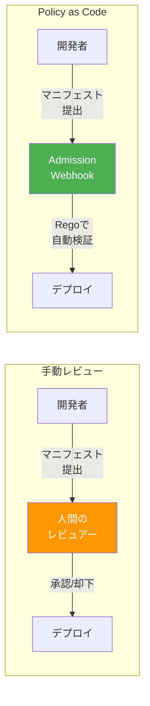
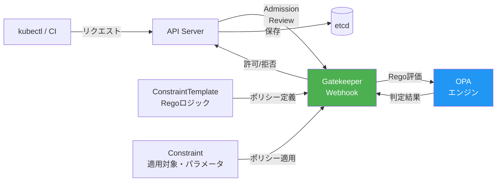
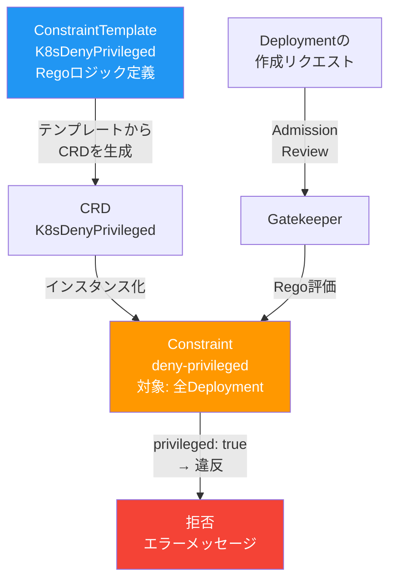
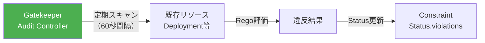

# 第10章 Policy as Code ― OPA / Gatekeeper

前章では、RBACやNetworkPolicyによるアクセス制御を手動で設定した。しかし、組織の規模が大きくなると、マニフェストのレビューを人手で行うのは限界がある。「privilegedコンテナを禁止する」「latestタグの使用を禁止する」といったポリシーをコードとして定義し、デプロイ時に自動で検証する仕組みが必要である。

本章では、OPA（Open Policy Agent）とGatekeeperを導入し、Admission Controlの段階でセキュリティポリシーを自動強制する。

## 10.1 Policy as Code とは何か

### 手動レビューの限界

セキュリティポリシーを手動レビューで運用する場合、以下の問題がある。

- **見落とし**: レビュアーの知識や注意力に依存し、一貫性がない
- **属人化**: 特定のメンバーしかレビューできず、ボトルネックになる
- **スケーラビリティ**: サービス数やデプロイ頻度の増加に追いつかない

Policy as Codeは、これらの課題をポリシーの宣言的な定義と自動検証で解決する。

図10.1: 手動レビュー vs Policy as Code



Policy as Codeの利点は以下の通りである。

- **宣言的**: ポリシーをコードとして定義し、バージョン管理できる
- **自動化**: すべてのデプロイに対して一貫した検証を行う
- **テスト可能**: ポリシーをユニットテストで検証できる

## 10.2 OPA と Gatekeeper のアーキテクチャ

### OPAとGatekeeperの関係

OPA（Open Policy Agent）は、CNCFを卒業した汎用ポリシーエンジンである。入力データ（JSON）に対してRego（レゴ）言語で記述されたポリシーを評価し、判定結果を返す。Gatekeeperは、OPAをKubernetesのAdmission Controllerとして統合するプロジェクトである。

図10.2にGatekeeperのアーキテクチャを示す。

図10.2: Gatekeeperのアーキテクチャ



### Gatekeeperのインストール

```bash
# コード10.1: Gatekeeperインストール
helm repo add gatekeeper https://open-policy-agent.github.io/gatekeeper/charts
helm repo update

helm install gatekeeper gatekeeper/gatekeeper \
  --namespace gatekeeper-system \
  --create-namespace \
  --set auditInterval=60
```

### ConstraintTemplateとConstraint

Gatekeeperのポリシーは2つのリソースで構成される。

- **ConstraintTemplate**: ポリシーのロジック（Regoコード）を定義するテンプレート
- **Constraint**: テンプレートを特定のリソースに適用するインスタンス

## 10.3 Rego言語の基礎

### 基本構文

> 表10.1: Regoの基本構文

| 要素 | 説明 | 例 |
|------|------|-----|
| パッケージ | ルールの名前空間 | `package k8scontainerlimits` |
| ルール | 条件が満たされたときに値を返す | `violation[{"msg": msg}] { ... }` |
| 入力参照 | Admission Reviewのデータにアクセス | `input.review.object.spec.containers` |
| イテレーション | コレクションの各要素を評価 | `container := input.review.object.spec.containers[_]` |
| 否定 | 条件の否定 | `not container.resources.limits` |

Gatekeeperでは `violation` ルールを定義する。ルール内の条件がすべて真になると違反と判定される。

### Regoの評価モデル

Regoの理解で最も重要なのは、その評価モデルが従来の命令型プログラミングとは根本的に異なる点である。Regoは宣言的言語であり、ルール本体に記述された条件はすべてAND結合として評価される。同名のルールが複数定義されている場合はOR結合として評価される。

```rego
# AND結合の例: 両方の条件が真の場合にviolation
violation[{"msg": msg}] {
  container := input.review.object.spec.containers[_]  # 条件1
  container.securityContext.privileged == true            # 条件2（AND）
  msg := sprintf("privileged: %v", [container.name])
}

# OR結合の例: いずれかのルールが真の場合にviolation
violation[{"msg": msg}] {
  # containers を検査（OR: ルール1）
  container := input.review.object.spec.containers[_]
  container.securityContext.privileged == true
  msg := sprintf("container: %v", [container.name])
}
violation[{"msg": msg}] {
  # initContainers を検査（OR: ルール2）
  container := input.review.object.spec.initContainers[_]
  container.securityContext.privileged == true
  msg := sprintf("initContainer: %v", [container.name])
}
```

この評価モデルにより、ポリシーの記述は直感的になるが、デバッグ時には「どの条件が真/偽になったか」を追跡する必要がある。`opa eval` コマンドの `--explain` オプションでトレース情報を出力できる。

## 10.4 実践 ― セキュリティポリシーの実装

### ポリシー1: privilegedコンテナの禁止

図10.3にConstraintTemplateからConstraintを作成して違反を検出するフローを示す。

図10.3: ConstraintTemplate → Constraint → 違反検出の流れ



```yaml
# コード10.2: privileged禁止のConstraintTemplate
apiVersion: templates.gatekeeper.sh/v1
kind: ConstraintTemplate
metadata:
  name: k8sdenyprivileged
spec:
  crd:
    spec:
      names:
        kind: K8sDenyPrivileged
  targets:
    - target: admission.k8s.gatekeeper.sh
      rego: |
        package k8sdenyprivileged

        violation[{"msg": msg}] {
          container := input.review.object.spec.containers[_]
          container.securityContext.privileged == true
          msg := sprintf("privilegedコンテナは禁止: %v", [container.name])
        }

        violation[{"msg": msg}] {
          container := input.review.object.spec.initContainers[_]
          container.securityContext.privileged == true
          msg := sprintf("privileged initコンテナは禁止: %v", [container.name])
        }
```

```yaml
# コード10.3: privileged禁止のConstraint
apiVersion: constraints.gatekeeper.sh/v1beta1
kind: K8sDenyPrivileged
metadata:
  name: deny-privileged
spec:
  enforcementAction: deny  # deny / dryrun / warn
  match:
    kinds:
      - apiGroups: ["apps"]
        kinds: ["Deployment", "DaemonSet", "StatefulSet"]
    namespaces: ["book-app"]
```

### ポリシー2: 信頼レジストリの制限

```yaml
# コード10.4: 信頼レジストリ制限のConstraintTemplate
apiVersion: templates.gatekeeper.sh/v1
kind: ConstraintTemplate
metadata:
  name: k8sallowedrepos
spec:
  crd:
    spec:
      names:
        kind: K8sAllowedRepos
      validation:
        openAPIV3Schema:
          type: object
          properties:
            repos:
              type: array
              items:
                type: string
  targets:
    - target: admission.k8s.gatekeeper.sh
      rego: |
        package k8sallowedrepos

        violation[{"msg": msg}] {
          container := input.review.object.spec.containers[_]
          not startswith_any(container.image, input.parameters.repos)
          msg := sprintf("許可されていないレジストリ: %v", [container.image])
        }

        startswith_any(str, prefixes) {
          prefix := prefixes[_]
          startswith(str, prefix)
        }
```

### ポリシー3: latestタグの禁止

```yaml
# コード10.5: latestタグ禁止のConstraintTemplate
apiVersion: templates.gatekeeper.sh/v1
kind: ConstraintTemplate
metadata:
  name: k8sdenylatesttag
spec:
  crd:
    spec:
      names:
        kind: K8sDenyLatestTag
  targets:
    - target: admission.k8s.gatekeeper.sh
      rego: |
        package k8sdenylatesttag

        violation[{"msg": msg}] {
          container := input.review.object.spec.containers[_]
          endswith(container.image, ":latest")
          msg := sprintf("latestタグは禁止: %v", [container.image])
        }

        violation[{"msg": msg}] {
          container := input.review.object.spec.containers[_]
          not contains(container.image, ":")
          msg := sprintf("タグが未指定（暗黙のlatest）: %v", [container.image])
        }
```

### ポリシー4: リソースリクエスト/リミットの必須化

```yaml
# コード10.5b: リソースリクエスト/リミット必須化のConstraintTemplate
apiVersion: templates.gatekeeper.sh/v1
kind: ConstraintTemplate
metadata:
  name: k8srequireresources
spec:
  crd:
    spec:
      names:
        kind: K8sRequireResources
  targets:
    - target: admission.k8s.gatekeeper.sh
      rego: |
        package k8srequireresources

        violation[{"msg": msg}] {
          container := input.review.object.spec.containers[_]
          not container.resources.limits
          msg := sprintf("resources.limitsが未設定: %v", [container.name])
        }

        violation[{"msg": msg}] {
          container := input.review.object.spec.containers[_]
          not container.resources.requests
          msg := sprintf("resources.requestsが未設定: %v", [container.name])
        }
```

### Regoのユニットテスト

```rego
# コード10.6: Regoユニットテスト
package k8sdenylatesttag

test_deny_latest_tag {
  input := {"review": {"object": {"spec": {"containers": [
    {"name": "app", "image": "myrepo/app:latest"}
  ]}}}}
  count(violation) > 0
}

test_allow_specific_tag {
  input := {"review": {"object": {"spec": {"containers": [
    {"name": "app", "image": "myrepo/app:v1.0.0"}
  ]}}}}
  count(violation) == 0
}

test_deny_no_tag {
  input := {"review": {"object": {"spec": {"containers": [
    {"name": "app", "image": "myrepo/app"}
  ]}}}}
  count(violation) > 0
}
```

```bash
# テストの実行
opa test . -v

# 出力例
# data.k8sdenylatesttag.test_deny_latest_tag: PASS (1.234ms)
# data.k8sdenylatesttag.test_allow_specific_tag: PASS (0.567ms)
# data.k8sdenylatesttag.test_deny_no_tag: PASS (0.789ms)
# -------------------------------------------------------
# PASS: 3/3
```

### CI/CDパイプラインへの統合

Regoのユニットテストはローカル環境だけでなく、CI/CDパイプラインにも組み込むべきである。ポリシーの変更がプルリクエストとして提出された際、自動テストで既存のポリシーが壊れていないことを検証できる。

```bash
# コード10.6b: CI/CDパイプラインでのポリシーテスト
# Regoの構文チェック
opa check policies/

# ユニットテストの実行
opa test policies/ -v --coverage

# 既存のマニフェストに対するポリシー評価（プレデプロイチェック）
# Gatekeeperのgator CLIを使用
gator test -f manifests/ -t policies/constraint-templates/
```

`gator` はGatekeeperのCLIツールであり、クラスタにGatekeeperがインストールされていない環境でもConstraintTemplateとConstraintを使用したポリシー評価をローカルで実行できる。これにより、CI/CDパイプラインでデプロイ前にポリシー違反を検出できる。

## 10.5 ポリシーの運用と監査

### 段階的な適用

Gatekeeperのポリシーは段階的に適用する。段階的な適用が重要である理由は、ポリシーの誤検出（false positive）がデプロイメントパイプラインを停止させるリスクがあるためである。

1. **dryrun**: ポリシー違反を検出するが、リソースの作成は許可する。Audit機能で既存リソースの違反状況を把握するのに最適
2. **warn**: 違反を警告として表示するが、リソースの作成は許可する。開発者にポリシーの存在を周知し、修正を促す
3. **deny**: 違反するリソースの作成を拒否する。十分な検証後に適用する

各段階の推奨期間は以下の通りである。

> 表10.1b: 段階的適用の推奨スケジュール

| 段階 | 推奨期間 | 目的 |
|------|---------|------|
| dryrun | 1〜2週間 | 既存リソースへの影響範囲を把握する |
| warn | 1〜2週間 | 開発チームへの周知と既存違反の修正を行う |
| deny | 恒久的 | ポリシーを強制し、新規の違反を防止する |

### Gatekeeperの除外設定

特定のNamespaceやリソースをポリシーの対象外にする必要がある場合がある。たとえば、kube-system NamespaceのシステムPodは特権が必要な場合がある。

```yaml
# コード10.7b: Gatekeeperの除外設定（Config）
apiVersion: config.gatekeeper.sh/v1alpha1
kind: Config
metadata:
  name: config
  namespace: gatekeeper-system
spec:
  match:
    - excludedNamespaces:
        - kube-system          # システムNamespaceを除外
        - gatekeeper-system    # Gatekeeper自身を除外
        - istio-system         # Istioコンポーネントを除外
      processes:
        - "*"
```

Constraintの `match` セクションでも個別に除外設定が可能である。

### Audit機能

Gatekeeperは定期的に既存リソースをスキャンし、ポリシー違反を検出する。

図10.4: Gatekeeperの監査フロー



```bash
# 違反ステータスの確認
kubectl get constraint deny-privileged -o yaml

# status:
#   violations:
#   - enforcementAction: deny
#     kind: Deployment
#     message: "privilegedコンテナは禁止: debug-container"
#     name: debug-deployment
#     namespace: book-app
```

### 監査結果のObservability統合

Gatekeeperの監査結果はメトリクスとして公開されており、Prometheusで収集できる。

```yaml
# コード10.7c: ServiceMonitor（Gatekeeperメトリクス用）
apiVersion: monitoring.coreos.com/v1
kind: ServiceMonitor
metadata:
  name: gatekeeper-metrics
  namespace: book-observability
spec:
  selector:
    matchLabels:
      gatekeeper.sh/system: "yes"
  namespaceSelector:
    matchNames:
      - gatekeeper-system
  endpoints:
    - port: metrics
      interval: 30s
```

Gatekeeperが公開する主要なメトリクスは以下の通りである。

> 表10.1c: Gatekeeperの主要メトリクス

| メトリクス名 | 説明 |
|------------|------|
| `gatekeeper_violations` | 監査で検出された違反の総数（ラベル: enforcement_action） |
| `gatekeeper_request_duration_seconds` | Admission Reviewの処理時間 |
| `gatekeeper_request_count` | 処理されたAdmission Reviewリクエスト数 |
| `gatekeeper_constraint_templates` | 登録されたConstraintTemplateの数 |

```yaml
# Grafanaダッシュボード用PromQLクエリ
# ポリシー違反数のトレンド
# PromQL: sum(gatekeeper_violations) by (enforcement_action)

# Admission Webhookのレイテンシ（P99）
# PromQL: histogram_quantile(0.99,
#   sum(rate(gatekeeper_request_duration_seconds_bucket[5m])) by (le))
```

Gatekeeperのレイテンシが高い場合（数百ms以上）、すべてのリソース作成・更新リクエストに遅延が加わるため、Constraintの数やRegoの複雑さを見直す必要がある。

### Kustomizeでのポリシー管理

```yaml
# コード10.7: Kustomizeでのポリシー管理
# overlays/policies/kustomization.yaml
apiVersion: kustomize.config.k8s.io/v1beta1
kind: Kustomization

resources:
  - constraint-templates/
  - constraints/

# constraint-templates/
#   deny-privileged.yaml
#   allowed-repos.yaml
#   deny-latest-tag.yaml
# constraints/
#   deny-privileged-constraint.yaml
#   allowed-repos-constraint.yaml
#   deny-latest-tag-constraint.yaml
```

## 10.6 まとめと次章への橋渡し

本章では、OPA/GatekeeperによるPolicy as Codeを導入し、以下のポリシーをデプロイ時に自動強制する仕組みを構築した。

- privilegedコンテナの禁止
- 信頼レジストリ以外のイメージ使用禁止
- latestタグの使用禁止
- リソースリクエスト/リミットの必須化

### Gatekeeperの運用上の注意点

> 表10.2b: Gatekeeper運用時の注意点

| カテゴリ | 注意点 | 推奨事項 |
|---------|--------|---------|
| 可用性 | GatekeeperのWebhookがダウンするとリソース作成が不可能になる | `failurePolicy: Ignore` を設定し、Webhook障害時にリソース作成を許可する（セキュリティとのトレードオフ） |
| パフォーマンス | Constraintの数が増えるとAdmission Reviewのレイテンシが増加 | 1つのConstraintTemplateで複数のチェックをまとめるか、影響を受けるリソースの種類を限定する |
| バージョン管理 | ConstraintTemplateの変更が既存のConstraintを壊す可能性がある | ConstraintTemplateのバージョニング戦略を定め、後方互換性を維持する |
| テスト | 本番環境でのポリシー変更は高リスク | CI/CDパイプラインでgator CLIによるプレデプロイテストを必ず実施する |

Gatekeeperの「信頼レジストリ制限」ポリシーは、「どのレジストリからのイメージか」を検査する。しかし、信頼レジストリのイメージであっても脆弱性を含む可能性がある。イメージそのものの安全性を保証するには、脆弱性スキャンとイメージ署名によるサプライチェーンセキュリティが必要である。

次章では、Trivyによる脆弱性スキャンとSigstore/cosignによるイメージ署名・検証を導入し、Gatekeeperと連携して署名済みイメージのみデプロイ可能にする。

## 理解度チェック

1. OPA単体とGatekeeperの違いを説明し、Kubernetes環境でGatekeeperを使う利点を2つ挙げよ

2. ConstraintTemplateとConstraintの役割の違いを説明し、1つのConstraintTemplateから複数のConstraintを作成するユースケースを示せ

3. 「コンテナイメージのタグが `latest` でないこと」を検証するRegoルールの概略を書け

4. Gatekeeperのdryrun → warn → denyの段階的適用が重要である理由を述べよ

## 参考文献

- Open Policy Agent公式ドキュメント, https://www.openpolicyagent.org/docs/latest/
- Gatekeeper公式ドキュメント, https://open-policy-agent.github.io/gatekeeper/website/docs/
- Rego言語リファレンス, https://www.openpolicyagent.org/docs/latest/policy-language/
- Gatekeeper Library, https://github.com/open-policy-agent/gatekeeper-library
