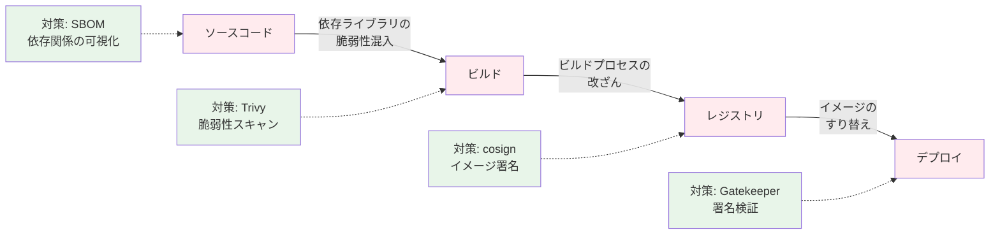
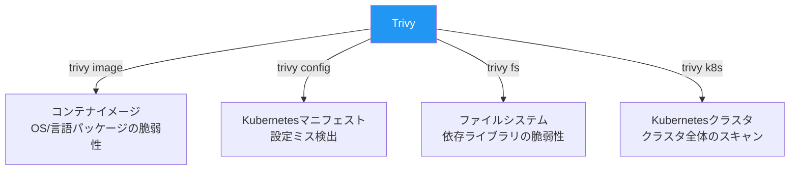
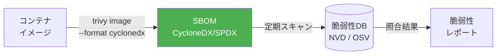
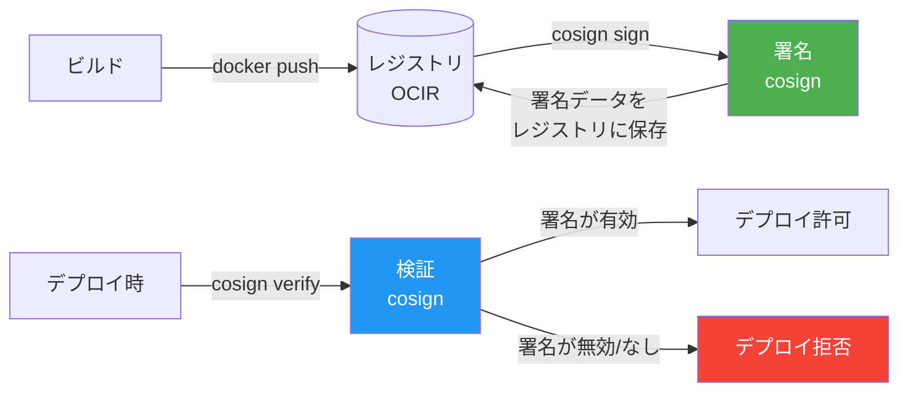
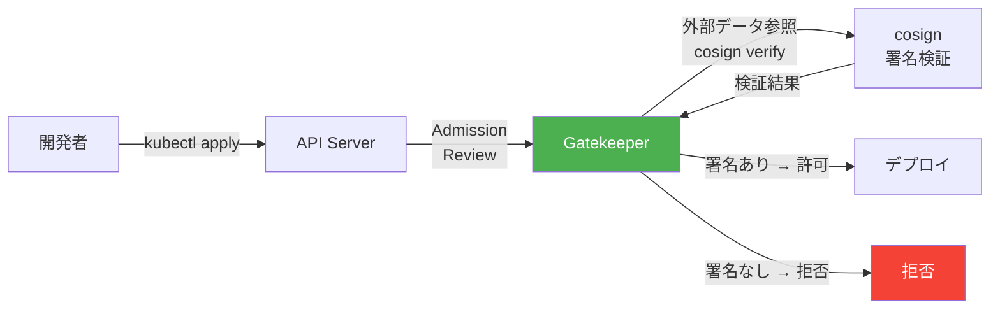

# 第11章 サプライチェーンセキュリティ ― Trivy + Sigstore

前章のGatekeeperで「信頼レジストリからのイメージのみ許可」するポリシーを実装した。しかし、信頼レジストリのイメージであっても、ベースイメージに既知の脆弱性が含まれていたり、ビルドパイプラインで改ざんされたりする可能性がある。本章では、コンテナイメージの脆弱性スキャン（Trivy）と署名・検証（Sigstore/cosign）を導入し、サプライチェーン全体のセキュリティを確保する。

## 11.1 サプライチェーンセキュリティの全体像

### 攻撃ベクトル

コンテナサプライチェーンには「ソースコード → ビルド → レジストリ → デプロイ」の各段階にリスクが存在する。

図11.1: コンテナサプライチェーンの攻撃面



SLSA（Supply-chain Levels for Software Artifacts）は、Googleが提唱したサプライチェーンセキュリティのフレームワークであり、ビルドの完全性を4段階のレベルで定義している[^1]。本章では、SLSAの考え方に基づいてサンプルアプリケーションのサプライチェーンを保護する。

### SLSAレベルの概要

SLSAフレームワークは、ソフトウェアサプライチェーンの成熟度を段階的に高めるための指針を提供する。

| SLSAレベル | 要件 | 本書での対応 |
|-----------|------|------------|
| Level 0 | なし（未対応） | - |
| Level 1 | ビルドプロセスの文書化、SBOM生成 | 11.3節（SBOM生成） |
| Level 2 | ホスティングされたビルドサービスの使用、署名付きProvenance | 第15章（GitHub Actions + cosign） |
| Level 3 | ビルドプラットフォームの強化、来歴の改ざん防止 | 第15章（Keyless署名 + Rekor） |

Level 1を達成するにはビルドの来歴（Provenance）を記録することが求められ、Level 2以上ではビルドサービス自体の信頼性と署名による来歴の検証可能性が必要となる。本書では、本章でLevel 1の基盤（SBOM + 署名）を構築し、第15章のCIパイプラインでLevel 2〜3の要件を満たす構成を実現する。

### 実際のサプライチェーン攻撃事例

サプライチェーン攻撃は理論上のリスクではなく、実際に大規模なインシデントが発生している。

- **SolarWinds事件（2020年）**: ビルドパイプラインが侵害され、正規のソフトウェアアップデートにバックドアが埋め込まれた。署名付きの正規パッケージとして配布されたため、検出が困難だった
- **Codecov事件（2021年）**: CI/CDツールのBash Uploaderスクリプトが改ざんされ、環境変数（シークレット含む）が外部に送信された
- **Log4Shell（2021年）**: 広く使われるJavaライブラリの脆弱性（CVE-2021-44228）が公開され、SBOMを持たない組織は影響範囲の特定に数週間を要した

これらの事例は、ビルドプロセスの保護（cosign署名）、依存関係の可視化（SBOM）、継続的な脆弱性スキャン（Trivy）がいかに重要であるかを示している。

## 11.2 Trivy ― イメージ脆弱性スキャン

### Trivyの概要

Trivy（トリビー）は、Aqua Securityが開発するオープンソースの脆弱性スキャナーである。コンテナイメージ、ファイルシステム、Kubernetesマニフェスト、IaC（Infrastructure as Code）等、多様なスキャン対象に対応する。

図11.2: Trivyのスキャン対象



### イメージスキャンの実践

```bash
# コード11.1: Trivyイメージスキャン
# サンプルアプリのイメージをスキャン
trivy image --severity HIGH,CRITICAL \
  your-registry.ocir.io/namespace/order-service:v1.0.0

# 出力例
# order-service:v1.0.0 (alpine 3.19.1)
# =======================================
# Total: 3 (HIGH: 2, CRITICAL: 1)
#
# ┌──────────────┬───────────────┬──────────┬─────────┬───────────────┐
# │   Library    │ Vulnerability │ Severity │ Version │ Fixed Version │
# ├──────────────┼───────────────┼──────────┼─────────┼───────────────┤
# │ libcrypto3   │ CVE-2024-xxxx │ CRITICAL │ 3.1.4   │ 3.1.5         │
# │ libssl3      │ CVE-2024-yyyy │ HIGH     │ 3.1.4   │ 3.1.5         │
# │ curl         │ CVE-2024-zzzz │ HIGH     │ 8.5.0   │ 8.6.0         │
# └──────────────┴───────────────┴──────────┴─────────┴───────────────┘
```

### マニフェストスキャン

```bash
# コード11.2: Trivyマニフェストスキャン
trivy config ./manuscript/ch01/manifests/

# 出力例
# deployment.yaml (kubernetes)
# ==============================
# Tests: 15 (SUCCESSES: 12, FAILURES: 3)
# Failures: 3 (MEDIUM: 2, LOW: 1)
#
# MEDIUM: Container 'order-service' should set 'securityContext.runAsNonRoot' to true
# MEDIUM: Container 'order-service' should set resources
# LOW: Container 'order-service' should set 'securityContext.readOnlyRootFilesystem'
```

脆弱性の対応方針は重大度に応じて決定する。

| 重大度 | 対応方針 | 期限の目安 |
|-------|---------|----------|
| CRITICAL | 即座に修正。修正版がない場合は代替イメージを検討 | 24時間以内 |
| HIGH | 計画的に修正 | 1週間以内 |
| MEDIUM | 次回リリース時に修正 | 次回スプリント |
| LOW | リスク評価の上、対応を判断 | バックログ管理 |

### 脆弱性の詳細調査とトリアージ

検出された脆弱性すべてが即座に対応を要するわけではない。トリアージ（優先度判定）では、以下の観点で影響を評価する。

```bash
# コード11.2b: 特定の脆弱性の詳細情報を表示
trivy image --severity CRITICAL \
  --format json \
  your-registry.ocir.io/namespace/order-service:v1.0.0 | \
  jq '.Results[].Vulnerabilities[] | {VulnerabilityID, PkgName, InstalledVersion, FixedVersion, Title}'

# 修正バージョンがない脆弱性のみ表示
trivy image --ignore-unfixed=false \
  your-registry.ocir.io/namespace/order-service:v1.0.0
```

トリアージで考慮すべき要素は以下の通りである。

- **到達可能性（Reachability）**: 脆弱性のあるコードパスが実際にアプリケーションから呼び出されるか。到達不可能な脆弱性は優先度を下げてよい
- **悪用可能性（Exploitability）**: 攻撃者がネットワーク経由で悪用可能か。ローカルアクセスが必要な脆弱性はリスクが低い
- **修正版の有無**: 修正版が提供されていない場合、ワークアラウンド（回避策）の適用を検討する
- **環境の文脈**: コンテナがネットワークから隔離されている場合、ネットワーク経由の脆弱性のリスクは軽減される

### 継続的スキャンの自動化

CIパイプラインでのスキャンに加え、デプロイ済みイメージの定期スキャンも重要である。新たな脆弱性は日々公開されるため、ビルド時に安全だったイメージも時間の経過とともにリスクを抱える可能性がある。

```bash
# コード11.2c: .trivyignoreによる既知の許容済み脆弱性の除外
# .trivyignoreファイルに記載された脆弱性はスキャン結果から除外される
cat <<'EOF' > .trivyignore
# 到達不可能と判断済み（2026-03-01 レビュー）
CVE-2024-xxxx
# ワークアラウンド適用済み（Issue #123で追跡中）
CVE-2024-yyyy
EOF

trivy image --ignorefile .trivyignore \
  your-registry.ocir.io/namespace/order-service:v1.0.0
```

`.trivyignore`ファイルには、リスク評価の結果「許容可能」と判断した脆弱性を記録する。この判断はセキュリティチームによるレビューを経て行い、定期的に再評価する必要がある。

## 11.3 SBOM ― ソフトウェア部品表の生成と活用

### SBOMとは

SBOM（Software Bill of Materials）は、ソフトウェアに含まれるすべてのコンポーネント（OSパッケージ、言語ライブラリ等）の一覧である。食品の原材料表示と同様に、ソフトウェアの「材料」を明示する。

図11.3: SBOMの位置づけ



### SBOM生成

```bash
# コード11.3: SBOM生成
# CycloneDX形式でSBOMを生成
trivy image --format cyclonedx \
  --output sbom-order-service.json \
  your-registry.ocir.io/namespace/order-service:v1.0.0

# 生成されたSBOMで脆弱性スキャン
trivy sbom sbom-order-service.json
```

SBOMを生成・保管しておくことで、新たな脆弱性が公開された際に、影響を受けるイメージを即座に特定できる。

### SBOMフォーマットの比較

SBOMの主要なフォーマットとして、CycloneDXとSPDXの2つがある。

| 項目 | CycloneDX | SPDX |
|------|----------|------|
| 策定団体 | OWASP | Linux Foundation |
| 設計思想 | セキュリティ・脆弱性管理に特化 | ライセンスコンプライアンスが起源 |
| 対応形式 | JSON, XML | JSON, RDF, Tag-Value |
| 脆弱性情報の記述 | ネイティブサポート | 外部参照として記述 |
| 推奨用途 | セキュリティスキャン、脆弱性管理 | ライセンス監査、法令遵守 |

本書ではセキュリティ目的のため、CycloneDX形式を採用する。

```bash
# コード11.3b: SPDX形式でのSBOM生成（比較用）
trivy image --format spdx-json \
  --output sbom-order-service-spdx.json \
  your-registry.ocir.io/namespace/order-service:v1.0.0
```

### SBOMの運用と活用方法

SBOMは一度生成して終わりではなく、継続的に活用することで真価を発揮する。

1. **新規脆弱性の影響調査**: 新たなCVEが公開された際に、保管済みSBOMを検索し、影響を受けるイメージとサービスを即座に特定する
2. **ライセンスコンプライアンス**: 含まれるOSSのライセンスを確認し、ライセンス違反がないことを確認する
3. **依存関係の可視化**: 推移的依存関係（依存ライブラリがさらに依存するライブラリ）を含めた全体像を把握する
4. **規制対応**: 米国大統領令（EO 14028）等、SBOMの提出を求める規制への対応を容易にする

```bash
# コード11.3c: 保管済みSBOMに対する新規脆弱性の照合
# 新たなCVEが公開された際に、影響を受けるイメージを特定
trivy sbom sbom-order-service.json --severity CRITICAL

# 特定のパッケージが含まれるかSBOMを検索
cat sbom-order-service.json | \
  jq '.components[] | select(.name == "openssl") | {name, version}'
```

## 11.4 Sigstore / cosign ― イメージ署名と検証

### Sigstoreの概要

Sigstore（シグストア）は、ソフトウェアの署名・検証・透過性のためのオープンソースプロジェクトである。以下の3つのコンポーネントで構成される。

- **cosign**: コンテナイメージの署名・検証ツール
- **Fulcio**: 短命な署名証明書を発行する認証局（CA）
- **Rekor**: 署名の透過性ログ（公開台帳）

### 署名・検証フロー

図11.4: cosignによる署名・検証フロー



### 署名の実践

```bash
# コード11.4: cosign鍵ペア生成と署名
# 鍵ペアの生成
cosign generate-key-pair

# イメージへの署名
cosign sign --key cosign.key \
  your-registry.ocir.io/namespace/order-service:v1.0.0

# 署名がレジストリに保存されたことを確認
cosign tree your-registry.ocir.io/namespace/order-service:v1.0.0
```

### 検証の実践

```bash
# コード11.5: cosign署名検証
# 署名の検証
cosign verify --key cosign.pub \
  your-registry.ocir.io/namespace/order-service:v1.0.0

# 出力例
# Verification for your-registry.ocir.io/namespace/order-service:v1.0.0 --
# The following checks were performed on these signatures:
#   - The cosign claims were validated
#   - The signatures were verified against the specified public key
```

### Keyless署名（OIDC連携）

キーペア方式では秘密鍵の管理が運用負担となる。Keyless署名はOIDCプロバイダー（GitHub Actions等）のIDトークンをFulcioに提示し、一時的な署名証明書を取得する方式である。秘密鍵を生成・保管する必要がなく、CI/CD環境に適している。

```bash
# コード11.5b: Keyless署名（GitHub Actions環境）
# OIDCトークンが自動的にFulcioに提示される
cosign sign --yes \
  your-registry.ocir.io/namespace/order-service:v1.0.0

# Keyless検証（署名者のidentityで検証）
cosign verify \
  --certificate-identity "https://github.com/your-org/your-repo/.github/workflows/ci.yaml@refs/heads/main" \
  --certificate-oidc-issuer "https://token.actions.githubusercontent.com" \
  your-registry.ocir.io/namespace/order-service:v1.0.0
```

Keyless署名では、署名証明書は数分で失効するが、署名時刻がRekor（透過性ログ）に記録されるため、事後の検証は常に可能である。第15章のGitHub ActionsによるCIパイプラインでは、このKeyless署名を採用する。

### 署名ワークフローの選択指針

署名方式の選択は運用環境に応じて判断する。

| 観点 | キーペア方式 | Keyless方式（OIDC） |
|------|-----------|-------------------|
| 秘密鍵管理 | 必要（HSM/KMS推奨） | 不要 |
| CI/CD統合 | 手動で鍵を配置 | OIDCプロバイダーが自動対応 |
| 監査証跡 | ローカル管理 | Rekorに自動記録 |
| 対応環境 | 任意の環境 | OIDC対応のCI/CDのみ |
| 鍵のローテーション | 手動で実施 | 不要（一時証明書） |
| 推奨場面 | エアギャップ環境、オフライン環境 | GitHub Actions、GitLab CI等 |

キーペア方式を採用する場合、秘密鍵はOCI Vault（Key Management Service）等のHSM（Hardware Security Module）バックエンドの鍵管理サービスに保管することを強く推奨する。ファイルシステム上に秘密鍵を直接配置することは、鍵の漏洩リスクを高めるため避けるべきである。

### cosignによるSBOMのアタッチ

cosignにはイメージにSBOMをアタッチ（添付）する機能がある。これにより、イメージとSBOMの対応関係がレジストリ上で保証される。

```bash
# コード11.5c: イメージにSBOMをアタッチ
# SBOMを生成
trivy image --format cyclonedx \
  --output sbom.json \
  your-registry.ocir.io/namespace/order-service:v1.0.0

# SBOMをイメージにアタッチ
cosign attach sbom --sbom sbom.json \
  your-registry.ocir.io/namespace/order-service:v1.0.0

# アタッチされたSBOMの確認
cosign tree your-registry.ocir.io/namespace/order-service:v1.0.0
# 出力例:
# 📦 Supply Chain Security Related artifacts for an image:
# └── 📦 SBOMs for an image tag: ...
# └── 🔐 Signatures for an image tag: ...
```

この方法により、イメージの署名とSBOMがレジストリ上で一元管理され、消費者は`cosign verify`と`cosign download sbom`で検証と取得を行える。

## 11.5 Gatekeeper連携 ― 署名なしイメージのデプロイ拒否

### 署名検証ポリシー

第10章のGatekeeperと連携し、署名済みイメージのみデプロイ可能にするポリシーを実装する。

図11.5: 署名検証付きデプロイフロー



```yaml
# コード11.6: 署名検証ConstraintTemplate
apiVersion: templates.gatekeeper.sh/v1
kind: ConstraintTemplate
metadata:
  name: k8srequireimagecosigned
spec:
  crd:
    spec:
      names:
        kind: K8sRequireImageCosigned
      validation:
        openAPIV3Schema:
          type: object
          properties:
            publicKey:
              type: string
  targets:
    - target: admission.k8s.gatekeeper.sh
      rego: |
        package k8srequireimagecosigned

        violation[{"msg": msg}] {
          container := input.review.object.spec.containers[_]
          image := container.image
          # 署名検証の結果を外部データから取得
          not image_is_signed(image)
          msg := sprintf("署名されていないイメージ: %v", [image])
        }

        image_is_signed(image) {
          # Gatekeeperの外部データプロバイダー経由で
          # cosign verify の結果を参照
          data.inventory.cosign[image].signed == true
        }
```

```yaml
# コード11.7: 署名検証Constraint
apiVersion: constraints.gatekeeper.sh/v1beta1
kind: K8sRequireImageCosigned
metadata:
  name: require-cosigned-images
spec:
  enforcementAction: deny
  match:
    kinds:
      - apiGroups: ["apps"]
        kinds: ["Deployment"]
    namespaces: ["book-app"]
  parameters:
    publicKey: |
      -----BEGIN PUBLIC KEY-----
      MFkwEwYHKoZIzj0CAQYIKoZIzj0DAQcDQgAE...
      -----END PUBLIC KEY-----
```

### 動作確認

```bash
# 署名なしイメージのデプロイ（拒否される）
kubectl apply -f unsigned-deployment.yaml
# Error: admission webhook "validation.gatekeeper.sh" denied the request:
# 署名されていないイメージ: myrepo/app:unsigned

# 署名済みイメージのデプロイ（成功する）
kubectl apply -f signed-deployment.yaml
# deployment.apps/order-service created
```

### トラブルシューティング

署名検証付きデプロイで問題が発生した場合のデバッグ手順を示す。

```bash
# コード11.7b: 署名検証のトラブルシューティング
# 1. イメージの署名状態を確認
cosign tree your-registry.ocir.io/namespace/order-service:v1.0.0

# 2. 署名の詳細を表示（署名者、タイムスタンプ等）
cosign verify --key cosign.pub \
  your-registry.ocir.io/namespace/order-service:v1.0.0 | jq .

# 3. Gatekeeperの監査ログを確認
kubectl logs -n gatekeeper-system deploy/gatekeeper-audit --tail=50

# 4. Constraintの適用状態を確認
kubectl get k8srequireimagecosigned -o yaml

# 5. 特定のイメージダイジェストで署名を検証
cosign verify --key cosign.pub \
  your-registry.ocir.io/namespace/order-service@sha256:abc123...
```

よくある問題とその対処法を以下に示す。

| 症状 | 原因 | 対処法 |
|------|------|--------|
| 署名済みイメージなのにデプロイが拒否される | タグとダイジェストの不一致 | `@sha256:...`形式でイメージを指定する |
| cosign verifyが証明書エラーを返す | Keyless署名で証明書が失効 | Rekorのタイムスタンプ検証を有効にする |
| Gatekeeperが外部データを取得できない | 外部データプロバイダーの接続エラー | プロバイダーPodのログとネットワーク設定を確認する |
| すべてのデプロイが拒否される | Constraintのmatch条件が広すぎる | namespaces指定で対象を限定する |

## 11.6 まとめと次章への橋渡し

本章では、コンテナサプライチェーンのセキュリティを以下の観点で強化した。

- **Trivy**: イメージの脆弱性スキャンとマニフェストの設定ミス検出
- **SBOM**: ソフトウェア部品表の生成による依存関係の可視化
- **cosign**: イメージへの署名と検証によるイメージの完全性保証
- **Gatekeeper連携**: 署名なしイメージのデプロイ拒否

Part 3の第9章〜第11章で、クラスタセキュリティ（RBAC + NetworkPolicy）、Policy as Code（OPA/Gatekeeper）、サプライチェーンセキュリティ（Trivy + cosign）の3つの個別セキュリティ機能を構築した。しかし、これらは独立して動作しており、統合的な監視・監査ができない。

次章では、Falcoによるランタイムセキュリティ検知を追加し、すべてのセキュリティイベントをObservability基盤と統合したセキュリティ監査ダッシュボードを構築する。

## 理解度チェック

1. コンテナサプライチェーンにおける攻撃ベクトルを3つ挙げ、それぞれに対する対策を述べよ

2. `trivy image` と `trivy config` の違いを説明し、それぞれどのようなリスクを検出するか述べよ

3. SBOMを生成・管理する利点を、脆弱性管理の観点から2つ挙げよ

4. cosignのキーペア方式とKeyless方式の違いを説明し、CI/CD環境ではどちらが適しているか理由とともに述べよ

## 参考文献

- Trivy公式ドキュメント, https://aquasecurity.github.io/trivy/
- Sigstore公式サイト, https://www.sigstore.dev/
- cosign公式ドキュメント, https://docs.sigstore.dev/signing/signing_with_containers/
- SLSA Framework, https://slsa.dev/
- CycloneDX, https://cyclonedx.org/

[^1]: SLSA "Supply-chain Levels for Software Artifacts", https://slsa.dev/spec/v1.0/
