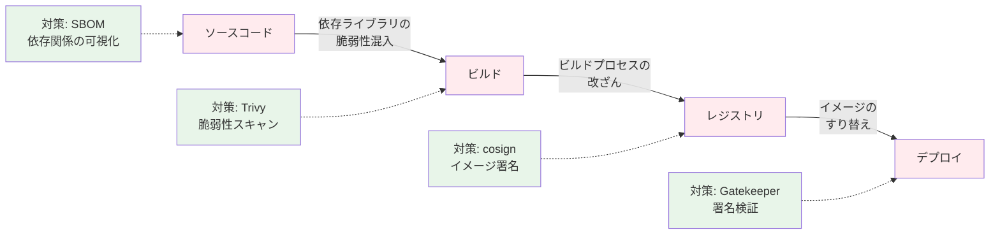
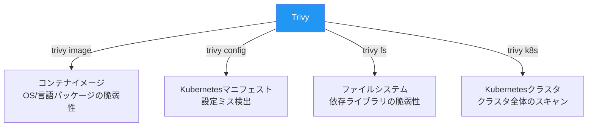
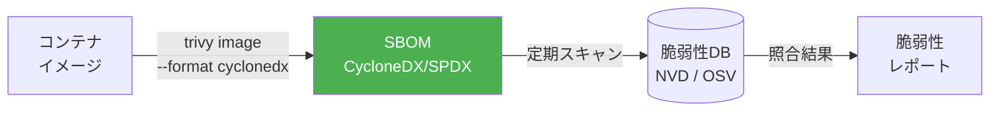
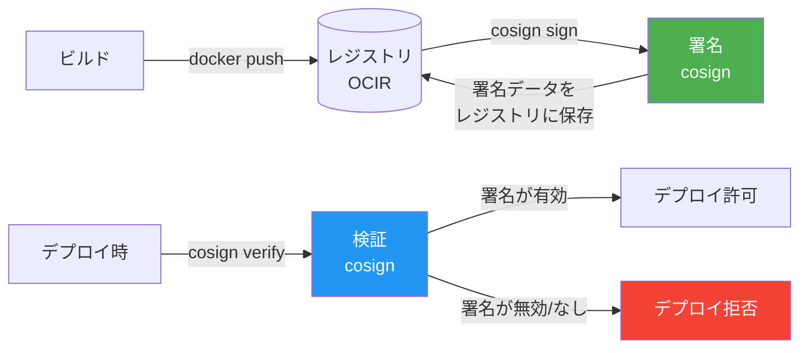
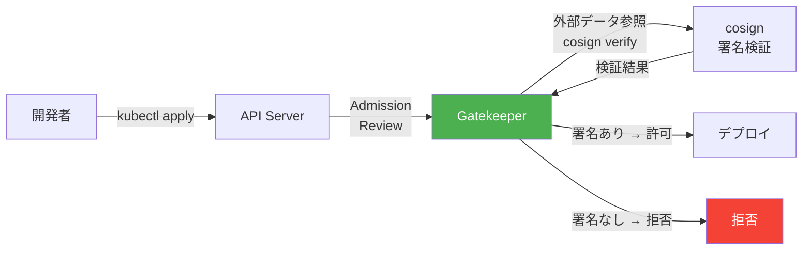

# 第11章 サプライチェーンセキュリティ ― Trivy + Sigstore

前章のGatekeeperで「信頼レジストリからのイメージのみ許可」するポリシーを実装した。しかし、信頼レジストリのイメージであっても、ベースイメージに既知の脆弱性が含まれていたり、ビルドパイプラインで改ざんされたりする可能性がある。本章では、コンテナイメージの脆弱性スキャン（Trivy）と署名・検証（Sigstore/cosign）を導入し、サプライチェーン全体のセキュリティを確保する。

## 11.1 サプライチェーンセキュリティの全体像

### 攻撃ベクトル

コンテナサプライチェーンには「ソースコード → ビルド → レジストリ → デプロイ」の各段階にリスクが存在する。

図11.1: コンテナサプライチェーンの攻撃面



SLSA（Supply-chain Levels for Software Artifacts）は、Googleが提唱したサプライチェーンセキュリティのフレームワークであり、ビルドの完全性を4段階のレベルで定義している[^1]。本章では、SLSAの考え方に基づいてサンプルアプリケーションのサプライチェーンを保護する。

## 11.2 Trivy ― イメージ脆弱性スキャン

### Trivyの概要

Trivy（トリビー）は、Aqua Securityが開発するオープンソースの脆弱性スキャナーである。コンテナイメージ、ファイルシステム、Kubernetesマニフェスト、IaC（Infrastructure as Code）等、多様なスキャン対象に対応する。

図11.2: Trivyのスキャン対象



### イメージスキャンの実践

```bash
# コード11.1: Trivyイメージスキャン
# サンプルアプリのイメージをスキャン
trivy image --severity HIGH,CRITICAL \
  your-registry.ocir.io/namespace/order-service:v1.0.0

# 出力例
# order-service:v1.0.0 (alpine 3.19.1)
# =======================================
# Total: 3 (HIGH: 2, CRITICAL: 1)
#
# ┌──────────────┬───────────────┬──────────┬─────────┬───────────────┐
# │   Library    │ Vulnerability │ Severity │ Version │ Fixed Version │
# ├──────────────┼───────────────┼──────────┼─────────┼───────────────┤
# │ libcrypto3   │ CVE-2024-xxxx │ CRITICAL │ 3.1.4   │ 3.1.5         │
# │ libssl3      │ CVE-2024-yyyy │ HIGH     │ 3.1.4   │ 3.1.5         │
# │ curl         │ CVE-2024-zzzz │ HIGH     │ 8.5.0   │ 8.6.0         │
# └──────────────┴───────────────┴──────────┴─────────┴───────────────┘
```

### マニフェストスキャン

```bash
# コード11.2: Trivyマニフェストスキャン
trivy config ./manuscript/ch01/manifests/

# 出力例
# deployment.yaml (kubernetes)
# ==============================
# Tests: 15 (SUCCESSES: 12, FAILURES: 3)
# Failures: 3 (MEDIUM: 2, LOW: 1)
#
# MEDIUM: Container 'order-service' should set 'securityContext.runAsNonRoot' to true
# MEDIUM: Container 'order-service' should set resources
# LOW: Container 'order-service' should set 'securityContext.readOnlyRootFilesystem'
```

脆弱性の対応方針は重大度に応じて決定する。

| 重大度 | 対応方針 | 期限の目安 |
|-------|---------|----------|
| CRITICAL | 即座に修正。修正版がない場合は代替イメージを検討 | 24時間以内 |
| HIGH | 計画的に修正 | 1週間以内 |
| MEDIUM | 次回リリース時に修正 | 次回スプリント |
| LOW | リスク評価の上、対応を判断 | バックログ管理 |

## 11.3 SBOM ― ソフトウェア部品表の生成と活用

### SBOMとは

SBOM（Software Bill of Materials）は、ソフトウェアに含まれるすべてのコンポーネント（OSパッケージ、言語ライブラリ等）の一覧である。食品の原材料表示と同様に、ソフトウェアの「材料」を明示する。

図11.3: SBOMの位置づけ



### SBOM生成

```bash
# コード11.3: SBOM生成
# CycloneDX形式でSBOMを生成
trivy image --format cyclonedx \
  --output sbom-order-service.json \
  your-registry.ocir.io/namespace/order-service:v1.0.0

# 生成されたSBOMで脆弱性スキャン
trivy sbom sbom-order-service.json
```

SBOMを生成・保管しておくことで、新たな脆弱性が公開された際に、影響を受けるイメージを即座に特定できる。

## 11.4 Sigstore / cosign ― イメージ署名と検証

### Sigstoreの概要

Sigstore（シグストア）は、ソフトウェアの署名・検証・透過性のためのオープンソースプロジェクトである。以下の3つのコンポーネントで構成される。

- **cosign**: コンテナイメージの署名・検証ツール
- **Fulcio**: 短命な署名証明書を発行する認証局（CA）
- **Rekor**: 署名の透過性ログ（公開台帳）

### 署名・検証フロー

図11.4: cosignによる署名・検証フロー



### 署名の実践

```bash
# コード11.4: cosign鍵ペア生成と署名
# 鍵ペアの生成
cosign generate-key-pair

# イメージへの署名
cosign sign --key cosign.key \
  your-registry.ocir.io/namespace/order-service:v1.0.0

# 署名がレジストリに保存されたことを確認
cosign tree your-registry.ocir.io/namespace/order-service:v1.0.0
```

### 検証の実践

```bash
# コード11.5: cosign署名検証
# 署名の検証
cosign verify --key cosign.pub \
  your-registry.ocir.io/namespace/order-service:v1.0.0

# 出力例
# Verification for your-registry.ocir.io/namespace/order-service:v1.0.0 --
# The following checks were performed on these signatures:
#   - The cosign claims were validated
#   - The signatures were verified against the specified public key
```

### Keyless署名（OIDC連携）

キーペア方式では秘密鍵の管理が運用負担となる。Keyless署名はOIDCプロバイダー（GitHub Actions等）のIDトークンをFulcioに提示し、一時的な署名証明書を取得する方式である。秘密鍵を生成・保管する必要がなく、CI/CD環境に適している。

```bash
# コード11.5b: Keyless署名（GitHub Actions環境）
# OIDCトークンが自動的にFulcioに提示される
cosign sign --yes \
  your-registry.ocir.io/namespace/order-service:v1.0.0

# Keyless検証（署名者のidentityで検証）
cosign verify \
  --certificate-identity "https://github.com/your-org/your-repo/.github/workflows/ci.yaml@refs/heads/main" \
  --certificate-oidc-issuer "https://token.actions.githubusercontent.com" \
  your-registry.ocir.io/namespace/order-service:v1.0.0
```

Keyless署名では、署名証明書は数分で失効するが、署名時刻がRekor（透過性ログ）に記録されるため、事後の検証は常に可能である。第15章のGitHub ActionsによるCIパイプラインでは、このKeyless署名を採用する。

## 11.5 Gatekeeper連携 ― 署名なしイメージのデプロイ拒否

### 署名検証ポリシー

第10章のGatekeeperと連携し、署名済みイメージのみデプロイ可能にするポリシーを実装する。

図11.5: 署名検証付きデプロイフロー



```yaml
# コード11.6: 署名検証ConstraintTemplate
apiVersion: templates.gatekeeper.sh/v1
kind: ConstraintTemplate
metadata:
  name: k8srequireimagecosigned
spec:
  crd:
    spec:
      names:
        kind: K8sRequireImageCosigned
      validation:
        openAPIV3Schema:
          type: object
          properties:
            publicKey:
              type: string
  targets:
    - target: admission.k8s.gatekeeper.sh
      rego: |
        package k8srequireimagecosigned

        violation[{"msg": msg}] {
          container := input.review.object.spec.containers[_]
          image := container.image
          # 署名検証の結果を外部データから取得
          not image_is_signed(image)
          msg := sprintf("署名されていないイメージ: %v", [image])
        }

        image_is_signed(image) {
          # Gatekeeperの外部データプロバイダー経由で
          # cosign verify の結果を参照
          data.inventory.cosign[image].signed == true
        }
```

```yaml
# コード11.7: 署名検証Constraint
apiVersion: constraints.gatekeeper.sh/v1beta1
kind: K8sRequireImageCosigned
metadata:
  name: require-cosigned-images
spec:
  enforcementAction: deny
  match:
    kinds:
      - apiGroups: ["apps"]
        kinds: ["Deployment"]
    namespaces: ["book-app"]
  parameters:
    publicKey: |
      -----BEGIN PUBLIC KEY-----
      MFkwEwYHKoZIzj0CAQYIKoZIzj0DAQcDQgAE...
      -----END PUBLIC KEY-----
```

### 動作確認

```bash
# 署名なしイメージのデプロイ（拒否される）
kubectl apply -f unsigned-deployment.yaml
# Error: admission webhook "validation.gatekeeper.sh" denied the request:
# 署名されていないイメージ: myrepo/app:unsigned

# 署名済みイメージのデプロイ（成功する）
kubectl apply -f signed-deployment.yaml
# deployment.apps/order-service created
```

## 11.6 まとめと次章への橋渡し

本章では、コンテナサプライチェーンのセキュリティを以下の観点で強化した。

- **Trivy**: イメージの脆弱性スキャンとマニフェストの設定ミス検出
- **SBOM**: ソフトウェア部品表の生成による依存関係の可視化
- **cosign**: イメージへの署名と検証によるイメージの完全性保証
- **Gatekeeper連携**: 署名なしイメージのデプロイ拒否

Part 3の第9章〜第11章で、クラスタセキュリティ（RBAC + NetworkPolicy）、Policy as Code（OPA/Gatekeeper）、サプライチェーンセキュリティ（Trivy + cosign）の3つの個別セキュリティ機能を構築した。しかし、これらは独立して動作しており、統合的な監視・監査ができない。

次章では、Falcoによるランタイムセキュリティ検知を追加し、すべてのセキュリティイベントをObservability基盤と統合したセキュリティ監査ダッシュボードを構築する。

## 理解度チェック

1. コンテナサプライチェーンにおける攻撃ベクトルを3つ挙げ、それぞれに対する対策を述べよ

2. `trivy image` と `trivy config` の違いを説明し、それぞれどのようなリスクを検出するか述べよ

3. SBOMを生成・管理する利点を、脆弱性管理の観点から2つ挙げよ

4. cosignのキーペア方式とKeyless方式の違いを説明し、CI/CD環境ではどちらが適しているか理由とともに述べよ

## 参考文献

- Trivy公式ドキュメント, https://aquasecurity.github.io/trivy/
- Sigstore公式サイト, https://www.sigstore.dev/
- cosign公式ドキュメント, https://docs.sigstore.dev/signing/signing_with_containers/
- SLSA Framework, https://slsa.dev/
- CycloneDX, https://cyclonedx.org/

[^1]: SLSA "Supply-chain Levels for Software Artifacts", https://slsa.dev/spec/v1.0/
