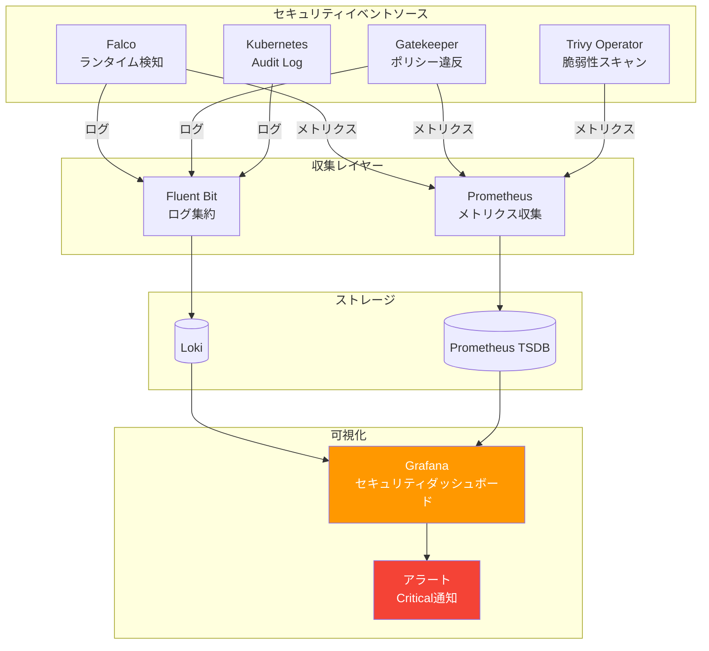
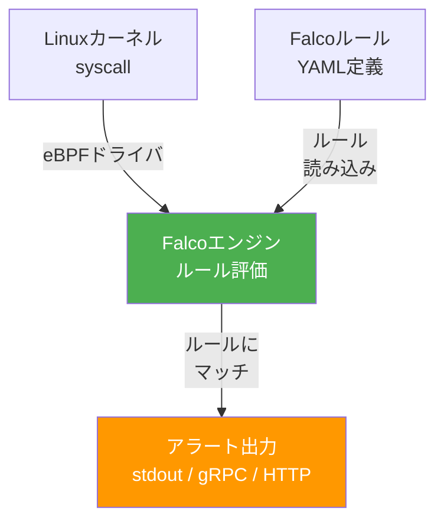
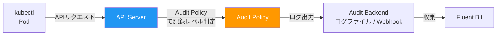
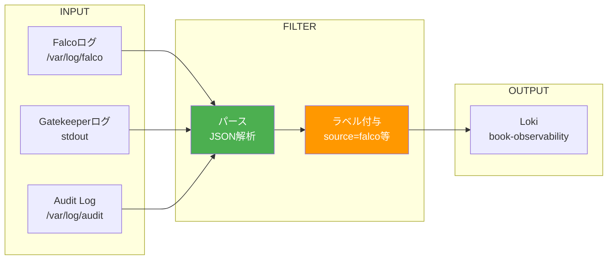
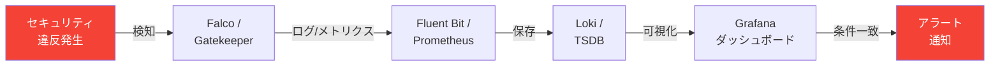
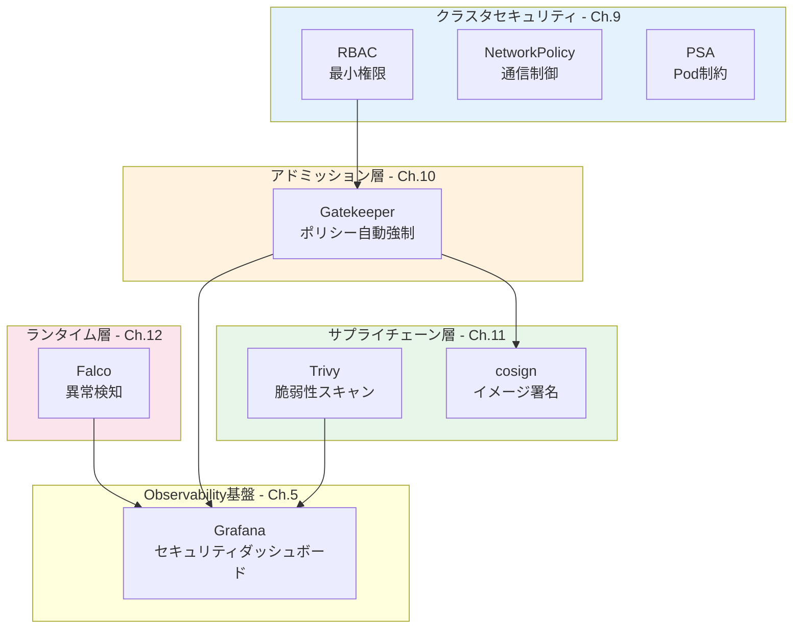

# 第12章 統合 ― セキュリティ監査基盤を構築する

Part 3の第9章〜第11章で、クラスタセキュリティ、Policy as Code、サプライチェーンセキュリティの個別機能を構築した。本章では、Falcoによるランタイムセキュリティ検知を追加し、すべてのセキュリティイベントをPart 1で構築したObservability基盤と統合する。セキュリティ監査ダッシュボードにより、セキュリティイベントの一元可視化とリアルタイムアラートを実現する。

## 12.1 セキュリティ監査基盤の設計

### 全体アーキテクチャ

図12.1にセキュリティ監査基盤のアーキテクチャを示す。

図12.1: セキュリティ監査基盤の全体アーキテクチャ



監査基盤のデータフローは2系統ある。

- **ログ系**: Falcoアラート、Gatekeeper違反ログ、Audit Log → Fluent Bit → Loki
- **メトリクス系**: Falcoアラート数、Gatekeeper違反数、Trivy脆弱性数 → Prometheus

## 12.2 Falco ― ランタイムセキュリティ検知

### Falcoの仕組み

Falco（ファルコ）は、CNCFを卒業したランタイムセキュリティツールである。Linuxカーネルのシステムコール（syscall）を捕捉し、定義されたルールに基づいて異常を検知する。

図12.2: Falcoのアーキテクチャ



### インストール

```bash
# コード12.1: Falcoインストール
helm repo add falcosecurity https://falcosecurity.github.io/charts
helm repo update

helm install falco falcosecurity/falco \
  --namespace book-security \
  --create-namespace \
  --set driver.kind=ebpf \
  --set falcosidekick.enabled=true \
  --set falcosidekick.config.prometheus.enabled=true
```

### カスタムルール

```yaml
# コード12.2: Falcoカスタムルール
customRules:
  book-app-rules.yaml: |
    - rule: Shell in book-app container
      desc: コンテナ内でシェルが起動された
      condition: >
        spawned_process and container and
        proc.name in (bash, sh, zsh) and
        k8s.ns.name = "book-app"
      output: >
        Shell起動検知 (user=%user.name container=%container.name
        pod=%k8s.pod.name ns=%k8s.ns.name command=%proc.cmdline)
      priority: WARNING
      tags: [shell, book-app]

    - rule: Sensitive file access in book-app
      desc: 機密ファイルへのアクセスが検知された
      condition: >
        open_read and container and
        fd.name startswith /etc/shadow and
        k8s.ns.name = "book-app"
      output: >
        機密ファイルアクセス (file=%fd.name container=%container.name
        pod=%k8s.pod.name)
      priority: CRITICAL
      tags: [filesystem, book-app]
```

## 12.3 Kubernetes Audit Log の活用

### Audit Logの概要

Kubernetes Audit Logは、APIサーバーへのすべてのリクエストを記録する監査機能である。

図12.3: Audit Logのデータフロー



Audit Policyには4つの記録レベルがある。

| レベル | 記録内容 | ユースケース |
|-------|---------|------------|
| None | 記録しない | 低リスクなリクエスト |
| Metadata | リクエストのメタデータのみ | 一般的なリクエスト |
| Request | メタデータ + リクエストボディ | Secretsの作成・更新 |
| RequestResponse | メタデータ + リクエスト + レスポンス | 重要なリソースの変更 |

セキュリティ上重要なイベントには、Secretsへのアクセス、RBACの変更、Namespaceの作成・削除がある。

## 12.4 Fluent Bit によるセキュリティログの集約

### セキュリティログの収集設定

図12.4: セキュリティログ集約パイプライン



```yaml
# コード12.3: Fluent Bitセキュリティログ設定
# Falcoアラートログの収集
[INPUT]
    Name              tail
    Tag               security.falco.*
    Path              /var/log/containers/*falco*.log
    Parser            docker
    Refresh_Interval  5

[FILTER]
    Name              modify
    Match             security.falco.*
    Add               source falco
    Add               log_type security

# Gatekeeperログの収集
[INPUT]
    Name              tail
    Tag               security.gatekeeper.*
    Path              /var/log/containers/*gatekeeper-audit*.log
    Parser            docker
    Refresh_Interval  5

[FILTER]
    Name              modify
    Match             security.gatekeeper.*
    Add               source gatekeeper
    Add               log_type security

# Lokiへの出力
[OUTPUT]
    Name              loki
    Match             security.*
    Host              loki-gateway.book-observability
    Port              3100
    Labels            job=security-logs, source=$source
```

## 12.5 セキュリティメトリクスの収集

### メトリクス一覧

> 表12.1: セキュリティメトリクス一覧

| メトリクス名 | データソース | 型 | 説明 |
|------------|-----------|-----|------|
| `falco_events_total` | Falcosidekick | Counter | Falcoアラートの総数（優先度別） |
| `gatekeeper_violations` | Gatekeeper | Gauge | ポリシー違反数（Constraint別） |
| `gatekeeper_audit_duration_seconds` | Gatekeeper | Histogram | 監査スキャンの所要時間 |
| `trivy_image_vulnerabilities` | Trivy Operator | Gauge | イメージ別脆弱性数（重大度別） |
| `trivy_image_info` | Trivy Operator | Gauge | スキャン対象イメージの情報 |

### Falcosidekickの設定

Falcosidekick（旧称Falco Exporter）は、Falcoのイベントを外部システムに転送するコンポーネントである。Prometheus用のメトリクスエンドポイントも提供する。

```yaml
# コード12.4: Falcosidekickの設定
# Falcosidekickの設定（Helm values）
falcosidekick:
  config:
    prometheus:
      enabled: true
      extralabels: "source:falco"
```

### Trivy Operatorのインストール

```bash
# コード12.5: Trivy Operatorインストール
helm repo add aqua https://aquasecurity.github.io/helm-charts/
helm repo update

helm install trivy-operator aqua/trivy-operator \
  --namespace book-security \
  --set trivy.ignoreUnfixed=true \
  --set operator.scannerReportTTL=24h
```

### ServiceMonitorの追加

```yaml
# コード12.6: Prometheus ServiceMonitor追加
# Falcosidekick用
apiVersion: monitoring.coreos.com/v1
kind: ServiceMonitor
metadata:
  name: falcosidekick
  namespace: book-observability
spec:
  selector:
    matchLabels:
      app.kubernetes.io/name: falcosidekick
  namespaceSelector:
    matchNames: [book-security]
  endpoints:
    - port: metrics
      interval: 15s
---
# Gatekeeper用
apiVersion: monitoring.coreos.com/v1
kind: ServiceMonitor
metadata:
  name: gatekeeper-metrics
  namespace: book-observability
spec:
  selector:
    matchLabels:
      app: gatekeeper
  namespaceSelector:
    matchNames: [gatekeeper-system]
  endpoints:
    - port: metrics
      interval: 15s
```

## 12.6 Grafana セキュリティダッシュボードの構築

### ダッシュボード設計

図12.5にセキュリティダッシュボードのレイアウトを示す。

図12.5: セキュリティダッシュボードのレイアウト設計

```
┌─────────────────────────────────────────────────────────┐
│ セキュリティ監査ダッシュボード              [24h ▼]       │
├──────────┬──────────┬──────────┬────────────────────────┤
│ Falco    │ GK違反   │ 脆弱性   │ Audit Events           │
│ ⚠ 12     │ ✗ 3      │ 🔴 5     │ 📋 234                 │
│ アラート  │ 違反     │ Critical │ イベント               │
├──────────┴──────────┴──────────┴────────────────────────┤
│ Falcoアラートタイムライン                                 │
│ ┌─────────────────────────────────────────────────┐     │
│ │ ▲ CRITICAL  ■ ■           ■                     │     │
│ │ ▲ WARNING   ■ ■ ■ ■   ■ ■ ■ ■   ■              │     │
│ │ ▲ NOTICE    ■ ■ ■ ■ ■ ■ ■ ■ ■ ■ ■ ■ ■          │     │
│ └─────────────────────────────────────────────────┘     │
├─────────────────────────────────────────────────────────┤
│ Gatekeeper違反内訳                                       │
│ ┌────────────────────┬────────────────────────────┐     │
│ │ deny-privileged: 1 │ ████                       │     │
│ │ allowed-repos: 1   │ ████                       │     │
│ │ deny-latest: 1     │ ████                       │     │
│ └────────────────────┴────────────────────────────┘     │
├─────────────────────────────────────────────────────────┤
│ イメージ脆弱性（Trivy Operator）                         │
│ ┌──────────────────┬──────┬──────┬──────┬──────┐       │
│ │ イメージ          │ CRIT │ HIGH │ MED  │ LOW  │       │
│ │ order-service:v1 │  1   │  2   │  5   │  3   │       │
│ │ product-svc:v1   │  0   │  1   │  3   │  2   │       │
│ │ api-gateway:v1   │  0   │  0   │  2   │  4   │       │
│ └──────────────────┴──────┴──────┴──────┴──────┘       │
├─────────────────────────────────────────────────────────┤
│ セキュリティログ（Loki）                                  │
│ ┌─────────────────────────────────────────────────┐     │
│ │ 10:15:32 [WARN] falco: Shell in container...    │     │
│ │ 10:15:33 [ERR]  gatekeeper: privileged denied.. │     │
│ └─────────────────────────────────────────────────┘     │
└─────────────────────────────────────────────────────────┘
```

```json
// コード12.7: Grafanaダッシュボード定義（抜粋）
{
  "dashboard": {
    "title": "Security Audit Dashboard",
    "panels": [
      {
        "title": "Falco Alerts (Critical)",
        "type": "stat",
        "targets": [{
          "expr": "sum(increase(falco_events_total{priority=\"Critical\"}[24h]))"
        }]
      },
      {
        "title": "Gatekeeper Violations",
        "type": "stat",
        "targets": [{
          "expr": "sum(gatekeeper_violations)"
        }]
      }
    ]
  }
}
```

### アラートルール

```yaml
# コード12.8: Grafanaアラートルール
apiVersion: 1
groups:
  - orgId: 1
    name: security_alerts
    folder: Security
    interval: 1m
    rules:
      - uid: falco-critical
        title: Falco Criticalアラート検知
        condition: C
        data:
          - refId: A
            datasourceUid: prometheus
            model:
              expr: increase(falco_events_total{priority="Critical"}[5m])
          - refId: C
            datasourceUid: __expr__
            model:
              type: threshold
              conditions:
                - evaluator:
                    type: gt
                    params: [0]
        for: 0s  # 即座に発火
        annotations:
          summary: "Falco Criticalイベントが検知されました"
```

## 12.7 セキュリティイベントのシナリオテスト

### 検証フロー

図12.6にセキュリティイベントの検知フローを示す。

図12.6: セキュリティイベントの検知フロー



### シナリオテスト

```yaml
# コード12.9: シナリオテスト用マニフェスト
# シナリオ1: privilegedコンテナのデプロイ試行
apiVersion: apps/v1
kind: Deployment
metadata:
  name: test-privileged
  namespace: book-app
spec:
  replicas: 1
  selector:
    matchLabels:
      app: test-privileged
  template:
    metadata:
      labels:
        app: test-privileged
    spec:
      containers:
        - name: test
          image: alpine:3.19
          securityContext:
            privileged: true  # Gatekeeperが拒否する
```

各シナリオの期待結果を以下にまとめる。

| シナリオ | アクション | 期待される検知 | ダッシュボードでの確認 |
|---------|----------|-------------|-------------------|
| privilegedコンテナ | `kubectl apply` | Gatekeeper拒否 | GK違反数が+1 |
| 署名なしイメージ | `kubectl apply` | Gatekeeper拒否 | GK違反数が+1 |
| Pod内シェル起動 | `kubectl exec -- sh` | Falco WARNING | Falcoアラートタイムライン |
| 脆弱性イメージ | デプロイ済みイメージ | Trivy Operator検出 | 脆弱性テーブル更新 |

## 12.8 まとめとPart 3の振り返り

### Part 3の成果

図12.7にPart 3完成後の全体像を示す。

図12.7: Part 3完成後のサンプルアプリ全体図



Part 3で構築したセキュリティの4層防御を整理する。

| 層 | 章 | ツール | 防御のタイミング | 防御対象 |
|---|---|--------|-------------|---------|
| クラスタ層 | 第9章 | RBAC, NetworkPolicy, PSA | リソースアクセス時 | API権限、ネットワーク、Pod設定 |
| アドミッション層 | 第10章 | OPA/Gatekeeper | リソース作成時 | ポリシー違反の自動検出 |
| サプライチェーン層 | 第11章 | Trivy, cosign | ビルド・デプロイ時 | 脆弱性、イメージ改ざん |
| ランタイム層 | 第12章 | Falco | 実行時 | 不審なプロセス、ファイルアクセス |

### Part 4への橋渡し

Part 4では、CI/CD（Continuous Integration / Continuous Delivery）とGitOpsを導入する。Part 3で確立したセキュリティチェック（Trivyスキャン、cosign署名）をCI/CDパイプラインに組み込み、「Secure by Default」なデリバリーパイプラインを構築する。第13章ではArgoCDによるGitOps、第14章ではArgo Rolloutsによるプログレッシブデリバリー、第15章ではGitHub Actionsによるパイプラインを扱い、第16章でこれらを統合する。

## 理解度チェック

1. Falcoがランタイムの異常を検知する仕組みを、システムコールの観点から説明せよ

2. Part 3で構築した4つのセキュリティ層（クラスタ、アドミッション、サプライチェーン、ランタイム）のそれぞれが「いつ」「何を」防御するか整理せよ

3. セキュリティイベントの監視において、Prometheusメトリクスによる監視とLokiログによる監視をどのように使い分けるべきか述べよ

4. セキュリティダッシュボードに最低限含めるべきパネルを4つ挙げ、それぞれの役割を説明せよ

5. Falcoが「コンテナ内でのシェル起動」を検知した場合、ダッシュボード上での確認から対応完了までの手順を述べよ

## 参考文献

- Falco公式ドキュメント, https://falco.org/docs/
- Falco Rules, https://falco.org/docs/reference/rules/
- Trivy Operator, https://aquasecurity.github.io/trivy-operator/
- Kubernetes Audit Logging, https://kubernetes.io/docs/tasks/debug/debug-cluster/audit/
- Grafana Alerting, https://grafana.com/docs/grafana/latest/alerting/
