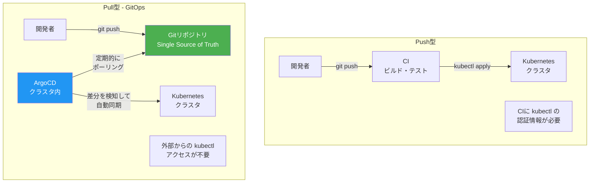
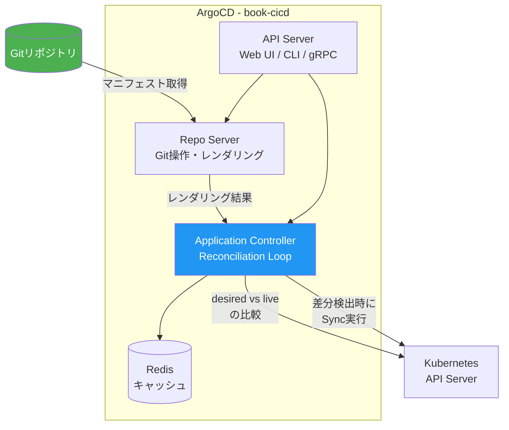
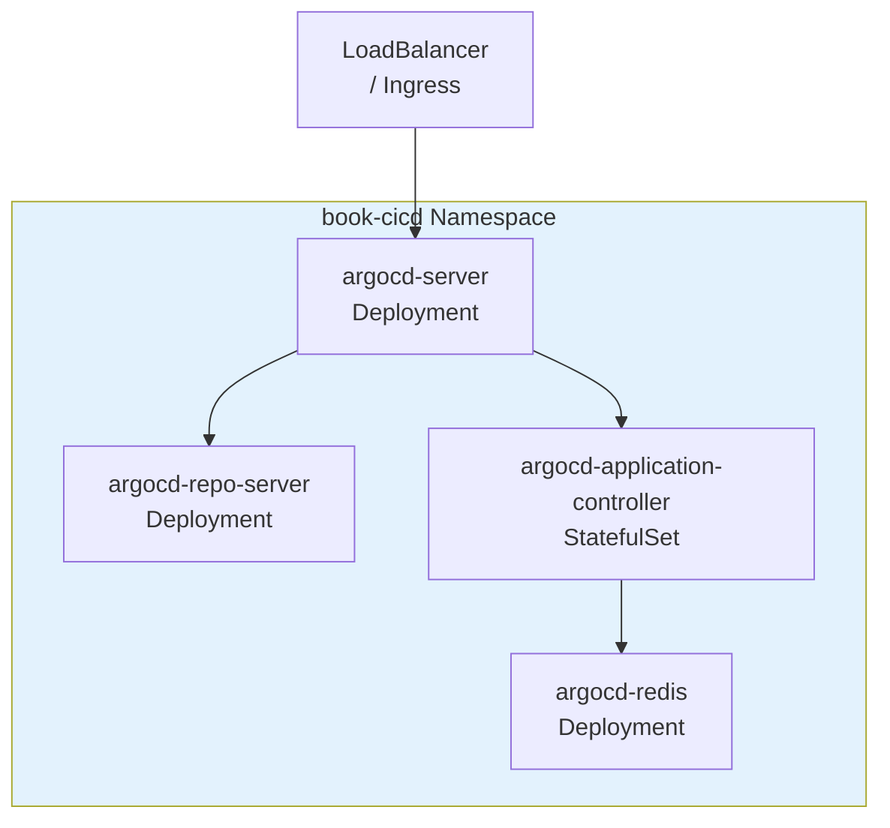
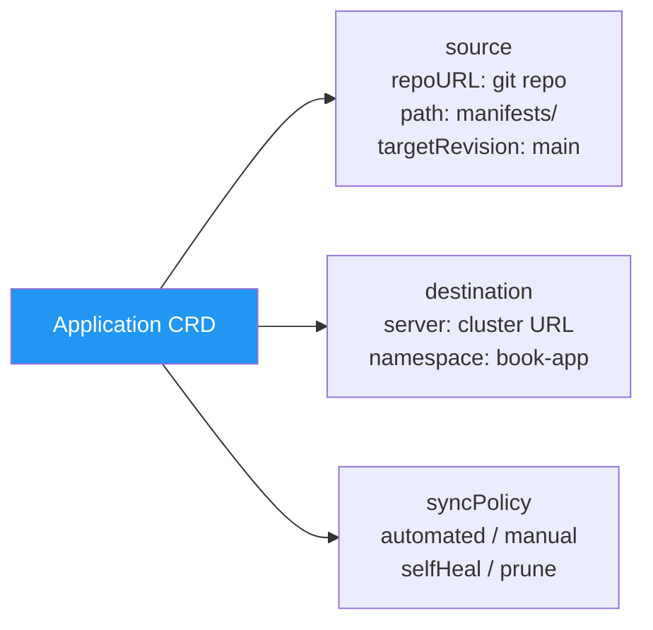
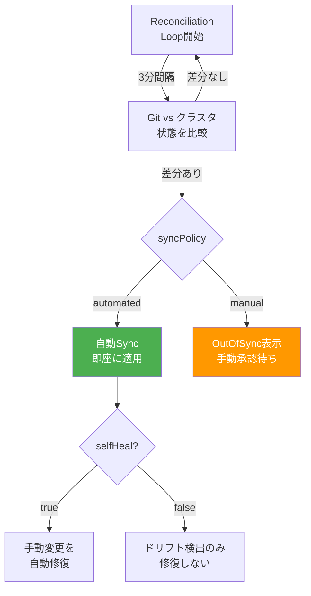
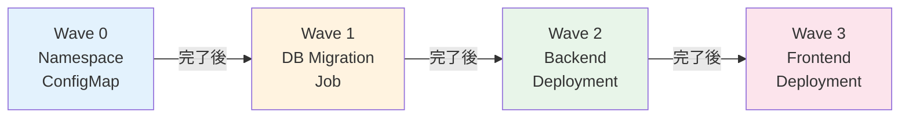
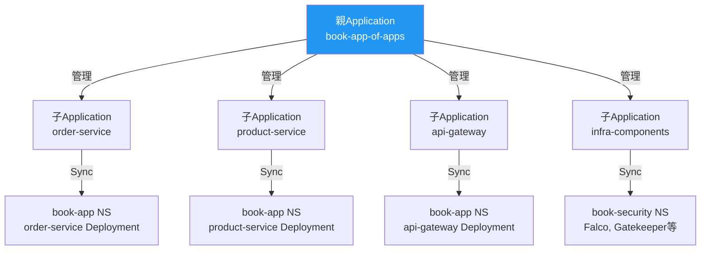

# 第13章 GitOps ― ArgoCD

Part 1〜3でObservability、Service Mesh、Securityの基盤を構築した。しかし、サンプルアプリケーションのデプロイは `kubectl apply` による手動操作のままである。誰がいつ何を変更したか追跡できず、ロールバックも手動で行う必要がある。Part 4では、CI/CD（Continuous Integration / Continuous Delivery）とGitOpsを導入し、デリバリーパイプラインを自動化する。

本章では、Gitリポジトリを唯一の信頼できる情報源（Single Source of Truth）とするGitOpsの原則を学び、ArgoCDを導入してサンプルアプリケーションのデプロイを自動化する。

## 13.1 GitOpsとは何か

### Push型とPull型の比較

従来のCI/CDパイプラインでは、CIツール（Jenkins等）がビルド後に `kubectl apply` を実行してデプロイする（Push型）。GitOpsでは、クラスタ内のエージェント（ArgoCD）がGitリポジトリの変更を検知して自動的にデプロイする（Pull型）。

図13.1: Push型デプロイとPull型（GitOps）デプロイの比較



### GitOpsの4原則

1. **宣言的記述**: システムの望ましい状態をマニフェストとして宣言的に記述する
2. **バージョン管理**: すべての設定をGitで管理し、変更履歴を保持する
3. **自動適用**: Gitの変更がクラスタに自動的に反映される
4. **自己修復**: クラスタの状態がGitの宣言と乖離した場合、自動的に修復する（Reconciliation Loop）

### GitOpsがもたらすメリット

GitOpsを導入することで、従来のCI/CDパイプラインでは難しかった以下の利点が得られる。

- **監査証跡の自動化**: Gitの変更履歴がそのまま「誰が、いつ、何を変更したか」の監査ログとなる。`kubectl apply`による手動変更では、変更者の追跡が困難である
- **ロールバックの簡便化**: `git revert`でマニフェストを元に戻すだけで、クラスタの状態も自動的にロールバックされる
- **セキュリティの向上**: クラスタへの直接アクセス（`kubectl`のcredentials）をCI/CDパイプラインに渡す必要がない。ArgoCDはクラスタ内部で動作するため、外部からのAPI Serverアクセスを制限できる
- **再現性の保証**: Gitリポジトリのコミットハッシュを指定することで、任意の時点のクラスタ状態を正確に再現できる
- **ドリフト検知**: 手動変更や不正な変更を自動的に検知し、宣言された状態に修復する

## 13.2 ArgoCDのアーキテクチャ

図13.2にArgoCDのアーキテクチャを示す。

図13.2: ArgoCDのアーキテクチャと主要コンポーネント



- **API Server**: Web UI、CLI、gRPC APIのエンドポイント。認証・認可を処理する
- **Repo Server**: Gitリポジトリからマニフェストを取得し、Kustomize/Helmでレンダリングする
- **Application Controller**: Reconciliation Loopを実行し、desired state（Git）とlive state（クラスタ）を比較する

## 13.3 ArgoCDのインストールと初期設定

```yaml
# コード13.1: ArgoCD Helmインストールのvalues.yaml
# helm install argocd argo/argo-cd -n book-cicd --create-namespace -f values.yaml
server:
  service:
    type: LoadBalancer  # OKE環境
  extraArgs:
    - --insecure  # TLS終端をIngress/LBに委譲
configs:
  params:
    server.insecure: true
  repositories:
    book-app-repo:
      url: https://github.com/your-org/book-app-manifests.git
      type: git
```

図13.3: ArgoCDインストール後のリソース構成



```bash
# コード13.8: argocd CLI基本操作コマンド集
# 初期管理者パスワードの取得
kubectl -n book-cicd get secret argocd-initial-admin-secret \
  -o jsonpath="{.data.password}" | base64 -d

# argocd CLIでログイン
argocd login <argocd-server-address>

# Applicationの一覧
argocd app list

# 手動Sync
argocd app sync book-app

# Applicationの詳細状態を表示
argocd app get book-app

# 差分の表示（Git vs クラスタ）
argocd app diff book-app

# Applicationの履歴を表示
argocd app history book-app

# 特定のリビジョンにロールバック
argocd app rollback book-app <history-id>
```

### ArgoCDのRBACとアクセス制御

ArgoCDは組み込みのRBAC機能を持ち、ユーザーやグループごとにApplicationへのアクセスを制御できる。本番環境では、初期管理者アカウントを無効化し、SSO（Single Sign-On）連携でアクセスを管理することを推奨する。

```yaml
# コード13.8b: ArgoCD RBAC設定
configs:
  rbac:
    policy.csv: |
      # ロール定義: 開発チームはbook-projectのSyncのみ可能
      p, role:developer, applications, get, book-project/*, allow
      p, role:developer, applications, sync, book-project/*, allow
      p, role:developer, applications, action/*, book-project/*, allow

      # ロール定義: SREチームは全操作可能
      p, role:sre, applications, *, */*, allow
      p, role:sre, clusters, *, *, allow
      p, role:sre, repositories, *, *, allow

      # グループとロールの紐付け
      g, dev-team, role:developer
      g, sre-team, role:sre

    policy.default: role:readonly  # デフォルトは読み取り専用
    scopes: '[groups]'
```

| ロール | 操作権限 | 対象 | 推奨ユーザー |
|--------|---------|------|------------|
| readonly | 閲覧のみ | 全Application | 全メンバー（デフォルト） |
| developer | Sync、ステータス確認 | 自プロジェクト | 開発チーム |
| sre | 全操作 | 全リソース | SRE/プラットフォームチーム |
| admin | システム設定含む全操作 | ArgoCD全体 | 管理者のみ |

SSO連携にはOIDCプロバイダー（GitHub、Google、Okta等）を使用する。OCI IAM（Identity and Access Management）との連携も可能である。

## 13.4 Application CRDによるアプリケーション管理

### Application CRD

Application CRDは、GitリポジトリとKubernetesクラスタの対応関係を定義する。

図13.4: Application CRDのフィールド構造



```yaml
# コード13.2: Application CRD（サンプルアプリ用）
apiVersion: argoproj.io/v1alpha1
kind: Application
metadata:
  name: book-app
  namespace: book-cicd
spec:
  project: book-project
  source:
    repoURL: https://github.com/your-org/book-app-manifests.git
    path: overlays/oke
    targetRevision: main
    kustomize:
      namePrefix: ""  # Kustomize設定
  destination:
    server: https://kubernetes.default.svc
    namespace: book-app
  syncPolicy:
    automated:
      selfHeal: true  # ドリフト自動修復
      prune: true     # 削除されたリソースの自動削除
    syncOptions:
      - CreateNamespace=true
```

```yaml
# コード13.3: AppProject CRD
apiVersion: argoproj.io/v1alpha1
kind: AppProject
metadata:
  name: book-project
  namespace: book-cicd
spec:
  sourceRepos:
    - https://github.com/your-org/book-app-manifests.git
  destinations:
    - server: https://kubernetes.default.svc
      namespace: book-app
  clusterResourceWhitelist:
    - group: ""
      kind: Namespace
```

## 13.5 自動同期と手動同期の使い分け

### Reconciliation Loop

ArgoCDのApplication Controllerは定期的（デフォルト3分間隔）にGitリポジトリの状態とクラスタの状態を比較する。差分を検出した場合の動作は、syncPolicyの設定に依存する。

図13.5: Reconciliation Loopの動作フロー



> 表13.1: 同期ポリシーの比較と推奨使用場面

| ポリシー | 動作 | 推奨環境 |
|---------|------|---------|
| automated + selfHeal + prune | 完全自動同期。ドリフトも自動修復 | 開発環境 |
| automated + selfHeal | 自動同期。削除はGit側でのみ | ステージング環境 |
| manual | 手動承認後にSync | 本番環境 |

```yaml
# コード13.4: syncPolicy設定の各パターン
# 開発環境向け: 完全自動
syncPolicy:
  automated:
    selfHeal: true
    prune: true

# 本番環境向け: 手動同期
syncPolicy: {}  # automated を指定しない = 手動同期
```

### Sync Windowによる時間帯制御

本番環境では、デプロイ可能な時間帯を制限したい場合がある。ArgoCDのSync Window機能を使うと、Syncを許可/拒否する時間帯をスケジュールで定義できる。

```yaml
# コード13.4b: Sync Window設定（AppProject内で定義）
apiVersion: argoproj.io/v1alpha1
kind: AppProject
metadata:
  name: book-project
  namespace: book-cicd
spec:
  sourceRepos:
    - https://github.com/your-org/book-app-manifests.git
  destinations:
    - server: https://kubernetes.default.svc
      namespace: book-app
  syncWindows:
    # 平日の業務時間帯のみSyncを許可
    - kind: allow
      schedule: "0 9 * * 1-5"  # 月〜金 9:00開始
      duration: 9h             # 9時間（9:00〜18:00）
      applications: ["*"]
    # メンテナンスウィンドウでは手動Syncのみ許可
    - kind: deny
      schedule: "0 0 * * 0"   # 日曜 0:00開始
      duration: 24h            # 24時間
      applications: ["*"]
      manualSync: true         # 手動Syncは許可
```

Sync Windowにより、深夜や休日の自動デプロイを防止し、問題発生時に対応できる体制が整った時間帯にのみデプロイを実行できる。

### Webhookによるリアルタイム同期

ArgoCDのデフォルトでは3分間隔のポーリングでGitの変更を検知するが、Webhookを設定するとGitリポジトリへのPush直後にSyncを開始できる。

```yaml
# コード13.4c: GitHub Webhook設定
# ArgoCDのConfigMapにWebhook Secretを追加
configs:
  secret:
    githubSecret: "your-webhook-secret"
```

GitHubリポジトリの Settings → Webhooks で `https://<argocd-server>/api/webhook` をPayload URLとして設定する。Content typeは `application/json` を選択し、Pushイベントを送信する。

## 13.6 Sync Waves・Hooks・ヘルスチェック

### Sync Waves

複数リソースのデプロイ順序を `argocd.argoproj.io/sync-wave` アノテーションで制御する。

図13.6: Sync Wavesによるデプロイ順序制御



```yaml
# コード13.5: Sync Wavesアノテーション付きマニフェスト
apiVersion: apps/v1
kind: Deployment
metadata:
  name: order-service
  annotations:
    argocd.argoproj.io/sync-wave: "2"  # Wave 2でデプロイ
```

### Sync Hooks

```yaml
# コード13.6: PreSync Hookによるマイグレーションジョブ
apiVersion: batch/v1
kind: Job
metadata:
  name: db-migration
  annotations:
    argocd.argoproj.io/hook: PreSync       # Sync前に実行
    argocd.argoproj.io/hook-delete-policy: HookSucceeded
spec:
  template:
    spec:
      containers:
        - name: migrate
          image: your-registry/db-migrate:v1.0.0
          command: ["./migrate", "up"]
      restartPolicy: Never
```

## 13.7 マルチ環境管理とディレクトリ構成

### ディレクトリ構成パターン

図13.7: マルチ環境管理のディレクトリ構成

```
book-app-manifests/
├── base/                     # 共通マニフェスト
│   ├── kustomization.yaml
│   ├── deployment.yaml
│   ├── service.yaml
│   └── configmap.yaml
├── overlays/
│   ├── dev/                  # 開発環境
│   │   ├── kustomization.yaml
│   │   └── patches/
│   ├── staging/              # ステージング環境
│   │   ├── kustomization.yaml
│   │   └── patches/
│   └── prod/                 # 本番環境
│       ├── kustomization.yaml
│       └── patches/
└── argocd/
    ├── app-of-apps.yaml      # App of Apps
    └── applicationset.yaml   # ApplicationSet
```

### App of Appsパターン

App of Appsパターンは、1つの「親」Applicationが複数の「子」Applicationを管理する階層的な構成である。親Applicationのsource.pathにArgoCDのApplication CRDマニフェストを格納したディレクトリを指定すると、ArgoCDが子Applicationを自動的に作成・管理する。

図13.7b: App of Appsパターンの階層構造



```yaml
# コード13.6b: App of Apps親Application
apiVersion: argoproj.io/v1alpha1
kind: Application
metadata:
  name: book-app-of-apps
  namespace: book-cicd
spec:
  project: book-project
  source:
    repoURL: https://github.com/your-org/book-app-manifests.git
    path: argocd/apps   # 子Applicationのマニフェストが格納されたディレクトリ
    targetRevision: main
  destination:
    server: https://kubernetes.default.svc
    namespace: book-cicd
```

子Applicationのマニフェストはargocd/apps/ディレクトリに配置する。

```yaml
# コード13.6c: 子Application（order-service用）
# argocd/apps/order-service.yaml
apiVersion: argoproj.io/v1alpha1
kind: Application
metadata:
  name: order-service
  namespace: book-cicd
  finalizers:
    - resources-finalizer.argocd.argoproj.io
spec:
  project: book-project
  source:
    repoURL: https://github.com/your-org/book-app-manifests.git
    path: services/order-service/overlays/prod
    targetRevision: main
  destination:
    server: https://kubernetes.default.svc
    namespace: book-app
  syncPolicy:
    automated:
      selfHeal: true
      prune: true
```

このパターンにより、複数のマイクロサービスやインフラコンポーネントをGitリポジトリの変更だけで一元管理できる。新しいサービスを追加する場合は、`argocd/apps/`に新しいApplicationマニフェストを追加してGitにPushするだけでよい。

App of Appsパターンの利点と注意点を整理する。

| 観点 | 利点 | 注意点 |
|------|------|--------|
| 管理の一元化 | 全サービスを1つのGitリポジトリで管理 | 子Applicationの数が多いと見通しが悪くなる |
| ブートストラップ | 親Applicationの作成だけで全体が起動 | 親Applicationの障害が全体に波及する |
| 権限分離 | サービスごとにAppProjectを分離可能 | 親Applicationには広い権限が必要 |
| 段階的導入 | 既存環境に段階的に適用可能 | 既存のApplication定義の移行が必要 |

ただし、動的な環境追加が必要な場合はApplicationSetの方が柔軟性が高い。

### ApplicationSet

```yaml
# コード13.7: ApplicationSet（Gitディレクトリジェネレータ）
apiVersion: argoproj.io/v1alpha1
kind: ApplicationSet
metadata:
  name: book-app-envs
  namespace: book-cicd
spec:
  generators:
    - git:
        repoURL: https://github.com/your-org/book-app-manifests.git
        revision: main
        directories:
          - path: overlays/*
  template:
    metadata:
      name: "book-app-{{path.basename}}"
    spec:
      project: book-project
      source:
        repoURL: https://github.com/your-org/book-app-manifests.git
        path: "{{path}}"
        targetRevision: main
      destination:
        server: https://kubernetes.default.svc
        namespace: "book-app-{{path.basename}}"
```

ApplicationSetにより、`overlays/` 配下のディレクトリごとにApplicationが自動生成される。新しい環境（overlays/qa 等）を追加するだけで、ArgoCDが自動的に管理対象に加える。

### ApplicationSetのジェネレーター比較

ApplicationSetには複数のジェネレーターがあり、用途に応じて選択する。

| ジェネレーター | 用途 | 自動検出 | 例 |
|--------------|------|---------|-----|
| Git Directory | ディレクトリ構造ベース | ディレクトリの追加を検出 | 環境別overlays |
| Git File | 設定ファイルベース | ファイルの追加を検出 | config.jsonで定義 |
| List | 明示的なリスト | なし（手動追加） | 少数の固定環境 |
| Cluster | 登録済みクラスタベース | クラスタの追加を検出 | マルチクラスタ |
| Pull Request | PRベース | PRの作成/更新を検出 | PRプレビュー環境 |
| Matrix/Merge | 複数ジェネレーターの組み合わせ | 組み合わせ依存 | 環境 × サービス |

```yaml
# コード13.7b: Pull Requestジェネレーター（PRプレビュー環境の自動作成）
apiVersion: argoproj.io/v1alpha1
kind: ApplicationSet
metadata:
  name: book-app-pr-preview
  namespace: book-cicd
spec:
  generators:
    - pullRequest:
        github:
          owner: your-org
          repo: book-app-manifests
          labels:
            - preview  # "preview"ラベルが付いたPRのみ対象
        requeueAfterSeconds: 30
  template:
    metadata:
      name: "book-app-pr-{{number}}"
    spec:
      project: book-project
      source:
        repoURL: https://github.com/your-org/book-app-manifests.git
        path: overlays/dev
        targetRevision: "{{branch}}"
      destination:
        server: https://kubernetes.default.svc
        namespace: "preview-pr-{{number}}"
      syncPolicy:
        automated:
          selfHeal: true
          prune: true
        syncOptions:
          - CreateNamespace=true
```

このPull Requestジェネレーターにより、PRごとに一時的なプレビュー環境が自動作成され、PRがクローズされると自動的に削除される。開発チームはPR上でデプロイ結果を直接確認できる。

### ArgoCDの運用上のベストプラクティス

ArgoCDを本番環境で運用する際に考慮すべきポイントを整理する。

1. **リポジトリ分離**: アプリケーションコードとマニフェストは別リポジトリに分離する。これにより、コード変更とインフラ変更の責務が明確になり、CIの不要な再実行を防げる
2. **Secretの管理**: GitにSecretを直接コミットしてはならない。Sealed Secrets、External Secrets Operator、またはOCI Vaultとの連携を使用する
3. **通知の設定**: ArgoCD Notificationsを使用して、Sync成功/失敗をSlackやメールで通知する
4. **メトリクスの監視**: ArgoCDはPrometheusメトリクスを公開しており、Sync時間、キュー長、エラー数等を監視できる
5. **バックアップ**: ArgoCDの設定（Application CRD等）自体もGitで管理し、災害復旧に備える

ArgoCDによるGitOps管理が確立された。しかし、新バージョンのデプロイは全トラフィックを一度に切り替える方式であり、問題のあるリリースが全ユーザーに影響する。次章では、Argo Rolloutsによるプログレッシブデリバリー（Progressive Delivery）で段階的なトラフィック切り替えを実現する。

## 理解度チェック

1. GitOpsの4原則を挙げ、従来のCI/CDパイプライン（Push型）との違いを説明せよ

2. ArgoCDのReconciliation Loopにおいて、selfHealとpruneの動作の違いを説明し、それぞれを有効にすべき場面・無効にすべき場面を述べよ

3. Application CRDのsource.pathとsource.kustomizeはどのような関係にあるか。Kustomize overlaysを使って複数環境を管理する場合のディレクトリ構成を図示せよ

4. Sync Wavesを使ってデータベースマイグレーション → バックエンドデプロイ → フロントエンドデプロイの順序を制御するには、各リソースにどのようなアノテーションを付与すればよいか

5. App of Appsパターンの利点と、ApplicationSetとの使い分けを説明せよ

## 参考文献

- ArgoCD公式ドキュメント, https://argo-cd.readthedocs.io/en/stable/
- GitOps Principles, https://opengitops.dev/
- ArgoCD Best Practices, https://argo-cd.readthedocs.io/en/stable/user-guide/best_practices/
- ApplicationSet Controller, https://argo-cd.readthedocs.io/en/stable/operator-manual/applicationset/
