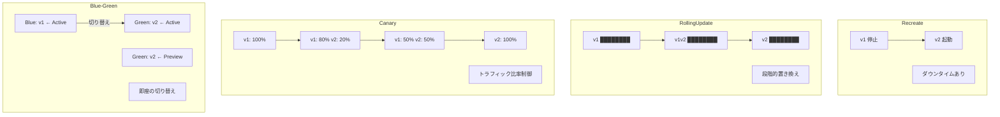
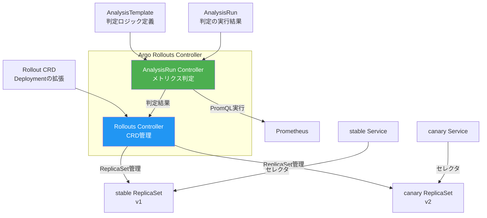
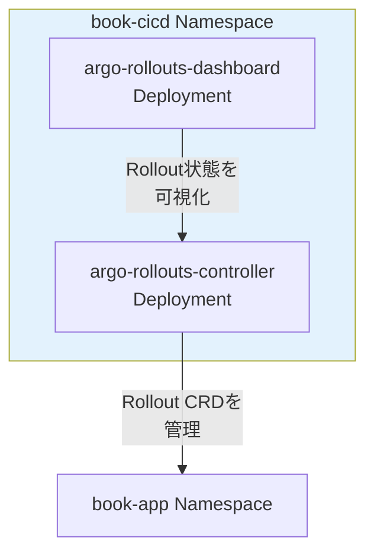
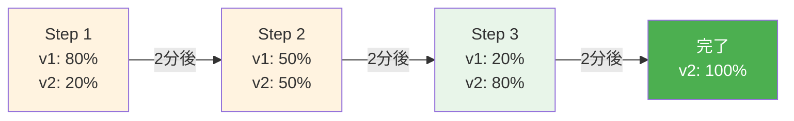
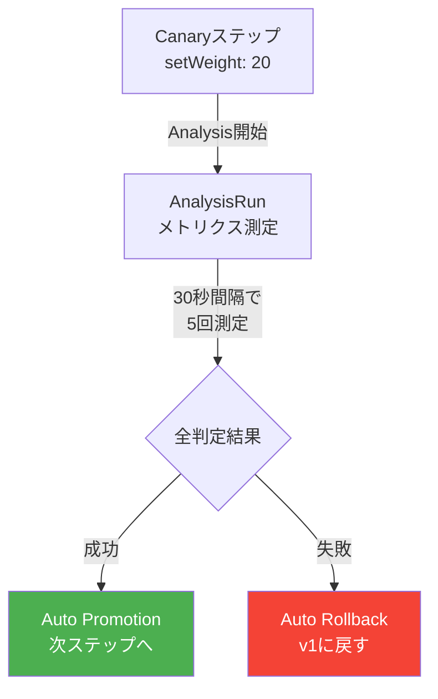
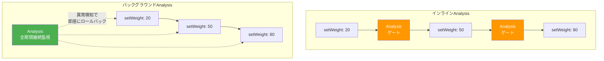
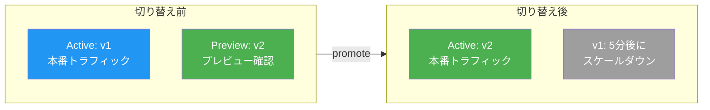

# 第14章 Progressive Delivery ― Argo Rollouts

前章のArgoCDは、Gitの変更をクラスタに同期する。しかし、同期は全トラフィックを一度に新バージョンに切り替える。新バージョンにバグがあれば、全ユーザーが影響を受ける。本章では、Argo Rolloutsを導入し、トラフィックを段階的に切り替えるProgressive Delivery（プログレッシブデリバリー）を実現する。第2章で構築したPrometheusのメトリクスに基づく自動判定（Auto Promotion）も実装する。

## 14.1 Progressive Deliveryの概念

### デプロイ戦略の比較

図14.1にデプロイ戦略の比較を示す。

図14.1: デプロイ戦略の比較



| 戦略 | ダウンタイム | ロールバック速度 | リソースコスト | メトリクス判定 |
|------|-----------|-------------|-------------|------------|
| Recreate | あり | 遅い | 1倍 | 不可 |
| RollingUpdate | なし | 中程度 | 1倍 | 不可 |
| Canary | なし | 速い | 1.x倍 | 可能 |
| Blue-Green | なし | 即座 | 2倍 | 可能 |

### なぜKubernetes標準のRollingUpdateでは不十分か

Kubernetes標準のDeploymentが提供するRollingUpdate戦略には以下の制限がある。

- **トラフィック比率の制御ができない**: RollingUpdateはPod数の比率で段階的に入れ替えるが、トラフィックの比率を正確に制御できない。例えば、3 Podのうち1 Podを新バージョンにすると約33%のトラフィックが新バージョンに流れるが、正確に「20%だけ」といった制御は不可能である
- **メトリクスに基づく自動判定がない**: RollingUpdateは新しいPodのReadiness Probeが通れば進行する。エラー率やレイテンシの劣化を検知して自動ロールバックする機能は持たない
- **一時停止と段階的昇格ができない**: 各段階で人手による確認を挟んだり、メトリクスを確認してから次の段階に進めたりする柔軟な制御ができない

Progressive Deliveryは、これらの制限を解消し、本番環境でのリリースリスクを最小化するアプローチである。

## 14.2 Argo Rolloutsのアーキテクチャ

図14.2にArgo Rolloutsのアーキテクチャを示す。

図14.2: Argo RolloutsのアーキテクチャとCRD構成



## 14.3 Argo Rolloutsのインストール

```yaml
# コード14.1: Argo Rollouts Helmインストール
# helm install argo-rollouts argo/argo-rollouts -n book-cicd -f values.yaml
controller:
  replicas: 1
dashboard:
  enabled: true
  service:
    type: ClusterIP
```

図14.3: Argo Rolloutsインストール後のコンポーネント配置



```bash
# コード14.7: kubectl argo rollouts操作コマンド集
# kubectl argo rolloutsプラグインのインストール
kubectl argo rollouts version

# Rolloutの状態確認
kubectl argo rollouts get rollout order-service -n book-app

# 手動昇格（Canaryを次のステップへ進める）
kubectl argo rollouts promote order-service -n book-app

# 全ステップをスキップして即座に昇格
kubectl argo rollouts promote --full order-service -n book-app

# 手動ロールバック（Canaryを中止してstableに戻す）
kubectl argo rollouts abort order-service -n book-app

# abortした後にstableバージョンに戻す
kubectl argo rollouts undo order-service -n book-app

# Rolloutのステータスを監視（リアルタイム表示）
kubectl argo rollouts get rollout order-service -n book-app --watch

# ダッシュボードの起動
kubectl argo rollouts dashboard
```

### DeploymentからRolloutへの移行手順

既存のDeploymentリソースをRollout CRDに移行する際は、以下の手順で進める。

1. **Deployment定義をコピー**: 既存のDeploymentのYAMLを元にRolloutマニフェストを作成する
2. **apiVersion/kindを変更**: `apps/v1 Deployment` → `argoproj.io/v1alpha1 Rollout`
3. **strategyを変更**: `strategy.rollingUpdate` → `strategy.canary` または `strategy.blueGreen`
4. **Serviceを分離**: stable ServiceとCanary Serviceを作成する
5. **既存Deploymentを削除**: Rolloutの適用前に既存Deploymentを削除する（同名リソースの競合を防ぐ）

ArgoCDと組み合わせる場合、`argoproj.io/v1alpha1 Rollout`はArgoCDが標準で認識するため、Application CRDの変更は不要である。

## 14.4 Canaryデプロイの実践

### DeploymentからRolloutへの移行

```yaml
# コード14.2: Rollout CRD（Canary戦略）
apiVersion: argoproj.io/v1alpha1
kind: Rollout
metadata:
  name: order-service
  namespace: book-app
spec:
  replicas: 3
  selector:
    matchLabels:
      app: order-service
  template:
    metadata:
      labels:
        app: order-service
    spec:
      containers:
        - name: order-service
          image: your-registry/order-service:v1.0.0
          ports:
            - containerPort: 8080
  strategy:
    canary:
      canaryService: order-service-canary
      stableService: order-service-stable
      steps:
        - setWeight: 20    # 20%のトラフィックをCanaryへ
        - pause: { duration: 2m }  # 2分間待機
        - setWeight: 50    # 50%に増加
        - pause: { duration: 2m }
        - setWeight: 80    # 80%に増加
        - pause: { duration: 2m }
        # 全ステップ完了後に100%に自動昇格
```

```yaml
# コード14.3: stable Service / canary Serviceの定義
apiVersion: v1
kind: Service
metadata:
  name: order-service-stable
  namespace: book-app
spec:
  selector:
    app: order-service
  ports:
    - port: 8080
---
apiVersion: v1
kind: Service
metadata:
  name: order-service-canary
  namespace: book-app
spec:
  selector:
    app: order-service
  ports:
    - port: 8080
```

図14.4: Canaryデプロイの段階的トラフィック移行



## 14.5 Analysis TemplateとAuto Promotion

### AnalysisTemplateの定義

AnalysisTemplate CRDでPrometheusメトリクスに基づく自動判定ロジックを定義する。

```yaml
# コード14.4: AnalysisTemplate（Prometheusエラー率チェック）
apiVersion: argoproj.io/v1alpha1
kind: AnalysisTemplate
metadata:
  name: error-rate-check
  namespace: book-app
spec:
  args:
    - name: service-name
  metrics:
    - name: error-rate
      interval: 30s
      count: 5          # 5回測定
      failureLimit: 2   # 2回失敗でロールバック
      successCondition: result[0] < 0.05  # エラー率5%未満で成功
      provider:
        prometheus:
          address: http://prometheus-server.book-observability:9090
          query: |
            sum(rate(http_server_duration_seconds_count{
              service="{{args.service-name}}",
              http_status_code=~"5.."
            }[2m]))
            /
            sum(rate(http_server_duration_seconds_count{
              service="{{args.service-name}}"
            }[2m]))
```

```yaml
# コード14.5: AnalysisTemplate（Prometheusレイテンシチェック）
apiVersion: argoproj.io/v1alpha1
kind: AnalysisTemplate
metadata:
  name: latency-check
  namespace: book-app
spec:
  args:
    - name: service-name
  metrics:
    - name: p99-latency
      interval: 30s
      count: 5
      failureLimit: 2
      successCondition: result[0] < 500  # P99が500ms未満
      provider:
        prometheus:
          address: http://prometheus-server.book-observability:9090
          query: |
            histogram_quantile(0.99,
              sum(rate(http_server_duration_seconds_bucket{
                service="{{args.service-name}}"
              }[2m])) by (le)
            ) * 1000
```

図14.5: AnalysisTemplateによる自動判定フロー



> 表14.1: AnalysisTemplate主要フィールド

| フィールド | 説明 | 例 |
|-----------|------|-----|
| metrics[].interval | 測定間隔 | `30s` |
| metrics[].count | 測定回数 | `5` |
| metrics[].failureLimit | 許容失敗回数 | `2` |
| metrics[].successCondition | 成功条件 | `result[0] < 0.05` |
| metrics[].provider | メトリクスソース | `prometheus` |

### 複数メトリクスの組み合わせ

実運用では、エラー率とレイテンシの両方を組み合わせて判定することが一般的である。いずれかのメトリクスが閾値を超えた場合にロールバックを実行する。

```yaml
# コード14.5c: 複合メトリクスのAnalysisTemplate
apiVersion: argoproj.io/v1alpha1
kind: AnalysisTemplate
metadata:
  name: composite-check
  namespace: book-app
spec:
  args:
    - name: service-name
  metrics:
    - name: error-rate
      interval: 30s
      count: 5
      failureLimit: 2
      successCondition: result[0] < 0.05
      provider:
        prometheus:
          address: http://prometheus-server.book-observability:9090
          query: |
            sum(rate(http_server_duration_seconds_count{
              service="{{args.service-name}}",
              http_status_code=~"5.."
            }[2m]))
            /
            sum(rate(http_server_duration_seconds_count{
              service="{{args.service-name}}"
            }[2m]))
    - name: p99-latency
      interval: 30s
      count: 5
      failureLimit: 2
      successCondition: result[0] < 500
      provider:
        prometheus:
          address: http://prometheus-server.book-observability:9090
          query: |
            histogram_quantile(0.99,
              sum(rate(http_server_duration_seconds_bucket{
                service="{{args.service-name}}"
              }[2m])) by (le)
            ) * 1000
    - name: saturation
      interval: 30s
      count: 3
      failureLimit: 1
      successCondition: result[0] < 80
      provider:
        prometheus:
          address: http://prometheus-server.book-observability:9090
          query: |
            avg(container_memory_usage_bytes{
              pod=~"{{args.service-name}}.*"
            } / container_spec_memory_limit_bytes{
              pod=~"{{args.service-name}}.*"
            }) * 100
```

複数のmetricsを定義すると、すべてのメトリクスが並行して評価される。いずれか1つでもfailureLimitを超えるとAnalysisRunは失敗となり、ロールバックが実行される。

### インラインAnalysisとバックグラウンドAnalysis

AnalysisTemplateの実行方法には2種類ある。

- **インラインAnalysis**: Canaryステップの一部として実行する。`analysis`ステップで指定し、成功するまで次のステップに進まない。段階的なweight変更の途中でゲートとして機能する
- **バックグラウンドAnalysis**: Rollout全体を通じてバックグラウンドで継続的にメトリクスを監視する。`strategy.canary.analysis`で指定し、Rolloutの開始から完了まで並行して実行される。全ステップを通じた異常検知に適する

図14.5b: インラインAnalysisとバックグラウンドAnalysisの動作の違い



両者を組み合わせることも可能である。バックグラウンドAnalysisで継続的にエラー率を監視しつつ、各ステップの境界でインラインAnalysisによるレイテンシチェックを行う構成が推奨される。

```yaml
# コード14.5b: バックグラウンドAnalysisの設定例
spec:
  strategy:
    canary:
      analysis:
        templates:
          - templateName: error-rate-check
        args:
          - name: service-name
            value: order-service
      steps:
        - setWeight: 20
        - pause: { duration: 60s }
        - setWeight: 50
        - pause: { duration: 60s }
        - setWeight: 80
        - pause: { duration: 60s }
```

## 14.6 Blue-Greenデプロイ

### Blue-Green戦略

```yaml
# コード14.6: Rollout CRD（Blue-Green戦略）
apiVersion: argoproj.io/v1alpha1
kind: Rollout
metadata:
  name: api-gateway
  namespace: book-app
spec:
  replicas: 3
  selector:
    matchLabels:
      app: api-gateway
  template:
    metadata:
      labels:
        app: api-gateway
    spec:
      containers:
        - name: api-gateway
          image: your-registry/api-gateway:v1.0.0
  strategy:
    blueGreen:
      activeService: api-gateway-active     # 本番トラフィック
      previewService: api-gateway-preview   # プレビュー環境
      autoPromotionEnabled: false           # 手動承認
      scaleDownDelaySeconds: 300            # 旧版を5分間保持
```

図14.6: Blue-Greenデプロイの切り替えフロー



> 表14.2: Canary vs Blue-Green の使い分け

| 観点 | Canary | Blue-Green |
|------|--------|-----------|
| トラフィック制御 | 比率で段階的 | 全か無か |
| リソースコスト | 1.x倍（Canaryの分） | 2倍（両バージョン同時稼働） |
| ロールバック速度 | 即座（weight: 0に戻す） | 即座（Serviceを切り戻す） |
| 適するケース | 大規模トラフィック | プレビュー環境での事前検証 |

### ArgoCDとArgo Rolloutsの統合

ArgoCDとArgo Rolloutsを統合して使用する場合の注意点を示す。

ArgoCDはRollout CRDをネイティブに認識するため、Application CRDのsource.pathにRolloutマニフェストを含むディレクトリを指定するだけでよい。ただし、ヘルスチェックの設定に注意が必要である。

```yaml
# コード14.6b: ArgoCD側のRolloutヘルスチェック設定
# ArgoCD ConfigMapにRolloutのヘルスチェックを追加
configs:
  cm:
    resource.customizations: |
      argoproj.io/Rollout:
        health.lua: |
          hs = {}
          if obj.status ~= nil then
            if obj.status.phase == "Healthy" then
              hs.status = "Healthy"
              hs.message = "Rollout is healthy"
            elseif obj.status.phase == "Paused" then
              hs.status = "Suspended"
              hs.message = "Rollout is paused"
            elseif obj.status.phase == "Degraded" then
              hs.status = "Degraded"
              hs.message = "Rollout is degraded"
            else
              hs.status = "Progressing"
              hs.message = "Rollout is progressing"
            end
          end
          return hs
```

### トラブルシューティング

Argo Rolloutsで問題が発生した場合の確認手順を示す。

| 症状 | 確認コマンド | 想定される原因 |
|------|-----------|-------------|
| Canaryが進行しない | `kubectl argo rollouts get rollout <name> -n book-app` | pause中、またはAnalysis待ち |
| AnalysisRunが失敗する | `kubectl get analysisrun -n book-app -o yaml` | PromQL構文エラー、Prometheus接続不可 |
| ロールバック後も旧Podが残る | `kubectl get rs -n book-app` | ReplicaSetの自動スケールダウン設定 |
| ServiceのSelector不一致 | `kubectl get svc -n book-app -o yaml` | stable/canary Serviceのselectorが不正 |

```bash
# コード14.7b: トラブルシューティング用コマンド
# AnalysisRunの詳細を確認
kubectl get analysisrun -n book-app --sort-by=.metadata.creationTimestamp

# 直近のAnalysisRunの結果を表示
kubectl get analysisrun -n book-app -o yaml | \
  grep -A 20 "status:"

# Rollouts Controllerのログを確認
kubectl logs -n book-cicd deploy/argo-rollouts --tail=100

# Rolloutのイベントを確認
kubectl describe rollout order-service -n book-app
```

ArgoCDによるGitOpsとArgo RolloutsによるProgressive Deliveryで、CDの仕組みが整った。次章では、コードからイメージのビルド・テスト・スキャン・署名までのCI部分をGitHub Actionsで構築する。

## 理解度チェック

1. CanaryデプロイとBlue-Greenデプロイの違いを、トラフィック制御・リソースコスト・ロールバック速度の観点で比較せよ

2. Argo RolloutsのRollout CRDは、Kubernetes標準のDeploymentと比較してどのような拡張を提供するか。既存のDeploymentからの移行手順を述べよ

3. AnalysisTemplateでPrometheusメトリクスを使った自動昇格を設定する場合、successConditionとfailureLimitはそれぞれどのような役割を果たすか

4. バックグラウンドAnalysisとインラインAnalysisの違いを説明し、それぞれの適切な使用場面を述べよ

## 参考文献

- Argo Rollouts公式ドキュメント, https://argo-rollouts.readthedocs.io/en/stable/
- Argo Rollouts Analysis, https://argo-rollouts.readthedocs.io/en/stable/features/analysis/
- Progressive Delivery, https://www.weave.works/blog/progressive-delivery
