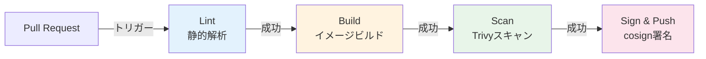
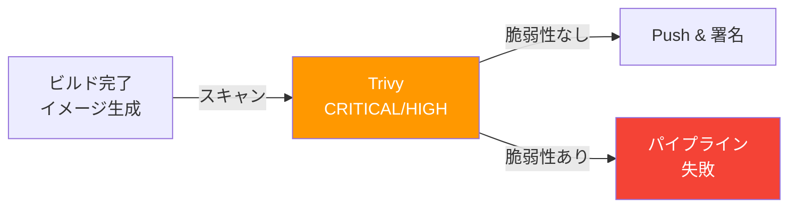
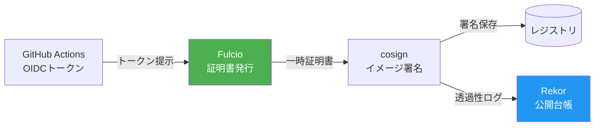
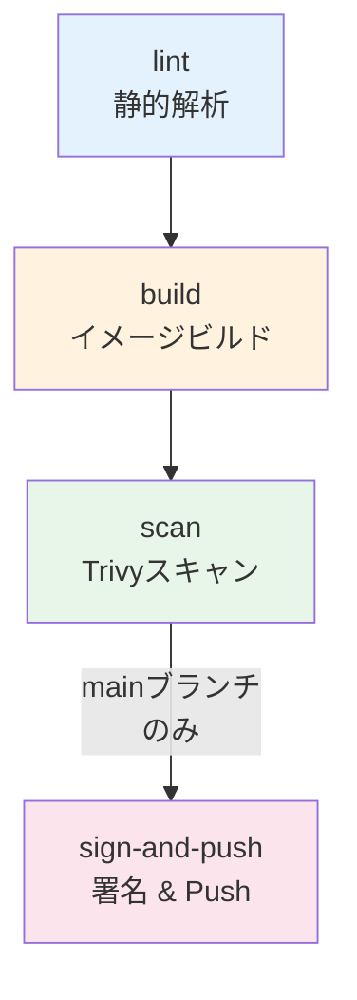

# 第15章 CIパイプライン ― GitHub Actions

前章まででCD側の仕組み（ArgoCD + Argo Rollouts）が整った。しかし、コードの変更からコンテナイメージが安全にレジストリに格納されるまでのCI（Continuous Integration）部分が未整備である。本章では、GitHub Actionsを用いてビルド、テスト、脆弱性スキャン（Trivy）、イメージ署名（cosign）、レジストリへのPushまでの一連のCIパイプラインを構築する。

## 15.1 コンテナビルドのベストプラクティス

### マルチステージビルド

本番向けコンテナイメージのサイズを最小化するには、マルチステージビルドが有効である。ビルドに必要なツール（コンパイラ等）を含むステージと、実行に必要な最小限のバイナリのみを含むステージを分離する。

図15.1: マルチステージビルドの構造

```
┌─────────────────────────────────────┐
│ Stage 1: ビルドステージ              │
│  FROM golang:1.23 AS builder        │
│  ├── コンパイラ、ツール              │
│  ├── ソースコード                    │
│  └── go build → バイナリ出力         │
│  イメージサイズ: ~800MB              │
└───────────────┬─────────────────────┘
                │ バイナリのみコピー
┌───────────────▼─────────────────────┐
│ Stage 2: 実行ステージ              │
│  FROM gcr.io/distroless/static     │
│  ├── バイナリのみ                   │
│  └── 非rootユーザーで実行           │
│  イメージサイズ: ~15MB              │
└─────────────────────────────────────┘
```

```dockerfile
# コード15.1: マルチステージビルドのDockerfile（Goアプリ）
# Stage 1: ビルド
FROM golang:1.23-alpine AS builder
WORKDIR /app
COPY go.mod go.sum ./
RUN go mod download           # 依存関係のキャッシュ
COPY . .
RUN CGO_ENABLED=0 go build -o /order-service ./cmd/server

# Stage 2: 実行
FROM gcr.io/distroless/static:nonroot
COPY --from=builder /order-service /order-service
USER nonroot:nonroot
ENTRYPOINT ["/order-service"]
```

| ベースイメージ | サイズ | シェル | パッケージマネージャ | 推奨用途 |
|-------------|-------|-------|------------------|---------|
| distroless | ~2MB | なし | なし | 本番（Go, Java） |
| Alpine | ~5MB | あり | apk | 本番（デバッグが必要な場合） |
| scratch | 0MB | なし | なし | 最小構成（静的バイナリ） |

## 15.2 GitHub Actionsの基本構造

### CIパイプラインの全体像

図15.2: CIパイプラインの全体フロー



ワークフローファイルは `.github/workflows/ci.yaml` に配置する。

### GitHub Actionsの基本概念

GitHub Actionsのワークフローは以下の階層で構成される。

> 表15.1: GitHub Actionsの構成要素

| 構成要素 | 説明 | 例 |
|---------|------|-----|
| Workflow | `.github/workflows/`に配置するYAMLファイル | `ci.yaml` |
| Event | ワークフローのトリガー | `push`, `pull_request` |
| Job | 独立した実行単位。並列または依存関係で制御 | `lint`, `build`, `scan` |
| Step | Job内の個別処理。Action利用またはシェルコマンド | `actions/checkout@v4` |
| Runner | ジョブを実行するVM環境 | `ubuntu-latest` |

```yaml
# コード15.2: GitHub Actionsワークフローの基本構造
name: CI Pipeline           # ワークフロー名
on:                          # トリガー定義
  pull_request:
    branches: [main]         # mainへのPRで実行
  push:
    branches: [main]         # mainへのPushで実行

jobs:
  lint:                      # ジョブ名
    runs-on: ubuntu-latest   # 実行環境
    steps:                   # ステップの配列
      - uses: actions/checkout@v4  # リポジトリのチェックアウト
      - run: echo "Hello"         # シェルコマンドの実行

  build:
    needs: lint              # lintジョブの完了を待つ
    runs-on: ubuntu-latest
    steps:
      - uses: actions/checkout@v4
```

`needs`フィールドでジョブ間の依存関係を定義し、実行順序を制御する。依存関係がないジョブは並列に実行される。

## 15.3 ビルドとキャッシュ戦略

### キャッシュ戦略

図15.3: キャッシュ戦略の比較

| 戦略 | 速度 | 設定の複雑さ | ストレージ |
|------|------|-----------|----------|
| GitHub Actions Cache (type=gha) | 速い | 低い | GitHub提供（10GB） |
| Registry Cache | 中程度 | 中程度 | レジストリ |
| Inline Cache | 遅い | 低い | レジストリ |

```yaml
# コード15.3: CIワークフロー: ビルドジョブ（キャッシュ付き）
jobs:
  build:
    runs-on: ubuntu-latest
    steps:
      - uses: actions/checkout@v4

      - uses: docker/setup-buildx-action@v3

      - uses: docker/login-action@v3
        with:
          registry: ${{ vars.REGISTRY }}
          username: ${{ secrets.REGISTRY_USER }}
          password: ${{ secrets.REGISTRY_PASSWORD }}

      - uses: docker/build-push-action@v5
        with:
          context: .
          push: ${{ github.event_name == 'push' && github.ref == 'refs/heads/main' }}
          tags: |
            ${{ vars.REGISTRY }}/order-service:${{ github.sha }}
            ${{ vars.REGISTRY }}/order-service:latest
          cache-from: type=gha
          cache-to: type=gha,mode=max
```

## 15.4 脆弱性スキャンの組み込み

図15.4: CIパイプラインにおけるTrivyスキャンの位置づけ



```yaml
# コード15.4: CIワークフロー: Trivyスキャンジョブ
  scan:
    needs: build
    runs-on: ubuntu-latest
    steps:
      - uses: aquasecurity/trivy-action@master
        with:
          image-ref: ${{ vars.REGISTRY }}/order-service:${{ github.sha }}
          format: sarif
          output: trivy-results.sarif
          severity: CRITICAL,HIGH
          exit-code: 1  # 脆弱性検出時にジョブを失敗させる

      - uses: github/codeql-action/upload-sarif@v3
        if: always()
        with:
          sarif_file: trivy-results.sarif
```

## 15.5 イメージ署名の組み込み

### Keyless署名

GitHub ActionsのOIDCトークンをFulcioに提示して一時的な署名証明書を取得する。秘密鍵の管理が不要になる。

図15.5: Keyless署名のフロー



```yaml
# コード15.5: CIワークフロー: cosign署名ジョブ
  sign:
    needs: scan
    if: github.event_name == 'push' && github.ref == 'refs/heads/main'
    runs-on: ubuntu-latest
    permissions:
      id-token: write  # OIDCトークンの取得に必要
      packages: write
    steps:
      - uses: sigstore/cosign-installer@v3

      - run: |
          cosign sign --yes \
            ${{ vars.REGISTRY }}/order-service@${{ needs.build.outputs.digest }}
```

## 15.6 完成したCIワークフロー

図15.6: 完成版CIワークフローのジョブ依存関係



```yaml
# コード15.6: CIワークフロー: 完成版
name: CI Pipeline
on:
  pull_request:
    branches: [main]
  push:
    branches: [main]

jobs:
  lint:
    runs-on: ubuntu-latest
    steps:
      - uses: actions/checkout@v4
      - uses: actions/setup-go@v5
        with:
          go-version: "1.23"
      - run: go vet ./...

  build:
    needs: lint
    runs-on: ubuntu-latest
    outputs:
      digest: ${{ steps.build.outputs.digest }}
    steps:
      - uses: actions/checkout@v4
      - uses: docker/setup-buildx-action@v3
      - uses: docker/login-action@v3
        with:
          registry: ${{ vars.REGISTRY }}
          username: ${{ secrets.REGISTRY_USER }}
          password: ${{ secrets.REGISTRY_PASSWORD }}
      - id: build
        uses: docker/build-push-action@v5
        with:
          context: .
          push: ${{ github.ref == 'refs/heads/main' }}
          tags: ${{ vars.REGISTRY }}/order-service:${{ github.sha }}
          cache-from: type=gha
          cache-to: type=gha,mode=max

  scan:
    needs: build
    runs-on: ubuntu-latest
    steps:
      - uses: aquasecurity/trivy-action@master
        with:
          image-ref: ${{ vars.REGISTRY }}/order-service:${{ github.sha }}
          severity: CRITICAL,HIGH
          exit-code: 1

  sign-and-push:
    needs: [build, scan]
    if: github.ref == 'refs/heads/main'
    runs-on: ubuntu-latest
    permissions:
      id-token: write
    steps:
      - uses: sigstore/cosign-installer@v3
      - run: |
          cosign sign --yes \
            ${{ vars.REGISTRY }}/order-service@${{ needs.build.outputs.digest }}
```

```yaml
# コード15.7: OCIR認証の設定（OKE環境向け）
# GitHub Secretsに以下を設定
# REGISTRY: <region>.ocir.io
# REGISTRY_USER: <tenancy-namespace>/<username>
# REGISTRY_PASSWORD: <auth-token>
```

CI（GitHub Actions）とCD（ArgoCD + Argo Rollouts）が個別に構築された。次章では、ArgoCD Image Updaterで両者を接続し、コードプッシュから本番Canaryデプロイまでの一気通貫パイプラインを完成させる。

## 理解度チェック

1. マルチステージビルドを使用する利点を、イメージサイズとセキュリティの観点から説明せよ

2. GitHub ActionsにおけるKeyless署名の仕組みを、OIDCトークン・Fulcio・Rekorの役割を含めて説明せよ

3. CIパイプラインでTrivyスキャンを実行する際、CRITICAL脆弱性が検出されたらビルドを失敗させるにはどのような設定が必要か

4. PR時とmainブランチPush時でCIワークフローの動作を変える必要がある理由を説明し、GitHub Actionsでの実現方法を述べよ

## 参考文献

- GitHub Actions公式ドキュメント, https://docs.github.com/en/actions
- docker/build-push-action, https://github.com/docker/build-push-action
- aquasecurity/trivy-action, https://github.com/aquasecurity/trivy-action
- sigstore/cosign-installer, https://github.com/sigstore/cosign-installer
- Distroless Container Images, https://github.com/GoogleContainerTools/distroless
