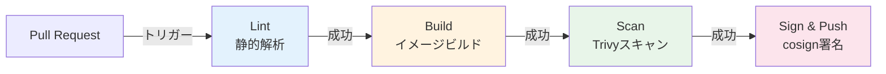
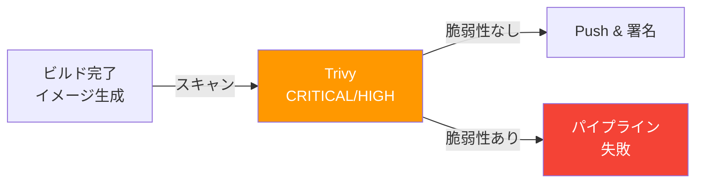
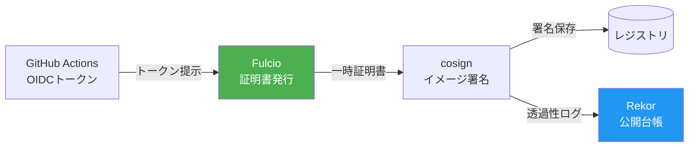
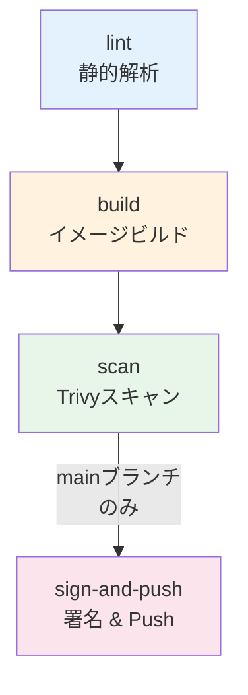

# 第15章 CIパイプライン ― GitHub Actions

前章まででCD側の仕組み（ArgoCD + Argo Rollouts）が整った。しかし、コードの変更からコンテナイメージが安全にレジストリに格納されるまでのCI（Continuous Integration）部分が未整備である。本章では、GitHub Actionsを用いてビルド、テスト、脆弱性スキャン（Trivy）、イメージ署名（cosign）、レジストリへのPushまでの一連のCIパイプラインを構築する。

## 15.1 コンテナビルドのベストプラクティス

### マルチステージビルド

本番向けコンテナイメージのサイズを最小化するには、マルチステージビルドが有効である。ビルドに必要なツール（コンパイラ等）を含むステージと、実行に必要な最小限のバイナリのみを含むステージを分離する。

図15.1: マルチステージビルドの構造

```
┌─────────────────────────────────────┐
│ Stage 1: ビルドステージ              │
│  FROM golang:1.23 AS builder        │
│  ├── コンパイラ、ツール              │
│  ├── ソースコード                    │
│  └── go build → バイナリ出力         │
│  イメージサイズ: ~800MB              │
└───────────────┬─────────────────────┘
                │ バイナリのみコピー
┌───────────────▼─────────────────────┐
│ Stage 2: 実行ステージ              │
│  FROM gcr.io/distroless/static     │
│  ├── バイナリのみ                   │
│  └── 非rootユーザーで実行           │
│  イメージサイズ: ~15MB              │
└─────────────────────────────────────┘
```

```dockerfile
# コード15.1: マルチステージビルドのDockerfile（Goアプリ）
# Stage 1: ビルド
FROM golang:1.23-alpine AS builder
WORKDIR /app
COPY go.mod go.sum ./
RUN go mod download           # 依存関係のキャッシュ
COPY . .
RUN CGO_ENABLED=0 go build -o /order-service ./cmd/server

# Stage 2: 実行
FROM gcr.io/distroless/static:nonroot
COPY --from=builder /order-service /order-service
USER nonroot:nonroot
ENTRYPOINT ["/order-service"]
```

| ベースイメージ | サイズ | シェル | パッケージマネージャ | 推奨用途 |
|-------------|-------|-------|------------------|---------|
| distroless | ~2MB | なし | なし | 本番（Go, Java） |
| Alpine | ~5MB | あり | apk | 本番（デバッグが必要な場合） |
| scratch | 0MB | なし | なし | 最小構成（静的バイナリ） |

### セキュアなDockerfileのベストプラクティス

本番向けDockerfileを作成する際は、セキュリティの観点で以下のプラクティスに従う。

```dockerfile
# コード15.1b: セキュアなDockerfileの完全版
# Stage 1: ビルド
FROM golang:1.23-alpine AS builder
# バージョンを固定（再現性の確保）
RUN apk add --no-cache ca-certificates tzdata

WORKDIR /app
# 依存関係のキャッシュ層を分離
COPY go.mod go.sum ./
RUN go mod download && go mod verify

COPY . .
# CGO無効化、静的リンク、デバッグ情報の削除
RUN CGO_ENABLED=0 GOOS=linux GOARCH=amd64 \
    go build -ldflags="-s -w" -o /order-service ./cmd/server

# Stage 2: 実行
FROM gcr.io/distroless/static:nonroot
# タイムゾーンと証明書をビルドステージからコピー
COPY --from=builder /usr/share/zoneinfo /usr/share/zoneinfo
COPY --from=builder /etc/ssl/certs/ca-certificates.crt /etc/ssl/certs/
COPY --from=builder /order-service /order-service

# 非rootユーザーで実行（UID 65532 = nonroot）
USER 65532:65532

EXPOSE 8080
ENTRYPOINT ["/order-service"]
```

- **バージョンの固定**: ベースイメージのタグを明示し、ビルドの再現性を確保する。`latest`タグの使用は避ける
- **非rootユーザー**: コンテナ内のプロセスは非rootユーザーで実行する。distrolessの`nonroot`タグは`USER 65532`が設定済みである
- **最小限のレイヤー**: 不要なファイルを含めない。`.dockerignore`ファイルで不要ファイルを除外する
- **シークレットの除外**: ビルド引数やレイヤーにシークレットを含めない

```
# .dockerignore
.git
.github
*.md
docs/
manuscript/
.steering/
```

## 15.2 GitHub Actionsの基本構造

### CIパイプラインの全体像

図15.2: CIパイプラインの全体フロー



ワークフローファイルは `.github/workflows/ci.yaml` に配置する。

### GitHub Actionsの基本概念

GitHub Actionsのワークフローは以下の階層で構成される。

> 表15.1: GitHub Actionsの構成要素

| 構成要素 | 説明 | 例 |
|---------|------|-----|
| Workflow | `.github/workflows/`に配置するYAMLファイル | `ci.yaml` |
| Event | ワークフローのトリガー | `push`, `pull_request` |
| Job | 独立した実行単位。並列または依存関係で制御 | `lint`, `build`, `scan` |
| Step | Job内の個別処理。Action利用またはシェルコマンド | `actions/checkout@v4` |
| Runner | ジョブを実行するVM環境 | `ubuntu-latest` |

```yaml
# コード15.2: GitHub Actionsワークフローの基本構造
name: CI Pipeline           # ワークフロー名
on:                          # トリガー定義
  pull_request:
    branches: [main]         # mainへのPRで実行
  push:
    branches: [main]         # mainへのPushで実行

jobs:
  lint:                      # ジョブ名
    runs-on: ubuntu-latest   # 実行環境
    steps:                   # ステップの配列
      - uses: actions/checkout@v4  # リポジトリのチェックアウト
      - run: echo "Hello"         # シェルコマンドの実行

  build:
    needs: lint              # lintジョブの完了を待つ
    runs-on: ubuntu-latest
    steps:
      - uses: actions/checkout@v4
```

`needs`フィールドでジョブ間の依存関係を定義し、実行順序を制御する。依存関係がないジョブは並列に実行される。

### セキュリティ上の考慮事項

GitHub Actionsワークフローでは、以下のセキュリティベストプラクティスに従う。

- **Actionのバージョン固定**: `actions/checkout@v4`のようにタグで指定するだけでなく、可能であればコミットハッシュで固定する（例: `actions/checkout@b4ffde65f...`）。タグはサプライチェーン攻撃で書き換えられる可能性がある
- **最小権限の原則**: `permissions`フィールドで必要最小限の権限のみを付与する。デフォルトは`contents: read`のみに制限する
- **Secretsの管理**: 機密情報は必ずGitHub Secretsに格納し、ワークフロー内で直接ハードコードしない
- **サードパーティActionの精査**: 使用するActionの提供元を確認し、信頼できるもののみを使用する

```yaml
# コード15.2b: 権限を最小化したワークフロー
name: CI Pipeline
on:
  pull_request:
    branches: [main]

# ワークフロー全体のデフォルト権限を制限
permissions:
  contents: read

jobs:
  lint:
    runs-on: ubuntu-latest
    steps:
      - uses: actions/checkout@v4  # コミットハッシュ固定が推奨
```

## 15.3 ビルドとキャッシュ戦略

### キャッシュ戦略

図15.3: キャッシュ戦略の比較

| 戦略 | 速度 | 設定の複雑さ | ストレージ |
|------|------|-----------|----------|
| GitHub Actions Cache (type=gha) | 速い | 低い | GitHub提供（10GB） |
| Registry Cache | 中程度 | 中程度 | レジストリ |
| Inline Cache | 遅い | 低い | レジストリ |

```yaml
# コード15.3: CIワークフロー: ビルドジョブ（キャッシュ付き）
jobs:
  build:
    runs-on: ubuntu-latest
    steps:
      - uses: actions/checkout@v4

      - uses: docker/setup-buildx-action@v3

      - uses: docker/login-action@v3
        with:
          registry: ${{ vars.REGISTRY }}
          username: ${{ secrets.REGISTRY_USER }}
          password: ${{ secrets.REGISTRY_PASSWORD }}

      - uses: docker/build-push-action@v5
        with:
          context: .
          push: ${{ github.event_name == 'push' && github.ref == 'refs/heads/main' }}
          tags: |
            ${{ vars.REGISTRY }}/order-service:${{ github.sha }}
            ${{ vars.REGISTRY }}/order-service:latest
          cache-from: type=gha
          cache-to: type=gha,mode=max
```

## 15.4 脆弱性スキャンの組み込み

### スキャンの種類と実行タイミング

CIパイプラインに組み込むスキャンには複数の種類がある。用途に応じて組み合わせることで、より広範なセキュリティカバレッジを実現する。

| スキャン種類 | 対象 | 実行タイミング | ツール |
|------------|------|-------------|--------|
| イメージスキャン | コンテナイメージ（OS/言語パッケージ） | ビルド後 | `trivy image` |
| ファイルシステムスキャン | ソースコードの依存ライブラリ | PR時 | `trivy fs` |
| IaCスキャン | Kubernetesマニフェスト、Terraform | PR時 | `trivy config` |
| Secretスキャン | コード内のハードコードされたシークレット | PR時 | `trivy fs --scanners secret` |
| ライセンススキャン | 依存ライブラリのライセンス | PR時 | `trivy fs --scanners license` |

```yaml
# コード15.3b: PRトリガーのマルチスキャンジョブ
  multi-scan:
    runs-on: ubuntu-latest
    steps:
      - uses: actions/checkout@v4

      # ソースコードの依存ライブラリスキャン
      - name: Scan dependencies
        uses: aquasecurity/trivy-action@master
        with:
          scan-type: fs
          scan-ref: .
          severity: CRITICAL,HIGH
          exit-code: 1

      # Kubernetesマニフェストの設定ミススキャン
      - name: Scan manifests
        uses: aquasecurity/trivy-action@master
        with:
          scan-type: config
          scan-ref: ./manifests/
          severity: CRITICAL,HIGH
          exit-code: 1

      # シークレットの漏洩チェック
      - name: Scan for secrets
        uses: aquasecurity/trivy-action@master
        with:
          scan-type: fs
          scan-ref: .
          scanners: secret
          exit-code: 1
```

図15.4: CIパイプラインにおけるTrivyスキャンの位置づけ



```yaml
# コード15.4: CIワークフロー: Trivyスキャンジョブ
  scan:
    needs: build
    runs-on: ubuntu-latest
    steps:
      - uses: aquasecurity/trivy-action@master
        with:
          image-ref: ${{ vars.REGISTRY }}/order-service:${{ github.sha }}
          format: sarif
          output: trivy-results.sarif
          severity: CRITICAL,HIGH
          exit-code: 1  # 脆弱性検出時にジョブを失敗させる

      - uses: github/codeql-action/upload-sarif@v3
        if: always()
        with:
          sarif_file: trivy-results.sarif
```

## 15.5 イメージ署名の組み込み

### Keyless署名

GitHub ActionsのOIDCトークンをFulcioに提示して一時的な署名証明書を取得する。秘密鍵の管理が不要になる。

図15.5: Keyless署名のフロー



```yaml
# コード15.5: CIワークフロー: cosign署名ジョブ
  sign:
    needs: scan
    if: github.event_name == 'push' && github.ref == 'refs/heads/main'
    runs-on: ubuntu-latest
    permissions:
      id-token: write  # OIDCトークンの取得に必要
      packages: write
    steps:
      - uses: sigstore/cosign-installer@v3

      - run: |
          cosign sign --yes \
            ${{ vars.REGISTRY }}/order-service@${{ needs.build.outputs.digest }}
```

## 15.6 完成したCIワークフロー

図15.6: 完成版CIワークフローのジョブ依存関係



```yaml
# コード15.6: CIワークフロー: 完成版
name: CI Pipeline
on:
  pull_request:
    branches: [main]
  push:
    branches: [main]

jobs:
  lint:
    runs-on: ubuntu-latest
    steps:
      - uses: actions/checkout@v4
      - uses: actions/setup-go@v5
        with:
          go-version: "1.23"
      - run: go vet ./...

  build:
    needs: lint
    runs-on: ubuntu-latest
    outputs:
      digest: ${{ steps.build.outputs.digest }}
    steps:
      - uses: actions/checkout@v4
      - uses: docker/setup-buildx-action@v3
      - uses: docker/login-action@v3
        with:
          registry: ${{ vars.REGISTRY }}
          username: ${{ secrets.REGISTRY_USER }}
          password: ${{ secrets.REGISTRY_PASSWORD }}
      - id: build
        uses: docker/build-push-action@v5
        with:
          context: .
          push: ${{ github.ref == 'refs/heads/main' }}
          tags: ${{ vars.REGISTRY }}/order-service:${{ github.sha }}
          cache-from: type=gha
          cache-to: type=gha,mode=max

  scan:
    needs: build
    runs-on: ubuntu-latest
    steps:
      - uses: aquasecurity/trivy-action@master
        with:
          image-ref: ${{ vars.REGISTRY }}/order-service:${{ github.sha }}
          severity: CRITICAL,HIGH
          exit-code: 1

  sign-and-push:
    needs: [build, scan]
    if: github.ref == 'refs/heads/main'
    runs-on: ubuntu-latest
    permissions:
      id-token: write
    steps:
      - uses: sigstore/cosign-installer@v3
      - run: |
          cosign sign --yes \
            ${{ vars.REGISTRY }}/order-service@${{ needs.build.outputs.digest }}
```

```yaml
# コード15.7: OCIR認証の設定（OKE環境向け）
# GitHub Secretsに以下を設定
# REGISTRY: <region>.ocir.io
# REGISTRY_USER: <tenancy-namespace>/<username>
# REGISTRY_PASSWORD: <auth-token>
```

## 15.7 マニフェスト更新の自動化

CIパイプラインでイメージがビルド・署名されたら、次はマニフェストリポジトリのイメージタグを更新してArgoCDにデプロイさせる必要がある。この更新を自動化する方法は2つある。

### 方法1: GitHub Actionsからマニフェストリポジトリを更新

```yaml
# コード15.8: マニフェスト更新ジョブ
  update-manifests:
    needs: [build, sign-and-push]
    if: github.ref == 'refs/heads/main'
    runs-on: ubuntu-latest
    steps:
      - uses: actions/checkout@v4
        with:
          repository: your-org/book-app-manifests
          token: ${{ secrets.MANIFEST_REPO_TOKEN }}

      - name: Update image tag
        run: |
          cd overlays/prod
          kustomize edit set image \
            your-registry/order-service=your-registry/order-service:${{ github.sha }}

      - name: Commit and push
        run: |
          git config user.name "github-actions[bot]"
          git config user.email "github-actions[bot]@users.noreply.github.com"
          git add .
          git commit -m "chore: update order-service image to ${{ github.sha }}"
          git push
```

### 方法2: ArgoCD Image Updaterの利用

ArgoCD Image Updaterは、コンテナレジストリを監視して新しいイメージタグを検出し、自動的にArgoCDのApplicationを更新するコンポーネントである。マニフェストリポジトリへの直接的な書き込みが不要になる。この方法は第16章で詳しく扱う。

## 15.8 ワークフローの実行結果の確認とデバッグ

### 失敗時のデバッグ手順

CIパイプラインが失敗した場合のデバッグアプローチを示す。

| 失敗箇所 | よくある原因 | 対処法 |
|---------|------------|--------|
| Lint | 静的解析のエラー | ローカルで`go vet ./...`を実行して修正 |
| Build | Dockerfile構文エラー、依存解決失敗 | ローカルで`docker build`を実行して確認 |
| Scan (Trivy) | CRITICAL脆弱性の検出 | ベースイメージの更新、`.trivyignore`の検討 |
| Sign | OIDCトークン取得失敗 | `permissions.id-token: write`の確認 |
| Push | レジストリ認証失敗 | Secretsの設定を確認 |

```yaml
# コード15.9: デバッグ用のステップ追加（一時的に使用）
      - name: Debug - Show environment
        if: failure()
        run: |
          echo "Event: ${{ github.event_name }}"
          echo "Ref: ${{ github.ref }}"
          echo "SHA: ${{ github.sha }}"
          echo "Registry: ${{ vars.REGISTRY }}"
          # Secretsの値は表示しない（マスクされる）
```

### Branch Protection Rulesとの連携

GitHub Branch Protection Rulesを設定して、CIが成功しない限りmainブランチへのマージを禁止する。

```
リポジトリ Settings → Branches → Branch protection rules:
- Require status checks to pass before merging: 有効
  - Required checks: lint, build, scan
- Require pull request reviews before merging: 有効
  - Required approving reviews: 1
- Require signed commits: 有効（推奨）
```

これにより、脆弱性スキャンをパスしていないコードがmainブランチにマージされることを防止できる。CIパイプラインが品質ゲートとして機能する。

CI（GitHub Actions）とCD（ArgoCD + Argo Rollouts）が個別に構築された。次章では、ArgoCD Image Updaterで両者を接続し、コードプッシュから本番Canaryデプロイまでの一気通貫パイプラインを完成させる。

## 理解度チェック

1. マルチステージビルドを使用する利点を、イメージサイズとセキュリティの観点から説明せよ

2. GitHub ActionsにおけるKeyless署名の仕組みを、OIDCトークン・Fulcio・Rekorの役割を含めて説明せよ

3. CIパイプラインでTrivyスキャンを実行する際、CRITICAL脆弱性が検出されたらビルドを失敗させるにはどのような設定が必要か

4. PR時とmainブランチPush時でCIワークフローの動作を変える必要がある理由を説明し、GitHub Actionsでの実現方法を述べよ

## 参考文献

- GitHub Actions公式ドキュメント, https://docs.github.com/en/actions
- docker/build-push-action, https://github.com/docker/build-push-action
- aquasecurity/trivy-action, https://github.com/aquasecurity/trivy-action
- sigstore/cosign-installer, https://github.com/sigstore/cosign-installer
- Distroless Container Images, https://github.com/GoogleContainerTools/distroless
