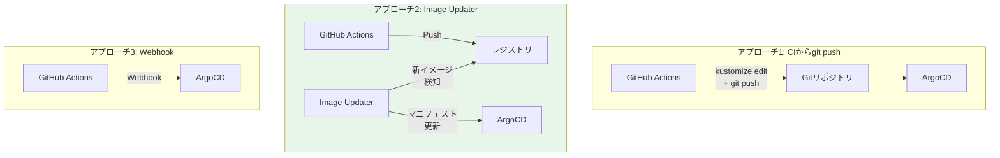
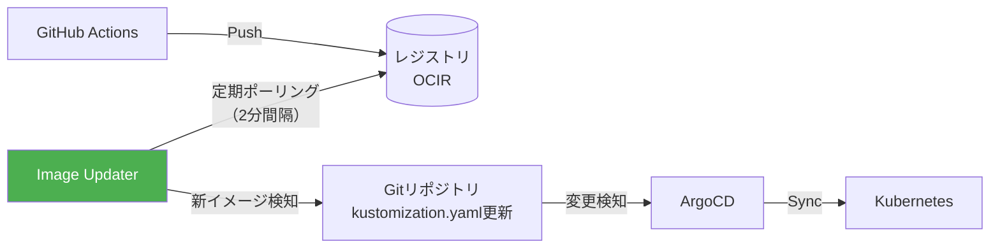
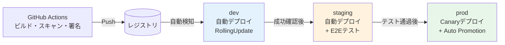
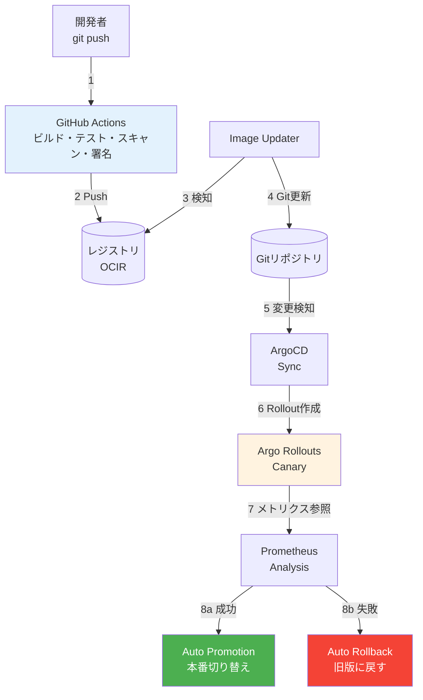
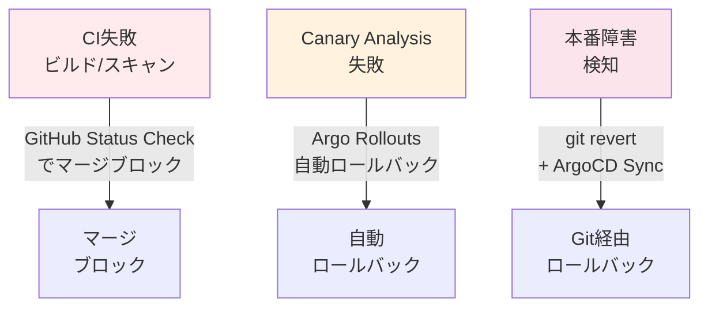
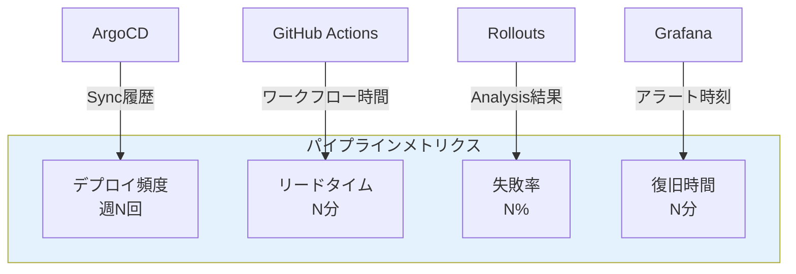
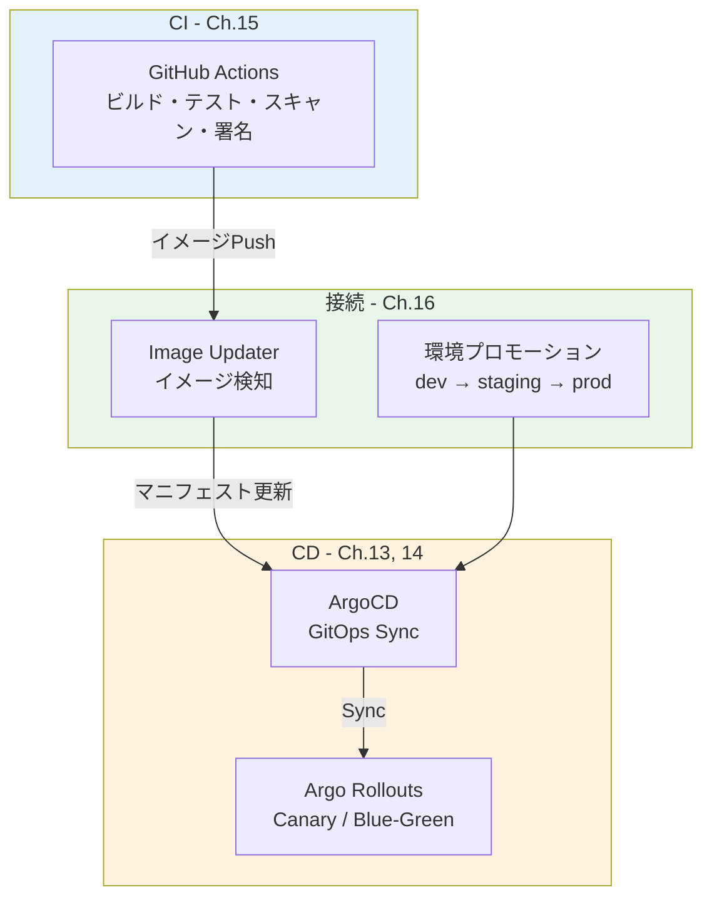

# 第16章 統合 ― End-to-End デリバリーパイプライン

第13章〜第15章でCI（GitHub Actions）とCD（ArgoCD + Argo Rollouts）を個別に構築した。本章では、ArgoCD Image Updaterで両者を接続し、環境プロモーション戦略（dev → staging → prod）を設計する。コードプッシュから本番Canaryデプロイ・Prometheusメトリクスによる自動判定までの一気通貫パイプラインを完成させる。

## 16.1 CI→CDの接続設計

### 3つのアプローチ

図16.1: CI→CD接続の3つのアプローチ比較



> 表16.1: CI→CD接続アプローチのトレードオフ比較

| アプローチ | GitOps準拠 | 疎結合性 | 設定の複雑さ | 推奨度 |
|-----------|-----------|---------|-----------|-------|
| CIからgit push | 高（Gitに記録される） | 低（CIにGit権限必要） | 中 | 中 |
| Image Updater | 高（Gitに記録可能） | 高（CIとCD分離） | 低 | 高 |
| Webhook | 低（Gitをバイパス） | 低（直接アクセス必要） | 低 | 低 |

本書ではアプローチ2（Image Updater）を採用する。CIとCDの責務が明確に分離され、GitOps原則にも準拠できる。

## 16.2 ArgoCD Image Updaterの導入

### インストールと設定

```yaml
# コード16.1: ArgoCD Image Updater Helmインストール
# helm install argocd-image-updater argo/argocd-image-updater \
#   -n book-cicd -f values.yaml
config:
  registries:
    - name: OCIR
      api_url: https://<region>.ocir.io
      prefix: <region>.ocir.io
      credentials: pullsecret:book-cicd/ocir-credentials
      default: true
```

図16.2: ArgoCD Image Updaterの動作フロー



### Applicationアノテーション

```yaml
# コード16.2: Applicationアノテーション（Image Updater設定）
apiVersion: argoproj.io/v1alpha1
kind: Application
metadata:
  name: book-app-prod
  namespace: book-cicd
  annotations:
    argocd-image-updater.argoproj.io/image-list: |
      order=<region>.ocir.io/namespace/order-service
    argocd-image-updater.argoproj.io/order.update-strategy: semver
    argocd-image-updater.argoproj.io/write-back-method: git
    argocd-image-updater.argoproj.io/write-back-target: "kustomization:overlays/prod"
spec:
  source:
    repoURL: https://github.com/your-org/book-app-manifests.git
    path: overlays/prod
    targetRevision: main
  destination:
    server: https://kubernetes.default.svc
    namespace: book-app
```

## 16.3 環境プロモーション戦略

### 3環境の設計

図16.3: 環境プロモーションフロー



### Kustomize overlaysによる環境差分管理

```yaml
# コード16.3: Kustomize overlays構成
# overlays/dev/kustomization.yaml
apiVersion: kustomize.config.k8s.io/v1beta1
kind: Kustomization
resources:
  - ../../base
namespace: book-app-dev
replicas:
  - name: order-service
    count: 1  # 開発環境は1レプリカ

# overlays/staging/kustomization.yaml
apiVersion: kustomize.config.k8s.io/v1beta1
kind: Kustomization
resources:
  - ../../base
namespace: book-app-staging
replicas:
  - name: order-service
    count: 2

# overlays/prod/kustomization.yaml
apiVersion: kustomize.config.k8s.io/v1beta1
kind: Kustomization
resources:
  - ../../base
  - rollout.yaml          # Rollout CRD（Canary戦略）
  - analysis-template.yaml # AnalysisTemplate
namespace: book-app
replicas:
  - name: order-service
    count: 3
```

```yaml
# コード16.4: ApplicationSet（環境プロモーション用）
apiVersion: argoproj.io/v1alpha1
kind: ApplicationSet
metadata:
  name: book-app-envs
  namespace: book-cicd
spec:
  generators:
    - list:
        elements:
          - env: dev
            syncPolicy: automated
            namespace: book-app-dev
          - env: staging
            syncPolicy: automated
            namespace: book-app-staging
          - env: prod
            syncPolicy: manual
            namespace: book-app
  template:
    metadata:
      name: "book-app-{{env}}"
    spec:
      project: book-project
      source:
        repoURL: https://github.com/your-org/book-app-manifests.git
        path: "overlays/{{env}}"
        targetRevision: main
      destination:
        server: https://kubernetes.default.svc
        namespace: "{{namespace}}"
```

## 16.4 E2Eパイプラインの構築

### 完全なフロー

図16.4: E2Eデリバリーパイプラインの全体アーキテクチャ



```yaml
# コード16.5: prod環境のRollout CRD + AnalysisTemplate（統合版）
apiVersion: argoproj.io/v1alpha1
kind: Rollout
metadata:
  name: order-service
  namespace: book-app
spec:
  replicas: 3
  strategy:
    canary:
      canaryService: order-service-canary
      stableService: order-service-stable
      steps:
        - setWeight: 10
        - analysis:
            templates:
              - templateName: production-analysis
            args:
              - name: service-name
                value: order-service
        - setWeight: 30
        - pause: { duration: 5m }
        - setWeight: 60
        - pause: { duration: 5m }
---
apiVersion: argoproj.io/v1alpha1
kind: AnalysisTemplate
metadata:
  name: production-analysis
  namespace: book-app
spec:
  args:
    - name: service-name
  metrics:
    - name: error-rate
      interval: 60s
      count: 5
      failureLimit: 1
      successCondition: result[0] < 0.01  # エラー率1%未満
      provider:
        prometheus:
          address: http://prometheus-server.book-observability:9090
          query: |
            sum(rate(http_server_duration_seconds_count{
              service="{{args.service-name}}", http_status_code=~"5.."
            }[5m])) / sum(rate(http_server_duration_seconds_count{
              service="{{args.service-name}}"
            }[5m]))
```

## 16.5 ロールバックとインシデント対応

### 障害パターンと対応

図16.5: 障害発生ポイント別のロールバックフロー



> 表16.2: 障害パターンとロールバック手順

| 障害パターン | 検知方法 | ロールバック方法 | 所要時間 |
|------------|---------|-------------|---------|
| CI失敗（ビルド/テスト） | GitHub Status Check | PRがマージ不可 | 即座 |
| Trivyスキャン失敗 | CI Job失敗 | PRがマージ不可 | 即座 |
| Canary Analysis失敗 | Argo Rollouts | 自動ロールバック | 1-2分 |
| 本番障害 | Grafanaアラート | git revert → ArgoCD Sync | 5-10分 |

## 16.6 運用のベストプラクティス

### DORA Four Keys

> 表16.3: DORA Four Keysとパイプラインメトリクスの対応

| DORA指標 | 説明 | 計測方法 |
|---------|------|---------|
| デプロイ頻度 | 本番デプロイの頻度 | ArgoCD Sync History |
| 変更リードタイム | コミットから本番デプロイまでの時間 | GitHub Actions + ArgoCD |
| 変更失敗率 | デプロイ後のロールバック率 | Argo Rollouts Analysis失敗率 |
| 復旧時間 | 障害検知から復旧までの時間 | Grafanaアラート + ロールバック完了時刻 |

図16.6: デリバリーパイプラインの可観測性ダッシュボード



### シークレット管理

```yaml
# コード16.7: Sealed Secretsによるシークレット管理
apiVersion: bitnami.com/v1alpha1
kind: SealedSecret
metadata:
  name: db-credentials
  namespace: book-app
spec:
  encryptedData:
    password: AgBe1... # 暗号化されたデータ
    username: AgCx2... # Gitにコミット可能
```

```yaml
# コード16.6: ArgoCD Notification設定（Slack連携）
notifications:
  triggers:
    - name: on-sync-succeeded
      template: app-sync-succeeded
      when: app.status.sync.status == 'Synced'
    - name: on-sync-failed
      template: app-sync-failed
      when: app.status.sync.status == 'Error'
  templates:
    - name: app-sync-succeeded
      message: "✅ {{.app.metadata.name}} の同期が完了しました"
```

## 16.7 Part 4のまとめ

### 構築した全コンポーネント

図16.7: Part 4で構築した全コンポーネントの関係図



Part 4では以下を達成した。

- **第13章**: ArgoCDによるGitOps管理（宣言的、自動同期、自己修復）
- **第14章**: Argo Rolloutsによるプログレッシブデリバリー（Canary、Auto Promotion）
- **第15章**: GitHub ActionsによるCI（ビルド、スキャン、署名）
- **第16章**: E2Eパイプラインの統合（Image Updater、環境プロモーション）

### Part 5への橋渡し

デリバリーパイプラインは完成したが、新しいサービスを追加する際には、Rollout CRD、ArgoCD Application、GitHub Actionsワークフロー、環境overlay等を手動で作成する必要がある。Part 5では、Platform Engineeringの観点から、Backstageでサービスカタログとソフトウェアテンプレート（Software Template）を構築し、開発者がセルフサービスで新サービスを立ち上げられるInternal Developer Platform（IDP）を実現する。

## 理解度チェック

1. ArgoCD Image Updaterを使ったCI→CD接続と、CIからgit pushでマニフェストを更新するアプローチを比較し、それぞれの利点・欠点を述べよ

2. dev → staging → prod の環境プロモーション戦略において、各環境でのデプロイ方法と判定基準をどのように差別化すべきか設計せよ

3. E2Eパイプラインにおいて、Canary Analysisが失敗した場合のロールバックフローを、関与する各コンポーネントの動作を含めて時系列で説明せよ

4. DORA Four Keysの各指標を、本章で構築したパイプラインのどのメトリクスから計測できるか対応づけよ

5. GitOps環境において、Secretをどのように安全に管理すべきか。Sealed SecretsとExternal Secrets Operatorの違いを説明せよ

## 参考文献

- ArgoCD Image Updater, https://argocd-image-updater.readthedocs.io/
- Sealed Secrets, https://sealed-secrets.netlify.app/
- DORA Four Keys, https://dora.dev/research/
- ArgoCD Notifications, https://argo-cd.readthedocs.io/en/stable/operator-manual/notifications/
