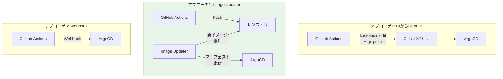
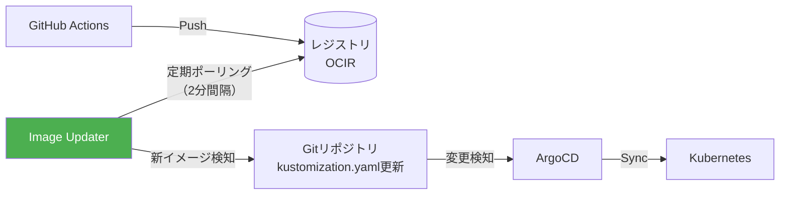
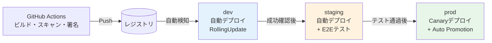
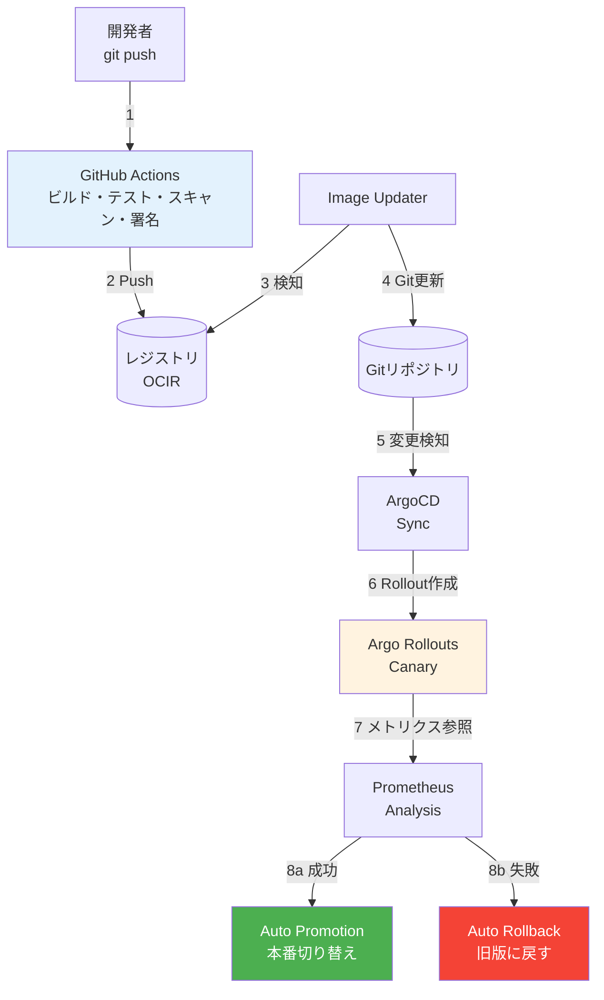
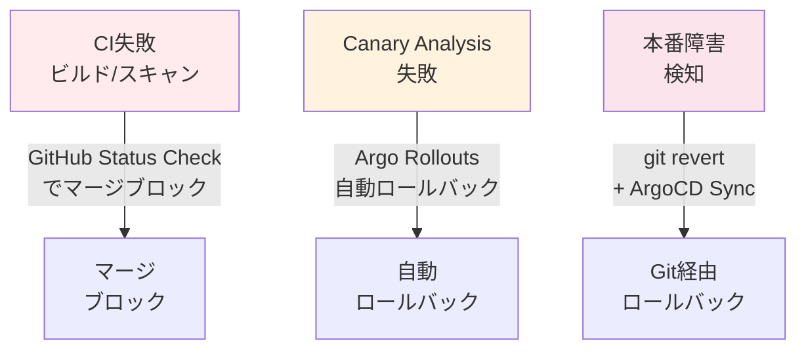
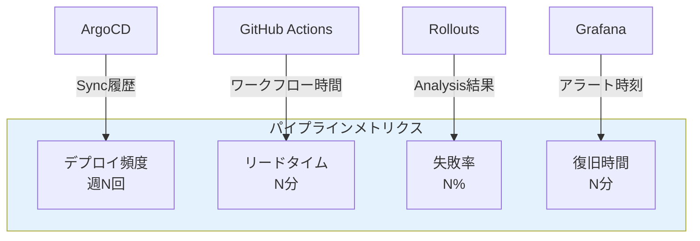
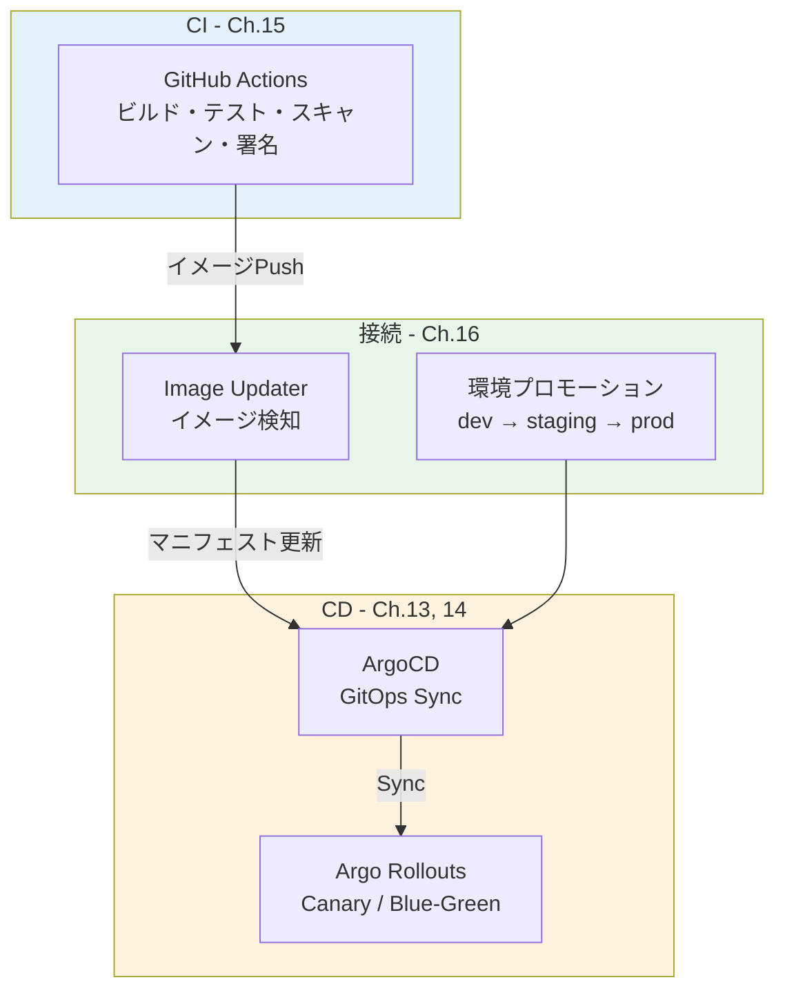

# 第16章 統合 ― End-to-End デリバリーパイプライン

第13章〜第15章でCI（GitHub Actions）とCD（ArgoCD + Argo Rollouts）を個別に構築した。本章では、ArgoCD Image Updaterで両者を接続し、環境プロモーション戦略（dev → staging → prod）を設計する。コードプッシュから本番Canaryデプロイ・Prometheusメトリクスによる自動判定までの一気通貫パイプラインを完成させる。

## 16.1 CI→CDの接続設計

### 3つのアプローチ

図16.1: CI→CD接続の3つのアプローチ比較



> 表16.1: CI→CD接続アプローチのトレードオフ比較

| アプローチ | GitOps準拠 | 疎結合性 | 設定の複雑さ | 推奨度 |
|-----------|-----------|---------|-----------|-------|
| CIからgit push | 高（Gitに記録される） | 低（CIにGit権限必要） | 中 | 中 |
| Image Updater | 高（Gitに記録可能） | 高（CIとCD分離） | 低 | 高 |
| Webhook | 低（Gitをバイパス） | 低（直接アクセス必要） | 低 | 低 |

本書ではアプローチ2（Image Updater）を採用する。CIとCDの責務が明確に分離され、GitOps原則にも準拠できる。

### 各アプローチの詳細分析

**アプローチ1（CIからgit push）** は、GitHub ActionsのワークフローにGitリポジトリへの書き込みステップを追加する方式である。具体的には、CIがイメージビルド後に `kustomize edit set image` でマニフェストを更新し、git commitとpushを行う。この方式の最大の問題はCI側にGitリポジトリへの書き込み権限が必要な点にある。Personal Access TokenやDeploy Keyの管理負荷が発生し、CIとCDが密結合になる。CIワークフローの変更がマニフェスト更新に影響を及ぼすリスクもある。

**アプローチ2（Image Updater）** は、CIはイメージのビルドとレジストリへのPushのみを担当し、Image Updaterが独立してレジストリを監視する。新しいイメージが検知されると、Image Updaterがwrite-backメソッド（git方式またはArgoCD方式）に従ってマニフェストを更新する。CIとCDが完全に分離されるため、片方の障害がもう片方に影響しない。チーム間の責務分界点も明確になる。

**アプローチ3（Webhook）** は、CIからArgoCDのAPIを直接呼び出してSyncをトリガーする方式である。実装は単純だが、GitOpsの根幹である「Gitが唯一の信頼源（Single Source of Truth）」の原則を破る。Gitに記録されないデプロイが発生するため、監査やロールバックが困難になる。本番環境での採用は推奨されない。

## 16.2 ArgoCD Image Updaterの導入

### インストールと設定

```yaml
# コード16.1: ArgoCD Image Updater Helmインストール
# helm install argocd-image-updater argo/argocd-image-updater \
#   -n book-cicd -f values.yaml
config:
  registries:
    - name: OCIR
      api_url: https://<region>.ocir.io
      prefix: <region>.ocir.io
      credentials: pullsecret:book-cicd/ocir-credentials
      default: true
```

図16.2: ArgoCD Image Updaterの動作フロー



### Update Strategyの選択

Image Updaterは複数のUpdate Strategyを提供する。用途に応じた使い分けが重要である。

> 表16.1b: Image Updater Update Strategyの比較

| Strategy | 動作 | ユースケース |
|----------|------|------------|
| semver | セマンティックバージョニングに基づき最新バージョンを選択 | 本番環境向け。タグ規約が整備されている場合 |
| latest | 最終更新日時が最新のイメージを選択 | 開発環境向け。タグに依存しない場合 |
| digest | 特定タグのダイジェストが変更されたら更新 | 同一タグ（latestなど）で上書きビルドする場合 |
| name | タグ名のアルファベット順で最新を選択 | 日付ベースのタグ（20260310など）を使う場合 |

semver戦略を採用する場合、タグのフィルタリングにconstraintを指定できる。たとえば `~1.2` は `1.2.x` の範囲内で最新バージョンを選択し、`^1.0` は `1.x.x` の範囲で最新を選択する。本番環境ではマイナーバージョンの自動更新を避け、パッチバージョンのみ自動更新する `~X.Y` 形式が安全である。

### Applicationアノテーション

```yaml
# コード16.2: Applicationアノテーション（Image Updater設定）
apiVersion: argoproj.io/v1alpha1
kind: Application
metadata:
  name: book-app-prod
  namespace: book-cicd
  annotations:
    argocd-image-updater.argoproj.io/image-list: |
      order=<region>.ocir.io/namespace/order-service
    argocd-image-updater.argoproj.io/order.update-strategy: semver
    argocd-image-updater.argoproj.io/write-back-method: git
    argocd-image-updater.argoproj.io/write-back-target: "kustomization:overlays/prod"
spec:
  source:
    repoURL: https://github.com/your-org/book-app-manifests.git
    path: overlays/prod
    targetRevision: main
  destination:
    server: https://kubernetes.default.svc
    namespace: book-app
```

## 16.3 環境プロモーション戦略

### 3環境の設計

図16.3: 環境プロモーションフロー



### Kustomize overlaysによる環境差分管理

```yaml
# コード16.3: Kustomize overlays構成
# overlays/dev/kustomization.yaml
apiVersion: kustomize.config.k8s.io/v1beta1
kind: Kustomization
resources:
  - ../../base
namespace: book-app-dev
replicas:
  - name: order-service
    count: 1  # 開発環境は1レプリカ

# overlays/staging/kustomization.yaml
apiVersion: kustomize.config.k8s.io/v1beta1
kind: Kustomization
resources:
  - ../../base
namespace: book-app-staging
replicas:
  - name: order-service
    count: 2

# overlays/prod/kustomization.yaml
apiVersion: kustomize.config.k8s.io/v1beta1
kind: Kustomization
resources:
  - ../../base
  - rollout.yaml          # Rollout CRD（Canary戦略）
  - analysis-template.yaml # AnalysisTemplate
namespace: book-app
replicas:
  - name: order-service
    count: 3
```

```yaml
# コード16.4: ApplicationSet（環境プロモーション用）
apiVersion: argoproj.io/v1alpha1
kind: ApplicationSet
metadata:
  name: book-app-envs
  namespace: book-cicd
spec:
  generators:
    - list:
        elements:
          - env: dev
            syncPolicy: automated
            namespace: book-app-dev
          - env: staging
            syncPolicy: automated
            namespace: book-app-staging
          - env: prod
            syncPolicy: manual
            namespace: book-app
  template:
    metadata:
      name: "book-app-{{env}}"
    spec:
      project: book-project
      source:
        repoURL: https://github.com/your-org/book-app-manifests.git
        path: "overlays/{{env}}"
        targetRevision: main
      destination:
        server: https://kubernetes.default.svc
        namespace: "{{namespace}}"
```

### 環境間のイメージタグ戦略

環境プロモーションにおいて、各環境でのイメージタグ管理は重要な設計判断である。

> 表16.1c: 環境別イメージタグ戦略

| 環境 | タグ形式 | Update Strategy | 自動/手動 |
|------|---------|----------------|----------|
| dev | `git-<SHA>` | latest（最終更新日時） | 自動 |
| staging | `v1.2.3-rc.1` | semver（プレリリース含む） | 自動（E2Eテスト通過後） |
| prod | `v1.2.3` | semver（安定版のみ） | 手動承認後 |

dev環境ではgit SHAベースのタグを使い、コミットごとに自動デプロイする。staging環境ではリリース候補（RC）タグを使い、E2Eテスト通過を条件に自動デプロイする。prod環境では安定版タグのみを対象とし、手動承認後にデプロイを実行する。

この戦略により、開発中のイメージが誤って本番環境にデプロイされるリスクを排除できる。Image Updaterのタグフィルタリング機能（`argocd-image-updater.argoproj.io/<alias>.allow-tags`）を活用して、各環境で受け入れるタグパターンを制限する。

## 16.4 E2Eパイプラインの構築

### 完全なフロー

図16.4: E2Eデリバリーパイプラインの全体アーキテクチャ



```yaml
# コード16.5: prod環境のRollout CRD + AnalysisTemplate（統合版）
apiVersion: argoproj.io/v1alpha1
kind: Rollout
metadata:
  name: order-service
  namespace: book-app
spec:
  replicas: 3
  strategy:
    canary:
      canaryService: order-service-canary
      stableService: order-service-stable
      steps:
        - setWeight: 10
        - analysis:
            templates:
              - templateName: production-analysis
            args:
              - name: service-name
                value: order-service
        - setWeight: 30
        - pause: { duration: 5m }
        - setWeight: 60
        - pause: { duration: 5m }
---
apiVersion: argoproj.io/v1alpha1
kind: AnalysisTemplate
metadata:
  name: production-analysis
  namespace: book-app
spec:
  args:
    - name: service-name
  metrics:
    - name: error-rate
      interval: 60s
      count: 5
      failureLimit: 1
      successCondition: result[0] < 0.01  # エラー率1%未満
      provider:
        prometheus:
          address: http://prometheus-server.book-observability:9090
          query: |
            sum(rate(http_server_duration_seconds_count{
              service="{{args.service-name}}", http_status_code=~"5.."
            }[5m])) / sum(rate(http_server_duration_seconds_count{
              service="{{args.service-name}}"
            }[5m]))
```

### Canary戦略の詳細設計

コード16.5のRollout CRDにおけるCanary戦略は、トラフィック重み付けとAnalysis実行を段階的に組み合わせている。この設計の背景を詳しく解説する。

**ステップの設計意図**

1. **setWeight: 10**: 最初に全体トラフィックの10%を新バージョンに振り向ける。この段階でユーザー影響を最小限に抑えつつ、実トラフィックでの挙動を確認する
2. **analysis（production-analysis）**: 10%トラフィック下で5分間（interval: 60s x count: 5）のメトリクス分析を実行する。エラー率が1%を超えた場合、ここで即座にロールバックが発生する
3. **setWeight: 30 → pause: 5m**: Analysis通過後、トラフィックを30%に増加し5分間安定性を確認する
4. **setWeight: 60 → pause: 5m**: さらに60%に増加し安定性を確認する
5. **暗黙のsetWeight: 100**: 全ステップ完了後、自動的に100%トラフィックが新バージョンに切り替わる

この段階的なトラフィック増加により、障害の影響範囲を段階的に制御できる。10%の段階でエラーが検知された場合、影響を受けるユーザーは全体の10%に留まる。

**AnalysisTemplateの設計詳細**

production-analysisテンプレートでは、Prometheusからエラー率を算出している。クエリの構造を分解する。

- **分子**: `sum(rate(http_server_duration_seconds_count{service="...", http_status_code=~"5.."}[5m]))` ― 5分間の5xxエラーレート
- **分母**: `sum(rate(http_server_duration_seconds_count{service="..."}[5m]))` ― 5分間の全リクエストレート
- **判定条件**: `result[0] < 0.01` ― エラー率が1%未満であれば成功

`failureLimit: 1` の設定により、5回の計測のうち1回でも失敗すると即座にロールバックが発生する。逆に言えば、一時的なスパイクに対しても厳格に反応する。本番環境の安全性を重視した設定である。

**複数メトリクスを組み合わせたAnalysisTemplate**

本番環境ではエラー率だけでなく、レイテンシやスループットも同時に監視することが推奨される。以下は複数メトリクスを組み合わせた拡張版のAnalysisTemplateである。

```yaml
# コード16.5b: 複合メトリクスAnalysisTemplate
apiVersion: argoproj.io/v1alpha1
kind: AnalysisTemplate
metadata:
  name: production-analysis-comprehensive
  namespace: book-app
spec:
  args:
    - name: service-name
  metrics:
    - name: error-rate
      interval: 60s
      count: 5
      failureLimit: 1
      successCondition: result[0] < 0.01
      provider:
        prometheus:
          address: http://prometheus-server.book-observability:9090
          query: |
            sum(rate(http_server_duration_seconds_count{
              service="{{args.service-name}}", http_status_code=~"5.."
            }[5m])) / sum(rate(http_server_duration_seconds_count{
              service="{{args.service-name}}"
            }[5m]))
    - name: p99-latency
      interval: 60s
      count: 5
      failureLimit: 2
      successCondition: result[0] < 500
      provider:
        prometheus:
          address: http://prometheus-server.book-observability:9090
          query: |
            histogram_quantile(0.99,
              sum(rate(http_server_duration_seconds_bucket{
                service="{{args.service-name}}"
              }[5m])) by (le)
            ) * 1000
    - name: throughput-degradation
      interval: 60s
      count: 5
      failureLimit: 2
      successCondition: result[0] > 0.8
      provider:
        prometheus:
          address: http://prometheus-server.book-observability:9090
          query: |
            sum(rate(http_server_duration_seconds_count{
              service="{{args.service-name}}"
            }[5m])) / sum(rate(http_server_duration_seconds_count{
              service="{{args.service-name}}"
            }[5m] offset 1h))
```

このテンプレートでは三つのメトリクスを同時に評価する。

- **error-rate**: エラー率1%未満（失敗許容1回）
- **p99-latency**: P99レイテンシが500ms未満（失敗許容2回）
- **throughput-degradation**: スループットが1時間前と比較して80%以上を維持（失敗許容2回）

いずれか一つのメトリクスでも失敗条件を超えると、Rolloutは自動的にロールバックを開始する。

## 16.5 ロールバックとインシデント対応

### 障害パターンと対応

図16.5: 障害発生ポイント別のロールバックフロー



> 表16.2: 障害パターンとロールバック手順

| 障害パターン | 検知方法 | ロールバック方法 | 所要時間 |
|------------|---------|-------------|---------|
| CI失敗（ビルド/テスト） | GitHub Status Check | PRがマージ不可 | 即座 |
| Trivyスキャン失敗 | CI Job失敗 | PRがマージ不可 | 即座 |
| Canary Analysis失敗 | Argo Rollouts | 自動ロールバック | 1-2分 |
| 本番障害 | Grafanaアラート | git revert → ArgoCD Sync | 5-10分 |

### ロールバックの時系列フロー

Canary Analysisが失敗した場合の具体的な時系列フローを解説する。

1. **T+0秒**: Rolloutがステップ `setWeight: 10` を実行。Canary Podに全体の10%のトラフィックが振り向けられる
2. **T+0秒〜T+5分**: `production-analysis` が開始。60秒間隔でPrometheusにクエリを発行し、エラー率を計測する
3. **T+2分（例）**: 新バージョンにバグがあり、エラー率が5%に上昇。Analysisの3回目の計測で `successCondition: result[0] < 0.01` を満たさない
4. **T+2分**: `failureLimit: 1` に到達。AnalysisRunのステータスが `Failed` に遷移する
5. **T+2分**: Rollout ControllerがAnalysisRunの失敗を検知し、Rolloutのフェーズを `Degraded` に変更する
6. **T+2分〜T+3分**: Rollout Controllerが自動ロールバックを開始する。Canary ReplicaSetのスケールダウンと、Stable ReplicaSetへの全トラフィック復帰が実行される
7. **T+3分**: ロールバック完了。全トラフィックが旧バージョン（Stable）に戻る。Rolloutのステータスは `Degraded` のまま保持される

この一連のフローは完全に自動化されている。人間の介入なしに、問題のある新バージョンからの退避が完了する。

### 手動ロールバックのシナリオ

Canary Analysisでは検知できない問題（ビジネスロジックの誤り、データ不整合等）が本番稼働後に発覚した場合は、GitOpsフローに沿ったロールバックを行う。

```bash
# コード16.5c: git revertによるロールバック手順
# 1. 問題のあるコミットを特定
git log --oneline -5

# 2. 問題のコミットをrevert
git revert <commit-hash>

# 3. pushしてArgoCDの自動同期をトリガー
git push origin main

# 4. ArgoCDの同期状態を確認
argocd app get book-app-prod
```

git revertによるロールバックの利点は、変更履歴が保持される点にある。`git reset --hard` と異なり、「何を戻したか」がGitの履歴に残るため、事後のインシデント分析に活用できる。

## 16.6 運用のベストプラクティス

### DORA Four Keys

> 表16.3: DORA Four Keysとパイプラインメトリクスの対応

| DORA指標 | 説明 | 計測方法 |
|---------|------|---------|
| デプロイ頻度 | 本番デプロイの頻度 | ArgoCD Sync History |
| 変更リードタイム | コミットから本番デプロイまでの時間 | GitHub Actions + ArgoCD |
| 変更失敗率 | デプロイ後のロールバック率 | Argo Rollouts Analysis失敗率 |
| 復旧時間 | 障害検知から復旧までの時間 | Grafanaアラート + ロールバック完了時刻 |

図16.6: デリバリーパイプラインの可観測性ダッシュボード



### DORA Four Keysの計測方法の詳細

DORA Four Keysの各指標を、本パイプラインから具体的にどう計測するかを詳しく解説する。

**デプロイ頻度** は、ArgoCDのSync Historyから取得する。ArgoCD APIの `/api/v1/applications/{name}/events` エンドポイントから同期イベントを取得し、日次・週次の頻度を集計する。Grafanaのargocd-exporterメトリクス（`argocd_app_sync_total`）をダッシュボード化する方法もある。

**変更リードタイム** は、GitHub ActionsのワークフローとArgoCDの同期時刻を組み合わせて計測する。具体的には、`github.event.head_commit.timestamp`（コミット時刻）から、ArgoCD Syncが完了し、Argo RolloutsのRolloutが `Healthy` に遷移した時刻までの差分を算出する。Image Updaterの検知遅延（ポーリング間隔）も含まれるため、ポーリング間隔の設定がリードタイムに直接影響する。

**変更失敗率** は、Argo RolloutsのAnalysisRun結果から算出する。`kubectl get analysisruns -n book-app` の結果から、`Failed` ステータスの割合を計算する。Prometheusメトリクス `rollout_info{phase="Degraded"}` の発生頻度も指標となる。

**復旧時間（MTTR）** は、Grafanaアラートの発火時刻と、ロールバック完了時刻（Rolloutが再び `Healthy` になった時刻）の差分から算出する。自動ロールバックの場合は通常1〜3分、手動のgit revertの場合は5〜15分が目安となる。

### シークレット管理

```yaml
# コード16.7: Sealed Secretsによるシークレット管理
apiVersion: bitnami.com/v1alpha1
kind: SealedSecret
metadata:
  name: db-credentials
  namespace: book-app
spec:
  encryptedData:
    password: AgBe1... # 暗号化されたデータ
    username: AgCx2... # Gitにコミット可能
```

GitOps環境でのシークレット管理には、Sealed Secrets以外にも複数のアプローチがある。

> 表16.3b: シークレット管理手法の比較

| 手法 | 概要 | 暗号化方式 | GitOps適合性 | 運用負荷 |
|------|------|----------|------------|---------|
| Sealed Secrets | クラスタ固有の鍵で暗号化 | 非対称暗号（RSA） | 高（Gitにコミット可能） | 低 |
| External Secrets Operator | 外部シークレットストア参照 | 外部サービスに委任 | 中（参照のみGit管理） | 中 |
| SOPS + Age | ファイル暗号化 | 対称暗号/非対称暗号 | 高（暗号化ファイルをGit管理） | 中 |
| HashiCorp Vault | 専用シークレット管理サービス | AES-256-GCM | 中（Vault自体の管理が必要） | 高 |

Sealed Secretsはシンプルで導入が容易だが、クラスタ再構築時に鍵の移行が必要になる。External Secrets Operatorは外部シークレットストア（OCI Vault等）と連携し、シークレットの実体をクラスタ外に保持する。大規模な組織やマルチクラスタ環境では、External Secrets OperatorやVaultの導入が推奨される。

```yaml
# コード16.6: ArgoCD Notification設定（Slack連携）
notifications:
  triggers:
    - name: on-sync-succeeded
      template: app-sync-succeeded
      when: app.status.sync.status == 'Synced'
    - name: on-sync-failed
      template: app-sync-failed
      when: app.status.sync.status == 'Error'
  templates:
    - name: app-sync-succeeded
      message: "✅ {{.app.metadata.name}} の同期が完了しました"
```

## 16.7 Part 4のまとめ

### 構築した全コンポーネント

図16.7: Part 4で構築した全コンポーネントの関係図



Part 4では以下を達成した。

- **第13章**: ArgoCDによるGitOps管理（宣言的、自動同期、自己修復）
- **第14章**: Argo Rolloutsによるプログレッシブデリバリー（Canary、Auto Promotion）
- **第15章**: GitHub ActionsによるCI（ビルド、スキャン、署名）
- **第16章**: E2Eパイプラインの統合（Image Updater、環境プロモーション）

### Part 5への橋渡し

デリバリーパイプラインは完成したが、新しいサービスを追加する際には、Rollout CRD、ArgoCD Application、GitHub Actionsワークフロー、環境overlay等を手動で作成する必要がある。Part 5では、Platform Engineeringの観点から、Backstageでサービスカタログとソフトウェアテンプレート（Software Template）を構築し、開発者がセルフサービスで新サービスを立ち上げられるInternal Developer Platform（IDP）を実現する。

## 理解度チェック

1. ArgoCD Image Updaterを使ったCI→CD接続と、CIからgit pushでマニフェストを更新するアプローチを比較し、それぞれの利点・欠点を述べよ

2. dev → staging → prod の環境プロモーション戦略において、各環境でのデプロイ方法と判定基準をどのように差別化すべきか設計せよ

3. E2Eパイプラインにおいて、Canary Analysisが失敗した場合のロールバックフローを、関与する各コンポーネントの動作を含めて時系列で説明せよ

4. DORA Four Keysの各指標を、本章で構築したパイプラインのどのメトリクスから計測できるか対応づけよ

5. GitOps環境において、Secretをどのように安全に管理すべきか。Sealed SecretsとExternal Secrets Operatorの違いを説明せよ

## 参考文献

- ArgoCD Image Updater, https://argocd-image-updater.readthedocs.io/
- Sealed Secrets, https://sealed-secrets.netlify.app/
- DORA Four Keys, https://dora.dev/research/
- ArgoCD Notifications, https://argo-cd.readthedocs.io/en/stable/operator-manual/notifications/
