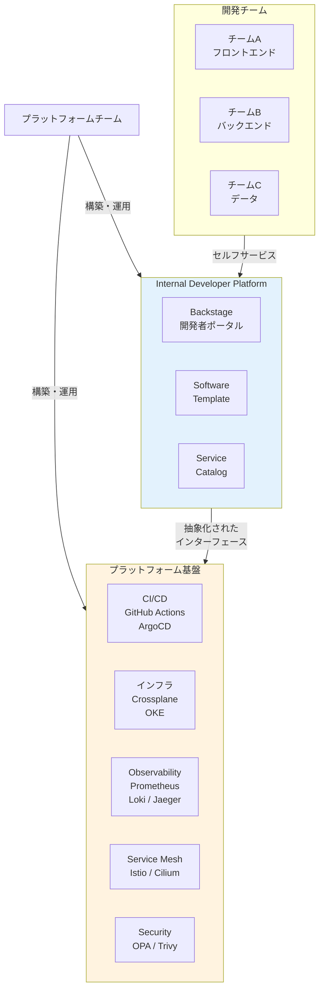
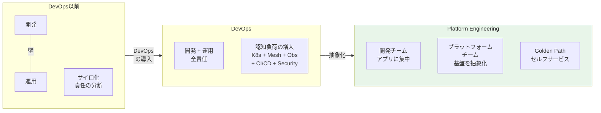
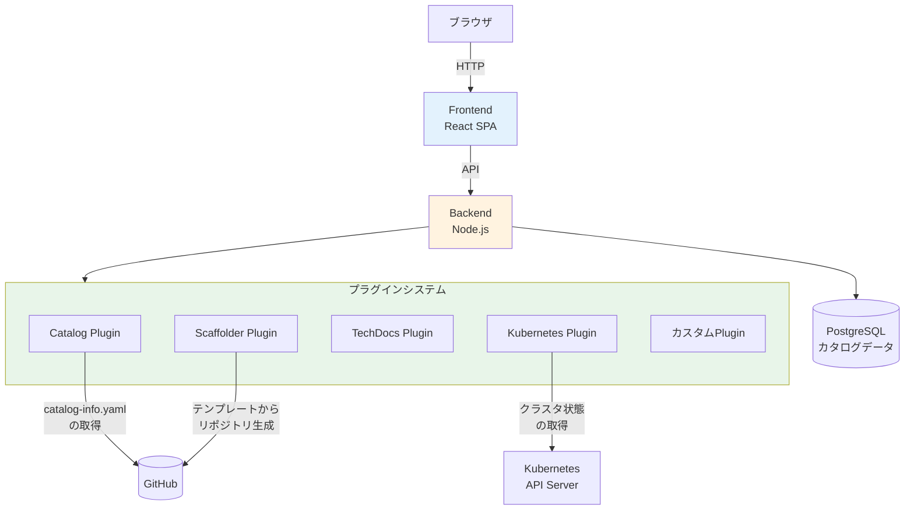
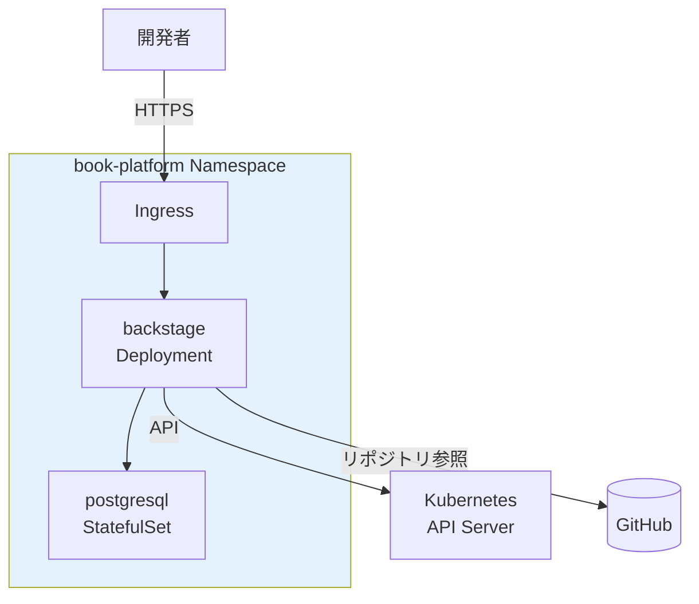
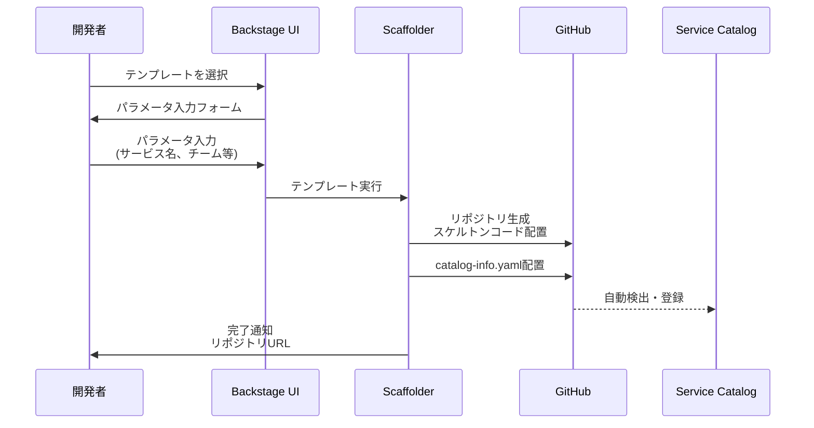

# 第17章 Internal Developer Platform ― Backstage

Part 1〜4で、Observability、Service Mesh、Security、CI/CD & GitOpsの基盤を個別に構築してきた。しかし、新しいサービスを追加する際には、リポジトリの作成、マニフェストの用意、ArgoCD Applicationの登録、Observabilityの設定、NetworkPolicyの定義など、多くの手作業が必要である。Part 5では、これらの技術群を「開発者に提供するプラットフォーム」として統合するPlatform Engineeringを導入する。本章では、Backstageを用いてInternal Developer Platform（IDP）の基盤を構築する。

## 17.1 Platform Engineeringとは何か

### DevOpsの進化形

DevOpsは「You build it, you run it」の原則でサイロを取り払った。しかし、クラウドネイティブ技術の急速な発展により、開発者が理解すべき技術スタックは膨大になった。Kubernetes、Service Mesh、Observability、CI/CD、セキュリティポリシー ― これらすべてを各開発チームが個別に習得・運用するのは現実的ではない。

Platform Engineeringは、この認知負荷（Cognitive Load）の問題を解決するアプローチである。専門のプラットフォームチームがインフラと運用の複雑さを抽象化し、開発チームにセルフサービスのインターフェースとして提供する。

図17.1: Platform Engineeringの全体像



### 認知負荷の変化

図17.2: 認知負荷の変化



### IDPの三要素

IDPは以下の三要素で構成される。

1. **セルフサービス**: 開発者がチケットや依頼なしに、必要なリソースを自分で調達できる
2. **Golden Path**: 推奨される標準的な構成テンプレート。自由度を保ちつつ、ベストプラクティスに沿った設計を誘導する
3. **自動化**: テンプレートからの生成、CI/CDパイプライン、インフラプロビジョニングが自動で実行される

Team Topologiesの分類では、プラットフォームチームはストリームアラインドチーム（開発チーム）の認知負荷を減らすことを目的とするチームタイプである。プラットフォームチームの提供物はドキュメントやWikiではなく、「使えるプラットフォーム」そのものである。

## 17.2 Backstageの概要とアーキテクチャ

### Backstageとは

Backstageは、Spotifyが開発しCNCFに寄贈したオープンソースのInternal Developer Platform構築フレームワークである。2022年にCNCF Incubatingプロジェクトとなり、2025年にGraduatedプロジェクトに昇格した。

Backstageは「箱から出してすぐ使える完成品」ではなく、組織固有のIDPを構築するためのフレームワークである。プラグインシステムにより、CI/CD、Observability、クラウドサービスなど、任意のツールとの統合が可能である。

> 表17.1: Backstageのコア機能一覧

| コア機能 | 概要 | 用途 |
|---------|------|------|
| Service Catalog | サービス・API・インフラのカタログ管理 | サービスの発見、依存関係の把握、オーナーシップ管理 |
| Software Templates | テンプレートからの新規サービス生成 | Golden Pathの実装、標準化されたプロジェクト初期化 |
| TechDocs | ドキュメントのカタログ統合 | docs-as-codeによる技術ドキュメント管理 |
| Search | カタログ横断の全文検索 | サービス・API・ドキュメントの発見 |
| Kubernetes Plugin | クラスタリソースの可視化 | PodやDeploymentの状態をBackstage上で確認 |

### アーキテクチャ

図17.3: Backstageのアーキテクチャ



Backstageは、フロントエンド（React SPA）とバックエンド（Node.js）で構成される。バックエンドはプラグインシステムを通じて外部サービスと連携する。カタログデータはPostgreSQLに格納される。

### Entityの概念

Backstageでは、管理対象のすべてのリソースをEntity（エンティティ）として表現する。Entityは `catalog-info.yaml` というYAMLファイルで定義され、Gitリポジトリのルートに配置する。Backstageは定期的にこのファイルを読み取り、カタログに反映する。

## 17.3 Backstageのデプロイ

### Helmチャートによるインストール

```yaml
# コード17.1: Backstage Helm valuesの主要設定
# helm install backstage backstage/backstage -n book-platform --create-namespace -f values.yaml
backstage:
  image:
    registry: ghcr.io
    repository: backstage/backstage
    tag: latest
  appConfig:
    configMapRef: backstage-app-config
  extraEnvVars:
    - name: POSTGRES_HOST
      value: backstage-postgresql
    - name: POSTGRES_USER
      value: backstage

postgresql:
  enabled: true
  auth:
    username: backstage
    password: backstage-password
    database: backstage

ingress:
  enabled: true
  host: backstage.example.com
```

```yaml
# コード17.2: app-config.yamlの設定例
app:
  title: CloudNative Book Platform
  baseUrl: http://backstage.example.com

backend:
  baseUrl: http://backstage.example.com
  database:
    client: pg
    connection:
      host: ${POSTGRES_HOST}
      port: 5432
      user: ${POSTGRES_USER}
      password: ${POSTGRES_PASSWORD}

catalog:
  locations:
    - type: url
      target: https://github.com/your-org/book-app/blob/main/catalog-info.yaml
      rules:
        - allow: [Component, API, Resource, System, Group]

  providers:
    github:
      yourOrg:
        organization: your-org
        catalogPath: /catalog-info.yaml
        schedule:
          frequency: { minutes: 30 }
          timeout: { minutes: 3 }

kubernetes:
  serviceLocatorMethod:
    type: multiTenant
  clusterLocatorMethods:
    - type: config
      clusters:
        - url: https://kubernetes.default.svc
          name: oke-cluster
          authProvider: serviceAccount
          serviceAccountToken: ${K8S_SA_TOKEN}
```

図17.4: Backstageのデプロイ構成



## 17.4 サービスカタログの構築

### catalog-info.yamlの記述

サンプルアプリケーションの各サービスをBackstageのカタログに登録する。

```yaml
# コード17.3: catalog-info.yaml（Componentの定義例）
apiVersion: backstage.io/v1alpha1
kind: Component
metadata:
  name: order-service
  description: 注文管理サービス
  annotations:
    backstage.io/techdocs-ref: dir:.
    github.com/project-slug: your-org/order-service
    backstage.io/kubernetes-label-selector: app=order-service
  tags:
    - go
    - grpc
spec:
  type: service
  lifecycle: production
  owner: backend-team
  system: book-app
  providesApis:
    - order-api
  dependsOn:
    - resource:order-db
    - component:product-service
```

```yaml
# コード17.4: catalog-info.yaml（API定義とリレーション）
apiVersion: backstage.io/v1alpha1
kind: API
metadata:
  name: order-api
  description: 注文管理API
spec:
  type: grpc
  lifecycle: production
  owner: backend-team
  system: book-app
  definition: |
    syntax = "proto3";
    service OrderService {
      rpc CreateOrder(CreateOrderRequest) returns (Order);
      rpc GetOrder(GetOrderRequest) returns (Order);
      rpc ListOrders(ListOrdersRequest) returns (ListOrdersResponse);
    }
---
apiVersion: backstage.io/v1alpha1
kind: Resource
metadata:
  name: order-db
  description: 注文データベース
spec:
  type: database
  owner: backend-team
  system: book-app
```

> 表17.2: catalog-info.yamlの主要フィールド

| フィールド | 説明 | 例 |
|-----------|------|-----|
| apiVersion | Backstage APIバージョン | `backstage.io/v1alpha1` |
| kind | Entityの種類 | `Component`, `API`, `Resource`, `System`, `Group` |
| metadata.name | Entity名（一意） | `order-service` |
| metadata.annotations | Backstageプラグイン向けメタデータ | `backstage.io/kubernetes-label-selector` |
| spec.type | Entityのサブタイプ | `service`, `library`, `website` |
| spec.owner | 所有チーム/ユーザー | `backend-team` |
| spec.dependsOn | 依存するEntity | `component:product-service` |
| spec.providesApis | 提供するAPI | `order-api` |
| spec.consumesApis | 消費するAPI | `product-api` |

### 依存関係グラフ

サンプルアプリケーションの全サービスをカタログに登録すると、Backstage上で依存関係が可視化される。

図17.5: サービスカタログの依存関係グラフ

```
┌──────────────────────────────────────────────────────────┐
│  Backstage - Service Catalog                            │
│                                                          │
│  System: book-app                                        │
│                                                          │
│  ┌──────────┐    ┌──────────────┐    ┌───────────────┐  │
│  │ frontend │───▶│ api-gateway  │───▶│ order-service │  │
│  │ (website)│    │ (service)    │    │ (service)     │  │
│  └──────────┘    └──────┬───────┘    └──────┬────────┘  │
│                         │                    │           │
│                         ▼                    ▼           │
│                  ┌──────────────┐    ┌──────────────┐   │
│                  │product-service│   │   order-db   │   │
│                  │ (service)    │    │ (database)   │   │
│                  └──────┬───────┘    └──────────────┘   │
│                         │                                │
│                         ▼                                │
│                  ┌──────────────┐                        │
│                  │  product-db  │                        │
│                  │ (database)   │                        │
│                  └──────────────┘                        │
│                                                          │
│  Owner: backend-team  │  Lifecycle: production           │
└──────────────────────────────────────────────────────────┘
```

## 17.5 Software Templateによる新サービス作成

### Golden Pathの実装

Software Templateは、Backstageが提供する新規サービスの足場生成（Scaffolding）機能である。開発者はBackstage UIからテンプレートを選択し、パラメータを入力するだけで、標準構成のリポジトリが自動生成される。

図17.6: Software Templateのワークフロー



```yaml
# コード17.5: template.yaml（Software Template定義）
apiVersion: scaffolder.backstage.io/v1beta3
kind: Template
metadata:
  name: go-microservice
  title: Goマイクロサービス
  description: 標準構成のGoマイクロサービスを生成する
  tags:
    - go
    - microservice
    - recommended
spec:
  owner: platform-team
  type: service

  parameters:
    - title: サービス情報
      required:
        - serviceName
        - owner
        - description
      properties:
        serviceName:
          title: サービス名
          type: string
          pattern: "^[a-z][a-z0-9-]*$"
        owner:
          title: オーナーチーム
          type: string
          ui:field: OwnerPicker
        description:
          title: 説明
          type: string

    - title: インフラ要件
      properties:
        needsDatabase:
          title: データベースが必要
          type: boolean
          default: false
        needsCache:
          title: キャッシュが必要
          type: boolean
          default: false

  steps:
    - id: fetch-skeleton
      name: スケルトン生成
      action: fetch:template
      input:
        url: ./skeleton
        values:
          serviceName: ${{ parameters.serviceName }}
          owner: ${{ parameters.owner }}
          description: ${{ parameters.description }}

    - id: publish
      name: GitHubリポジトリ作成
      action: publish:github
      input:
        allowedHosts: ["github.com"]
        repoUrl: github.com?owner=your-org&repo=${{ parameters.serviceName }}
        description: ${{ parameters.description }}
        defaultBranch: main

    - id: register
      name: カタログ登録
      action: catalog:register
      input:
        repoContentsUrl: ${{ steps.publish.output.repoContentsUrl }}
        catalogInfoPath: /catalog-info.yaml

  output:
    links:
      - title: リポジトリ
        url: ${{ steps.publish.output.remoteUrl }}
      - title: カタログページ
        url: /catalog/default/component/${{ parameters.serviceName }}
```

### テンプレートのスケルトン

テンプレートが生成するリポジトリには、サービスコード、Dockerfile、Kustomize構成、catalog-info.yamlが含まれる。

> 表17.3: テンプレートに含まれるファイル一覧

| ファイル | 役割 |
|---------|------|
| `cmd/server/main.go` | サービスエントリポイント |
| `Dockerfile` | マルチステージビルド用Dockerfile |
| `catalog-info.yaml` | Backstageカタログ登録用メタデータ |
| `base/kustomization.yaml` | Kustomize base構成 |
| `base/deployment.yaml` | Deploymentマニフェスト |
| `base/service.yaml` | Serviceマニフェスト |
| `overlays/dev/kustomization.yaml` | 開発環境オーバーレイ |
| `overlays/prod/kustomization.yaml` | 本番環境オーバーレイ |
| `.github/workflows/ci.yaml` | GitHub Actions CIワークフロー |

```go
// コード17.6: テンプレートのスケルトン（Goサービス）
// skeleton/cmd/server/main.go
package main

import (
	"log"
	"net/http"
	"os"
)

func main() {
	port := os.Getenv("PORT")
	if port == "" {
		port = "8080"
	}

	mux := http.NewServeMux()
	mux.HandleFunc("/healthz", func(w http.ResponseWriter, r *http.Request) {
		w.WriteHeader(http.StatusOK)
	})
	mux.HandleFunc("/readyz", func(w http.ResponseWriter, r *http.Request) {
		w.WriteHeader(http.StatusOK)
	})

	log.Printf("${{ values.serviceName }} starting on port %s", port)
	if err := http.ListenAndServe(":"+port, mux); err != nil {
		log.Fatal(err)
	}
}
```

```yaml
# コード17.7: テンプレートのKustomization.yaml
# skeleton/base/kustomization.yaml
apiVersion: kustomize.config.k8s.io/v1beta1
kind: Kustomization

resources:
  - deployment.yaml
  - service.yaml

commonLabels:
  app: ${{ values.serviceName }}
  team: ${{ values.owner }}
```

### Golden Pathの設計思想

Golden Pathの設計で重要なのは、「自由度」と「標準化」のバランスである。

- **強制すべき項目**: ヘルスチェックエンドポイント、OTel計装、catalog-info.yaml、CIパイプライン
- **選択可能な項目**: データベースの有無、キャッシュの有無、レプリカ数
- **自由な項目**: ビジネスロジックの実装、内部のパッケージ構成

テンプレートはベストプラクティスへの入口であり、強制ではない。開発者はテンプレートで生成した後、必要に応じてカスタマイズできる。

BackstageによるサービスカタログとSoftware Templateで、IDPの「入口」が構築された。しかし、テンプレートで生成されるのはGitHubリポジトリまでであり、サービスが必要とするデータベースやキャッシュなどのインフラは手動でプロビジョニングする必要がある。次章では、Crossplaneを導入し、Kubernetesマニフェストによるインフラのセルフサービスプロビジョニングを実現する。

## 理解度チェック

1. Platform Engineeringが解決する課題は何か。DevOpsにおける認知負荷の問題と、IDPによるセルフサービス化の関係を説明せよ

2. Backstageのcatalog-info.yamlで定義できるEntityの種類（kind）を3つ挙げ、それぞれの用途を説明せよ

3. Software Templateのtemplate.yamlにおいて、parametersセクションとstepsセクションはそれぞれ何を定義するか

4. Golden Pathの設計において、「自由度」と「標準化」のバランスをどのように取るべきか。本章の内容を踏まえて考察せよ

## 参考文献

- Backstage公式ドキュメント, https://backstage.io/docs
- CNCF Backstageプロジェクト, https://www.cncf.io/projects/backstage/
- Team Topologies, Matthew Skelton & Manuel Pais, IT Revolution Press
- Platform Engineering on Kubernetes, Mauricio Salatino, Manning Publications
