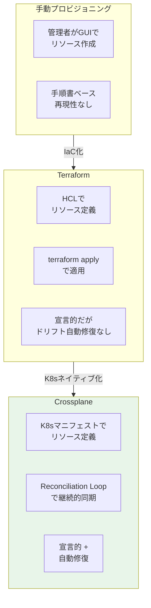
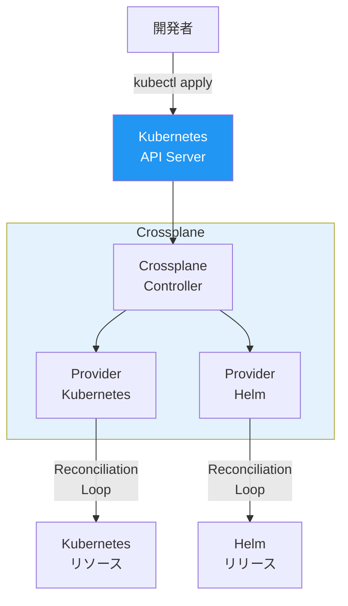
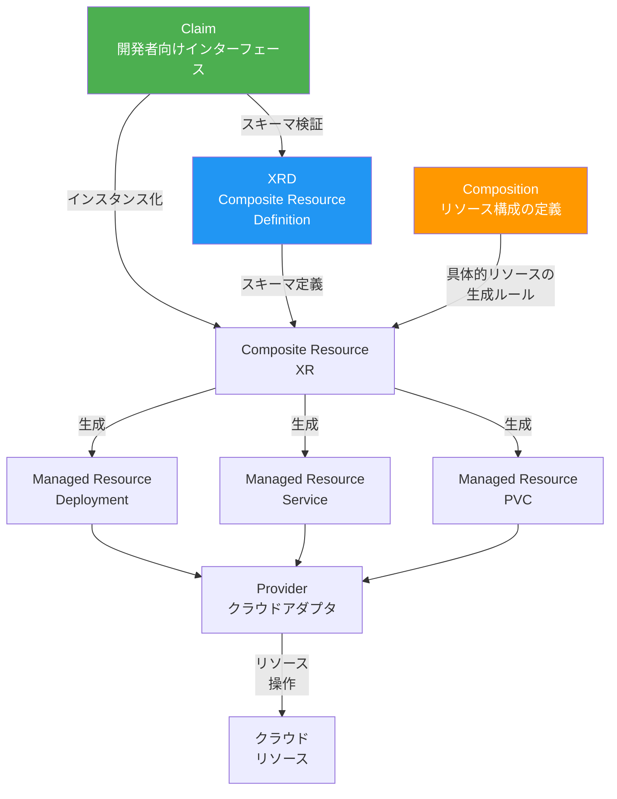
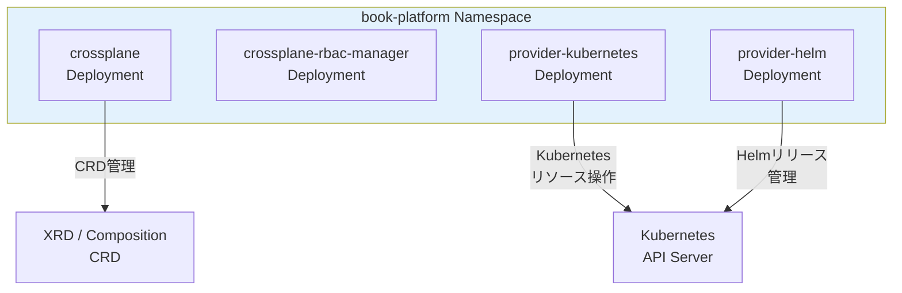
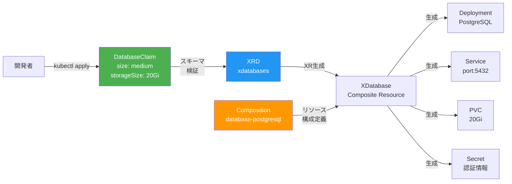
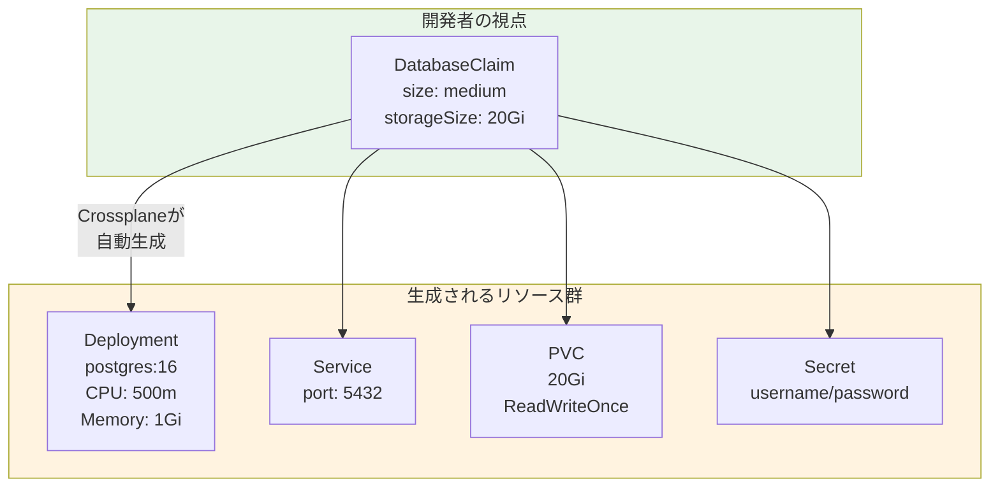
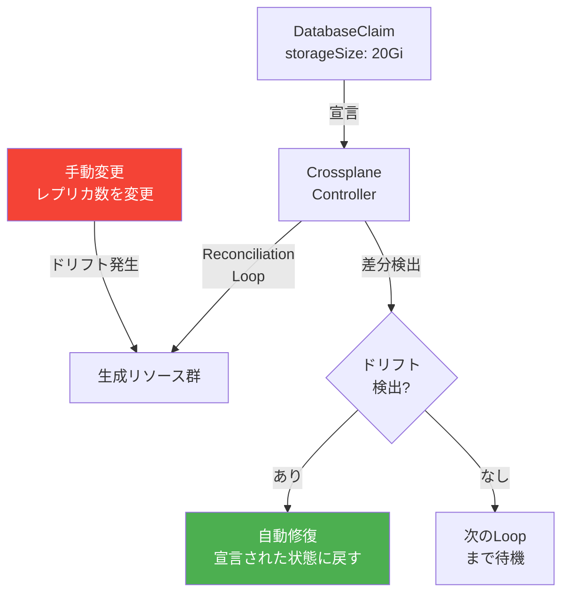
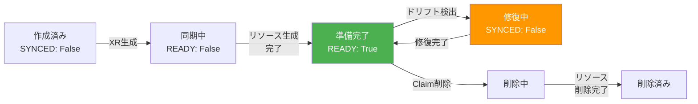

# 第18章 インフラ抽象化 ― Crossplane

前章でBackstageによるサービスカタログとSoftware Templateを構築した。Software Templateで新サービスのリポジトリを生成できるようになったが、サービスが必要とするインフラ（データベース、キャッシュ等）のプロビジョニングは手動のままである。本章では、Crossplaneを導入し、Kubernetesマニフェストによるインフラの宣言的管理と開発者セルフサービスを実現する。

## 18.1 インフラ管理の課題とCrossplaneの思想

### 従来のインフラ管理

インフラ管理のアプローチは段階的に進化してきた。手動プロビジョニングからTerraform等のIaCツールへ、そしてCrossplaneへと発展している。

図18.1: インフラ管理アプローチの比較



Terraformは宣言的なインフラ定義を実現した。しかし、Terraformの適用は「plan → apply」という人間が起点のワークフローであり、継続的なReconciliationは行わない。apply後にリソースが手動で変更された場合（ドリフト）、次に `terraform plan` を実行するまで検出されない。

> 表18.0: Crossplane vs Terraform 詳細比較

| 比較項目 | Terraform | Crossplane |
|---------|-----------|------------|
| 定義言語 | HCL | Kubernetes YAML |
| 実行モデル | CLI実行（plan/apply） | Reconciliation Loop |
| 状態管理 | tfstate（ファイル/リモート） | Kubernetes etcd |
| ドリフト検出 | plan実行時のみ | 常時（Controller Loop） |
| ドリフト修復 | 手動apply | 自動修復 |
| GitOps親和性 | 中（外部ツール連携が必要） | 高（K8s APIネイティブ） |
| 学習コスト | HCL習得が必要 | K8s知識を活用可能 |
| セルフサービス | 困難（tfstate管理の問題） | 容易（Claim機構） |
| マルチテナント | 困難（Workspace分離） | 容易（Namespace分離） |

Terraformが不要になるわけではない。Crossplaneはアプリケーションチームのセルフサービスに適しているが、プラットフォームチームがOKEクラスタ自体やVCN等のベースインフラを管理する際にはTerraformが依然として有効である。両者は競合ではなく、管理レイヤーの異なる補完関係にある。

### Control Plane of Control Planes

Crossplaneは「Control Plane of Control Planes」という思想を掲げる。Kubernetes API Serverを統一的なコントロールプレーンとして、クラウドプロバイダーのAPIを抽象化する。

図18.2: Control Plane of Control Planes



CrossplaneとTerraformの最大の違いは、Reconciliation Loopにある。ArgoCDがGitとクラスタの状態を常に同期し続けるように、Crossplaneはマニフェストとインフラの状態を常に同期し続ける。手動でリソースが変更されても、Crossplaneが自動的に宣言された状態に修復する。

Kubernetes APIをインターフェースとして使うことで、GitOps（ArgoCD）との親和性が非常に高い。CrossplaneのClaimをGitリポジトリに格納し、ArgoCDで同期すれば、インフラもGitOpsで管理できる。

### Crossplaneのアーキテクチャ上の位置づけ

Crossplaneは三つの役割を同時に担う。

1. **CRDエンジン**: XRDから自動的にCRDを生成し、Kubernetes APIを拡張する
2. **Compositionエンジン**: 抽象化リソース（XR）から具体的なManaged Resourceを生成するルールを管理する
3. **Reconciliationエンジン**: Managed Resourceの状態をクラウドプロバイダーのリソース状態と継続的に同期する

この三層構造により、プラットフォームチームはKubernetes APIの拡張を通じて「組織固有のクラウドAPI」を構築できる。開発チームは `kubectl apply` だけでインフラを操作でき、既存のKubernetes知識をそのまま活用できる。

## 18.2 Crossplaneのアーキテクチャ

### コンポーネント階層

Crossplaneは複数の抽象化レイヤーで構成される。

図18.3: Crossplaneのコンポーネント階層



> 表18.1: Crossplaneの主要概念一覧

| 概念 | 役割 | 対象者 |
|------|------|-------|
| Provider | クラウドプロバイダーへの接続アダプタ | プラットフォームチーム |
| Managed Resource | クラウドリソースの1:1マッピング | プラットフォームチーム |
| XRD | 抽象化リソースのスキーマ定義 | プラットフォームチーム |
| Composition | 抽象化リソースから具体リソースへの変換ルール | プラットフォームチーム |
| Composite Resource（XR） | 抽象化リソースのインスタンス（Namespace非所属） | - |
| Claim | 開発者向けの簡潔なインターフェース（Namespace所属） | 開発チーム |

この階層構造のポイントは、プラットフォームチームが「XRD + Composition」で抽象化レイヤーを定義し、開発チームは「Claim」のみを扱うという責任分離にある。開発者はデータベースの内部実装（Deployment、Service、PVC、ConfigMapの構成）を知る必要がなく、「データベースが欲しい」というClaimを投入するだけでよい。

## 18.3 Crossplaneのインストールとプロバイダー設定

### Helmチャートによるインストール

```yaml
# コード18.1: Crossplane Helm valuesの主要設定
# helm install crossplane crossplane-stable/crossplane -n book-platform -f values.yaml
replicas: 1
provider:
  packages: []  # Providerは別途インストール
args:
  - --enable-composition-revisions
```

```yaml
# コード18.2: Provider-KubernetesのProviderConfig
# Provider-Kubernetesのインストール
apiVersion: pkg.crossplane.io/v1
kind: Provider
metadata:
  name: provider-kubernetes
spec:
  package: xpkg.upbound.io/crossplane-contrib/provider-kubernetes:v0.14.1
---
# Provider-Helmのインストール
apiVersion: pkg.crossplane.io/v1
kind: Provider
metadata:
  name: provider-helm
spec:
  package: xpkg.upbound.io/crossplane-contrib/provider-helm:v0.19.0
---
# ProviderConfig（Kubernetes認証設定）
apiVersion: kubernetes.crossplane.io/v1alpha1
kind: ProviderConfig
metadata:
  name: default
spec:
  credentials:
    source: InjectedIdentity  # ServiceAccountの権限を使用
```

図18.4: Crossplaneのデプロイ構成



Providerをインストールすると、Crossplaneが新しいCRDを自動的にクラスタに登録する。`kubectl get crds | grep crossplane` で確認できる。

### Provider設定の詳細

ProviderConfigは、Crossplaneがクラウドリソースを操作する際の認証設定を定義する。認証方式は三つある。

> 表18.1b: ProviderConfig認証方式の比較

| 認証方式 | 説明 | セキュリティ | 用途 |
|---------|------|-----------|------|
| InjectedIdentity | PodのServiceAccount権限を使用 | 高（RBAC連携） | 同一クラスタ内リソース管理 |
| Secret | Kubernetes Secretに格納した認証情報 | 中（Secret管理が必要） | クラウドAPI認証 |
| Environment | 環境変数から認証情報を取得 | 低（Pod内に平文保持） | 開発環境のみ |

本書ではProvider-KubernetesとProvider-Helmを使用するため、InjectedIdentity方式が適切である。この方式では、ProviderのServiceAccountに適切なRBAC権限を付与する必要がある。Crossplaneのrbac-managerが、Provider CRDに基づいてClusterRoleを自動生成する。

クラウドプロバイダーのManaged Resource（OCI Database Service等）を管理する場合は、Secret方式でAPIキーを格納する。OCI環境では、OCI Instance PrincipalやWorkload Identityとの連携も可能である。

## 18.4 XRDとCompositionによるインフラ抽象化

### データベースの抽象化

XRDでスキーマを定義し、Compositionで具体的なリソース構成を定義する。

```yaml
# コード18.3: XRD定義（DatabaseCompositeResource）
apiVersion: apiextensions.crossplane.io/v1
kind: CompositeResourceDefinition
metadata:
  name: xdatabases.platform.example.com
spec:
  group: platform.example.com
  names:
    kind: XDatabase
    plural: xdatabases
  claimNames:
    kind: DatabaseClaim
    plural: databaseclaims
  versions:
    - name: v1alpha1
      served: true
      referenceable: true
      schema:
        openAPIV3Schema:
          type: object
          properties:
            spec:
              type: object
              properties:
                size:
                  type: string
                  enum: [small, medium, large]
                  description: "データベースサイズ"
                version:
                  type: string
                  default: "16"
                  description: "PostgreSQLバージョン"
                storageSize:
                  type: string
                  default: "10Gi"
                  description: "ストレージサイズ"
              required:
                - size
```

```yaml
# コード18.4: Composition定義（PostgreSQLのプロビジョニング）
apiVersion: apiextensions.crossplane.io/v1
kind: Composition
metadata:
  name: database-postgresql
  labels:
    provider: kubernetes
    database: postgresql
spec:
  compositeTypeRef:
    apiVersion: platform.example.com/v1alpha1
    kind: XDatabase
  resources:
    - name: deployment
      base:
        apiVersion: kubernetes.crossplane.io/v1alpha2
        kind: Object
        spec:
          forProvider:
            manifest:
              apiVersion: apps/v1
              kind: Deployment
              metadata:
                name: ""  # パッチで設定
              spec:
                replicas: 1
                selector:
                  matchLabels:
                    app: ""
                template:
                  metadata:
                    labels:
                      app: ""
                  spec:
                    containers:
                      - name: postgresql
                        image: postgres:16
                        ports:
                          - containerPort: 5432
                        env:
                          - name: POSTGRES_DB
                            value: appdb
                          - name: POSTGRES_USER
                            valueFrom:
                              secretKeyRef:
                                name: ""
                                key: username
                        volumeMounts:
                          - name: data
                            mountPath: /var/lib/postgresql/data
                    volumes:
                      - name: data
                        persistentVolumeClaim:
                          claimName: ""
      patches:
        - type: FromCompositeFieldPath
          fromFieldPath: metadata.labels[crossplane.io/claim-name]
          toFieldPath: spec.forProvider.manifest.metadata.name
          transforms:
            - type: string
              string:
                fmt: "%s-db"

    - name: service
      base:
        apiVersion: kubernetes.crossplane.io/v1alpha2
        kind: Object
        spec:
          forProvider:
            manifest:
              apiVersion: v1
              kind: Service
              spec:
                ports:
                  - port: 5432
                    targetPort: 5432

    - name: pvc
      base:
        apiVersion: kubernetes.crossplane.io/v1alpha2
        kind: Object
        spec:
          forProvider:
            manifest:
              apiVersion: v1
              kind: PersistentVolumeClaim
              spec:
                accessModes: [ReadWriteOnce]
                resources:
                  requests:
                    storage: 10Gi
      patches:
        - type: FromCompositeFieldPath
          fromFieldPath: spec.storageSize
          toFieldPath: spec.forProvider.manifest.spec.resources.requests.storage
```

図18.5: XRD・Composition・Claimの関係



### キャッシュの抽象化

同様のパターンでRedisキャッシュも抽象化する。

```yaml
# コード18.5: XRD定義（CacheCompositeResource）
apiVersion: apiextensions.crossplane.io/v1
kind: CompositeResourceDefinition
metadata:
  name: xcaches.platform.example.com
spec:
  group: platform.example.com
  names:
    kind: XCache
    plural: xcaches
  claimNames:
    kind: CacheClaim
    plural: cacheclaims
  versions:
    - name: v1alpha1
      served: true
      referenceable: true
      schema:
        openAPIV3Schema:
          type: object
          properties:
            spec:
              type: object
              properties:
                size:
                  type: string
                  enum: [small, medium, large]
                maxMemory:
                  type: string
                  default: "256mb"
              required:
                - size
```

図18.6: データベース抽象化の具体例



### Compositionパターンの設計

Compositionはインフラ抽象化の中核であり、XRから具体的なManaged Resourceへの変換ルールを定義する。実運用ではいくつかの設計パターンが重要になる。

**パッチ（Patches）の活用**: Compositionのresources内でpatchesを使い、Claimのパラメータを具体リソースのフィールドにマッピングする。パッチには複数のタイプがある。

> 表18.1c: Compositionパッチタイプの一覧

| パッチタイプ | 方向 | 用途 |
|------------|------|------|
| FromCompositeFieldPath | XR → Managed Resource | XRのフィールド値をManaged Resourceに適用 |
| ToCompositeFieldPath | Managed Resource → XR | Managed Resourceの出力値をXRに反映 |
| CombineFromComposite | XR（複数フィールド） → Managed Resource | 複数フィールドを結合して適用 |
| CombineToComposite | Managed Resource（複数フィールド） → XR | 複数フィールドを結合してXRに反映 |

**Transformsによる値変換**: patchesと組み合わせて、Transforms（変換）を使い、抽象的なパラメータ値を具体値に変換する。以下は `size` パラメータをCPU/メモリのリソース量にマッピングする例である。

```yaml
# コード18.4b: sizeパラメータのリソース量マッピング
patches:
  - type: FromCompositeFieldPath
    fromFieldPath: spec.size
    toFieldPath: spec.forProvider.manifest.spec.template.spec.containers[0].resources.requests.cpu
    transforms:
      - type: map
        map:
          small: "250m"
          medium: "500m"
          large: "1000m"
  - type: FromCompositeFieldPath
    fromFieldPath: spec.size
    toFieldPath: spec.forProvider.manifest.spec.template.spec.containers[0].resources.requests.memory
    transforms:
      - type: map
        map:
          small: "512Mi"
          medium: "1Gi"
          large: "2Gi"
  - type: FromCompositeFieldPath
    fromFieldPath: spec.size
    toFieldPath: spec.forProvider.manifest.spec.replicas
    transforms:
      - type: map
        map:
          small: 1
          medium: 2
          large: 3
```

**Composition Revisions**: Compositionを更新した際、既存のXRに即座に影響を与えないために、Composition Revisionsの機能が有効である。`--enable-composition-revisions` フラグ（コード18.1で設定済み）を有効にすると、Compositionの更新ごとにRevisionが作成される。既存のXRは作成時のRevisionを参照し続け、明示的に更新するまで新しいRevisionの影響を受けない。

### XRD設計のベストプラクティス

XRDの設計で重要なのは、開発者に公開するパラメータの選定である。

- **公開すべき**: サイズ（small/medium/large）、ストレージ容量、バージョン
- **隠蔽すべき**: レプリカ数の具体値、CPU/メモリの具体値、ボリュームの詳細設定、ネットワーク設定

sizeを `enum: [small, medium, large]` で定義し、Compositionのpatches内で具体的なリソース量にマッピングする。これにより、開発者は「medium」と指定するだけで、プラットフォームチームが定めた適切なリソース量が自動的に割り当てられる。

**XRDバージョニング**: XRDはKubernetes CRDと同様に複数バージョンをサポートする。`v1alpha1` から始め、APIが安定したら `v1beta1`、`v1` とバージョンを上げていく。複数バージョンを同時に `served: true` に設定し、既存のClaimが古いバージョンのまま動作し続けることを保証する。Webhook Conversionを使って、バージョン間のフィールド変換を定義することも可能である。

**statusフィールドの設計**: XRDのschemaにstatusフィールドを定義し、プロビジョニング結果（接続先ホスト名、ポート番号、Secret名など）を開発者に返すことが推奨される。`ToCompositeFieldPath` パッチを使い、生成されたManaged Resourceの情報をXRのstatusに反映する。これにより、開発者はClaimのstatusを参照するだけで、データベースの接続情報を取得できる。

## 18.5 Claimによるセルフサービスプロビジョニング

### Claimの作成

開発者は以下のようなClaimを投入するだけで、データベースがプロビジョニングされる。

```yaml
# コード18.6: DatabaseClaim（開発者が投入するClaim）
apiVersion: platform.example.com/v1alpha1
kind: DatabaseClaim
metadata:
  name: order-db
  namespace: book-app
spec:
  size: medium
  version: "16"
  storageSize: 20Gi
```

```yaml
# コード18.7: CacheClaim（開発者が投入するClaim）
apiVersion: platform.example.com/v1alpha1
kind: CacheClaim
metadata:
  name: order-cache
  namespace: book-app
spec:
  size: small
  maxMemory: 128mb
```

> 表18.2: DatabaseClaim / CacheClaimのパラメータ一覧

| Claim | パラメータ | 型 | 説明 | デフォルト |
|-------|----------|-----|------|----------|
| DatabaseClaim | size | enum | small/medium/large | - |
| DatabaseClaim | version | string | PostgreSQLバージョン | "16" |
| DatabaseClaim | storageSize | string | ストレージサイズ | "10Gi" |
| CacheClaim | size | enum | small/medium/large | - |
| CacheClaim | maxMemory | string | 最大メモリ | "256mb" |

### 状態確認

```bash
# コード18.8: Claimの状態確認コマンド
# Claimの一覧と状態確認
kubectl get databaseclaims -n book-app
# NAME       SYNCED   READY   AGE
# order-db   True     True    5m

# Composite Resource（XR）の確認
kubectl get xdatabases
# NAME              SYNCED   READY   COMPOSITION            AGE
# order-db-xxxxx    True     True    database-postgresql    5m

# 生成されたリソースの確認
kubectl get deploy,svc,pvc -n book-app -l crossplane.io/claim-name=order-db
# NAME                          READY   AGE
# deployment.apps/order-db-db   1/1     5m
# NAME                  TYPE        PORT(S)
# service/order-db-svc  ClusterIP   5432/TCP
# NAME                          STATUS   CAPACITY
# pvc/order-db-data             Bound    20Gi
```

### ドリフト検出と自動修復

Crossplaneの強みはReconciliation Loopによるドリフト自動修復である。

図18.7: ドリフト検出と自動修復



### Claimのライフサイクル管理

Claimの作成後、状態遷移を理解することが運用上重要である。

図18.7b: Claimの状態遷移



Claimを削除すると、Crossplaneは関連するすべてのManaged Resource（Deployment、Service、PVC等）を自動的に削除する。ただし、データ保護のためにPVCの `reclaimPolicy` を `Retain` に設定しておけば、PersistentVolumeのデータは保持される。

CrossplaneのClaimをGitリポジトリに格納し、ArgoCDで同期する構成が推奨される。これにより以下のメリットが得られる。

- **二重のReconciliation**: ArgoCDがGit→クラスタ、Crossplaneがクラスタ→インフラの同期を担当
- **変更追跡**: インフラの変更もGitの履歴として記録される
- **レビュープロセス**: PRレビューによるインフラ変更の承認フロー

### ArgoCD + Crossplaneの統合パターン

ArgoCDとCrossplaneを組み合わせる際には、同期順序の制御が重要になる。アプリケーションのDeploymentがデータベースに依存する場合、データベースのClaim（Crossplane）が先にプロビジョニングされている必要がある。

ArgoCDのSync Waves機能を使い、リソースの適用順序を制御する。

```yaml
# コード18.8b: Sync Wavesによる適用順序の制御
# Crossplane Claim（Wave 0: 最初に適用）
apiVersion: platform.example.com/v1alpha1
kind: DatabaseClaim
metadata:
  name: order-db
  namespace: book-app
  annotations:
    argocd.argoproj.io/sync-wave: "0"
spec:
  size: medium
---
# アプリケーションDeployment（Wave 1: Claim完了後に適用）
apiVersion: apps/v1
kind: Deployment
metadata:
  name: order-service
  namespace: book-app
  annotations:
    argocd.argoproj.io/sync-wave: "1"
spec:
  # ... Deployment設定
```

Sync Waveの番号が小さいリソースから順に適用される。Wave 0でデータベースClaimを適用し、CrossplaneがPodの準備完了を確認した後にWave 1でアプリケーションが適用される。この順序制御により、アプリケーション起動時にデータベースが利用可能な状態を保証する。

本章で構築したCrossplaneのClaim機構と、第17章のBackstage Software Templateを組み合わせることで、次章ではテンプレートからのサービス作成時にインフラのClaimも自動生成されるGolden Pathを実現する。さらにArgoCD、Observability、Service Mesh、Securityの全技術と統合し、書籍全体の集大成となるフルスタックプラットフォームを完成させる。

## 理解度チェック

1. CrossplaneとTerraformの違いを説明せよ。特にReconciliation Loopの観点から、インフラのドリフト検出・修復の仕組みを比較せよ

2. XRD、Composition、Claimの3つの概念の関係を説明せよ。それぞれがインフラ抽象化のどのレイヤーに対応するか述べよ

3. Crossplaneの「Control Plane of Control Planes」とはどのような概念か。Kubernetes APIをインフラ管理に拡張することの利点を2つ挙げよ

4. XRDの設計において、開発者に公開するパラメータをどのような基準で選定すべきか。抽象化の粒度に関する考慮事項を述べよ

5. CrossplaneのClaimをGitリポジトリで管理し、ArgoCDで同期する利点を説明せよ

## 参考文献

- Crossplane公式ドキュメント, https://docs.crossplane.io/
- Crossplane Compositions, https://docs.crossplane.io/latest/concepts/compositions/
- Provider Kubernetes, https://github.com/crossplane-contrib/provider-kubernetes
- Platform Reference Architectures, https://docs.crossplane.io/knowledge-base/guides/
