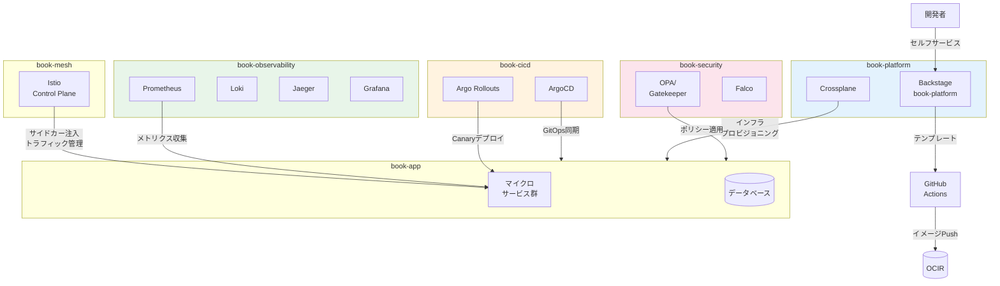
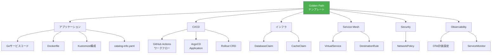
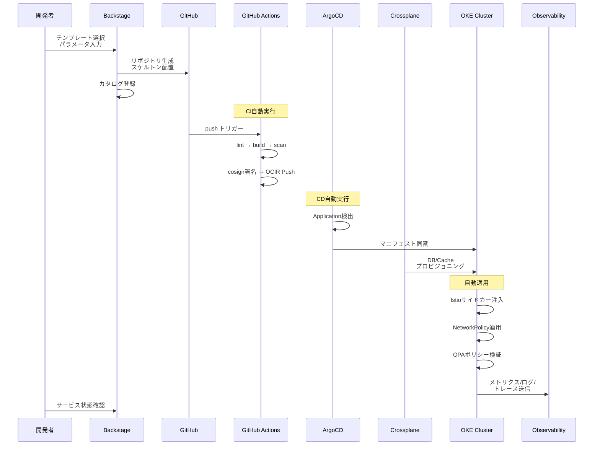
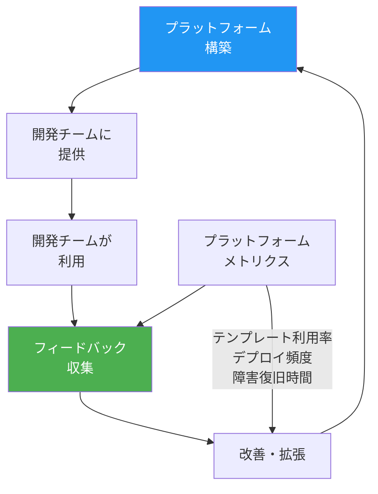
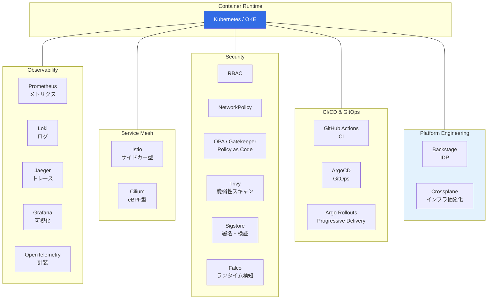

# 第19章 統合 ― すべてをプラットフォームとしてまとめる

本書の最終章として、Part 1〜4で個別に構築してきたObservability、Service Mesh、Security、CI/CD & GitOpsの全技術と、Part 5のBackstage・Crossplaneを統合する。開発者がGolden Pathに沿ってサービスを立ち上げるだけで、すべての基盤が自動的に適用される「完成されたInternal Developer Platform」を実現する。

## 19.1 プラットフォームの全体像

### 統合アーキテクチャ

Part 0〜5で構築した全コンポーネントが、6つのNamespaceにわたって連携する。

図19.1: 統合プラットフォームの全体アーキテクチャ



### Golden Pathのフロー

図19.2: Golden Pathのフロー


このフローにおいて、開発者の操作は最初の2ステップ（テンプレート選択とパラメータ入力）のみである。残りはすべてプラットフォームが自動実行する。デプロイされたサービスには以下が自動的に適用される。

- **Observability**: Prometheus メトリクス収集、Lokiログ収集、Jaegerトレース収集、Grafanaダッシュボード
- **Service Mesh**: Istioサイドカー注入、mTLS、トラフィック管理
- **Security**: NetworkPolicy、OPA/Gatekeeperポリシー
- **CI/CD**: GitHub ActionsによるCI、ArgoCDによるGitOps、Argo RolloutsによるCanaryデプロイ

### 設計原則

IDPの設計原則は以下の3つである。

1. **セルフサービス**: 開発者がプラットフォームチームへの依頼なしにサービスを立ち上げられる
2. **自動化**: テンプレートからの生成、CI/CD、インフラプロビジョニングが自動実行される
3. **ガードレール**: セキュリティポリシー、Observability計装、ネットワーク制限が自動的に適用される

### Compositionパターンの全体設計

Golden Pathの実現には、Part 1〜4の各技術がどのように結合されるかを理解する必要がある。以下は各技術の結合ポイントを整理した表である。

> 表19.1b: 技術間の結合ポイント

| 結合ポイント | 接続元 | 接続先 | 接続手段 |
|------------|--------|--------|---------|
| コードからビルドへ | GitHub（ソースコード） | GitHub Actions | pushイベントトリガー |
| ビルドからデプロイへ | GitHub Actions（イメージ） | ArgoCD | Image Updater |
| デプロイからメッシュへ | Kubernetes（Pod） | Istio | サイドカー自動注入（Namespace label） |
| デプロイからObsへ | Kubernetes（Pod） | Prometheus/Loki/Jaeger | OTel計装 + ServiceMonitor |
| デプロイからセキュリティへ | Kubernetes（Pod） | OPA/Gatekeeper | Admission Webhook |
| デプロイからインフラへ | ArgoCD（マニフェスト同期） | Crossplane | Claim → XR → Managed Resource |
| Canaryからメトリクスへ | Argo Rollouts（Analysis） | Prometheus | PromQLクエリ |

この表から分かるように、各技術は「マニフェスト」と「Kubernetes API」を共通のインターフェースとして接続されている。Golden Pathテンプレートが生成するのは、これらの接続を実現するマニフェスト群である。

## 19.2 Golden Path テンプレートの構築

### 統合テンプレート

第17章のSoftware Templateを拡張し、Part 1〜4の全技術が自動適用されるGolden Pathテンプレートを構築する。

```yaml
# コード19.1: 統合Golden Pathテンプレート（template.yaml）
apiVersion: scaffolder.backstage.io/v1beta3
kind: Template
metadata:
  name: golden-path-service
  title: Golden Path マイクロサービス
  description: 全基盤が自動適用されるマイクロサービスを生成する
spec:
  owner: platform-team
  type: service

  parameters:
    - title: サービス情報
      required: [serviceName, owner, description]
      properties:
        serviceName:
          title: サービス名
          type: string
          pattern: "^[a-z][a-z0-9-]*$"
        owner:
          title: オーナーチーム
          type: string
          ui:field: OwnerPicker
        description:
          title: 説明
          type: string

    - title: インフラ要件
      properties:
        needsDatabase:
          title: データベースが必要
          type: boolean
          default: false
        databaseSize:
          title: データベースサイズ
          type: string
          enum: [small, medium, large]
          default: small
        needsCache:
          title: キャッシュが必要
          type: boolean
          default: false

    - title: デプロイ設定
      properties:
        deployStrategy:
          title: デプロイ戦略
          type: string
          enum: [canary, blue-green, rolling]
          default: canary
        replicas:
          title: レプリカ数
          type: integer
          default: 3

  steps:
    - id: fetch-skeleton
      name: スケルトン生成
      action: fetch:template
      input:
        url: ./skeleton
        values:
          serviceName: ${{ parameters.serviceName }}
          owner: ${{ parameters.owner }}
          needsDatabase: ${{ parameters.needsDatabase }}
          databaseSize: ${{ parameters.databaseSize }}
          needsCache: ${{ parameters.needsCache }}
          deployStrategy: ${{ parameters.deployStrategy }}
          replicas: ${{ parameters.replicas }}

    - id: publish
      name: GitHubリポジトリ作成
      action: publish:github
      input:
        repoUrl: github.com?owner=your-org&repo=${{ parameters.serviceName }}
        description: ${{ parameters.description }}
        defaultBranch: main

    - id: register
      name: カタログ登録
      action: catalog:register
      input:
        repoContentsUrl: ${{ steps.publish.output.repoContentsUrl }}
        catalogInfoPath: /catalog-info.yaml

  output:
    links:
      - title: リポジトリ
        url: ${{ steps.publish.output.remoteUrl }}
      - title: カタログ
        url: /catalog/default/component/${{ parameters.serviceName }}
```

> 表19.1: Golden Pathテンプレートのパラメータ

| パラメータ | 型 | 説明 | 対応技術 |
|----------|-----|------|---------|
| serviceName | string | サービス名 | 全体 |
| owner | string | オーナーチーム | Backstage |
| description | string | サービスの説明 | Backstage |
| needsDatabase | boolean | データベース要否 | Crossplane |
| databaseSize | enum | DB サイズ | Crossplane |
| needsCache | boolean | キャッシュ要否 | Crossplane |
| deployStrategy | enum | デプロイ戦略 | Argo Rollouts |
| replicas | integer | レプリカ数 | Kubernetes |

### テンプレートが生成するリソース

図19.3: Golden Pathテンプレートが生成するリソース一覧



### テンプレートの条件分岐設計

Golden Pathテンプレートでは、パラメータに応じてファイルの生成を制御する。Nunjucksテンプレートエンジンの条件分岐を使い、不要なリソースの生成を抑制する。

たとえば、`needsDatabase: false` の場合はDatabaseClaimを生成せず、`deployStrategy: rolling` の場合はRollout CRDの代わりに通常のDeploymentを生成する。この制御により、開発者は必要な機能のみを選択し、過剰な設定ファイルの生成を避けられる。

> 表19.1c: パラメータと生成リソースの対応

| パラメータ | 値 | 生成されるリソース | 生成されないリソース |
|----------|-----|----------------|-------------------|
| needsDatabase | true | DatabaseClaim、DB用NetworkPolicy | - |
| needsDatabase | false | - | DatabaseClaim、DB用NetworkPolicy |
| needsCache | true | CacheClaim | - |
| deployStrategy | canary | Rollout CRD、AnalysisTemplate | Deployment |
| deployStrategy | rolling | Deployment | Rollout CRD、AnalysisTemplate |

各スケルトンファイルの内容を示す。

```yaml
# コード19.2: テンプレートのスケルトン: GitHub Actionsワークフロー
# skeleton/.github/workflows/ci.yaml
name: CI Pipeline
on:
  pull_request:
    branches: [main]
  push:
    branches: [main]

jobs:
  lint:
    runs-on: ubuntu-latest
    steps:
      - uses: actions/checkout@v4
      - uses: actions/setup-go@v5
        with:
          go-version: "1.23"
      - run: go vet ./...

  build:
    needs: lint
    runs-on: ubuntu-latest
    outputs:
      digest: ${{ "${{ steps.build.outputs.digest }}" }}
    steps:
      - uses: actions/checkout@v4
      - uses: docker/setup-buildx-action@v3
      - uses: docker/login-action@v3
        with:
          registry: ${{ "${{ vars.REGISTRY }}" }}
          username: ${{ "${{ secrets.REGISTRY_USER }}" }}
          password: ${{ "${{ secrets.REGISTRY_PASSWORD }}" }}
      - id: build
        uses: docker/build-push-action@v5
        with:
          context: .
          push: ${{ "${{ github.ref == 'refs/heads/main' }}" }}
          tags: ${{ "${{ vars.REGISTRY }}" }}/${{ values.serviceName }}:${{ "${{ github.sha }}" }}
          cache-from: type=gha
          cache-to: type=gha,mode=max

  scan:
    needs: build
    runs-on: ubuntu-latest
    steps:
      - uses: aquasecurity/trivy-action@master
        with:
          image-ref: ${{ "${{ vars.REGISTRY }}" }}/${{ values.serviceName }}:${{ "${{ github.sha }}" }}
          severity: CRITICAL,HIGH
          exit-code: 1

  sign-and-push:
    needs: [build, scan]
    if: github.ref == 'refs/heads/main'
    runs-on: ubuntu-latest
    permissions:
      id-token: write
    steps:
      - uses: sigstore/cosign-installer@v3
      - run: |
          cosign sign --yes \
            ${{ "${{ vars.REGISTRY }}" }}/${{ values.serviceName }}@${{ "${{ needs.build.outputs.digest }}" }}
```

```yaml
# コード19.3: テンプレートのスケルトン: ArgoCD Application
# skeleton/argocd/application.yaml
apiVersion: argoproj.io/v1alpha1
kind: Application
metadata:
  name: ${{ values.serviceName }}
  namespace: book-cicd
spec:
  project: book-project
  source:
    repoURL: https://github.com/your-org/${{ values.serviceName }}.git
    path: overlays/prod
    targetRevision: main
  destination:
    server: https://kubernetes.default.svc
    namespace: book-app
  syncPolicy:
    automated:
      selfHeal: true
      prune: true
```

```yaml
# コード19.4: テンプレートのスケルトン: Crossplane Claim
# skeleton/infra/database-claim.yaml（needsDatabase=trueの場合のみ生成）
apiVersion: platform.example.com/v1alpha1
kind: DatabaseClaim
metadata:
  name: ${{ values.serviceName }}-db
  namespace: book-app
spec:
  size: ${{ values.databaseSize }}
  version: "16"
  storageSize: 10Gi
```

```yaml
# コード19.5: テンプレートのスケルトン: Istio VirtualService + DestinationRule
# skeleton/mesh/virtual-service.yaml
apiVersion: networking.istio.io/v1
kind: VirtualService
metadata:
  name: ${{ values.serviceName }}
  namespace: book-app
spec:
  hosts:
    - ${{ values.serviceName }}
  http:
    - route:
        - destination:
            host: ${{ values.serviceName }}-stable
            port:
              number: 8080
---
apiVersion: networking.istio.io/v1
kind: DestinationRule
metadata:
  name: ${{ values.serviceName }}
  namespace: book-app
spec:
  host: ${{ values.serviceName }}
  trafficPolicy:
    tls:
      mode: ISTIO_MUTUAL
```

```yaml
# コード19.6: テンプレートのスケルトン: NetworkPolicy
# skeleton/security/network-policy.yaml
apiVersion: networking.k8s.io/v1
kind: NetworkPolicy
metadata:
  name: ${{ values.serviceName }}
  namespace: book-app
spec:
  podSelector:
    matchLabels:
      app: ${{ values.serviceName }}
  policyTypes: [Ingress, Egress]
  ingress:
    - from:
        - podSelector:
            matchLabels:
              app: api-gateway
      ports:
        - port: 8080
  egress:
    - to:
        - podSelector:
            matchLabels:
              app: ${{ values.serviceName }}-db
      ports:
        - port: 5432
    - to:  # DNS
        - namespaceSelector: {}
      ports:
        - port: 53
          protocol: UDP
```

```yaml
# コード19.7: テンプレートのスケルトン: OpenTelemetry計装設定
# skeleton/observability/otel-config.yaml
apiVersion: v1
kind: ConfigMap
metadata:
  name: ${{ values.serviceName }}-otel-config
  namespace: book-app
data:
  OTEL_SERVICE_NAME: ${{ values.serviceName }}
  OTEL_EXPORTER_OTLP_ENDPOINT: http://otel-collector.book-observability:4317
  OTEL_TRACES_SAMPLER: parentbased_traceidratio
  OTEL_TRACES_SAMPLER_ARG: "0.1"
```

## 19.3 End-to-Endデモ：新サービスの立ち上げ

### デモシナリオ

Golden Pathテンプレートを使い、「payment-service」（決済サービス）を新たに立ち上げる。

```yaml
# コード19.8: デモ: Backstageからのサービス作成（パラメータ例）
# Backstage UIで入力するパラメータ
serviceName: payment-service
owner: backend-team
description: 決済処理サービス
needsDatabase: true
databaseSize: medium
needsCache: true
deployStrategy: canary
replicas: 3
```

### シーケンス

図19.4: End-to-Endデモのシーケンス図



### 生成されたリソースの確認

```bash
# コード19.9: デモ: 生成されたリソースの確認コマンド群
# アプリケーションリソース
kubectl get rollout,svc -n book-app -l app=payment-service
# NAME                              DESIRED   CURRENT   READY   AGE
# rollout.argoproj.io/payment-service   3         3         3       5m
# NAME                           TYPE        PORT(S)
# service/payment-service-stable ClusterIP   8080/TCP
# service/payment-service-canary ClusterIP   8080/TCP

# インフラリソース（Crossplane）
kubectl get databaseclaims,cacheclaims -n book-app
# NAME                              SYNCED   READY   AGE
# databaseclaim/payment-service-db  True     True    5m
# cacheclaim/payment-service-cache  True     True    5m

# Istioリソース
kubectl get virtualservice,destinationrule -n book-app -l app=payment-service

# NetworkPolicy
kubectl get networkpolicy -n book-app payment-service

# OTel設定
kubectl get configmap payment-service-otel-config -n book-app
```

```bash
# コード19.10: デモ: ArgoCDの同期状態確認
argocd app get payment-service
# Name:               payment-service
# Server:             https://kubernetes.default.svc
# Namespace:          book-app
# Sync Status:        Synced
# Health Status:      Healthy
```

### Observabilityの自動適用

デプロイが完了すると、Observability基盤がpayment-serviceのテレメトリを自動的に収集し始める。

図19.5: デモ後のGrafanaダッシュボード

```
┌──────────────────────────────────────────────────────────────┐
│  Grafana - payment-service Dashboard                         │
├──────────────────────────┬───────────────────────────────────┤
│  Request Rate            │  Error Rate                       │
│  ┌────────────────────┐  │  ┌────────────────────┐          │
│  │     ╱╲    ╱╲       │  │  │                    │          │
│  │   ╱╱  ╲╱╱  ╲╲     │  │  │  ──────────────── │          │
│  │  ╱╱         ╲╲    │  │  │     0.1%           │          │
│  │ ──            ──   │  │  │                    │          │
│  │  12 req/s          │  │  │                    │          │
│  └────────────────────┘  │  └────────────────────┘          │
├──────────────────────────┼───────────────────────────────────┤
│  P99 Latency             │  Active Traces                    │
│  ┌────────────────────┐  │  ┌────────────────────┐          │
│  │                    │  │  │ payment-service     │          │
│  │  ────────────────  │  │  │  → order-service    │          │
│  │     45ms           │  │  │    → product-svc    │          │
│  │                    │  │  │      → postgres     │          │
│  └────────────────────┘  │  └────────────────────┘          │
├──────────────────────────┴───────────────────────────────────┤
│  Recent Logs (Loki)                                          │
│  INFO  payment-service starting on port 8080                 │
│  INFO  connected to payment-service-db                       │
│  INFO  connected to payment-service-cache                    │
│  INFO  ready to accept requests                              │
└──────────────────────────────────────────────────────────────┘
```

開発者の操作はBackstage UIでのテンプレート選択とパラメータ入力のみであった。それ以外はすべてプラットフォームが自動実行し、CI/CD、インフラ、Observability、Service Mesh、Securityが適用されたサービスが稼働を開始した。

### デモの所要時間分析

Golden Pathの全フローが完了するまでの時間を分析する。

> 表19.2b: Golden Pathフローの所要時間内訳

| フェーズ | 所要時間 | ボトルネック要因 |
|---------|---------|---------------|
| テンプレート選択・パラメータ入力 | 1〜2分 | 人間の操作速度 |
| リポジトリ生成・カタログ登録 | 30秒 | GitHub API応答 |
| GitHub Actions CI実行 | 3〜5分 | ビルド・スキャン処理 |
| Image Updater検知 | 0〜2分 | ポーリング間隔 |
| ArgoCD同期 | 30秒〜1分 | マニフェスト適用 |
| Crossplaneプロビジョニング | 1〜3分 | リソース生成 |
| Pod起動・ヘルスチェック | 30秒〜1分 | コンテナ起動 |
| **合計** | **7〜15分** | - |

従来の手動プロセス（チケット起票、インフラ依頼、レビュー待ち等）では数日〜数週間かかっていたサービス立ち上げが、15分以内に完了する。これがPlatform Engineeringの具体的な効果である。

## 19.4 プラットフォームの運用と進化

### プラットフォームの進化サイクル

プラットフォームは一度構築して終わりではなく、継続的に進化させる。

図19.6: プラットフォームの進化サイクル



### 運用上の考慮事項

テンプレートの更新戦略では、既存サービスへの影響を考慮する。テンプレートのバージョニングにより、既存サービスは古いテンプレートのままでも動作し続ける。新しいテンプレートへの移行は段階的に行う。

### プラットフォームメトリクスの設計

プラットフォームチームが追跡すべきメトリクスは以下の通りである。

- **テンプレート利用率**: Golden Pathの採用度合い
- **デプロイ頻度**: DORA指標の一つ
- **変更リードタイム**: コミットから本番稼働までの所要時間
- **障害復旧時間（MTTR）**: 障害検知から復旧までの所要時間

これらに加え、プラットフォームの成熟度を測るための追加メトリクスも重要である。

> 表19.3b: プラットフォーム成熟度メトリクス

| メトリクス | 計測方法 | 目標値の例 |
|-----------|---------|----------|
| テンプレート採用率 | テンプレート経由の新規サービス数 / 全新規サービス数 | 80%以上 |
| セルフサービス率 | プラットフォームチームへの依頼なしで完了した操作の割合 | 90%以上 |
| サービス立ち上げ時間 | テンプレート選択から本番稼働までの所要時間 | 15分以内 |
| プラットフォーム満足度 | 開発者アンケート（NPS等） | NPS 40以上 |
| ドキュメント到達率 | TechDocsの閲覧率 | 全サービスの70%以上がドキュメント保有 |

メトリクスの計測は自動化する。BackstageのAnalyticsプラグインでテンプレート利用率を、ArgoCDのメトリクスでデプロイ頻度を、GitHub Actionsのワークフロー統計で変更リードタイムを自動収集し、Grafanaダッシュボードで一元的に可視化する。

### プラットフォームの段階的導入

プラットフォームの導入は一度にすべてを展開するのではなく、段階的に進めることが成功の鍵である。

**フェーズ1（1〜2か月目）**: サービスカタログの構築から始める。既存サービスのcatalog-info.yamlを作成し、Backstageに登録する。この段階では自動化は最小限に留め、サービスの可視化とオーナーシップの明確化に集中する。

**フェーズ2（3〜4か月目）**: Software Templateの導入。最もよく使われるサービスパターン（例：Go + PostgreSQL + gRPC）を一つだけテンプレート化し、パイロットチームに提供する。フィードバックを収集し、テンプレートを改善する。

**フェーズ3（5〜6か月目）**: Crossplaneによるインフラ抽象化の導入。DatabaseClaimやCacheClaimを提供し、インフラのセルフサービスを実現する。ArgoCDとの統合によるGitOps管理も導入する。

**フェーズ4（7か月目以降）**: Golden Pathの完成。CI/CD、Observability、Service Mesh、Securityの全技術をテンプレートに統合し、End-to-Endの自動化を実現する。組織全体への展開を開始する。

各フェーズで開発チームからのフィードバックを収集し、プラットフォームの改善に反映することが重要である。「プラットフォームはプロダクトである」という考え方に基づき、開発チームを「顧客」として扱い、継続的に価値を提供する。

## 19.5 本書のまとめと次のステップ

### Part 0〜5の振り返り

> 表19.2: Part別の成果物サマリ

| Part | テーマ | 主要技術 | 成果物 |
|------|--------|---------|--------|
| Part 0 | 基盤構築 | OKE、Kustomize | サンプルアプリケーション |
| Part 1 | Observability | Prometheus、Loki、Jaeger、Grafana | 統合監視基盤 |
| Part 2 | Service Mesh | Istio、Cilium | サービス間通信制御基盤 |
| Part 3 | Security | RBAC、OPA、Trivy、Sigstore | セキュリティ監査基盤 |
| Part 4 | CI/CD & GitOps | GitHub Actions、ArgoCD、Argo Rollouts | End-to-Endデリバリーパイプライン |
| Part 5 | Platform Engineering | Backstage、Crossplane | Internal Developer Platform |

本書は、個々のツールを学ぶことから始め、最終的にそれらを統合したプラットフォームとして完成させた。この構成には意図がある。個々のツールの役割と仕組みを理解してはじめて、統合プラットフォームの設計判断ができるからである。

### CloudNativeエコシステムの全体マップ

図19.7: CloudNativeエコシステムの全体マップ



### 本書でカバーしなかった領域

CloudNativeエコシステムは本書で扱った技術以外にも広がっている。読者が次に探索すべき領域を挙げる。

- **Knative**: サーバーレスワークロード管理。イベント駆動アーキテクチャの構築。スケールゼロに対応し、リクエストがない場合のリソース消費をゼロにできる
- **Dapr**: 分散アプリケーションランタイム。サービス間通信、状態管理、Pub/Subの抽象化。サイドカーパターンでアプリケーションコードを変更せずに分散システムの共通課題を解決する
- **FinOps**: クラウドコスト管理。Kubecostによるリソースコストの可視化と最適化。Namespace単位・チーム単位でのコスト配分を実現する
- **Kyverno**: Kubernetes Native Policy Engine。OPA/Gatekeeperの代替。YAMLでポリシーを記述でき、Regoの学習が不要
- **Argo Workflows**: Kubernetes上のワークフローエンジン。データパイプラインやMLパイプラインに活用される
- **Keptn**: アプリケーションライフサイクル管理。デプロイ前後の自動テスト、品質ゲートの実装に使用される
- **Telepresence**: ローカル開発環境とリモートKubernetesクラスタの透過的な接続。開発者がローカルのIDEでリモートクラスタ上のサービスと対話しながら開発できる

### 読者への最終メッセージ

本書を通じて読者に伝えたかったのは、個別のツールの使い方ではなく、「プラットフォーム思考」である。

CloudNativeエコシステムの各ツールは単体でも価値があるが、それらを統合し、開発者に透過的に提供してこそ、組織全体の生産性を向上させる。Part 1で構築したObservabilityは、Part 4のCanaryデプロイの自動判定に使われる。Part 3のセキュリティポリシーは、Part 5のGolden Pathテンプレートで自動適用される。このように、各技術は相互に接続され、一つのプラットフォームとして機能する。

CNCFエコシステムは急速に進化し続けている。本書で学んだ「個別技術の理解」→「統合設計」→「プラットフォーム提供」というアプローチは、新しい技術が登場しても適用できる普遍的なフレームワークである。読者がこのフレームワークを自組織の課題に適用し、CloudNativeの恩恵を最大限に引き出すことを期待する。

## 理解度チェック

1. 本書で構築したプラットフォームにおいて、開発者が新サービスを立ち上げる際に必要な操作を列挙せよ。手動操作と自動化された処理を区別して説明すること

2. Golden Pathテンプレートから生成されるリソースを、Part 1〜5の対応技術ごとに分類せよ

3. Backstage Software Template、ArgoCD、Crossplaneの3つがGolden Pathにおいてそれぞれどの役割を担うか説明せよ

4. プラットフォームの「ガードレール」と「自由度」のバランスについて考察せよ。本書で構築したプラットフォームにおいて、開発者に強制されるルールと選択可能な項目をそれぞれ挙げよ

5. 本書の内容をベースに、さらにプラットフォームを発展させるとしたらどのような技術・機能を追加するか。2つ以上の具体例を挙げて説明せよ

## 参考文献

- CNCF Cloud Native Landscape, https://landscape.cncf.io/
- Platform Engineering on Kubernetes, Mauricio Salatino, Manning Publications
- Team Topologies, Matthew Skelton & Manuel Pais, IT Revolution Press
- DORA Metrics, https://dora.dev/
- Backstage Golden Path Templates, https://backstage.io/docs/features/software-templates/
